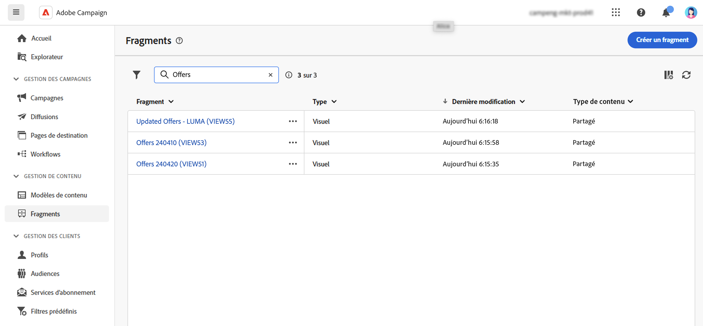
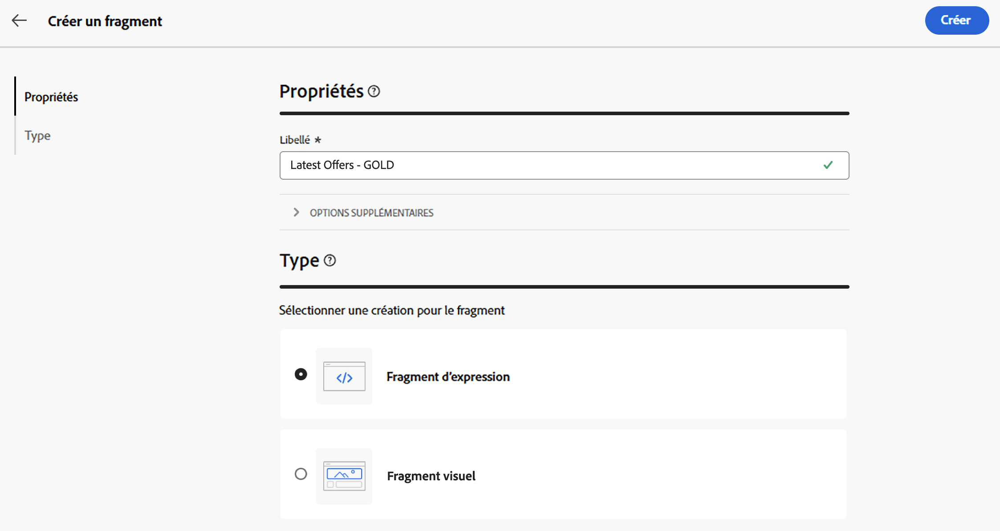
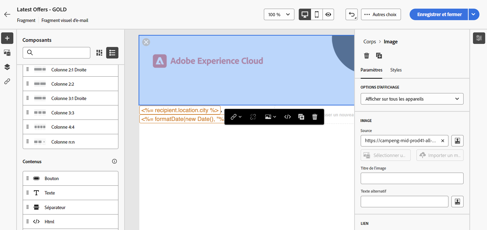
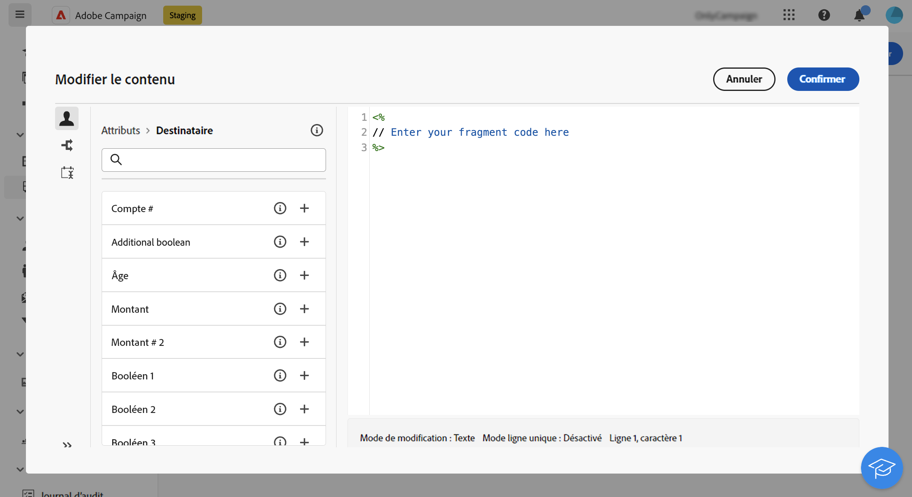
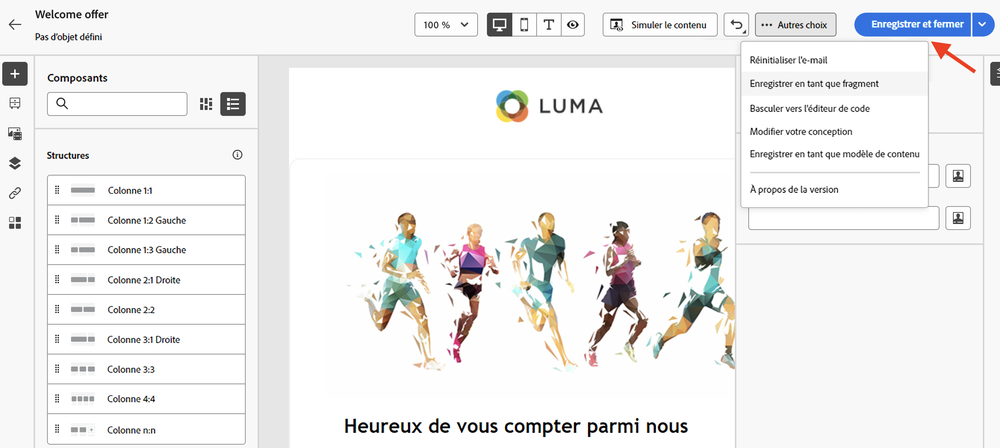
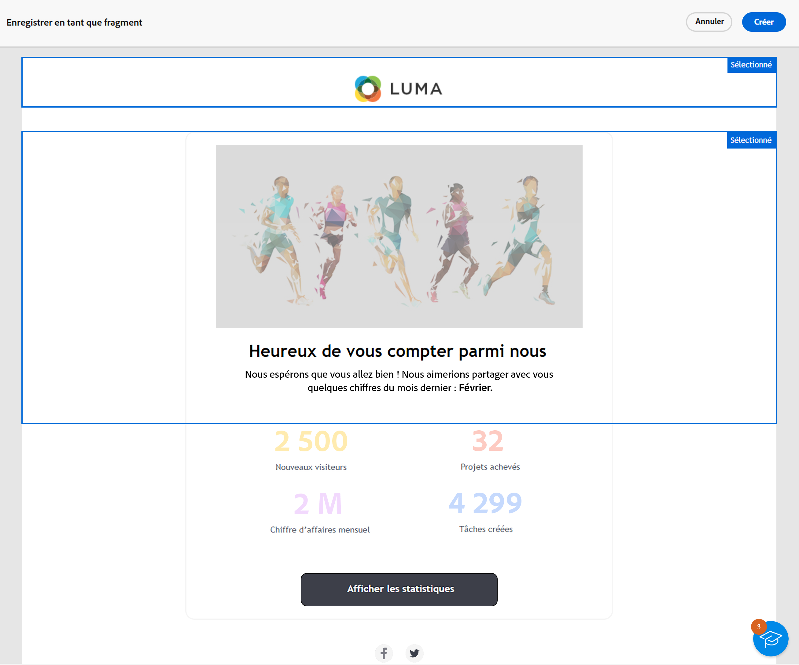
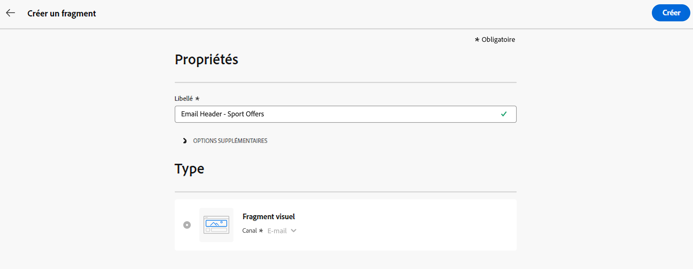
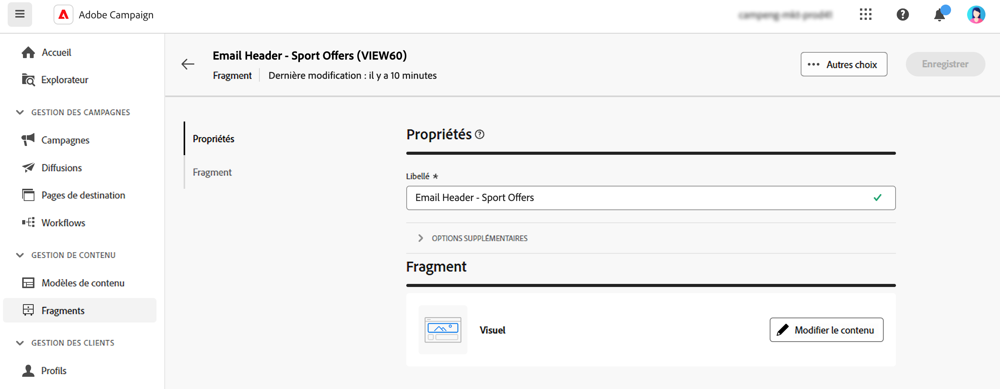
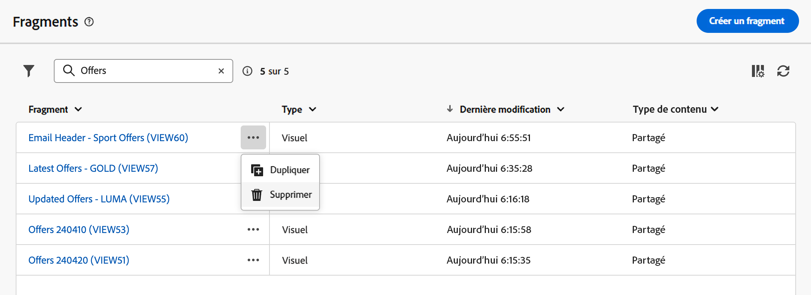

# Créer des fragments de contenu {#fragments}

>[!CONTEXTUALHELP]
>id="acw_fragments_create"
>title="Définir vos propres fragments de contenu"
>abstract="Définissez les propriétés du fragment et le type de fragment à créer. Vous pouvez ensuite utiliser le Concepteur d’e-mail ou l’éditeur d’expression pour configurer le contenu de votre fragment."

<!-- pas vu dans l'UI-->

>[!CONTEXTUALHELP]
>id="acw_fragments_properties"
>title="Propriétés des fragments"
>abstract="Saisissez le libellé du fragment. Si nécessaire, vous pouvez définir d’autres options, telles que le nom interne du fragment, son dossier et une description."

>[!CONTEXTUALHELP]
>id="acw_fragments_type"
>title="Type de fragment de contenu"
>abstract="Sélectionnez le type de fragment que vous souhaitez créer : Les **fragments visuels** sont des blocs visuels prédéfinis que vous pouvez réutiliser dans plusieurs diffusions e-mail ou dans des modèles de contenu. Les **fragments d’expression** sont des expressions prédéfinies disponibles à partir d’une entrée dédiée dans l’éditeur d’expression."

Vous pouvez créer des fragments de contenu de deux manières différentes :

* Créez un fragment à partir de zéro, à l’aide du menu dédié **[!UICONTROL Fragments]**. [Voici comment procéder](#create-from-scratch)
* Lors de la conception de contenu, enregistrez une partie de votre contenu en tant que fragment. [Voici comment procéder](#save-as-fragment)

  >[!NOTE]
  >
  >Cette fonctionnalité n’est disponible que pour les fragments visuels. Les fragments d’expression sont créés exclusivement à partir du menu **Fragments**.

Une fois enregistré, votre fragment de contenu peut être utilisé dans une diffusion ou un modèle de contenu.

## Créer un fragment de contenu à partir de zéro {#create-from-scratch}

Pour créer un modèle de contenu à partir de zéro, procédez comme suit.

1. [Accédez à la liste des fragments](#access-manage-fragments) par le biais du menu de gauche **[!UICONTROL Gestion de contenu]** > **[!UICONTROL Fragments]** et sélectionnez **[!UICONTROL Créer un fragment]**.

   

1. Saisissez le libellé du fragment. Si nécessaire, vous pouvez définir d’autres options, telles que le nom interne du fragment, son dossier et une description.

1. Choisissez le type de fragment que vous souhaitez créer : **Fragment visuel** ou **Fragment d’expression**. [Découvrez les différences entre les fragments visuels et d’expression.](fragments.md)

   

   >[!AVAILABILITY]
   >
   >Les fragments visuels sont en disponibilité limitée (LA). Ils sont limités aux clientes et clients effectuant la migration à partir d’**Adobe Campaign Standard vers Adobe Campaign v8** et ne peuvent pas être déployés dans un autre environnement.

1. Cliquez sur le bouton **Créer**.

   * Pour les **fragments visuels**, le [concepteur d’e-mail](../email/get-started-email-designer.md) s’affiche. Modifiez votre contenu selon vos besoins, comme vous le feriez pour n’importe quel e-mail d’une campagne, puis cliquez sur le bouton **Enregistrer et fermer**. Vous pouvez ajouter des images, un lien, des champs de personnalisation et du contenu dynamique.

     

   * Pour les **fragments d’expression**, l’éditeur d’expression s’ouvre. Tirez parti de ses fonctionnalités de personnalisation et de création pour créer votre contenu, puis cliquez sur **Confirmer**. [Découvrez comment travailler avec l’éditeur d’expression](../personalization/personalize.md).

     

1. Lorsque votre modèle est prêt, cliquez sur **Enregistrer**.

Ce fragment de contenu est maintenant prêt à être utilisé lors de la création d’une diffusion ou d’un [modèle de contenu](../email/use-email-templates.md) dans Campaign. Découvrez comment utiliser des fragments d’expression et visuels dans cette section :
* [Ajouter des fragments visuels à vos e-mails](use-visual-fragments.md)
* [Ajouter un fragment d’expression à l’éditeur d’expression](use-expression-fragments.md)

## Enregistrer du contenu en tant que fragment visuel {#save-as-fragment}

>[!CONTEXTUALHELP]
>id="acw_fragments_save"
>title="Enregistrer en tant que fragment"
>abstract="Pour enregistrer du contenu en tant que fragment visuel, sélectionnez les éléments à inclure dans votre fragment, y compris les champs de personnalisation et le contenu dynamique. Vous pouvez uniquement sélectionner des sections adjacentes. Vous ne pouvez pas sélectionner une structure vide ou un autre fragment de contenu. Ce contenu est désormais un fragment autonome ajouté à la liste de fragments et accessible à partir du menu dédié. Vous pouvez désormais utiliser ce fragment lors de la création d’un e-mail ou d’un modèle de contenu dans Campaign."

<!--pas vu dans l'UI-->

Tout contenu d’e-mail peut être enregistré en tant que fragment visuel en vue d’une réutilisation ultérieure. Lors de la conception d’un [modèle de contenu](../email/use-email-templates.md) ou d’un [e-mail](../email/get-started-email-designer.md), vous pouvez enregistrer une partie de votre contenu en tant que fragment visuel. Pour ce faire, procédez comme suit :

1. Dans le [Concepteur d’e-mail](../email/get-started-email-designer.md), cliquez sur le bouton **Plus** en haut à droite de l’écran.

1. Sélectionnez **[!UICONTROL Enregistrer en tant que fragment]** à partir du menu déroulant.

   

1. L’écran **[!UICONTROL Enregistrer en tant que fragment]** s’affiche. Sélectionnez ensuite les éléments à inclure dans votre fragment, notamment les champs de personnalisation et le contenu dynamique.

   >[!CAUTION]
   >
   >Vous pouvez uniquement sélectionner des sections adjacentes. Vous ne pouvez pas sélectionner une structure vide ou un autre fragment de contenu.

   

1. Cliquez sur **[!UICONTROL Créer]**. Renseignez le nom du fragment et enregistrez-le.

   

   Ce contenu est désormais un fragment autonome ajouté à la [liste de fragments](#manage-fragments) et accessible à partir du menu dédié. Vous pouvez désormais utiliser ce fragment lors de la création d’un [e-mail](../email/get-started-email-designer.md) ou d’un [modèle de contenu](../email/use-email-templates.md) dans Campaign. [Voici comment procéder](../content/use-visual-fragments.md)

>[!NOTE]
>
>Toute modification apportée à ce nouveau fragment n’est pas propagée dans le modèle d’où elle provient. De même, lorsque le contenu d’origine est modifié dans cet e-mail ou ce modèle, le nouveau fragment n’est pas modifié.-->

## Gérer vos fragments de contenu {#manage-fragments}

Vous pouvez modifier, mettre à jour, dupliquer ou supprimer un fragment de contenu de la liste des fragments.

### Modifier et mettre à jour un fragment de contenu {#edit-fragments}

Pour modifier un fragment de contenu, suivez les étapes ci-dessous.

1. Cliquez sur le nom du fragment à modifier dans la liste **[!UICONTROL Fragments]**.
1. Cliquez sur le bouton **Modifier le contenu** pour ouvrir le contenu de ce fragment.

   

1. Effectuez les modifications nécessaires et enregistrez vos modifications.

>[!CAUTION]
>
>Toute modification apportée à un fragment est propagée aux diffusions ou aux modèles qui l’utilisent.

### Supprimer un fragment de contenu {#delete-fragments}

Pour supprimer un fragment de contenu, procédez comme suit :

1. Accédez à la liste des fragments, puis cliquez sur le bouton **[!UICONTROL Autres actions]** en regard du fragment à supprimer.
1. Cliquez sur **Supprimer** pour confirmer.

   

>[!CAUTION]
>
>Lors de la suppression d’un fragment de contenu, les diffusions et les modèles qui l’utilisent sont mis à jour : le fragment est supprimé du contenu, mais il est toujours référencé. Pour conserver le contenu du fragment dans ces diffusions et modèles, vous devez rompre l’héritage avant de supprimer le fragment, [comme décrit dans cette section](use-visual-fragments.md#break-inheritance).

### Dupliquer un fragment de contenu {#duplicate-fragments}

Vous pouvez facilement dupliquer un fragment de contenu pour en créer un nouveau. Pour dupliquer un fragment existant, procédez comme suit :

1. Accédez à la liste des fragments, puis cliquez sur le bouton **[!UICONTROL Autres actions]** en regard du fragment à supprimer.
1. Cliquez sur **Dupliquer** pour confirmer.
1. Saisissez le libellé du nouveau fragment et enregistrez vos modifications.

   Le fragment est alors ajouté à la liste des fragments de contenu. Vous pouvez le modifier et le configurer selon vos besoins.
