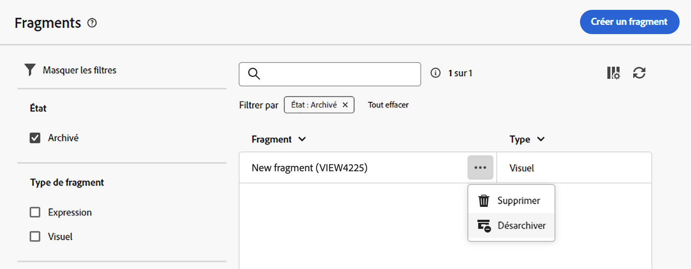

# Créer des fragments de contenu {#fragments}

>[!CONTEXTUALHELP]
>id="acw_fragments_create"
>title="Définir vos propres fragments de contenu"
>abstract="Définissez les propriétés du fragment et le type de fragment à créer. Vous pouvez ensuite utiliser le Concepteur d’e-mail ou l’éditeur d’expression pour configurer le contenu de votre fragment."

<!-- pas vu dans l'UI-->

>[!CONTEXTUALHELP]
>id="acw_fragments_properties"
>title="Propriétés des fragments"
>abstract="Saisissez le libellé du fragment. Si nécessaire, vous pouvez définir d’autres options, telles que le nom interne du fragment, son dossier et une description."

>[!CONTEXTUALHELP]
>id="acw_fragments_type"
>title="Type de fragment de contenu"
>abstract="Sélectionnez le type de fragment que vous souhaitez créer : Les **fragments visuels** sont des blocs visuels prédéfinis que vous pouvez réutiliser dans plusieurs diffusions e-mail ou dans des modèles de contenu. Les **fragments d’expression** sont des expressions prédéfinies disponibles à partir d’une entrée dédiée dans l’éditeur d’expression."

Il existe deux manières de créer des fragments de contenu :

* Créez un fragment à partir de zéro, à l’aide du menu dédié **[!UICONTROL Fragments]**. [Voici comment procéder](#create-from-scratch)
* Lors de la conception du contenu, enregistrez une partie de votre contenu en tant que fragment. [Voici comment procéder](#save-as-fragment)

  >[!NOTE]
  >
  >Cette fonctionnalité n’est disponible que pour les fragments visuels. Les fragments d’expression sont créés exclusivement à partir du menu **Fragments**.

Une fois enregistré, le fragment de contenu peut être utilisé dans n’importe quelle diffusion ou modèle de contenu.

## Créer un fragment de contenu à partir de zéro {#create-from-scratch}

Pour créer un modèle de contenu à partir de zéro, procédez comme suit.

1. [Accédez à la liste des fragments](#access-manage-fragments) par le biais du menu de gauche **[!UICONTROL Gestion de contenu]** > **[!UICONTROL Fragments]** et sélectionnez **[!UICONTROL Créer un fragment]**.

   

1. Saisissez le libellé du fragment. Si nécessaire, définissez des options supplémentaires, telles que le nom interne du fragment, son dossier et une description.

1. Choisissez le type de fragment à créer : **Fragment visuel** ou **Fragment d’expression**. [Découvrez les différences entre les fragments visuels et d’expression.](fragments.md)

   

   >[!AVAILABILITY]
   >
   >Les fragments visuels nécessitent une mise à jour de Campaign vers la version 8.6.4. Pour en savoir plus, consultez les [Notes de mise à jour de la console cliente Campaign v8](https://experienceleague.adobe.com/fr/docs/campaign/campaign-v8/releases/release-notes).

1. Cliquez sur le bouton **Créer**.

   * Pour les **fragments visuels**, le [concepteur d’e-mail](../email/get-started-email-designer.md) s’affiche. Modifiez le contenu selon vos besoins, de la même manière que pour tout e-mail contenu dans une campagne, puis cliquez sur le bouton **Enregistrer et fermer**. Ajoutez des images, des liens, des champs de personnalisation et du contenu dynamique.

     

   * Pour les **fragments d’expression**, l’éditeur d’expression s’ouvre. Utilisez ses fonctionnalités de personnalisation et de création pour créer le contenu, puis cliquez sur **Confirmer**. [Découvrez comment travailler avec l’éditeur d’expression](../personalization/personalize.md).

     

1. Une fois le contenu prêt, cliquez sur **Enregistrer**.

Ce fragment de contenu est maintenant prêt à être utilisé lors de la création d’une diffusion ou d’un [modèle de contenu](../email/use-email-templates.md) dans Campaign. Découvrez comment utiliser les fragments visuels et d’expression dans les sections suivantes :
* [Ajouter des fragments visuels à vos e-mails](use-visual-fragments.md)
* [Ajouter des fragments d’expression à l’éditeur d’expression](use-expression-fragments.md)

## Enregistrer le contenu en tant que fragment visuel {#save-as-fragment}

>[!CONTEXTUALHELP]
>id="acw_fragments_save"
>title="Enregistrer en tant que fragment"
>abstract="Pour enregistrer le contenu en tant que fragment visuel, sélectionnez les éléments à inclure dans le fragment, notamment les champs de personnalisation et le contenu dynamique. Seules les sections adjacentes peuvent être sélectionnées. Les structures vides ou autres fragments de contenu ne peuvent pas être sélectionnés. Le contenu devient alors un fragment autonome, ajouté à la liste des fragments et accessible à partir du menu dédié. Ce fragment peut être utilisé lors de la création d’un e-mail ou modèle de contenu dans Campaign."

<!--pas vu dans l'UI-->

Tout contenu d’e-mail peut être enregistré en tant que fragment visuel pour une réutilisation ultérieure. Lors de la conception d’une diffusion [modèle de contenu](../email/use-email-templates.md) ou [e-mail](../email/get-started-email-designer.md), enregistrez une partie du contenu en tant que fragment visuel. Pour ce faire, procédez comme suit :

1. Dans le [Designer d’e-mail](../email/get-started-email-designer.md), cliquez sur le bouton **Plus** en haut à droite de l’écran.

1. Sélectionnez **[!UICONTROL Enregistrer en tant que fragment]** à partir du menu déroulant.

   

1. L’écran **[!UICONTROL Enregistrer en tant que fragment]** s’affiche. Sélectionnez les éléments à inclure dans le fragment, notamment les champs de personnalisation et le contenu dynamique.

   >[!CAUTION]
   >
   >Seules les sections adjacentes peuvent être sélectionnées. Les structures vides ou autres fragments de contenu ne peuvent pas être sélectionnés.

   

1. Cliquez sur **[!UICONTROL Créer]**. Renseignez le nom du fragment et enregistrez-le.

   

   Ce contenu est désormais un fragment autonome, ajouté à la [liste de fragments](#manage-fragments) et accessible à partir du menu dédié. Utilisez ce fragment lors de la création d’un [e-mail](../email/get-started-email-designer.md) ou [modèle de contenu](../email/use-email-templates.md) dans Campaign. [Voici comment procéder](../content/use-visual-fragments.md)

>[!NOTE]
>
>Les modifications apportées au nouveau fragment ne sont pas propagées à l’e-mail ou au modèle d’où il provient. De même, lorsque le contenu d’origine est modifié dans l’e-mail ou le modèle, le nouveau fragment n’est pas modifié.

## Gérer vos fragments de contenu {#manage-fragments}

Vous pouvez modifier, mettre à jour, dupliquer ou supprimer un fragment de contenu de la liste des fragments.

### Modifier et mettre à jour un fragment de contenu {#edit-fragments}

Pour modifier un fragment de contenu, suivez les étapes ci-dessous.

1. Cliquez sur le nom du fragment à modifier dans la liste **[!UICONTROL Fragments]**.
1. Cliquez sur le bouton **Modifier le contenu** pour ouvrir le contenu du fragment.

   

1. Effectuez les modifications nécessaires et enregistrez-les.

>[!CAUTION]
>
>Les modifications apportées à un fragment sont propagées aux diffusions ou aux modèles qui l’utilisent.

### Supprimer un fragment de contenu {#delete-fragments}

Pour supprimer un fragment de contenu, procédez comme suit :

1. Accédez à la liste des fragments, puis cliquez sur le bouton **[!UICONTROL Autres actions]** en regard du fragment à supprimer.
1. Cliquez sur **Supprimer** pour confirmer.

   

>[!CAUTION]
>
>Lors de la suppression d’un fragment, les diffusions et les modèles qui l’utilisent sont mis à jour. Le fragment est supprimé du contenu mais reste référencé. Pour conserver le contenu du fragment dans ces diffusions et modèles, rompez l’héritage avant de supprimer le fragment, [comme indiqué dans cette section](use-visual-fragments.md#break-inheritance).

### Archiver un fragment de contenu {#archive}

Vous pouvez nettoyer la liste de fragments en archivant les fragments qui ne sont plus pertinents pour votre marque. Pour ce faire, cliquez sur le bouton **[!UICONTROL Autres actions]** en regard du fragment souhaité et sélectionnez **[!UICONTROL Archiver]**. Le fragment est supprimé de la liste des fragments, ce qui empêche ses utilisateurs de l’utiliser dans de futurs e-mails ou modèles.

Pour accéder aux fragments archivés, utilisez le volet de filtrage afin de les afficher. Pour désarchiver un fragment, cliquez sur le bouton **[!UICONTROL Autres actions]** et sélectionnez **[!UICONTROL Désarchiver]**.

>[!NOTE]
>
>Si vous archivez un fragment utilisé dans un contenu, ce contenu n’est pas affecté.

### Dupliquer un fragment de contenu {#duplicate-fragments}

Vous pouvez facilement dupliquer un fragment de contenu pour en créer un nouveau. Pour dupliquer un fragment existant, procédez comme suit :

1. Accédez à la liste des fragments, puis cliquez sur le bouton **[!UICONTROL Autres actions]** en regard du fragment à dupliquer.
1. Cliquez sur **Dupliquer** pour confirmer.
1. Saisissez le libellé du nouveau fragment et enregistrez les modifications.

   Le fragment est alors ajouté à la liste des fragments de contenu. Modifiez et configurez-le selon vos besoins.