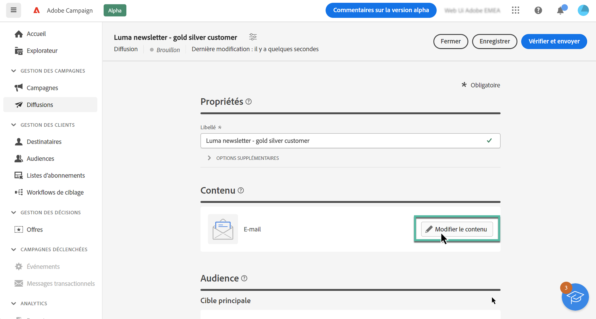
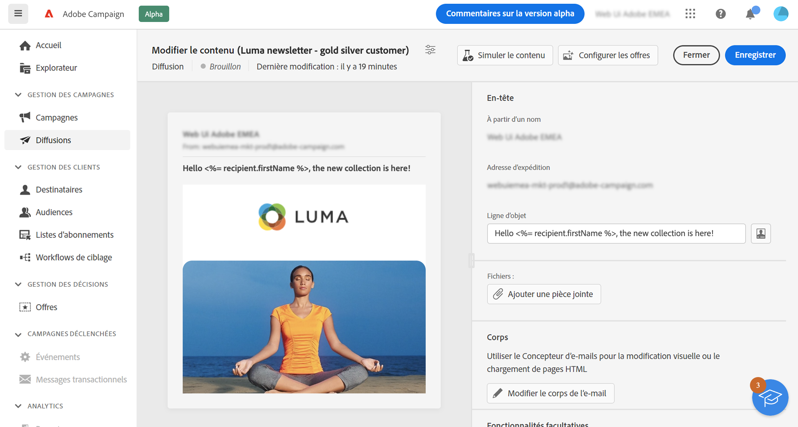

# Modifier le contenu de l’e-mail {#configure-content}

>[!CONTEXTUALHELP]
>id="acw_deliveries_email_content"
>title="Créer le contenu de l’e-mail"
>abstract="Avec cette section, vous pouvez créer le contenu de votre email et utiliser le Concepteur d&#39;email pour lui donner un aspect poli."

>[!CONTEXTUALHELP]
>id="acw_deliveries_email_header"
>title="En-tête d’e-mail"
>abstract="TBC"

>[!CONTEXTUALHELP]
>id="acw_deliveries_email_attachment"
>title="Pièce jointe d’e-mail"
>abstract="TBC"

>[!CONTEXTUALHELP]
>id="acw_deliveries_email_options"
>title="Options de tracking"
>abstract="TBC"

Pour commencer à créer le contenu d&#39;un email, cliquez sur le bouton **[!UICONTROL Modifier le contenu]** à partir de l’écran de création d’email.

Cet écran vous permet de définir le contenu de votre e-mail et d’accéder au Concepteur d’e-mail pour le concevoir.

Les étapes de définition du contenu de votre e-mail sont les suivantes :

1. Vérifiez les informations **[!UICONTROL À partir du nom]** et **[!UICONTROL À partir de l’e-mail]**. Ces champs sont en lecture seule et sont configurés dans le modèle d’e-mail sélectionné lors de la création de l’e-mail.

1. Définissez l’**[!UICONTROL Objet]** de l’e-mail. Pour ce faire, saisissez directement l’objet dans le champ dédié ou ouvrez l’éditeur d’expression pour définir l’ajout de la personnalisation à l’aide de divers attributs, blocs de contenu ou offres. [Découvrez comment personnaliser le contenu](../personalization/personalize.md)

1. Si vous souhaitez envoyer des offres par e-mail, sélectionnez-les à l’aide du bouton **[!UICONTROL Offres]**. Vous pourrez ensuite les insérer dans l’e-mail à l’aide de champs de personnalisation. [Découvrez comment envoyer des offres](offers.md)

1. Cliquez sur le bouton **[!UICONTROL Concepteur d’e-mail]** pour structurer et concevoir le contenu de l’e-mail. Des informations supplémentaires sur la conception de contenu d’e-mail sont disponibles dans les sections suivantes :

   * [Découvrez comment concevoir des e-mails](create-email-content.md)
   * [Donner un style à votre contenu](get-started-email-style.md)

1. Si vous souhaitez joindre un fichier à l’e-mail, cliquez sur le bouton **[!UICONTROL Ajouter une pièce jointe]** puis sélectionnez un ou plusieurs fichiers.

   <!--limitation on size + number of files?-->

1. Par défaut, le tracking est activé pour la diffusion. Vous pouvez désactiver cette option dans la **[!UICONTROL Fonctionnalités facultatives]** . [Découvrez comment ajouter des liens et gérer le tracking](message-tracking.md)

Une fois le contenu de votre e-mail défini, cliquez sur le bouton **[!UICONTROL Simuler le contenu]** pour vérifier comment il s’affichera avant de l’envoyer. [Découvrez comment prévisualiser et tester votre e-mail](../preview-test/preview-test.md)

<!-- show screenshot showing an email fully configured + highlight the simulate content button-->
