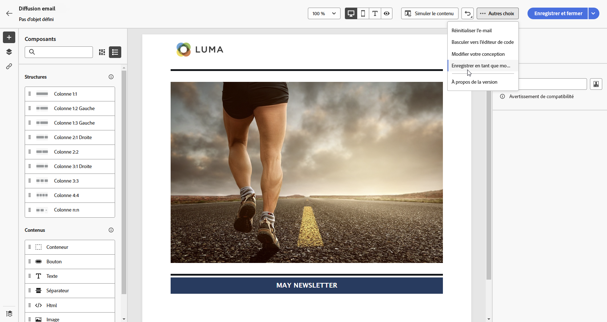
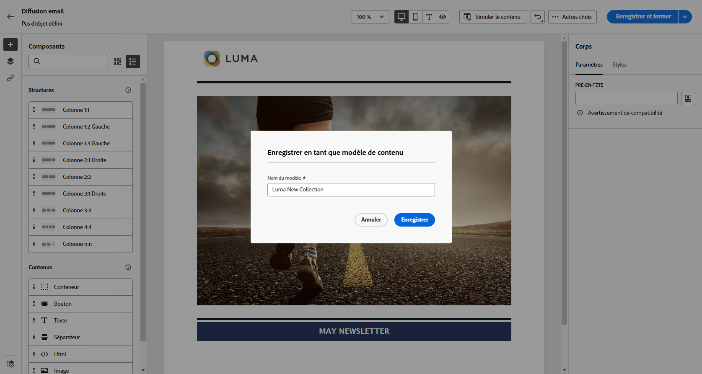
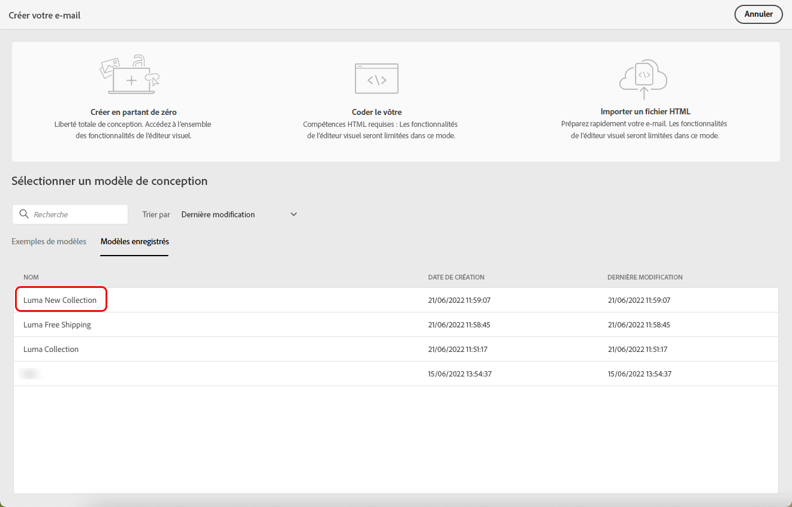

# Utiliser des modèles d’e-mails {#email-content-templates}

Lors de la [création d’un e-mail](../email/create-email.md), accédez à la section **[!UICONTROL Sélectionner un modèle de conception]** de l’interface **[!UICONTROL Créer votre e-mail]** pour commencer à créer le contenu à partir d’un modèle.

Vous pouvez choisir parmi les options suivantes :

* **Exemples de modèles**. Campaign s’accompagne d’un ensemble de modèles intégrés que vous pouvez sélectionner.

* **Modèles enregistrés**. Vous pouvez également utiliser un modèle personnalisé que vous avez enregistré comme modèle à partir d’un contenu existant.

Découvrez comment utiliser des modèles et comment enregistrer un contenu d’e-mail en tant que modèle dans les sections ci-dessous.

## Utiliser un modèle {#use-templates}

Pour commencer à créer votre contenu avec l’un des modèles enregistrés ou d’exemple, procédez comme suit.

1. Ouvrez le [concepteur d’e-mail](create-email-content.md).

1. Sur l’écran **[!UICONTROL Créer votre e-mail]**, l’onglet **[!UICONTROL Exemples de modèles]** est sélectionné par défaut.

1. Pour utiliser un modèle personnalisé existant, accédez à l’onglet **[!UICONTROL Modèles enregistrés]**.

   

1. La liste de tous les [modèles enregistrés](#save-as-template) s’affiche. Vous pouvez les trier **[!UICONTROL Par nom]**, selon la **[!UICONTROL Dernière modification]** et la **[!UICONTROL Dernière création]**.

   

1. Sélectionnez un modèle dans la liste pour afficher son contenu.

1. Utilisez les flèches droite et gauche pour naviguer entre les modèles (d’exemple ou enregistrés selon votre sélection).

   

1. Cliquez sur **[!UICONTROL Utiliser ce modèle]** en haut à droite de l’écran.

1. Modifiez le contenu selon vos besoins à l’aide du concepteur d’e-mail. [En savoir plus](create-email-content.md)

## Enregistrer le contenu de l’e-mail en tant que modèle {#save-as-template}

Une fois votre [e-mail conçu](create-email-content.md), vous pouvez enregistrer ce contenu en tant que modèle pour une réutilisation ultérieure. Les modèles enregistrés sont disponibles pour tous les utilisateurs et utilisatrices de votre environnement Adobe Campaign.

Pour enregistrer un contenu d’e-mail en tant que modèle, procédez comme suit :

1. Dans le Concepteur d’e-mail, cliquez sur les points de suspension en haut à droite de l’écran.

1. Sélectionnez **[!UICONTROL Enregistrer comme modèle de contenu]** dans le menu déroulant.

   

1. Saisissez le nom du modèle et enregistrez-le.

   

Vous pouvez désormais [utiliser ce modèle](#use-templates) pour créer un nouveau contenu : il est disponible sous l’onglet **[!UICONTROL Modèles enregistrés]** du concepteur d’e-mail.

