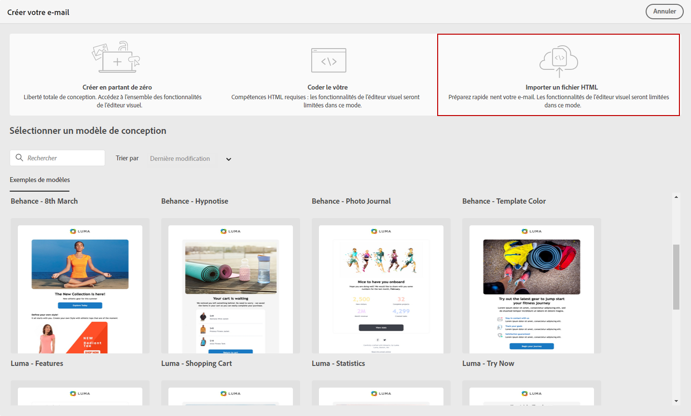
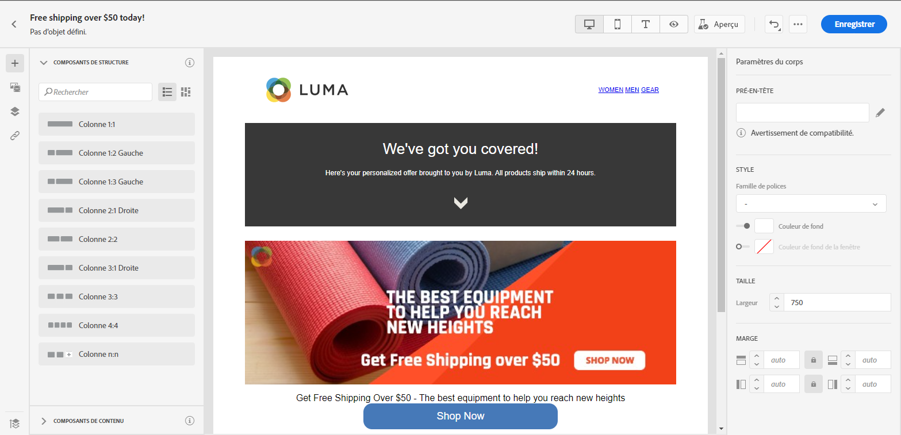

# Importer le contenu des e-mails {#existing-content}

>[!NOTE]
>
>Cette documentation est en cours d’élaboration et est fréquemment mise à jour. La version finale de ce contenu sera prête en janvier 2023.

Le Concepteur d’e-mail permet d’importer du contenu HTML existant. Ce contenu peut être :

* Un **fichier HTML** avec une feuille de style incorporée,
* Un **dossier ZIP** contenant le fichier HTML, la feuille de style (CSS) et les images.

   >[!NOTE]
   >
   >La structure du fichier ZIP est libre. Toutefois, les références doivent être relatives et adaptées à l’arborescence du dossier ZIP.

Pour importer un fichier contenant du contenu HTML, procédez comme suit :

1. Sur la page d’accueil du Concepteur d’e-mail, sélectionnez **[!UICONTROL Importer du code HTML]**.

   

1. Faites glisser et déposez le fichier HTML ou ZIP contenant le contenu HTML, puis cliquez sur **[!UICONTROL Importer]**.

1. Une fois le contenu HTML téléchargé, vous pouvez utiliser les fonctionnalités du Concepteur d’e-mail pour modifier et prévisualiser votre e-mail. [En savoir plus dans cette section](create-email-content.md).

   