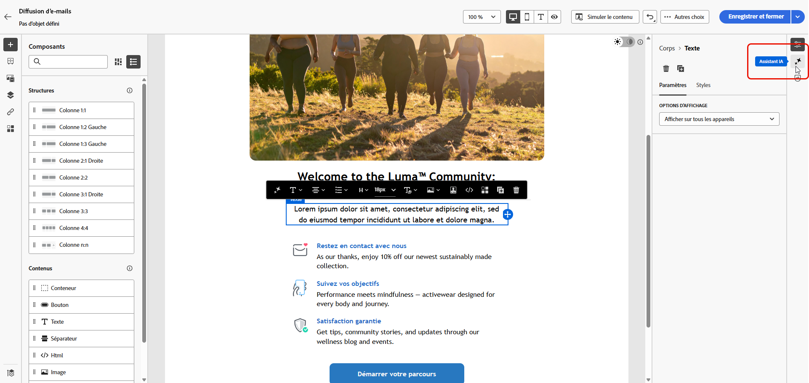
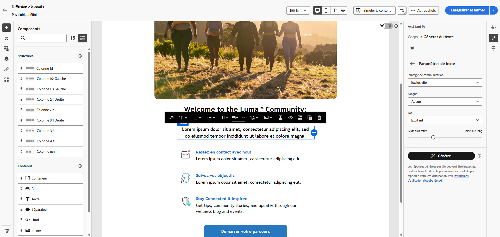
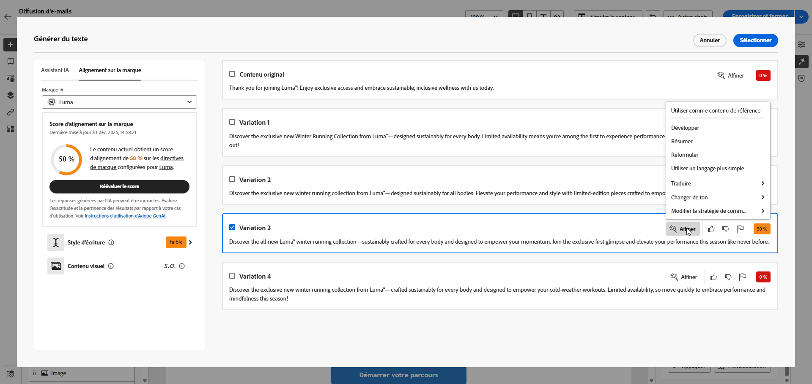
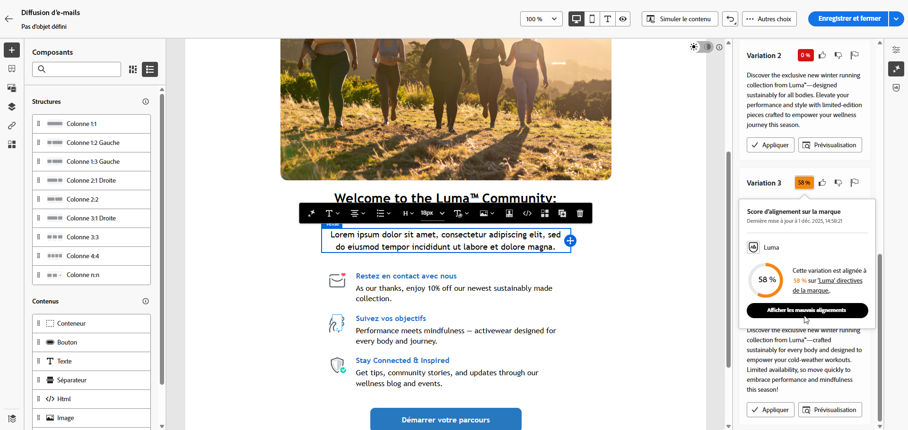

# Génération de texte avec l’assistant de contenu {#generative-content}

Une fois que vous avez créé et personnalisé vos emails, utilisez l’assistant de contenu, optimisé par l’IA générative, pour passer votre contenu au niveau supérieur.

L’assistant de contenu peut vous aider à optimiser l’impact de vos diffusions en suggérant un contenu différent plus susceptible de résonner auprès de votre audience.

1. Après avoir créé et configuré votre diffusion Email, cliquez sur **[!UICONTROL Modifier le contenu]**.

   Pour plus d&#39;informations sur le paramétrage de votre diffusion email, reportez-vous à la section [cette page](../content/create-email-content.md).

1. Renseignez les **[!UICONTROL Détails de base]** pour votre diffusion. Une fois terminé, cliquez sur **[!UICONTROL Modifier le contenu d’un email]**.

1. Personnalisez votre email selon vos besoins.

1. Sélectionnez la variable **[!UICONTROL Composant textuel]** vous souhaitez mettre à jour et accéder au menu Génération d’expérience .

   

1. Ajustez le contenu en décrivant ce que vous souhaitez générer.

   Activez la variable **[!UICONTROL Amélioration du contenu actuel]** pour l’assistant de contenu afin de personnaliser le nouveau contenu en fonction de votre diffusion, de votre nom de diffusion et de l’audience sélectionnée.

   

1. Sélectionner **[!UICONTROL Télécharger le fichier]** si vous souhaitez ajouter une note marketing afin de donner plus de contexte à l’assistant de contenu.

   Cliquez également sur **[!UICONTROL Contenu téléchargé]** pour rechercher des fichiers mis à jour précédemment.

1. Sélectionnez la variable **[!UICONTROL Stratégie de communication]** qui répond le mieux à vos besoins. Cela aura une incidence sur la tonalité et le style du texte généré.

1. Choisissez la **[!UICONTROL Langue]** et **[!UICONTROL Tone]** que vous souhaitez que le texte généré ait. Cela permet de s’assurer que le texte est adapté à votre audience et à votre objectif.

   

1. Utilisez le curseur pour définir la longueur du texte généré.

1. Une fois votre invite prête, cliquez sur **[!UICONTROL Générer]**.

1. Parcourir les **[!UICONTROL Variations]** et cliquez sur **[!UICONTROL Appliquer]** une fois que vous avez trouvé le contenu approprié.

   

1. Insérez des champs de personnalisation pour personnaliser le contenu de votre e-mail en fonction des données de profil. [En savoir plus sur la personnalisation du contenu](../personalization/personalize.md).

   

1. Après avoir défini le contenu de votre message, cliquez sur le bouton **[!UICONTROL Simulation du contenu]** pour contrôler le rendu et vérifier les paramètres de personnalisation avec les profils de test. [En savoir plus](../preview-test/preview-content.md)

   

1. Une fois que vous avez défini votre contenu, votre audience et votre planning, vous êtes prêt à préparer votre diffusion email. [En savoir plus](../monitor/prepare-send.md)

