# Générer du contenu complet avec l’assistant IA {#generative-full-content}

>[!IMPORTANT]
>
>Avant de commencer à utiliser cette fonctionnalité, lisez la section sur les [Mécanismes de sécurisation et limitations](generative-gs.md#generative-guardrails) connexes.
> 
>
>Vous devez accepter les termes d’un [contrat d’utilisation](https://www.adobe.com/legal/licenses-terms/adobe-dx-gen-ai-user-guidelines.html){target="_blank"} avant de pouvoir utiliser l’assistant IA dans Adobe Campaign Web. Pour plus d’informations, contactez votre représentant ou représentante Adobe.

Utilisez l’assistant IA dans Adobe Campaign Web pour générer des expériences de contenu complètes pour vos canaux d’e-mail, de page de destination et de notification push. L’assistant IA vous permet d’optimiser l’impact de vos diffusions en créant du contenu exhaustif qui résonne auprès de votre audience.

## Pour les e-mails et les pages de destination {#email-web-channels}

L’assistant IA peut produire des expériences de contenu complètes pour vos diffusions par e-mail et vos pages de destination en générant du texte et des images. Cette fonctionnalité robuste vous permet de créer du contenu attrayant et conforme à votre marque, qui résonne auprès de votre audience sur l’ensemble des points de contact numériques.

### Accéder et configurer {#access-configure}

Avant de commencer à créer du contenu avec l’assistant IA, vous devez configurer votre diffusion et ouvrir l’éditeur de contenu. Suivez les étapes ci-dessous pour préparer votre espace de travail et accéder au panneau de l’assistant IA.

1. Créez et configurez votre diffusion :

   * **E-mail** : après avoir créé et configuré votre diffusion par e-mail, cliquez sur **[!UICONTROL Modifier le contenu]**. [En savoir plus](../email/create-email-content.md)
   * **Page de destination** : après avoir créé et configuré votre page de destination, cliquez sur **[!UICONTROL Modifier le contenu]**. [En savoir plus](../landing-pages/create-lp.md)

1. Personnalisez votre mise en page selon vos besoins et accédez au menu **[!UICONTROL Assistant IA]**.

   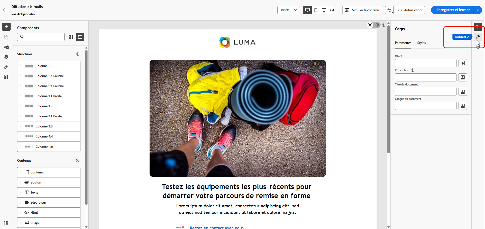{zoomable="yes"}

### Générer le contenu {#generate-content}

Une fois l’assistant IA ouvert, vous pouvez configurer les paramètres de génération pour créer du contenu correspondant à votre marque et à vos objectifs de campagne. Personnalisez les paramètres de texte et d’image, ajoutez des ressources de marque et saisissez des prompts pour guider l’IA dans la génération de variations pertinentes pour votre audience.

1. Sélectionnez votre **[!UICONTROL marque]** pour vous assurer que le contenu généré par l’IA correspond aux spécifications de votre marque. [En savoir plus](brands.md) sur les marques.

1. Ajustez le contenu en décrivant ce que vous souhaitez générer dans le champ **[!UICONTROL Prompt]**.

   Si vous avez besoin d’aide pour concevoir votre prompt, accédez à la **[!UICONTROL Bibliothèque de prompts]** qui vous met à disposition un large éventail d’idées de prompts pour améliorer vos diffusions. [En savoir plus sur les bonnes pratiques relatives aux prompts](ai-assistant-prompting-guide.md).

   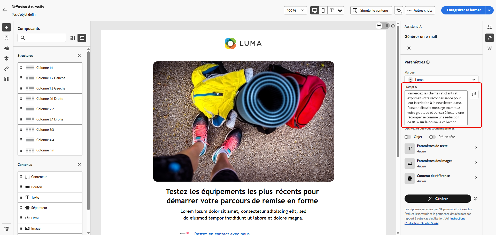{zoomable="yes"}

1. **Pour les e-mails**, vous pouvez activer les options **[!UICONTROL Objet]** et **[!UICONTROL Pré-en-tête]** pour les inclure dans la génération des variantes.

1. Adaptez votre prompt avec l’option **[!UICONTROL Paramètres de texte]** :

   * **[!UICONTROL Stratégie de communication]** : choisissez le style de communication le plus adapté au texte généré.
   * **[!UICONTROL Langues]** : sélectionnez la langue du contenu généré.
   * **[!UICONTROL Ton]** : le ton de votre e-mail doit résonner auprès de votre audience. Que vous souhaitiez communiquer de façon informative, ludique ou convaincante, l’assistant IA adapte le message en conséquence.

     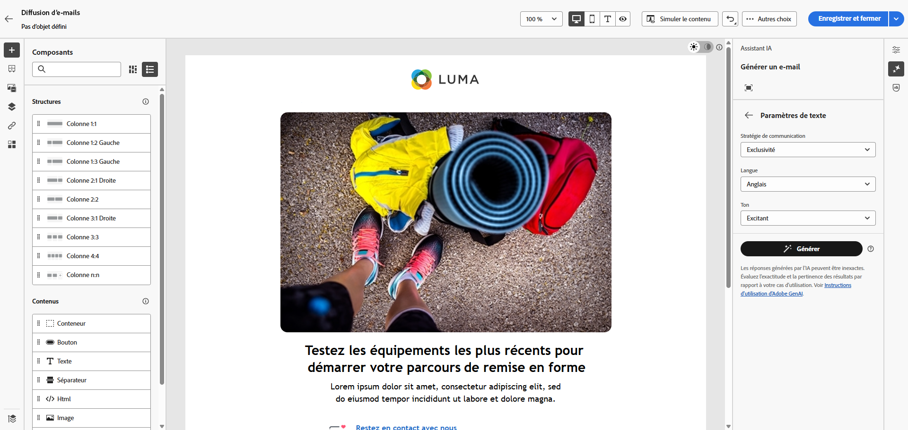{zoomable="yes"}

1. Choisissez vos **[!UICONTROL Paramètres d’image]** :

   * **[!UICONTROL Type de contenu]** : cette propriété classe la nature de l’élément visuel, en faisant la distinction entre les différentes formes de représentation visuelle, telles que les photos, les graphiques ou les illustrations.
   * **[!UICONTROL Intensité visuelle]** : vous pouvez contrôler l’impact de l’image en ajustant son intensité. Un réglage inférieur (2) crée un aspect plus doux, tandis qu’un réglage supérieur (10) rend l’image plus vivante.
   * **[!UICONTROL Couleur et ton]** : ajustez l’aspect général des couleurs et l’ambiance ou l’atmosphère véhiculée.
   * **[!UICONTROL Éclairage]** : modifiez l’éclairage de l’image pour façonner son atmosphère et mettre en évidence des éléments spécifiques.
   * **[!UICONTROL Composition]** : organisez les éléments dans le cadre de l’image.

1. Dans le menu **[!UICONTROL Contenu de référence]**, cliquez sur **[!UICONTROL Charger un fichier]** pour ajouter toute ressource de marque incluant du contenu pouvant fournir du contexte supplémentaire à l’assistant IA ou sélectionnez-en une chargée précédemment.

   Les fichiers précédemment chargés sont disponibles dans la liste déroulante **[!UICONTROL Contenu de référence chargé]**. Activez simplement les ressources que vous souhaitez inclure dans votre génération.

   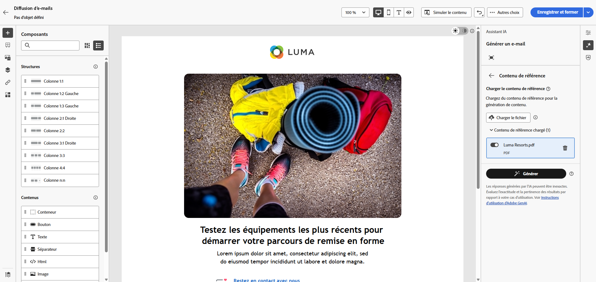{zoomable="yes"}

1. Lorsque votre prompt est prêt, cliquez sur **[!UICONTROL Générer]**.

### Affiner et finaliser {#refine-finalize}

Après avoir généré des variations de contenu, vous pouvez affiner les résultats pour vous assurer qu’ils répondent exactement à vos besoins. Examinez l’alignement sur la marque, ajustez le ton et le langage, puis préparez le contenu pour l’activation dans votre diffusion.

1. Après la génération, parcourez les **[!UICONTROL variations]**.

1. Cliquez sur l’icône de pourcentage pour afficher votre **[!UICONTROL score d’alignement sur la marque]** et identifier les alignements incorrects avec votre marque.

   En savoir plus sur le [score d’alignement sur la marque](brands-score.md).

   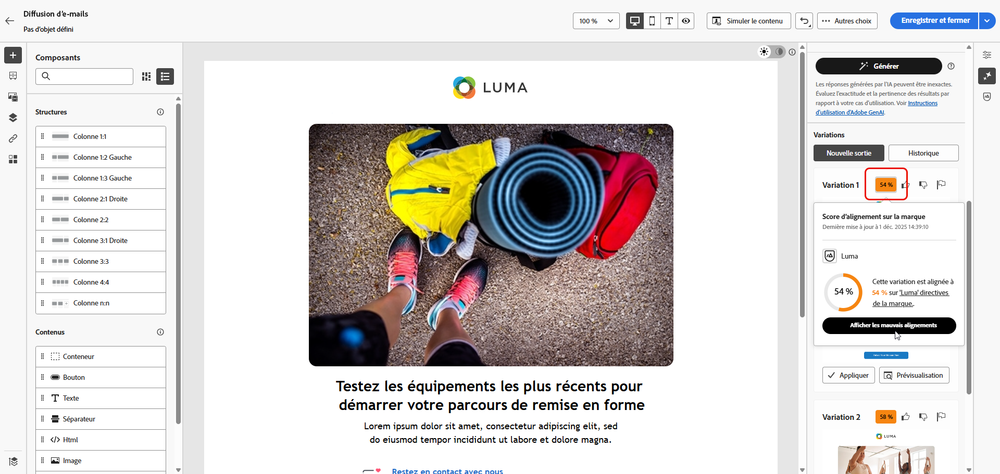{zoomable="yes"}

1. Cliquez sur **[!UICONTROL Aperçu]** pour afficher une version en plein écran de la variation sélectionnée ou sur **[!UICONTROL Appliquer]** pour remplacer votre contenu actuel.

1. Accédez à l’option **[!UICONTROL Affiner]** dans la fenêtre **[!UICONTROL Aperçu]** pour accéder à d’autres fonctionnalités de personnalisation :

   * **[!UICONTROL Reformuler]** : réécrivez le message tout en préservant sa signification. Cette option vous permet de générer une autre formulation, d’améliorer le flux ou d’ajuster les expressions sans modifier le message principal.

   * **[!UICONTROL Utiliser un langage simplifié]** : utilisez l’assistant IA pour simplifier votre langage, pour garantir clarté et accessibilité pour une audience plus large.

   * **[!UICONTROL Traduire]** : simplifiez votre texte pour garantir la clarté et l’accessibilité afin de toucher une audience plus large.

   * **[!UICONTROL Changer de ton]** : ajustez le ton du message pour mieux correspondre à votre style de communication, c’est-à-dire le rendre plus convivial, professionnel, urgent ou inspirant.

   * **[!UICONTROL Modifier la stratégie de communication]** : modifiez l’approche des messages en fonction de vos objectifs, tels que créer un sentiment d’urgence ou mettre en avant un aspect attractif et enthousiasmant.

     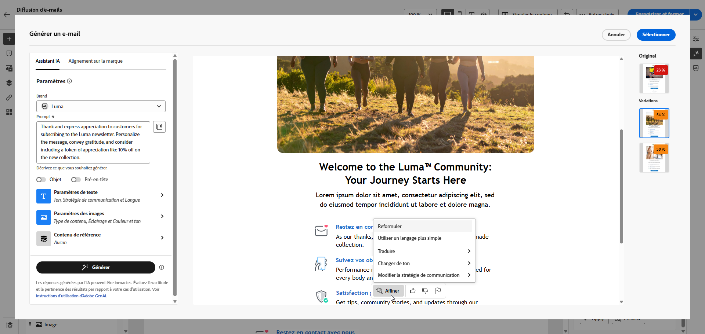{zoomable="yes"}

1. Ouvrez l’onglet **[!UICONTROL Alignement sur la marque]** pour voir comment votre contenu s’aligne sur vos [directives de marque](brands.md).

1. Cliquez sur **[!UICONTROL Sélectionner]** une fois que vous avez trouvé le contenu approprié.

1. Insérez des champs de personnalisation pour personnaliser votre contenu en fonction des données des profils. Cliquez ensuite sur le bouton **[!UICONTROL Simuler le contenu]** pour contrôler le rendu et vérifier les paramètres de personnalisation avec les profils de test. [En savoir plus](../preview-test/preview-content.md)

1. Examinez et activez votre contenu :
   * **E-mail** : lorsque vous avez défini le contenu, l’audience et le planning, vous pouvez préparer votre diffusion par e-mail. [En savoir plus](../monitor/prepare-send.md)
   * **Page de destination** : une fois votre page de destination prête, vous pouvez la publier afin de pouvoir l’utiliser dans un message. [En savoir plus](../landing-pages/create-lp.md)

## Pour les canaux mobiles {#mobile-channels}

L’assistant IA prend également en charge la génération de contenu pour les notifications push mobiles, ce qui vous permet de créer des titres, des messages et des images attrayants pour vos applications mobiles. Vous pouvez ainsi maintenir une communication cohérente et de haute qualité entre tous les points de contact de la clientèle, y compris les appareils mobiles.

### Accéder et configurer {#mobile-access-configure}

Pour utiliser l’assistant IA pour les notifications push, commencez par configurer votre diffusion push et ouvrez l’éditeur de contenu. Les étapes ci-dessous vous guideront tout au long de la préparation de votre diffusion et de l’accès aux outils de l’assistant IA.

1. Après avoir créé et configuré votre diffusion de notifications push, cliquez sur **[!UICONTROL Modifier le contenu]**.

   Pour plus d’informations sur la configuration de votre diffusion de notifications push, consultez [cette page](../push/create-push.md).

1. Personnalisez vos notifications push selon vos besoins. [En savoir plus](../push/content-push.md)

1. Accédez au menu **[!UICONTROL Afficher l’assistant IA]**.

   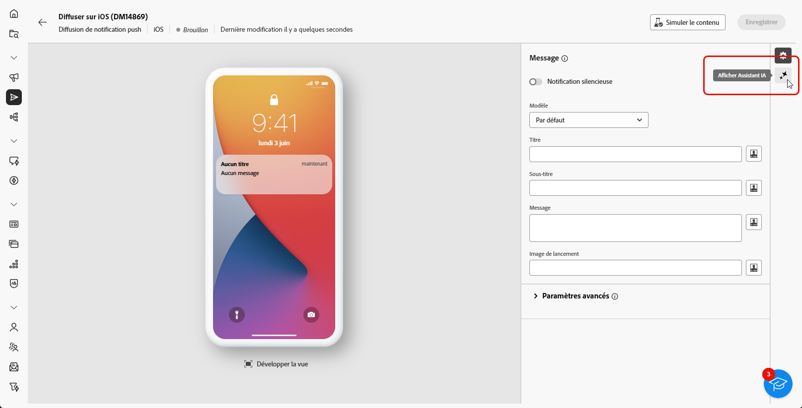{zoomable="yes"}

### Générer le contenu {#mobile-generate-content}

Une fois que vous avez accédé à l’assistant IA pour les notifications push, vous pouvez configurer les paramètres de génération afin de créer du contenu mobile attrayant. Définissez vos préférences de texte et d’image, sélectionnez les ressources de la marque et utilisez les prompts pour générer des variations de notification push qui impliquent vos utilisateurs et utilisatrices d’appareils mobiles.

1. Sélectionnez votre **[!UICONTROL marque]** pour vous assurer que le contenu généré par l’IA correspond aux spécifications de votre marque. [En savoir plus](brands.md) sur les marques.

1. Ajustez le contenu en décrivant ce que vous souhaitez générer dans le champ **[!UICONTROL Prompt]**.

   Si vous avez besoin d’aide pour concevoir votre prompt, accédez à la **[!UICONTROL Bibliothèque de prompts]** qui offre un large éventail d’idées de prompts pour améliorer votre diffusion. [En savoir plus sur les bonnes pratiques relatives aux prompts](ai-assistant-prompting-guide.md)

   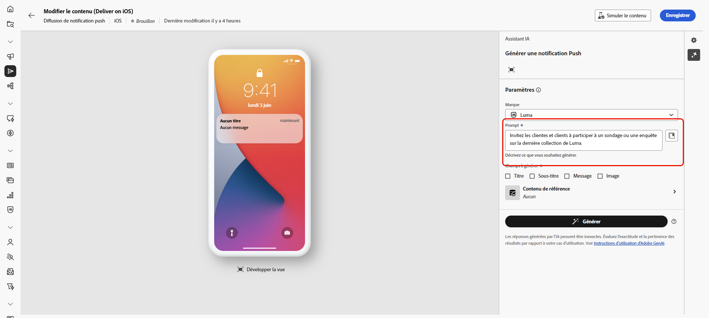{zoomable="yes"}

1. Choisissez le champ que vous souhaitez générer : **[!UICONTROL Titre]**, **[!UICONTROL Sous-titre]**, **[!UICONTROL Message]** et/ou **[!UICONTROL Image]**.

1. Adaptez votre prompt avec les options **[!UICONTROL Paramètres de texte]** :

   * **[!UICONTROL Stratégie de communication]** : choisissez le style de communication le plus adapté au texte généré.
   * **[!UICONTROL Langues]** : sélectionnez la langue du contenu généré.
   * **[!UICONTROL Ton]** : le ton de vos notifications push doit trouver écho auprès de votre audience. Que vous souhaitiez communiquer de façon informative, ludique ou convaincante, l’assistant IA peut adapter le message en conséquence.

     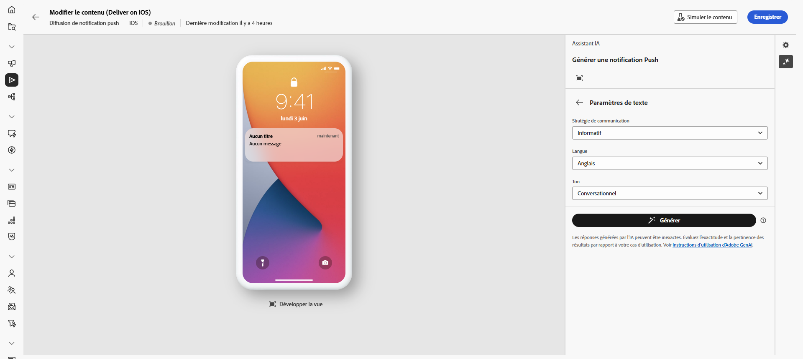{zoomable="yes"}

1. Choisissez vos **[!UICONTROL Paramètres d’image]** :

   * **[!UICONTROL Type de contenu]** : cette propriété classe la nature de l’élément visuel, en faisant la distinction entre les différentes formes de représentation visuelle, telles que les photos, les graphiques ou les illustrations.
   * **[!UICONTROL Intensité visuelle]** : contrôlez l’impact de l’image en ajustant son intensité. Un paramètre inférieur (2) crée un aspect plus doux et modéré, tandis qu’un paramètre supérieur (10) rend l’image plus vivante et visuellement plus puissante.
   * **[!UICONTROL Éclairage]** : réglez l’éclairage de l’image afin de façonner son atmosphère et de mettre en évidence des éléments spécifiques.
   * **[!UICONTROL Composition]** : organisez les éléments dans le cadre de l’image.

     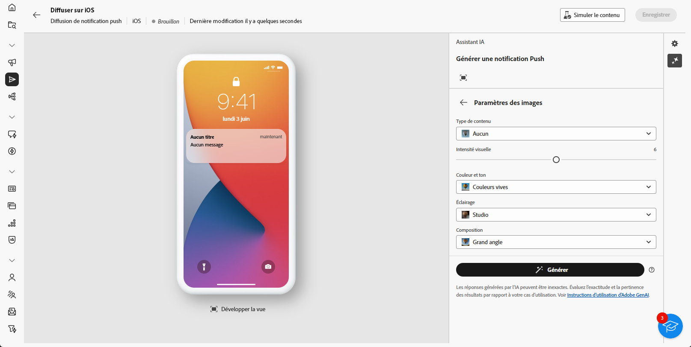{zoomable="yes"}

1. Dans le menu **[!UICONTROL Contenu de référence]**, cliquez sur **[!UICONTROL Charger un fichier]** pour ajouter toute ressource de marque incluant du contenu pouvant fournir du contexte supplémentaire à l’assistant IA ou sélectionnez-en une chargée précédemment.

   Les fichiers précédemment chargés sont disponibles dans la liste déroulante **[!UICONTROL Contenu de référence chargé]**. Activez simplement les ressources que vous souhaitez inclure dans votre génération.

1. Lorsque votre prompt est prêt, cliquez sur **[!UICONTROL Générer]**.

### Affiner et finaliser {#mobile-refine-finalize}

Après avoir examiné les variations de notification push générées, vous pouvez parfaire le contenu. Utilisez des outils de perfectionnement pour ajuster le langage et le ton, vérifier l’alignement sur la marque et personnaliser le contenu avant d’activer votre campagne de notification push.

1. Parcourez les **[!UICONTROL variations]** générées.

1. Cliquez sur l’icône de pourcentage pour afficher votre **[!UICONTROL score d’alignement sur la marque]** et identifier les alignements incorrects avec votre marque.

   En savoir plus sur le [score d’alignement sur la marque](brands-score.md).

   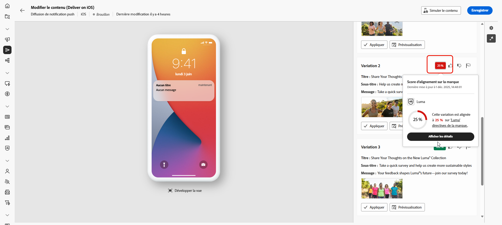{zoomable="yes"}

1. Cliquez sur **[!UICONTROL Aperçu]** pour afficher une version en plein écran de la variation sélectionnée ou cliquez sur **[!UICONTROL Appliquer]** pour remplacer votre contenu actuel.

1. Naviguez vers l’option **[!UICONTROL Affiner]** dans la fenêtre **[!UICONTROL Aperçu]** pour accéder à d’autres fonctionnalités de personnalisation :

   * **[!UICONTROL Utiliser comme contenu de référence]** : servez-vous de la variante choisie comme contenu de référence pour générer d’autres résultats.
   * **[!UICONTROL Reformuler]** : reformulez votre message de différentes manières pour conserver une écriture soignée et attrayante pour diverses audiences.
   * **[!UICONTROL Utiliser un langage plus simple]** : simplifiez votre texte pour en garantir la clarté et l’accessibilité pour une audience plus large.
   * **[!UICONTROL Traduire]** : simplifiez votre texte pour garantir la clarté et l’accessibilité afin de toucher une audience plus large.

   Vous pouvez également modifier le **[!UICONTROL Ton]** et la **[!UICONTROL Stratégie de communication]** de votre texte.

   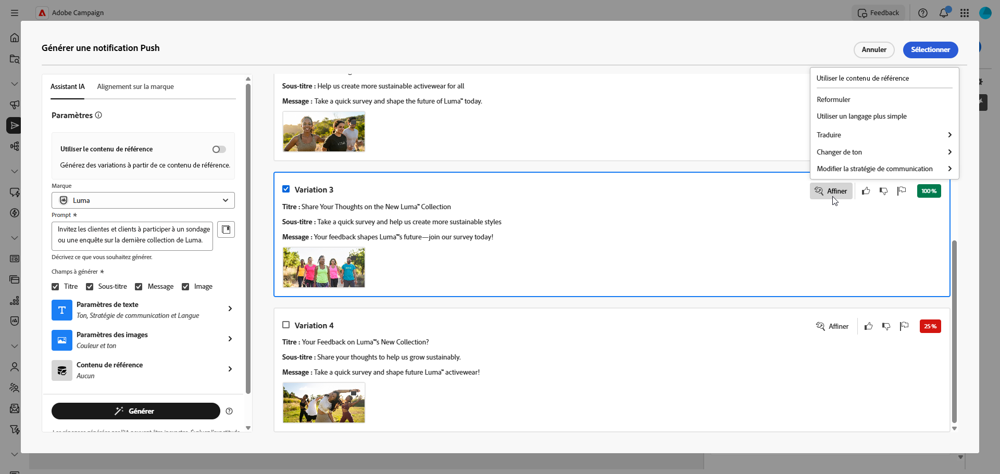{zoomable="yes"}

1. Ouvrez l’onglet **[!UICONTROL Alignement sur la marque]** pour voir comment votre contenu s’aligne sur vos [directives de marque](brands.md).

1. Cliquez sur **[!UICONTROL Sélectionner]** une fois que vous avez trouvé le contenu approprié.

1. Insérez des champs de personnalisation pour personnaliser le contenu de votre e-mail en fonction des données de profil. Cliquez ensuite sur le bouton **[!UICONTROL Simuler le contenu]** pour contrôler le rendu et vérifier les paramètres de personnalisation avec les profils de test. [En savoir plus](../preview-test/preview-content.md)

Lorsque vous définissez le contenu, l’audience et le planning, préparez votre diffusion de notification push. [En savoir plus](../monitor/prepare-send.md)

## Vidéo pratique {#video}

Découvrez comment utiliser l’assistant IA pour générer du contenu complet, du texte et des images pour les e-mails.

>[!VIDEO](https://video.tv.adobe.com/v/3428984)