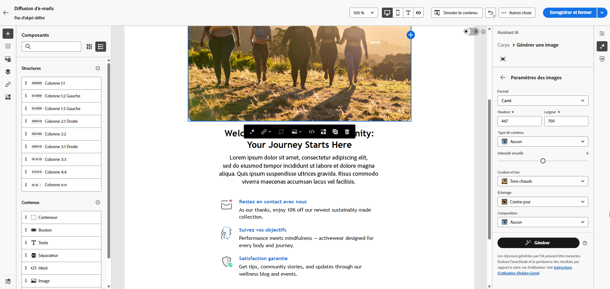
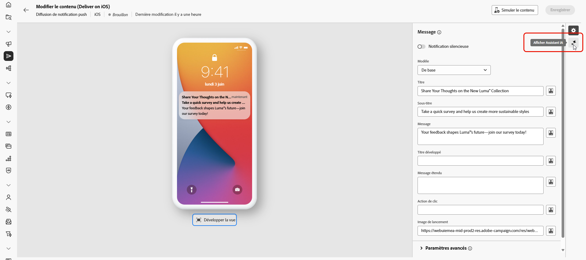
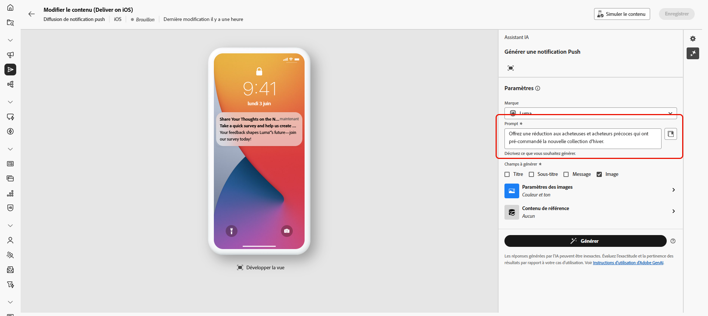
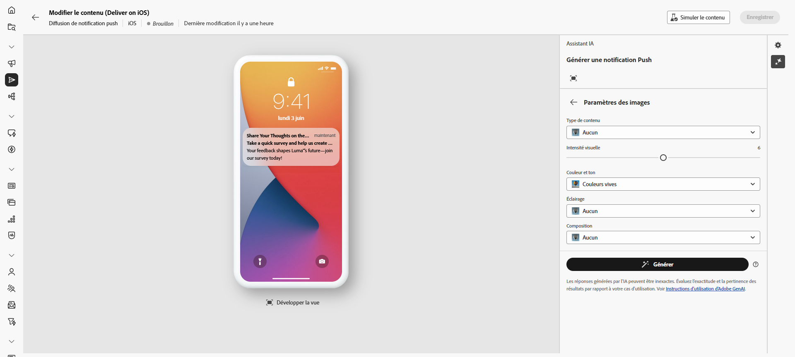
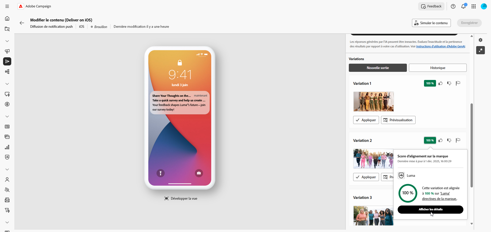

# Générer des images avec l’assistant d’IA {#generative-image}

>[!IMPORTANT]
>
>Avant de commencer à utiliser cette fonctionnalité, lisez la section sur les [Mécanismes de sécurisation et limitations](generative-gs.md#generative-guardrails) connexes.
> 
>
>Vous devez accepter les termes d’un [contrat d’utilisation](https://www.adobe.com/legal/licenses-terms/adobe-dx-gen-ai-user-guidelines.html){target="_blank"} avant de pouvoir utiliser l’assistant IA dans Adobe Campaign Web. Pour plus d’informations, contactez votre représentant ou représentante Adobe.

Utilisez l’assistant AI dans Adobe Campaign Web pour créer du contenu visuel attrayant qui améliore vos messages dans les e-mails, les pages de destination et les notifications push. L’assistant AI vous aide à générer et à optimiser des images, en veillant à ce que votre contenu soit visuellement attrayant et aligné avec votre marque.

## Pour les e-mails et les landing pages {#email-web-channels}

L’assistant AI peut générer des expériences visuelles complètes pour vos diffusions e-mail et vos pages de destination. Cette fonctionnalité vous permet de produire des images de marque attrayantes qui résonnent avec votre audience à travers les points de contact numériques.

### Accès et configuration {#access-configure}

Pour commencer à générer des images avec l’assistant AI, commencez par configurer votre diffusion et ouvrez l’éditeur de contenu. Suivez les étapes ci-dessous pour préparer votre espace de travail et accéder au panneau de l’assistant AI.

1. Créez et configurez votre diffusion :

   * **E-mail** : après avoir créé et configuré votre diffusion e-mail, cliquez sur **[!UICONTROL Modifier le contenu]**. [En savoir plus](../email/create-email-content.md)
   * **Page de destination** : après avoir créé et configuré votre page de destination, cliquez sur **[!UICONTROL Modifier le contenu]**. [En savoir plus](../landing-pages/create-lp.md)

1. Sélectionnez la ressource à modifier à l’aide de l’assistant AI et accédez au menu **[!UICONTROL Assistant AI]**.

   {zoomable="yes"}

### Générer le contenu {#generate-content}

1. Activez l’option **[!UICONTROL Style de référence]** de l’assistant IA afin de personnaliser le nouveau contenu en fonction du contenu sélectionné.

1. Sélectionnez votre **[!UICONTROL Marque]** pour vous assurer que le contenu généré par l’IA correspond aux spécifications de votre marque. [En savoir plus](brands.md) sur les marques.

1. Ajustez le contenu en décrivant ce que vous souhaitez générer dans le champ **[!UICONTROL Prompt]**.

   Si vous avez besoin d’aide pour concevoir votre invite, accédez à la **[!UICONTROL bibliothèque d’invites]** qui fournit un large éventail d’idées d’invites pour améliorer vos diffusions. [En savoir plus sur les bonnes pratiques relatives aux invites](ai-assistant-prompting-guide.md)

   {zoomable="yes"}

1. Adaptez votre prompt à l’aide de l’option **[!UICONTROL Paramètres d’image]** :

   * **[!UICONTROL Format]** : déterminez la largeur et la hauteur de la ressource. Choisissez parmi des formats courants tels que 16:9, 4:3, 3:2 ou 1:1, ou saisissez une taille personnalisée.
   * **[!UICONTROL Type de contenu]** : cette propriété classe la nature de l’élément visuel, en faisant la distinction entre les différentes formes de représentation visuelle, telles que les photos, les graphiques ou les illustrations.
   * **[!UICONTROL Intensité visuelle]** : vous pouvez contrôler l’impact de l’image en ajustant son intensité. Un réglage inférieur (2) crée un aspect plus doux, tandis qu’un réglage supérieur (10) rend l’image plus vivante.
   * **[!UICONTROL Couleur et ton]** : ajustez l’aspect général des couleurs et l’ambiance ou l’atmosphère véhiculée.
   * **[!UICONTROL Éclairage]** : modifiez l’éclairage de l’image pour façonner son atmosphère et mettre en évidence des éléments spécifiques.
   * **[!UICONTROL Composition]** : organisez les éléments dans le cadre de l’image.

     {zoomable="yes"}

1. Dans le menu **[!UICONTROL Contenu de référence]**, cliquez sur **[!UICONTROL Télécharger le fichier]** pour ajouter une ressource de marque contenant du contenu pouvant fournir un assistant d’IA contextuel supplémentaire ou sélectionnez-en une précédemment chargée.

   Les fichiers précédemment chargés sont disponibles dans le menu déroulant **[!UICONTROL Contenu de référence chargé]**. Activez simplement les ressources que vous souhaitez inclure dans votre génération.

1. Quand la configuration de votre prompt vous satisfait, cliquez sur **[!UICONTROL Générer]**.

### Affiner et finaliser {#refine-finalize}

Après avoir généré des variations d’image, vous pouvez examiner les résultats, vérifier l’alignement de la marque et sélectionner la meilleure option pour votre contenu.

1. Parcourez les **[!UICONTROL variations]** générées.

1. Cliquez sur l’icône de pourcentage pour afficher votre **[!UICONTROL score d’alignement sur la marque]** et identifier les alignements incorrects avec votre marque.

   En savoir plus sur le [score d’alignement sur la marque](../content/brands-score.md).

   {zoomable="yes"}

1. Cliquez sur **[!UICONTROL Aperçu]** pour afficher une version en plein écran de la variation sélectionnée ou sur **[!UICONTROL Appliquer]** pour remplacer votre contenu actuel.

1. Choisissez **[!UICONTROL Générer des résultats similaires]** si vous souhaitez afficher des images associées à cette variante.

1. Ouvrez l’onglet **[!UICONTROL Alignement sur la marque]** pour voir comment votre contenu s’aligne sur vos [directives de marque](../content/brands.md).

1. Cliquez sur **[!UICONTROL Sélectionner]** une fois que vous avez trouvé le contenu approprié.

1. Après avoir défini le contenu de votre message, cliquez sur le bouton **[!UICONTROL Simuler le contenu]** pour contrôler le rendu et vérifier les paramètres de personnalisation avec les profils de test. [En savoir plus](../preview-test/preview-content.md)

1. Examinez et activez votre contenu :
   * **E-mail** : lorsque vous avez défini le contenu, l’audience et le planning, vous êtes prêt(e) à préparer votre diffusion e-mail. [En savoir plus](../monitor/prepare-send.md)
   * **Page de destination** : une fois votre page de destination prête, vous pouvez la publier pour la rendre disponible pour une utilisation dans un message. [En savoir plus](../landing-pages/create-lp.md)

## Pour les canaux mobiles {#mobile-channels}

L’assistant AI vous permet de générer des images attrayantes pour les notifications push, ce qui vous permet de créer des communications mobiles visuellement attrayantes qui captent l’attention et résonnent avec votre audience.

### Accès et configuration {#mobile-access-configure}

Pour commencer à générer des images pour les notifications push avec l’assistant AI, commencez par configurer votre diffusion et ouvrez l’assistant AI.

1. Après avoir créé et configuré votre diffusion Notification push, cliquez sur **[!UICONTROL Modifier le contenu]**. [En savoir plus](../push/create-push.md)

1. Accédez au menu **[!UICONTROL Afficher l’assistant IA]**.

   {zoomable="yes"}

### Générer le contenu {#mobile-generate-content}

Après avoir accédé à l’assistant AI, vous pouvez ajuster les paramètres de génération pour créer des images qui s’alignent sur votre marque et soutiennent vos objectifs.

1. Sélectionnez votre **[!UICONTROL Marque]** pour vous assurer que le contenu généré par l’IA correspond aux spécifications de votre marque. [En savoir plus](brands.md) sur les marques.

1. Ajustez le contenu en décrivant ce que vous souhaitez générer dans le champ **[!UICONTROL Prompt]**.

   Si vous recherchez de l’aide pour concevoir votre invite, accédez à la **[!UICONTROL bibliothèque d’invites]** qui fournit un large éventail d’idées d’invites pour améliorer vos campagnes. [En savoir plus sur les bonnes pratiques relatives aux invites](ai-assistant-prompting-guide.md)

   {zoomable="yes"}

1. Sélectionnez **[!UICONTROL Image]** pour générer uniquement des ressources.

1. Choisissez vos **[!UICONTROL Paramètres d’image]** :

   * **[!UICONTROL Type de contenu]** : cette propriété classe la nature de l’élément visuel, en faisant la distinction entre les différentes formes de représentation visuelle, telles que les photos, les graphiques ou les illustrations.
   * **[!UICONTROL Intensité visuelle]** : contrôlez l’impact de l’image en ajustant son intensité. Un paramètre inférieur (2) crée un aspect plus doux et modéré, tandis qu’un paramètre supérieur (10) rend l’image plus vivante et visuellement plus puissante.
   * **[!UICONTROL Éclairage]** : réglez l’éclairage de l’image afin de façonner son atmosphère et de mettre en évidence des éléments spécifiques.
   * **[!UICONTROL Composition]** : organisez les éléments dans le cadre de l’image.

     {zoomable="yes"}

1. Dans le menu **[!UICONTROL Contenu de référence]**, cliquez sur **[!UICONTROL Télécharger le fichier]** pour ajouter une ressource de marque contenant du contenu pouvant fournir un assistant d’IA contextuel supplémentaire ou sélectionnez-en une précédemment chargée.

   Les fichiers précédemment chargés sont disponibles dans le menu déroulant **[!UICONTROL Contenu de référence chargé]**. Activez simplement les ressources que vous souhaitez inclure dans votre génération.

1. Lorsque votre prompt est prêt, cliquez sur **[!UICONTROL Générer]**.

### Affiner et finaliser {#mobile-refine-finalize}

Après avoir généré des variations d’image pour vos messages mobiles, vous pouvez affiner les résultats pour vous assurer qu’ils répondent exactement à vos besoins.

1. Après la génération, parcourez les **[!UICONTROL Variations]**.

1. Cliquez sur l’icône de pourcentage pour afficher votre **[!UICONTROL score d’alignement sur la marque]** et identifier les alignements incorrects avec votre marque.

   En savoir plus sur le [score d’alignement sur la marque](../content/brands-score.md).

   {zoomable="yes"}

1. Cliquez sur **[!UICONTROL Aperçu]** pour parcourir les **[!UICONTROL Variations]**.

1. Ouvrez l’onglet **[!UICONTROL Alignement sur la marque]** pour voir comment votre contenu s’aligne sur vos [directives de marque](brands.md).

1. Cliquez sur **[!UICONTROL Sélectionner]** une fois que vous avez trouvé le contenu approprié.

Une fois que vous avez défini le contenu, l’audience et le planning, préparez votre diffusion push. [En savoir plus](../monitor/prepare-send.md)
