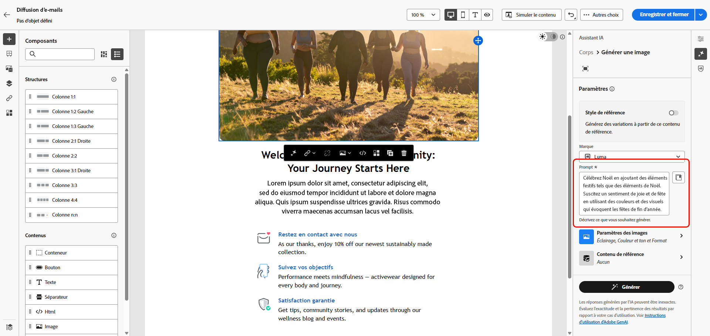
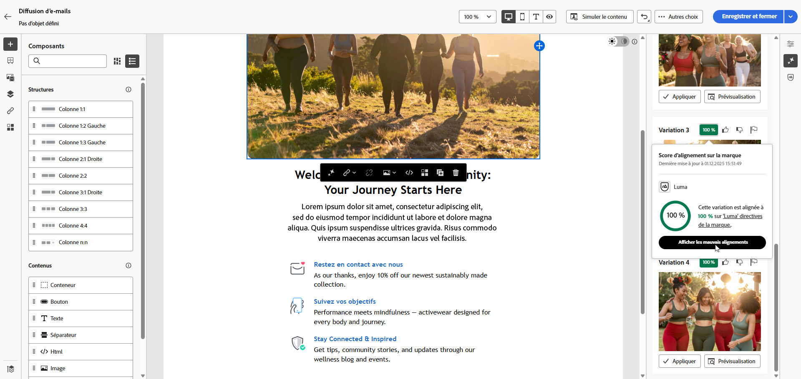

# Génération d’images à l’aide de l’assistant de contenu {#generative-image}

Après avoir conçu et personnalisé vos emails, vous pouvez améliorer votre contenu à l’aide de l’assistant de contenu, optimisé par une IA générative. Cette fonctionnalité simplifie le processus de personnalisation et d’amélioration du contenu.

Pour générer et améliorer des images dans vos emails à l’aide de l’assistant de contenu, procédez comme suit. Vous pouvez également créer du contenu de HTML complet avec l’assistant de contenu, comme décrit dans la section [cette page](generative-email.md), ou de générer un contenu textuel, en suivant la procédure décrite à la section [cette page](generative-content.md).

>[!NOTE]
>
>Avant de commencer à utiliser cette fonctionnalité, lisez les sections connexes : [Barrières de sécurité et limites](generative-gs.md#guardrails-and-limitations).

Dans l’exemple ci-dessous, découvrez comment tirer parti de l’assistant de contenu pour optimiser et améliorer votre contenu, afin d’offrir une expérience plus conviviale. Procédez comme suit :

1. Après avoir créé et configuré votre diffusion email, cliquez sur **[!UICONTROL Modifier le contenu]**.

   Pour plus d&#39;informations sur le paramétrage de votre diffusion email, reportez-vous à la section [cette page](../content/create-email-content.md).

1. Renseignez les **[!UICONTROL Détails de base]** pour votre diffusion. Une fois terminé, cliquez sur **[!UICONTROL Modifier le contenu d’un email]**.

1. Sélectionnez la ressource que vous souhaitez modifier à l’aide de l’assistant de contenu.

1. Dans le menu de droite, sélectionnez **[!UICONTROL Génération d’expériences]**.

   

1. Ajoutez une invite pour affiner davantage vos résultats.

   

1. Sélectionner **[!UICONTROL Télécharger le fichier]** si vous souhaitez ajouter une ressource de marque contenant du contenu pouvant fournir un contexte supplémentaire à l’assistant de contenu.

   Cliquez également sur **[!UICONTROL Contenu téléchargé]** pour rechercher des fichiers mis à jour précédemment. Notez que le contenu chargé est exclusivement disponible pour réutilisation par l’utilisateur actuel.

1. Sélectionnez la variable **[!UICONTROL Format]** de votre ressource. Cela détermine la largeur et la hauteur de la ressource.

   Vous avez la possibilité de choisir parmi des rapports communs tels que 16:9, 4:3, 3:2 ou 1:1, ou vous pouvez saisir une taille personnalisée.

1. Personnalisez le **[!UICONTROL Couleur et ton]**, **[!UICONTROL Type de contenu]**, **[!UICONTROL Éclairage]** et **[!UICONTROL Composition]** pour correspondre aux caractéristiques de ressources souhaitées.

   

1. Une fois que vous êtes satisfait de votre configuration rapide, cliquez sur **[!UICONTROL Générer]**.

1. Parcourez les **[!UICONTROL Suggestions de variation]** pour trouver la ressource souhaitée. Cliquez sur **[!UICONTROL Aperçu]** pour afficher une version plein écran de la variation sélectionnée.

   

1. Cliquez sur **[!UICONTROL Sélectionner]** une fois que vous avez trouvé le contenu approprié.

   

1. Après avoir défini le contenu de votre message, cliquez sur le bouton **[!UICONTROL Simulation du contenu]** pour contrôler le rendu et vérifier les paramètres de personnalisation avec les profils de test.  [En savoir plus](../preview-test/preview-content.md)

   

1. Une fois que vous avez défini votre contenu, votre audience et votre planning, vous êtes prêt à préparer votre diffusion email. [En savoir plus](../monitor/prepare-send.md)