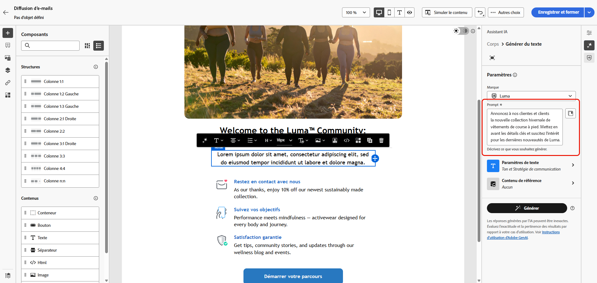
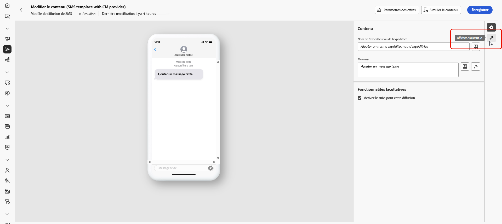
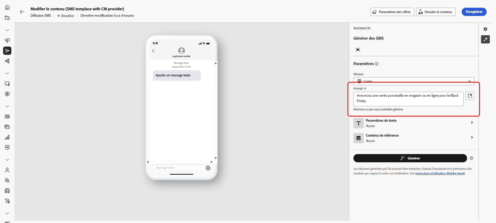
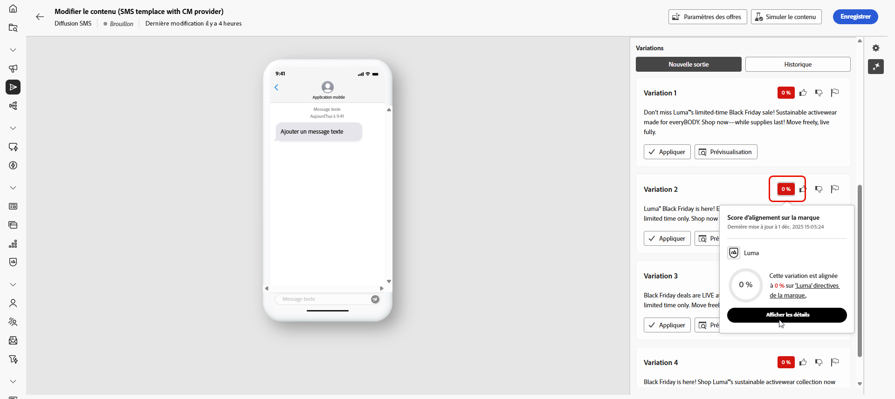
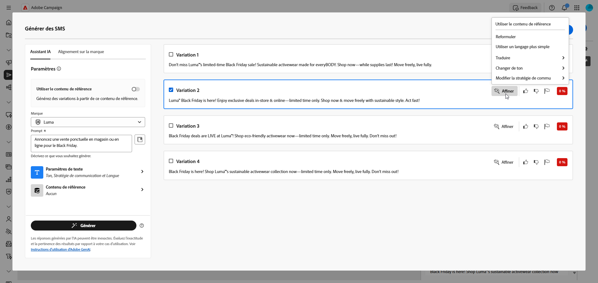

# Générer du texte avec l’assistant d’IA {#generative-text}

>[!IMPORTANT]
>
>Avant de commencer à utiliser cette fonctionnalité, lisez la section sur les [Mécanismes de sécurisation et limitations](generative-gs.md#generative-guardrails) connexes.
> 
>
>Vous devez accepter les termes d’un [contrat d’utilisation](https://www.adobe.com/legal/licenses-terms/adobe-dx-gen-ai-user-guidelines.html){target="_blank"} avant de pouvoir utiliser l’assistant IA dans Adobe Campaign Web. Pour plus d’informations, contactez votre représentant ou représentante Adobe.

Utilisez l’assistant AI dans Adobe Campaign Web pour générer un texte attrayant qui résonne avec votre audience. Que vous amélioriez la copie des e-mails, créiez du contenu de page de destination convaincant, écriviez des messages de notification push ou composiez du texte de SMS, l’assistant AI vous aide à diffuser une communication claire et efficace.

## Pour les e-mails et les landing pages {#email-web-channels}

L’assistant AI peut générer du contenu texte de haute qualité pour vos diffusions e-mail et vos pages de destination. Cette fonctionnalité vous permet de créer des messages attrayants sur la marque, qui se connectent à votre audience à travers les points de contact numériques.

### Accès et configuration {#access-configure}

Avant de pouvoir commencer à générer du contenu texte avec l’assistant AI, vous devez configurer votre diffusion et accéder à l’éditeur de contenu. Pour préparer votre espace de travail et ouvrir le panneau de l’assistant AI, procédez comme suit.

1. Créez et configurez votre diffusion :

   * **E-mail** : après avoir créé et configuré votre diffusion e-mail, cliquez sur **[!UICONTROL Modifier le contenu]**. [En savoir plus](../email/create-email-content.md)
   * **Page de destination** : après avoir créé et configuré votre page de destination, cliquez sur **[!UICONTROL Modifier le contenu]**. [En savoir plus](../landing-pages/create-lp.md)

1. Sélectionnez un **[!UICONTROL composant de texte]** pour cibler du contenu spécifique, puis accédez au menu **[!UICONTROL Assistant IA]**.

   {zoomable="yes"}

### Générer le contenu {#generate-content}

Découvrez comment créer des invites claires, affiner les paramètres et générer du texte personnalisé à l’aide de l’assistant AI, en veillant à ce que votre messagerie s’aligne sur vos objectifs de marque et de communication.

1. Sélectionnez votre **[!UICONTROL Marque]** pour vous assurer que le contenu généré par l’IA correspond aux spécifications de votre marque. [En savoir plus](brands.md) sur les marques.

1. Ajustez le contenu en décrivant ce que vous souhaitez générer dans le champ **[!UICONTROL Prompt]**.

   Si vous avez besoin d’aide pour concevoir votre invite, accédez à la **[!UICONTROL bibliothèque d’invites]** qui fournit un large éventail d’idées d’invites pour améliorer vos diffusions. [En savoir plus sur les bonnes pratiques relatives aux invites](ai-assistant-prompting-guide.md)

   {zoomable="yes"}

1. Adaptez votre prompt à l’aide de l’option **[!UICONTROL Paramètres de texte]** :

   * **[!UICONTROL Stratégie de communication]** : choisissez le style de communication le plus adapté au texte généré.
   * **[!UICONTROL Langues]** : sélectionnez la langue du contenu généré.
   * **[!UICONTROL Ton]** : le ton de votre e-mail doit résonner auprès de votre audience. Que vous souhaitiez communiquer de façon informative, ludique ou convaincante, l’assistant IA adapte le message en conséquence.
   * **Longueur de texte** : utilisez le curseur pour sélectionner la longueur souhaitée de votre texte.

     {zoomable="yes"}

1. Dans le menu **[!UICONTROL Contenu de référence]**, cliquez sur **[!UICONTROL Télécharger le fichier]** pour ajouter une ressource de marque contenant du contenu pouvant fournir un assistant d’IA contextuel supplémentaire ou sélectionnez-en une précédemment chargée.

   Les fichiers précédemment chargés sont disponibles dans le menu déroulant **[!UICONTROL Contenu de référence chargé]**. Activez simplement les ressources que vous souhaitez inclure dans votre génération.

1. Lorsque votre prompt est prêt, cliquez sur **[!UICONTROL Générer]**.

### Affiner et finaliser {#refine-finalize}

Découvrez comment réviser le texte généré, apporter des améliorations et appliquer une personnalisation pour finaliser votre contenu, créer des messages soignés et attrayants prêts à être diffusés.

1. Parcourez les **[!UICONTROL variations]** générées.

1. Cliquez sur l’icône de pourcentage pour afficher votre **[!UICONTROL score d’alignement sur la marque]** et identifier les alignements incorrects avec votre marque.

   En savoir plus sur le [score d’alignement sur la marque](brands-score.md).

   {zoomable="yes"}

1. Cliquez sur **[!UICONTROL Aperçu]** pour afficher une version en plein écran de la variation sélectionnée ou sur **[!UICONTROL Appliquer]** pour remplacer votre contenu actuel.

1. Naviguez vers l’option **[!UICONTROL Affiner]** dans la fenêtre **[!UICONTROL Aperçu]** pour accéder à d’autres fonctionnalités de personnalisation :

   * **[!UICONTROL Utiliser comme contenu de référence]** : la variante choisie sert de contenu de référence pour générer d’autres résultats.
   * **[!UICONTROL Élaborer]** : permet de développer des sujets spécifiques, en fournissant des détails supplémentaires pour une meilleure compréhension et un meilleur engagement.
   * **[!UICONTROL Résumer]** : permet de condenser des points clés en résumés clairs et concis qui retiennent l’attention et encouragent la lecture.
   * **[!UICONTROL Reformuler]** : permet de reformuler le message de différentes manières en conservant une écriture soignée et attrayante pour diverses audiences.
   * **[!UICONTROL Utiliser un langage plus simple]** : simplifiez vos énoncés pour garantir la clarté et l’accessibilité pour une audience plus large.
   * **[!UICONTROL Traduire]** : simplifiez votre langue pour garantir la clarté et l’accessibilité pour une audience plus large.

   Vous pouvez également modifier le **[!UICONTROL Ton]** et la **[!UICONTROL Stratégie de communication]** de votre texte.

   {zoomable="yes"}

1. Ouvrez l’onglet **[!UICONTROL Alignement sur la marque]** pour voir comment votre contenu s’aligne sur vos [directives de marque](../content/brands.md).

1. Cliquez sur **[!UICONTROL Sélectionner]** une fois que vous avez trouvé le contenu approprié.

1. Insérez des champs de personnalisation pour personnaliser votre contenu en fonction des données de profil. Cliquez ensuite sur le bouton **[!UICONTROL Simuler le contenu]** pour contrôler le rendu et vérifier les paramètres de personnalisation avec les profils de test. [En savoir plus](../preview-test/preview-content.md)

1. Examinez et activez votre contenu :
   * **E-mail** : lorsque vous avez défini le contenu, l’audience et le planning, vous êtes prêt(e) à préparer votre diffusion e-mail. [En savoir plus](../monitor/prepare-send.md)
   * **Page de destination** : une fois votre page de destination prête, vous pouvez la publier pour la rendre disponible pour une utilisation dans un message. [En savoir plus](../landing-pages/create-lp.md)

## Pour les canaux mobiles {#mobile-channels}

L’assistant AI peut générer du contenu texte attrayant pour vos notifications push et vos SMS, ce qui vous permet de créer des communications mobiles attrayantes qui se connectent à votre audience à travers tous les points de contact mobiles.

### Accès et configuration {#mobile-access-configure}

Avant de commencer à générer du texte avec l’assistant AI pour les canaux mobiles, vous devez configurer votre diffusion et accéder à l’assistant AI.

1. Créez et configurez votre diffusion mobile :
   * **Notifications push** : après avoir créé et configuré votre diffusion de notification push, cliquez sur **[!UICONTROL Modifier le contenu]**. [En savoir plus](../push/create-push.md)
   * **SMS** : après avoir créé et configuré votre diffusion SMS, cliquez sur **[!UICONTROL Modifier le contenu]**. [En savoir plus](../sms/create-sms.md)

1. Renseignez les **[!UICONTROL détails de base]** de votre diffusion. Une fois terminé, cliquez sur **[!UICONTROL Modifier le contenu]**.

1. Personnalisez votre message selon vos besoins :
   * **Notifications push** : [En savoir plus](../push/content-push.md)
   * **SMS** : [En savoir plus](../sms/content-sms.md)

1. Accédez au menu **[!UICONTROL Afficher l’assistant IA]**.

   {zoomable="yes"}

### Générer le contenu {#mobile-generate-content}

Une fois que vous avez accédé à l’assistant d’IA, vous pouvez configurer les paramètres de génération afin de créer du contenu mobile correspondant à votre marque et aux objectifs de diffusion. Personnalisez les paramètres de texte, ajoutez des ressources de marque et fournissez des invites pour guider l&#39;IA dans la génération de variations pertinentes.

1. Sélectionnez votre **[!UICONTROL Marque]** pour vous assurer que le contenu généré par l’IA correspond aux spécifications de votre marque. [En savoir plus](brands.md) sur les marques.

1. Ajustez le contenu en décrivant ce que vous souhaitez générer dans le champ **[!UICONTROL Prompt]**.

   Si vous recherchez de l&#39;aide pour concevoir votre invite, accédez à la **[!UICONTROL bibliothèque d&#39;invites]** qui fournit un large éventail d&#39;idées d&#39;invites pour améliorer votre diffusion. [En savoir plus sur les bonnes pratiques relatives aux invites](ai-assistant-prompting-guide.md)

   {zoomable="yes"}

1. **Pour les notifications push**, sélectionnez le champ de texte à générer : **[!UICONTROL Titre]**, **[!UICONTROL Sous-titre]** et/ou **[!UICONTROL Message]**.

1. Adaptez votre prompt avec les options **[!UICONTROL Paramètres de texte]** :

   * **[!UICONTROL Stratégie de communication]** : choisissez le style de communication le plus adapté au texte généré.
   * **[!UICONTROL Langues]** : sélectionnez la langue du contenu généré.
   * **[!UICONTROL Ton]** : Le ton doit résonner auprès de votre audience. Que vous souhaitiez communiquer de façon informative, ludique ou convaincante, l’assistant IA peut adapter le message en conséquence.
   * **[!UICONTROL Longueur]** : sélectionnez la longueur de votre contenu à l’aide du curseur de plage.

     {zoomable="yes"}

1. Dans le menu **[!UICONTROL Contenu de référence]**, cliquez sur **[!UICONTROL Télécharger le fichier]** pour ajouter une ressource de marque contenant du contenu pouvant fournir un assistant d’IA contextuel supplémentaire ou sélectionnez-en une précédemment chargée.

   Les fichiers précédemment chargés sont disponibles dans le menu déroulant **[!UICONTROL Contenu de référence chargé]**. Activez simplement les ressources que vous souhaitez inclure dans votre génération.

1. Lorsque votre prompt est prêt, cliquez sur **[!UICONTROL Générer]**.

### Affiner et finaliser {#mobile-refine-finalize}

Après avoir généré des variations de texte pour vos messages mobiles, vous pouvez affiner les résultats pour vous assurer qu’ils répondent exactement à vos besoins. Examinez l’alignement de la marque, ajustez le ton et la langue, puis préparez le contenu pour l’activation.

1. Après la génération, parcourez les **[!UICONTROL Variations]**.

1. Cliquez sur l’icône de pourcentage pour afficher votre **[!UICONTROL score d’alignement sur la marque]** et identifier les alignements incorrects avec votre marque.

   En savoir plus sur le [score d’alignement sur la marque](brands-score.md).

   {zoomable="yes"}

1. Cliquez sur **[!UICONTROL Aperçu]** pour afficher une version en plein écran de la variation sélectionnée ou cliquez sur **[!UICONTROL Appliquer]** pour remplacer votre contenu actuel.

1. Naviguez vers l’option **[!UICONTROL Affiner]** dans la fenêtre **[!UICONTROL Aperçu]** pour accéder à d’autres fonctionnalités de personnalisation :

   * **[!UICONTROL Utiliser comme contenu de référence]** : la variante choisie servira de contenu de référence pour générer d’autres résultats.

   * **[!UICONTROL Reformuler]** : réécrivez le message tout en préservant sa signification. Cette option vous permet de générer une autre formulation, d’améliorer le flux ou d’ajuster les expressions sans modifier le message principal.

   * **[!UICONTROL Utiliser un langage simplifié]** : utilisez l’assistant IA pour simplifier votre langage, garantissant ainsi clarté et accessibilité pour une audience plus large.

   * **[!UICONTROL Traduire]** : simplifiez votre langue pour garantir la clarté et l’accessibilité pour une audience plus large.

   * **[!UICONTROL Changer de ton]** : ajustez le ton du message pour mieux correspondre à votre style de communication, c’est-à-dire le rendre plus convivial, professionnel, urgent ou inspirant.

   * **[!UICONTROL Modifier la stratégie de communication]** : modifiez l’approche de messagerie en fonction de vos objectifs, tels que créer une urgence ou mettre l’accent sur un appel passionnant.

     {zoomable="yes"}

1. Ouvrez l’onglet **[!UICONTROL Alignement sur la marque]** pour voir comment votre contenu s’aligne sur vos [directives de marque](brands.md).

1. Cliquez sur **[!UICONTROL Sélectionner]** une fois que vous avez trouvé le contenu approprié.

1. Insérez des champs de personnalisation pour personnaliser votre contenu en fonction des données de profil. Cliquez ensuite sur le bouton **[!UICONTROL Simuler le contenu]** pour contrôler le rendu et vérifier les paramètres de personnalisation avec les profils de test. [En savoir plus](../personalization/personalize.md)

1. Examinez et activez votre contenu :
   * **Notification push** : lorsque vous avez défini votre contenu, votre audience et votre planning, vous êtes prêt à préparer votre diffusion de notification push. [En savoir plus](../push/send-push.md)
   * **SMS** : une fois votre SMS prêt, vous pouvez le publier pour le rendre disponible pour une utilisation dans un message. [En savoir plus](../sms/send-sms.md)
