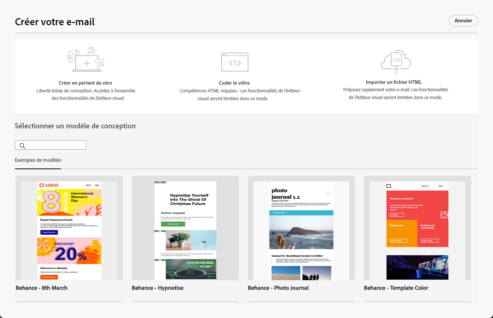

# Commencer avec le concepteur d’e-mail {#get-started-email-designer}

Une fois que vous avez créé un e-mail dans Adobe Campaign, vous devez en définir le contenu.

Le concepteur d’e-mail permet de créer des e-mails captivants et personnalisés au moyen d’une interface intuite par glisser-déposer. Un monde de possibilités s’offre à vous : commencez à partir de zéro, importez un contenu précédent ou tirez parti de modèles existants. Vous pouvez concevoir et affiner le contenu de chaque e-mail pour un usage promotionnel ou transactionnel.

<!--Built to deliver HTML optimized for responsive design, the Email Designer allows you to easily define and apply visibility conditions and dynamic content to an email, template, or fragment directly through the user interface. You can seamlessly switch between the drag and drop interface and HTML code at the click of a button.

The Email Designer allows you to create email content and email content templates. It is compatible with simple emails, transactional emails, A/B test emails, multilingual emails, and recurring emails.-->

* Tirez parti des fonctionnalités de conception d’e-mail de [!DNL Campaign] pour créer en toute facilité des e-mails en responsive design. [En savoir plus](create-email-content.md)

* Améliorez l’expérience des clients et clientes en créant des profils personnalisés en fonction de leurs attributs de profil. [En savoir plus](../personalization/personalize.md)

* Configurez du contenu conditionnel et élaborez une personnalisation dynamique basée sur le profil du ou de la destinataire. [En savoir plus](../personalization/conditions.md)

## Bonnes pratiques en matière de conception d’e-mail {#best-practices}

Lors de l’envoi d’e-mails, il est important de tenir compte du fait que les destinataires peuvent les transférer, ce qui peut parfois entraîner des problèmes de rendu de l’e-mail. Vous risquez de rencontrer ces problèmes si vous utilisez des classes CSS non prises en charge par le fournisseur de messagerie utilisé pour le transfert, comme « is-desktop-hidden », par exemple, pour masquer une image sur les appareils mobiles.

Pour éviter autant que possible ces problèmes de rendu, une bonne pratique consiste à concevoir une structure d’e-mail aussi simple que possible. Privilégiez une conception d’e-mail unique, qui fonctionne aussi bien sur les postes de travail que les appareils mobiles et évitez d’utiliser des classes CSS complexes ou d’autres éléments de conception dont la prise en charge par tous les clients de messagerie est aléatoire. En suivant ces bonnes pratiques, vous pouvez vous assurer que vos e-mails sont correctement rendus, quelle que soit la manière dont ils sont affichés ou transférés par les destinataires.

## Commencer à créer du contenu {#start-authoring}

À partir du tableau de bord de la diffusion e-mail, accédez à l’écran [Modifier le contenu](edit-content.md) pour ouvrir la page d’accueil du concepteur d’e-mail. Choisissez ensuite votre méthode de conception d’e-mail parmi les options suivantes :

* **Concevoir votre e-mail à partir de zéro** dans l’interface du concepteur d’e-mail. Découvrez comment concevoir le contenu de votre e-mail dans [cette section](create-email-content.md).

* **Codez ou collez du code HTML brut** directement dans le concepteur d’e-mail. Découvrez comment coder votre propre contenu dans [cette section](code-content.md).

* **Importez du contenu HTML existant** à partir d’un fichier ou d’un dossier .zip. Découvrez comment importer un contenu d’e-mail dans [cette section](existing-content.md).

* **Sélectionnez un contenu existant** à partir d’une liste de modèles intégrés ou personnalisés. Découvrez comment utiliser des modèles d’e-mail dans [cette section](email-sample-templates.md).

  
