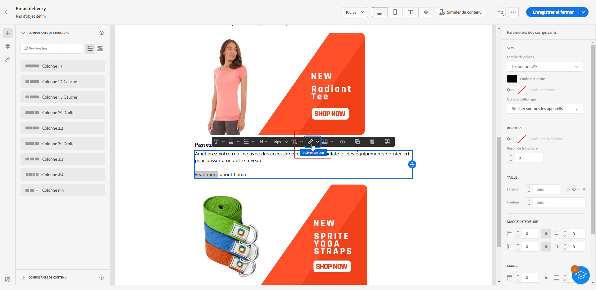
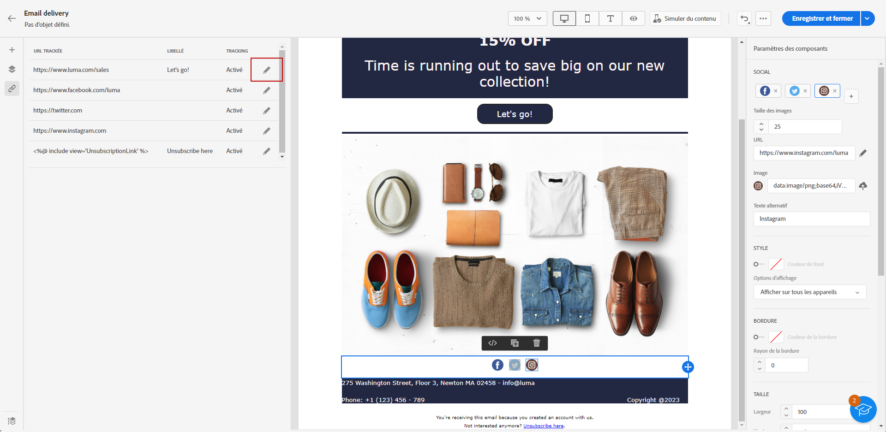
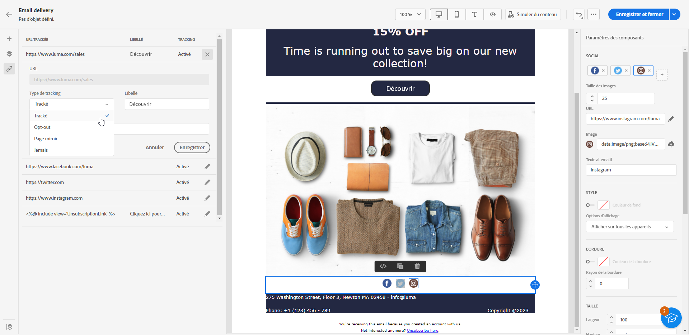
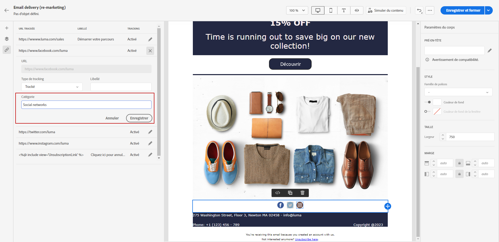

# Ajouter des liens et tracker les messages {#tracking}

Utilisez le Concepteur d’e-mail pour ajouter des liens à votre contenu et tracker les messages envoyés afin de surveiller le comportement de vos destinataires.

## Insérer des liens {#insert-links}

Lors de la conception d’un message, vous pouvez ajouter des liens à votre contenu.

>[!NOTE]
>
>Lorsque le tracking est activé, tous les liens inclus dans le contenu du message sont trackés.

Pour insérer des liens dans le contenu de votre e-mail, procédez comme suit :

1. Sélectionnez un élément et cliquez sur **[!UICONTROL Insérer un lien]** dans la barre d’outils contextuelle.

   

1. Ajoutez un **[!UICONTROL Libellé]** et un **[!UICONTROL Lien]**.

1. Enregistrez vos modifications.

1. Une fois le lien créé, vous pouvez encore le modifier à partir du volet **[!UICONTROL Paramètres des composants]** à droite.

   * Vous pouvez modifier le lien ainsi que sa **[!UICONTROL Cible]**.
   * Vous pouvez choisir de souligner le lien en cochant l’option correspondante.

   

>[!NOTE]
>
>Les e-mails de type marketing doivent inclure un lien d’exclusion, qui n’est pas obligatoire pour les messages transactionnels. La catégorie du message (**[!UICONTROL Marketing]** ou **[!UICONTROL Transactionnel]**) est définie au niveau de la surface du canal (c’est-à-dire le paramètre prédéfini du message) et lors de la création du message.

Un lien spécifique vers la page miroir doit être ajouté à tous vos emails. En savoir plus sur la page miroir dans [cette section](mirror-page.md).

## Gérer le tracking {#manage-tracking}

Le [Concepteur d’e-mail](create-email-content.md) permet de gérer les URL trackées : par exemple, vous pouvez modifier le type de tracking de chaque lien.

1. Cliquez sur l’icône **[!UICONTROL Liens]** dans le volet de gauche pour afficher la liste de toutes les URL du contenu à tracker.

   Cette liste permet d’avoir une vue centrale et de localiser chaque URL dans le contenu de l’e-mail.

1. Pour éditer un lien, cliquez sur l’icône représentant un crayon correspondante.

   

1. Vous pouvez modifier le **[!UICONTROL Type de tracking]** si nécessaire :

   

   Pour chaque URL trackée, vous pouvez définir le mode de tracking sur l’une des valeurs suivantes :

   * **[!UICONTROL Trackée]** : active le tracking de cette URL.
   * **[!UICONTROL Exclusion]** : traite cette URL comme une URL d’exclusion ou de désinscription.
   * **[!UICONTROL Page miroir]** : traite cette URL comme une URL de page miroir.
   * **[!UICONTROL Jamais]** : n’active jamais le tracking de cette URL. <!--This information is saved: if the URL appears again in a future message, its tracking is automatically deactivated.-->

1. Ajoutez une **[!UICONTROL Catégorie]** à votre lien pour regrouper les liens trackés, puis cliquez sur **[!UICONTROL Enregistrer]**.

   

1. Une fois votre diffusion envoyée, accédez à votre rapport de diffusion. Dans le menu **[!UICONTROL Tracking]**, le rapport **[!UICONTROL URL et flux de clics]** affiche les URL de votre diffusion les plus visitées. [En savoir plus](../reporting/reports.md)
