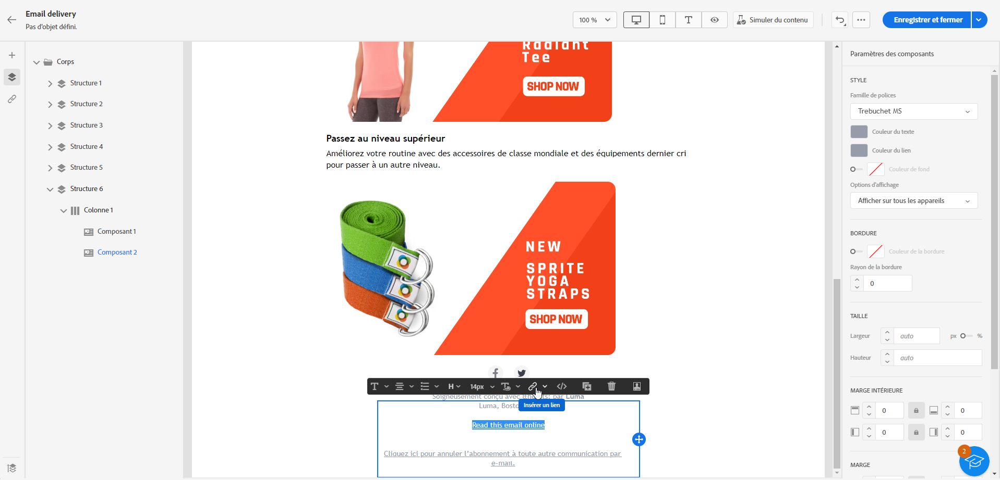
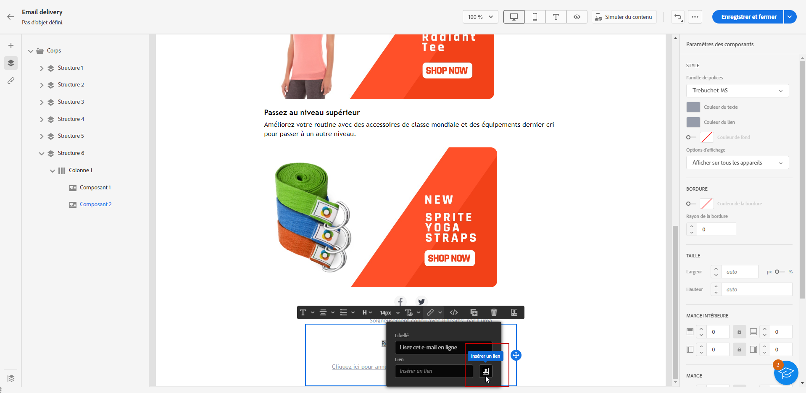
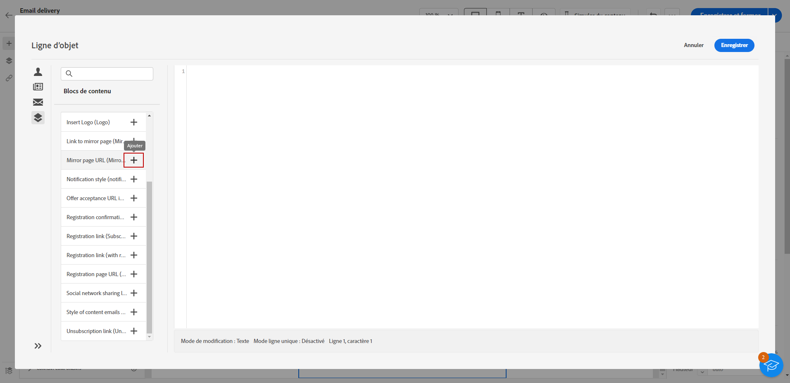

# Ajouter un lien vers la page miroir{#mirror-page}

La page miroir est une version en ligne de votre email.

Bien que la plupart des clients de messagerie rendent les images sans problème, certains paramètres prédéfinis peuvent éviter d’afficher les images pour des raisons de sécurité. Les utilisateurs peuvent accéder à la page miroir d’un email, par exemple s’ils rencontrent des problèmes de rendu ou des images endommagées lors de la tentative de l’afficher dans leur boîte de réception. Il est également recommandé de fournir une version en ligne pour des raisons d’accessibilité ou d’encourager le partage sur les réseaux sociaux.

La page miroir générée par Adobe Campaign contient toutes les données de personnalisation.

{width="600" align="left"}

## Ajouter un lien vers la page miroir{#link-to-mirror-page}

L’insertion d’un lien vers la page miroir est une bonne pratique. Ce lien peut, par exemple, &quot;Afficher cet email dans votre navigateur&quot; ou &quot;Lire ceci en ligne&quot;. Il se trouve souvent dans l’en-tête ou le pied de page de l’email.

Dans Adobe Campaign, vous pouvez insérer un lien vers la page miroir dans le contenu de l&#39;email à l&#39;aide du **bloc de personnalisation**. La version intégrée **Lien vers la page miroir** le bloc de personnalisation insère le code suivant dans le contenu de votre email : `<%@ include view='MirrorPage' %>`.

Pour ajouter un lien vers une page miroir dans l’e-mail :

1. Sélectionnez un élément et cliquez sur **[!UICONTROL Insérer un lien]** dans la barre d’outils contextuelle.

   

1. Sélectionnez l’icône **[!UICONTROL Insérer un lien]** pour accéder au menu de personnalisation.

   

1. Dans le menu **[!UICONTROL Bloc de contenu]**, sélectionnez **[!UICONTROL URL de la page miroir]** et cliquez sur **[!UICONTROL Ajouter]**.

   

   Pour plus d&#39;informations sur l&#39;insertion de blocs de contenu personnalisés, reportez-vous à la section [cette section](../personalization/personalize.md#personalize-emails).

La page miroir est automatiquement créée.

>[!IMPORTANT]
>
>Les liens de pages miroir sont générés automatiquement et ne peuvent pas être modifiés. Ils contiennent toutes les données personnalisées chiffrées requises pour générer l’e-mail original. Par conséquent, l’utilisation d’attributs personnalisés avec des valeurs élevées peut générer de longues URL de pages miroir. Cela peut empêcher le lien de fonctionner dans les navigateurs web qui imposent des limites de longueur d’URL.

Une fois l’e-mail envoyé, lorsque les destinataires cliquent sur le lien de la page miroir, le contenu de l’e-mail s’affiche dans leur navigateur web par défaut.

>[!NOTE]
>
>Dans l’e-mail de test envoyé aux profils de test, le lien vers la page miroir est inactif. Il n’est actif que dans les messages finaux.

Par défaut, la période de conservation d’une page miroir est de 60 jours. Une fois ce délai écoulé, la page miroir n’est plus disponible.

## Génération de pages miroir{#mirror-page-generation}

Par défaut, la page miroir est automatiquement générée par Adobe Campaign si le contenu de l&#39;email n&#39;est pas vide et s&#39;il contient un lien vers la page miroir (ou lien miroir).

Vous pouvez contrôler le mode de génération de la page miroir de l&#39;email. Les options sont disponibles dans les propriétés de la diffusion. [En savoir plus](../advanced-settings/delivery-settings.md#mirror)
