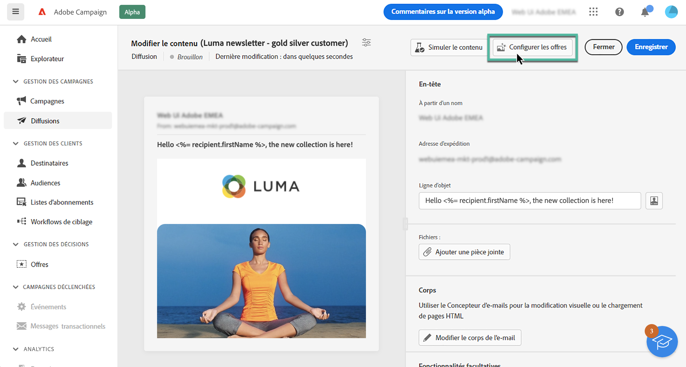
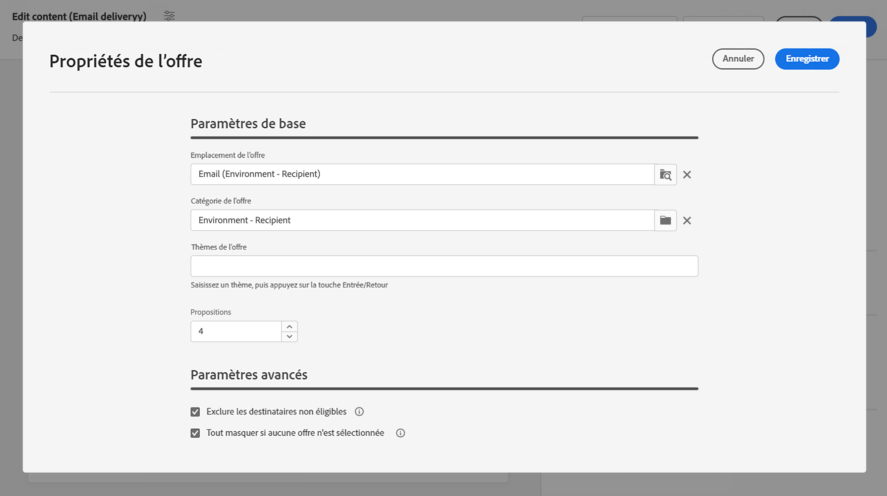
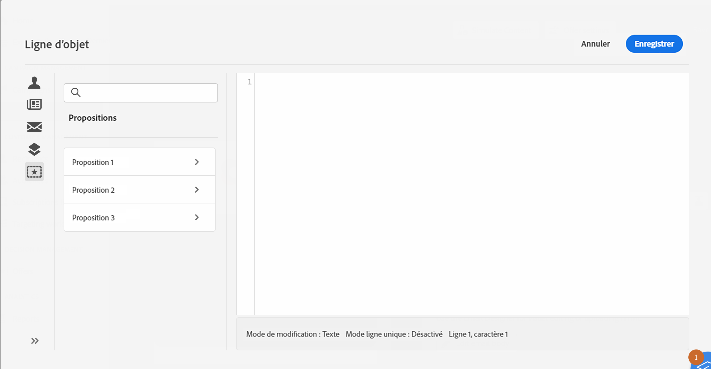
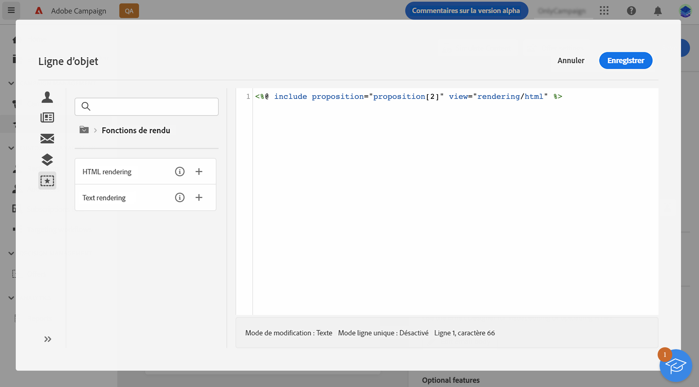

# Envoyer des offres {#offers-content}

Adobe Campaign v8 Web vous permet d’envoyer les offres qui ont été créées dans la console à l’aide du module **[!UICONTROL Interaction]** avec les diffusions. Pour plus d&#39;informations sur Interaction et la gestion d&#39;un catalogue d&#39;offres dans la console, reportez-vous à la section [Documentation de Campaign v8 (console cliente)](https://experienceleague.adobe.com/docs/campaign/campaign-v8/offers/interaction.html?lang=fr){target="_blank"}.

Pour envoyer des offres avec une diffusion, procédez comme suit :

1. [Configurer les offres à proposer](#configure)
1. [Insérer les offres dans la diffusion](#insert)

## Configurer les offres à proposer {#configure}

>[!CONTEXTUALHELP]
>id="acw_deliveries_email_offers_settings"
>title="Paramètres des offres"
>abstract="Configurez les offres qui doivent être proposées aux destinataires."

>[!CONTEXTUALHELP]
>id="acw_deliveries_email_offers_advanced_settings"
>title="Paramètres avancés des offres"
>abstract="Configurez les options avancées sur les offres."

1. Pour sélectionner les offres à proposer dans la diffusion, cliquez sur le bouton **[!UICONTROL Configurer les offres]** sur l’écran de modification du contenu de la diffusion.

   

1. Configurez les offres qui doivent être proposées aux destinataires.

   Sélectionnez d’abord l’**[!UICONTROL emplacement]** correspondant à votre environnement d’offres. Découvrez comment créer un emplacement dans le [Documentation de Campaign v8 (console cliente)](https://experienceleague.adobe.com/docs/campaign/campaign-v8/offers/interaction-settings/interaction-offer-spaces.html?lang=fr){target="_blank"}

   

1. Pour affiner le choix des offres du moteur, sélectionnez une **[!UICONTROL Catégorie d’offres]** spécifique dans laquelle les offres sont triées.

   Lors de la sélection d’un dossier, tous les sous-dossiers sont automatiquement inclus et ne peuvent pas être supprimés. Notez que l’interface de [!DNL Campaign] n’adopte pas ce comportement.

   >[!NOTE]
   >
   >Si vous ne sélectionnez aucune catégorie, toutes les offres contenues dans l’environnement sont prises en compte par le moteur d’offres, sauf si vous sélectionnez un **[!UICONTROL Thème d’offre]**.

1. (facultatif) Saisissez un thème pour filtrer les catégories. Les thèmes sont des mots-clés définis en amont dans les catégories. Ils servent de filtre et permettent ainsi d’affiner le nombre d’offres à présenter en les sélectionnant dans un ensemble de catégories.

1. Utilisez le champ **[!UICONTROL Propositions]** pour indiquer le nombre d’offres à insérer dans la diffusion.

1. Sélectionnez l’option **[!UICONTROL Exclure les destinataires non éligibles]**, si nécessaire.

   Cette option permet d’activer ou désactiver l’exclusion des destinataires pour lesquels il n’y a pas assez d’offres éligibles.

   * Si vous activez cette option, les destinataires qui n’ont pas suffisamment de propositions sont exclus de la diffusion.
   * Si vous désactivez cette option, ces destinataires ne sont pas exclus, mais ils ne peuvent pas avoir le nombre de propositions demandé.

1. Si nécessaire, sélectionnez l’option **[!UICONTROL Masquer tout si aucune offre n’est sélectionnée]**.

   Cette option vous permet de choisir le mode de traitement du message au cas où l’une des propositions n’existerait pas.

   * Si vous activez cette option, la représentation de la proposition manquante ne s’affiche pas et aucun contenu n’apparaît dans le message pour cette proposition.
   * Si vous désactivez cette option, le message est annulé lors de l’envoi et les destinataires ne peuvent plus recevoir de messages.

Une fois que vous avez configuré les offres à proposer dans la diffusion, vous pouvez les insérer dans le contenu de la diffusion à l’aide de l’éditeur d’expression.

## Insérer des offres dans la diffusion {#insert}

Vous pouvez ajouter des offres à la diffusion à l’aide de l’[Éditeur d’expression](../personalization/gs-personalization.md#access). Elles peuvent être insérées dans l’objet ou dans le corps de la diffusion.

>[!CAUTION]
>
>Avant d’insérer une offre dans une diffusion, assurez-vous d’avoir [configuré les offres proposées dans le cadre de cette diffusion](#configure).

Pour insérer une offre à l’aide de l’éditeur d’expression, procédez comme suit.

1. Accédez à l’objet ou au contenu d’une diffusion.

1. Placez le curseur de la souris à l’endroit où vous souhaitez insérer l’offre, puis ouvrez l’éditeur d’expression à l’aide de l’icône de personnalisation.

1. Sélectionnez le menu **[!UICONTROL Propositions]**. Les propositions disponibles s’affichent dans la liste.

   >[!NOTE]
   >
   >Le nombre de propositions est défini lors de la [configuration des offres](#configure) de la diffusion en cours.

   

1. Ajoutez les propositions dans l’objet ou le corps de la diffusion à l’aide des champs de personnalisation, des fonctions de rendu ou des attributs d’offre disponibles pour chaque proposition.

   

   >[!NOTE]
   >
   >Le nombre de propositions disponibles dépend de la configuration de l’appel au moteur et leur ordre dépend de la priorité des offres.

1. Enregistrez vos modifications.

1. Finalisez le contenu, puis testez et envoyez votre diffusion.

Désormais, lorsqu’un destinataire reçoit la diffusion, l’offre pertinente s’affiche pour ce profil spécifique.
