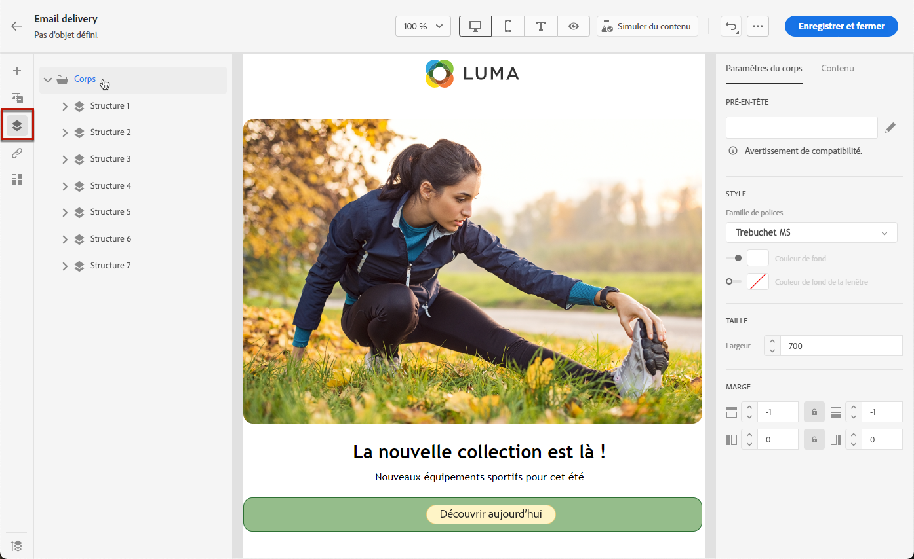
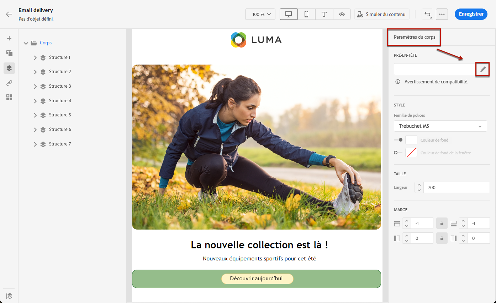

# Ajouter un pré-titre à un e-mail {#preheader}

>[!CONTEXTUALHELP]
>id="ac_edition_preheader"
>title="Ajouter un pré-titre"
>abstract="Un pré-titre est un bref résumé qui suit l’objet d’un e-mail lorsque vous le visualisez depuis votre client de messagerie. Dans de nombreux cas, il fournit un bref résumé de l’e-mail et contient généralement une seule phrase."

Un pré-titre est un texte court qui suit l’objet d’un email lorsqu’il est affiché à partir d’un client de messagerie majeur.

Dans de nombreux cas, il fournit un bref résumé du contenu, généralement d’une seule phrase.

>[!NOTE]
>
>Les pré-titres ne sont pas pris en charge par tous les clients de messagerie. Le pré-titre ne s’affiche pas s’il n’est pas pris en charge.

Pour définir le pré-titre de l&#39;email, procédez comme suit.

1. Dans la [Concepteur d&#39;email](create-email-content.md), ajoutez au moins un **[!UICONTROL Structure]** pour commencer à concevoir votre email.

1. Cliquez sur l’icône **[!UICONTROL Arborescence de navigation]** dans le volet de gauche, puis sélectionnez **[!UICONTROL Corps]**.

   

1. Dans la **[!UICONTROL Paramètres]** , saisissez du texte pour votre pré-titre.

1. Pour le personnaliser davantage, cliquez sur le bouton **[!UICONTROL Ajouter une personnalisation]** à gauche de la **[!UICONTROL Preheader]** champ .

   

1. Dans la **[!UICONTROL Modifier la personnalisation]** fenêtre, vous pouvez ajouter [champs de personnalisation](../personalization/personalize.md), [blocs de contenu](../personalization/content-blocks.md) et [contenu conditionnel](../personalization/conditions.md) en utilisant les entrées dédiées sur la gauche.

   

1. Cliquez sur **[!UICONTROL Confirmer]**.

Le pré-titre de votre e-mail est à présent configuré.
