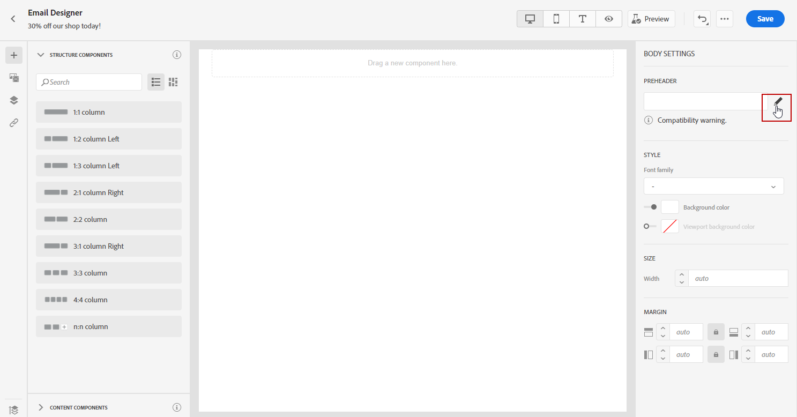

# Ajout d’un pré-titre {#preheader}

>[!NOTE]
>
>Cette documentation est en cours de construction et fréquemment mise à jour. La version finale de ce contenu sera prête en janvier 2023.

>[!CONTEXTUALHELP]
>id="ac_edition_preheader"
>title="Ajouter un pré-titre"
>abstract="Un pré-titre est un texte de résumé court qui suit l’objet d’un message lorsque vous le visualisez à partir de votre client de messagerie. Dans de nombreux cas, il fournit un bref résumé de l’email et il s’agit généralement d’une seule phrase."

Un pré-titre est un texte de résumé court qui suit l’objet d’un message lorsque vous le visualisez à partir de votre client de messagerie. Dans de nombreux cas, il fournit un bref résumé de l’email et il s’agit généralement d’une seule phrase.

>[!NOTE]
>
>Les en-têtes prédéfinis ne sont pas pris en charge par tous les clients de messagerie. Lorsqu’il n’est pas pris en charge, le pré-titre ne s’affiche pas.

Pour définir le pré-titre de l&#39;email, procédez comme suit :

1. Depuis le Concepteur d’email, ajoutez une **[!UICONTROL Composants de structure]** pour commencer à concevoir votre email.

   

1. Dans la **[!UICONTROL Paramètres du corps]** volet de droite, cliquez sur **Modifier** en regard de **[!UICONTROL Preheader]** pour ajouter du contenu.

   

1. Ajoutez votre pré-titre. Vous pouvez la personnaliser davantage en cliquant sur le bouton **[!UICONTROL Ajouter une personnalisation]** icône .

   

1. Dans la **[!UICONTROL Modifier la personnalisation]** fenêtre, vous pouvez ajouter **[!UICONTROL Bloc de contenu]**, **[!UICONTROL Contenu dynamique]** ou **[!UICONTROL Champs de personnalisation]**.

1. Cliquez sur **[!UICONTROL Valider]** pour vérifier votre syntaxe de personnalisation.

   

1. Cliquez sur **[!UICONTROL Enregistrer]**.

Votre pré-titre est maintenant configuré pour votre email.
