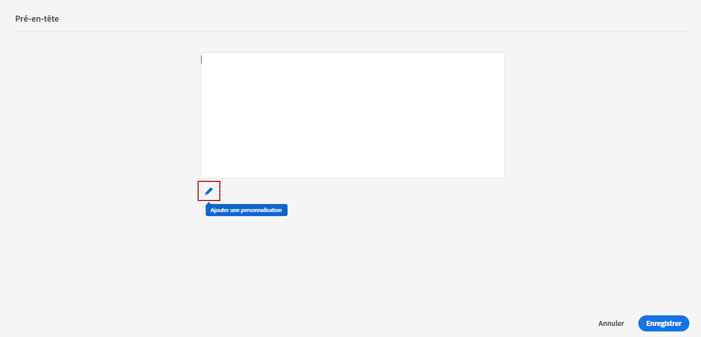

# Ajouter un pré-titre à un e-mail {#preheader}

>[!CONTEXTUALHELP]
>id="ac_edition_preheader"
>title="Ajouter un pré-titre"
>abstract="Un pré-titre est un bref résumé qui suit l’objet d’un e-mail lorsque vous le visualisez depuis votre client de messagerie. Dans de nombreux cas, il fournit un bref résumé de l’e-mail et contient généralement une seule phrase."

Un pré-titre est un bref résumé qui suit l’objet d’un e-mail lorsque vous le visualisez depuis votre client de messagerie.

Dans de nombreux cas, il fournit un bref résumé de l’e-mail et contient généralement une seule phrase.

>[!NOTE]
>
>Les pré-titres ne sont pas pris en charge par tous les clients de messagerie. Le pré-titre ne s’affiche pas s’il n’est pas pris en charge.

Pour définir le pré-titre d’un e-mail, procédez comme suit :

1. À partir du Concepteur d’e-mail, ajoutez au moins un **[!UICONTROL composant de structure]** pour commencer à concevoir votre e-mail.

1. Cliquez sur l’icône **[!UICONTROL Arborescence de navigation]** dans le volet de gauche, puis sélectionnez **[!UICONTROL Corps]**.

   

1. Dans le volet de droite **[!UICONTROL Paramètres du corps]**, cliquez sur l’icône de modification à côté du champ **[!UICONTROL Pré-titre]** pour ajouter du contenu.

   

1. Ajoutez le pré-titre. Vous pouvez le personnaliser davantage en cliquant sur l’icône **[!UICONTROL Ajouter une personnalisation]**.

   

1. Dans la fenêtre **[!UICONTROL Modifier la personnalisation]**, vous pouvez ajouter un **[!UICONTROL Bloc de contenu]**, du **[!UICONTROL Contenu dynamique]** ou des **[!UICONTROL Champs de personnalisation]**.

1. Cliquez sur **[!UICONTROL Valider]** pour vérifier la syntaxe de votre personnalisation.

1. Cliquez sur **[!UICONTROL Enregistrer]**.

Le pré-titre de votre e-mail est à présent configuré.
