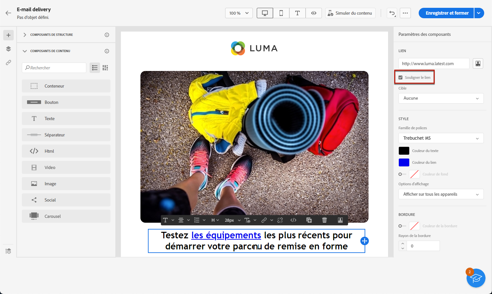
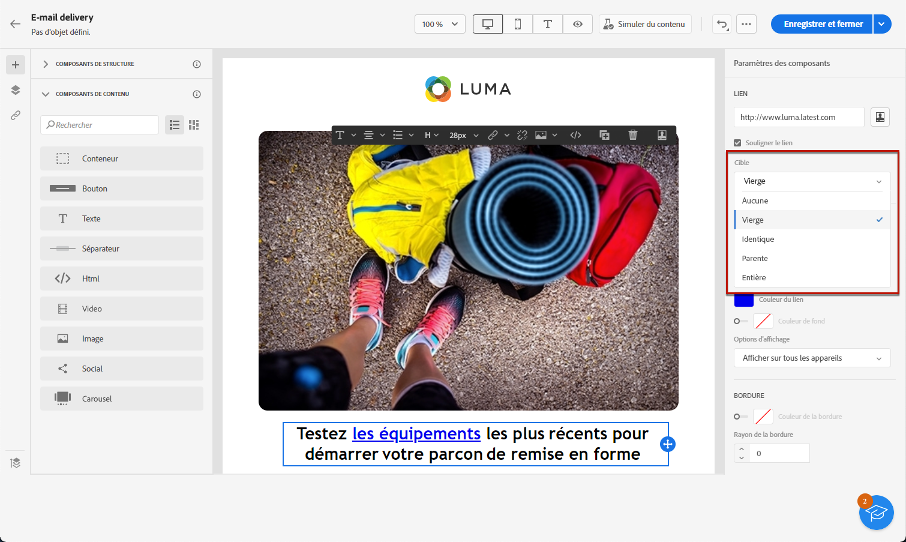
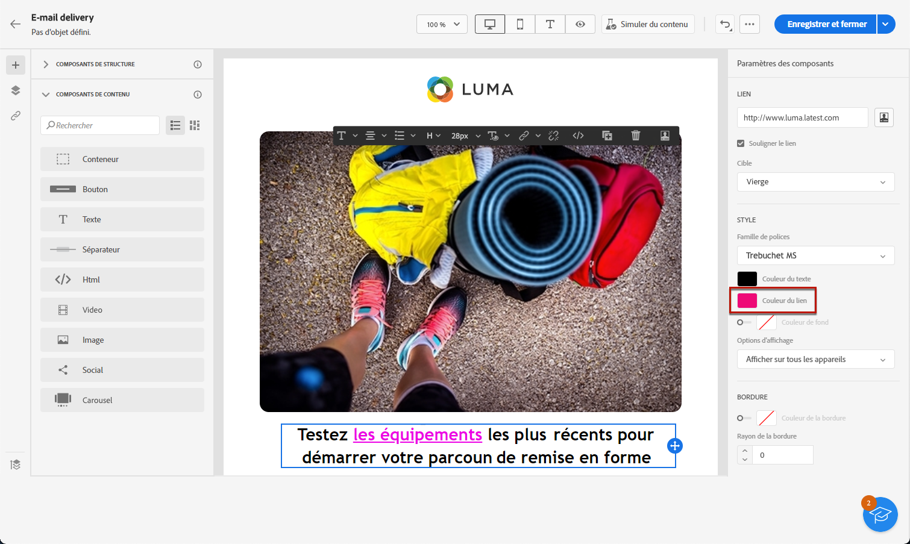

# Définir un style pour les liens {#styling-links}

Vous pouvez souligner un lien et sélectionner sa couleur et sa cible dans le Concepteur d’e-mail.

1. Dans un composant **[!UICONTROL Texte]** contenant un lien, sélectionnez ce dernier.

1. Dans le menu **[!UICONTROL Paramètres des composants]**, cochez **[!UICONTROL Souligner le lien]** pour que le libellé soit souligné.

   

1. Choisissez la manière de rediriger votre audience avec la liste déroulante **[!UICONTROL Cible]** :

   * **[!UICONTROL Aucune]** : ouvre le lien dans le même cadre que celui sur lequel l’utilisateur ou l’utilisatricea cliqué (par défaut).
   * **[!UICONTROL Vierge]** : ouvre le lien dans une nouvelle fenêtre ou un nouvel onglet.
   * **[!UICONTROL Auto]** : ouvre le lien dans le même cadre que celui sur lequel l’utilisateur ou l’utilisatrice a cliqué.
   * **[!UICONTROL Parent]** : ouvre le lien dans le cadre parent.
   * **[!UICONTROL Haut]** : ouvre le lien dans le corps complet de la fenêtre.

   

1. Pour modifier la couleur de votre lien, cliquez sur **[!UICONTROL Couleur du lien]** dans le volet de droite.

   

1. Enregistrez vos modifications.
