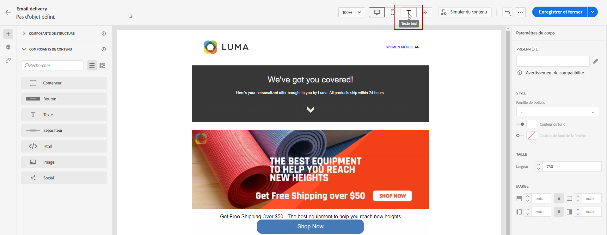
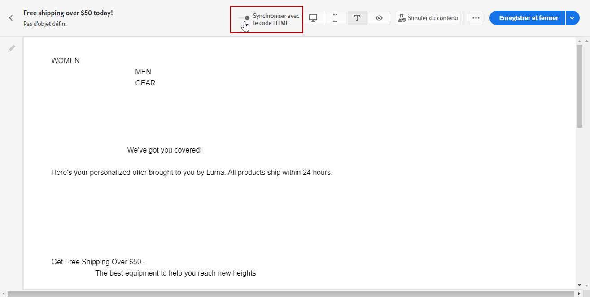
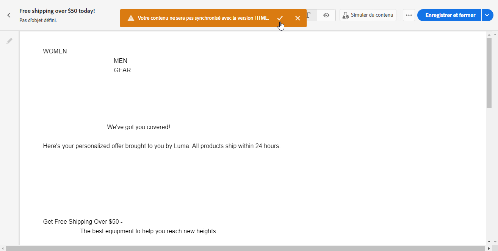

# Créer la version texte d&#39;un email {#text-version-email}

>[!NOTE]
>
>Cette documentation est en cours de construction et fréquemment mise à jour. La version finale de ce contenu sera prête en janvier 2023.

Il est recommandé de créer une version texte du corps de votre email, qui est utilisée lorsque le contenu du HTML ne peut pas être affiché.

Par défaut, le Concepteur d&#39;email crée une **[!UICONTROL Texte brut]** version de votre email, y compris les champs de personnalisation. Cette version est automatiquement générée et synchronisée avec la version par HTML de votre contenu.

Si vous préférez utiliser un contenu différent pour la version en texte brut, procédez comme suit :

1. Dans votre email, sélectionnez la variable **[!UICONTROL Texte brut]** .

   

1. Utilisez la variable **[!UICONTROL Synchroniser avec le HTML]** bascule pour désactiver la synchronisation.

   

1. Cliquez sur la coche pour confirmer votre choix.

   

1. Vous pouvez ensuite éditer la version en texte brut comme vous le souhaitez.

>[!CAUTION]
>
>* Modifications apportées dans **[!UICONTROL Texte brut]** ne sont pas reflétées dans la vue HTML.
>
>* Si vous réactivez l’événement **[!UICONTROL Synchroniser avec le HTML]** après la mise à jour de votre contenu en texte brut, vos modifications seront perdues et remplacées par du contenu texte généré à partir de la version HTML.

