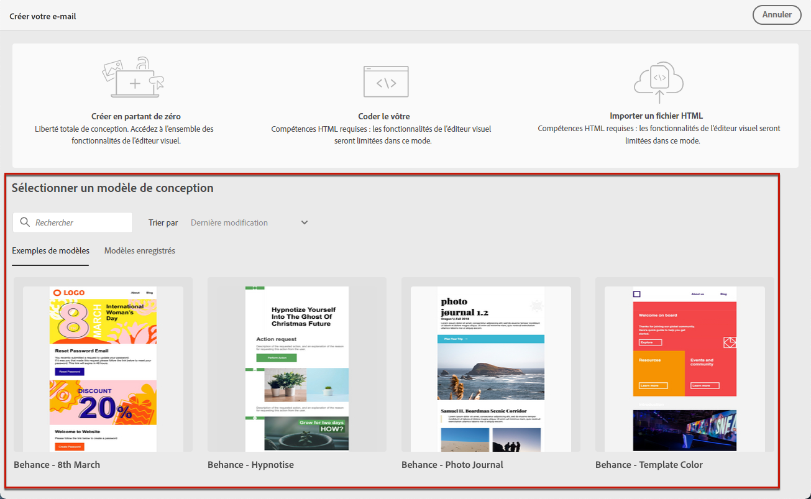
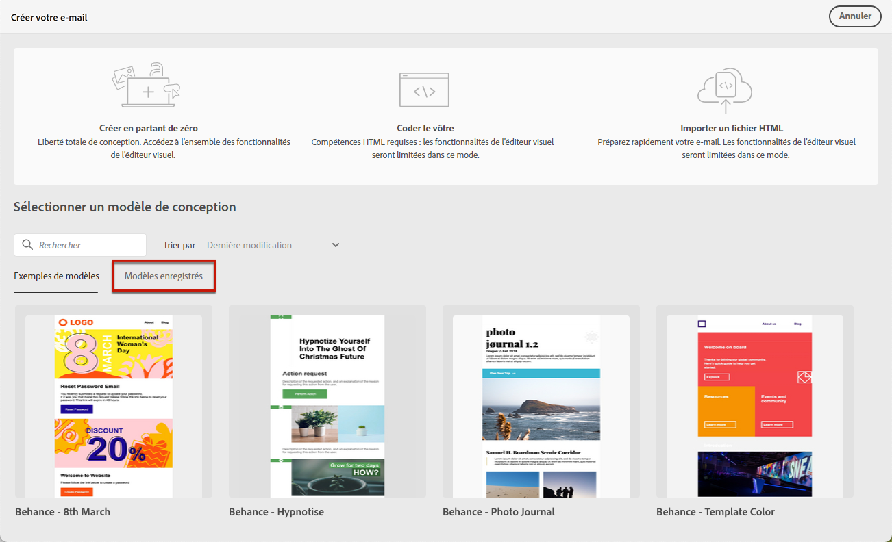
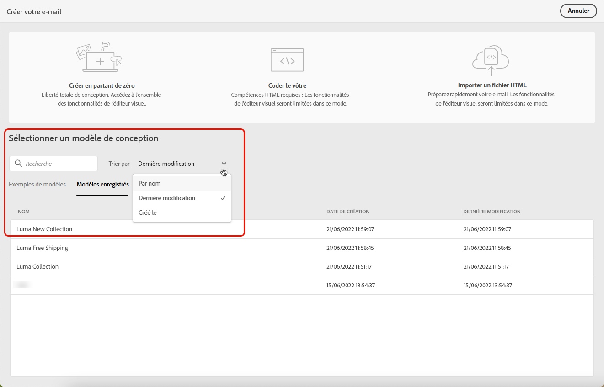

# Utiliser des modèles de courrier électronique {#use-email-templates}

Lors de la [création d’un e-mail](../email/create-email.md), accédez à la section **[!UICONTROL Sélectionner un modèle de conception]** de l’interface **[!UICONTROL Créer votre e-mail]** pour commencer à créer le contenu à partir d’un modèle.

Vous pouvez choisir parmi les options suivantes :

* **Exemples de modèles**. Campaign s’accompagne d’un ensemble de modèles intégrés que vous pouvez sélectionner.

* **Modèles enregistrés**. Vous pouvez également utiliser un modèle personnalisé que vous avez enregistré comme modèle à partir d’un contenu existant.

Découvrez comment utiliser des modèles et comment enregistrer un contenu d’e-mail en tant que modèle dans les sections ci-dessous.

>[!NOTE]
>
>Les modèles de contenu d’e-mail diffèrent des [modèles de diffusion](../msg/delivery-template.md). Ils permettent de réutiliser uniquement le contenu d’un e-mail, tandis que les modèles de diffusion permettent de réutiliser le contenu d’une diffusion, mais également l’ensemble des paramètres et propriétés de la diffusion, tels que les typologies, l’adresse de l’expéditeur ou de l’expéditrice, les audiences, etc.

Pour commencer à créer votre contenu avec l’un des modèles enregistrés ou d’exemple, procédez comme suit.

1. Ouvrez le [concepteur d’e-mail](create-email-content.md).

1. Sur l’écran **[!UICONTROL Créer votre e-mail]**, l’onglet **[!UICONTROL Exemples de modèles]** est sélectionné par défaut.

1. Pour utiliser un modèle personnalisé existant, accédez à l’onglet **[!UICONTROL Modèles enregistrés]**.

   

1. La liste de tous les [modèles enregistrés](#save-as-template) s’affiche. Vous pouvez les trier **[!UICONTROL Par nom]**, selon la **[!UICONTROL Dernière modification]** et la **[!UICONTROL Dernière création]**.

   

1. Sélectionnez un modèle dans la liste pour afficher son contenu.

1. Utilisez les flèches droite et gauche pour naviguer entre les modèles (d’exemple ou enregistrés selon votre sélection).

   

1. Cliquez sur **[!UICONTROL Utiliser ce modèle]** en haut à droite de l’écran.

1. Modifiez le contenu selon vos besoins à l’aide du concepteur d’e-mail. [En savoir plus](create-email-content.md)

