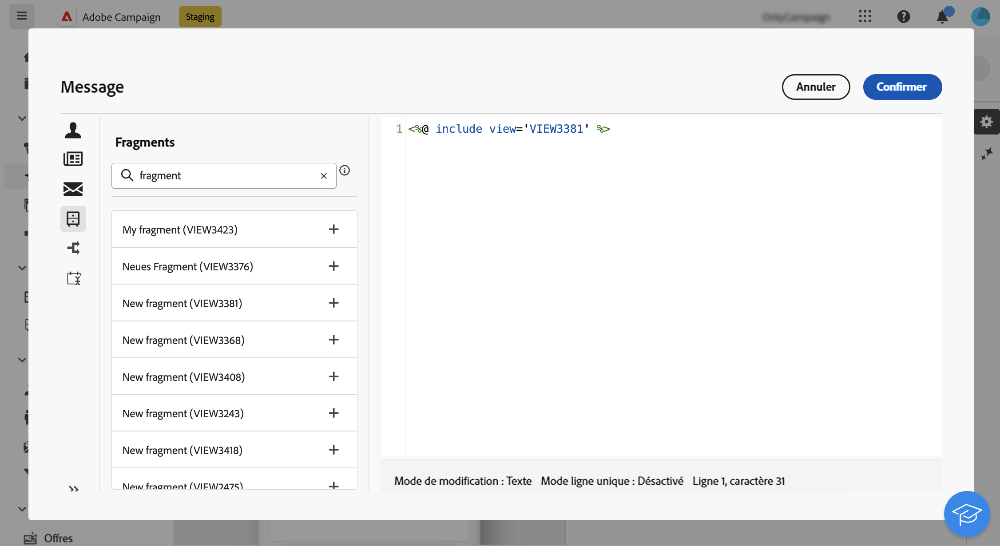

# Ajouter des fragments d’expression dans l’éditeur d’expression {#expression}

>[!CONTEXTUALHELP]
>id="acw_fragments_list"
>title="Fragments"
>abstract="Tous les fragments d’expression créés sur le sandbox actuel s’affichent dans cette liste. Pour utiliser un fragment, cliquez sur le bouton + pour ajouter l’identifiant du fragment dans l’éditeur."

<!-- pas vu dans l'UI-->

Les fragments d’expression peuvent être utilisés dans n’importe quel champ pouvant être édité à l’aide de l’éditeur d’expression. Pour ajouter des fragments d’expression à votre contenu, procédez comme suit.

1. Ouvrez l’[éditeur d’expression](../personalization/gs-personalization.md) et sélectionnez le menu **[!UICONTROL Fragments]** dans le volet de gauche.

   La liste affiche tous les fragments d’expression créés sur le sandbox actuel.

1. Cliquez sur l’icône `+` en regard d’un fragment d’expression pour l’ajouter à votre contenu.

   

1. L’ID de fragment est ajouté à l’éditeur. Si vous ouvrez le fragment d’expression correspondant et que vous l’éditez à partir de l’interface, les modifications sont synchronisées. Elles sont automatiquement propagées à toutes les diffusions **[!UICONTROL Brouillons]** contenant cet identifiant de fragment.
