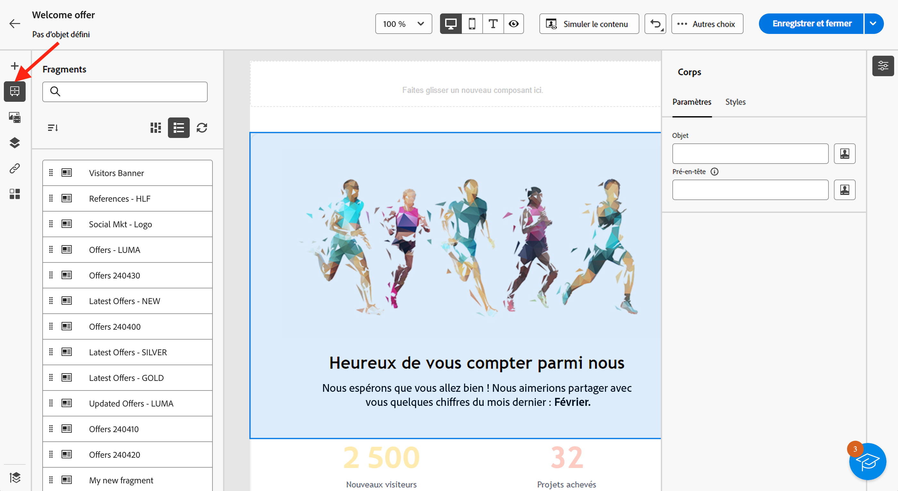
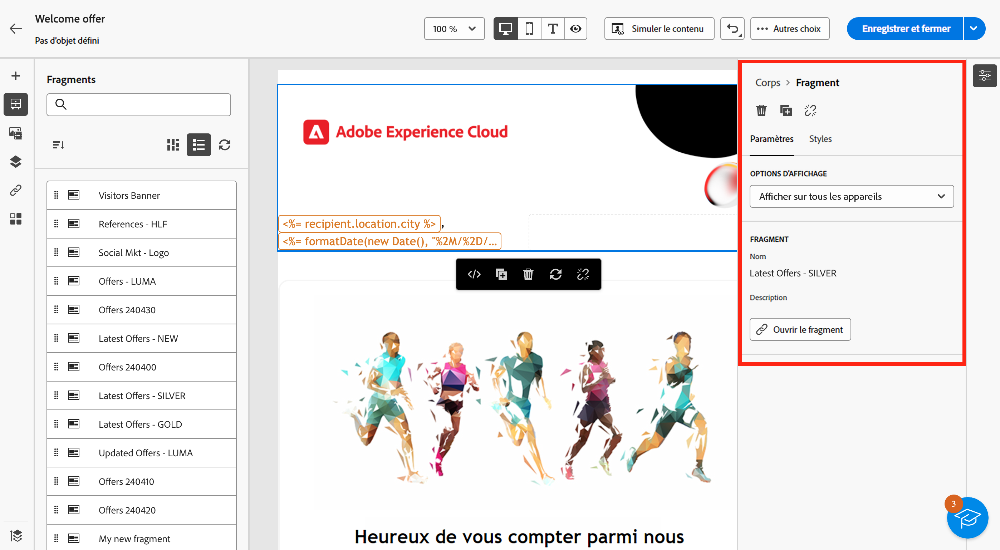
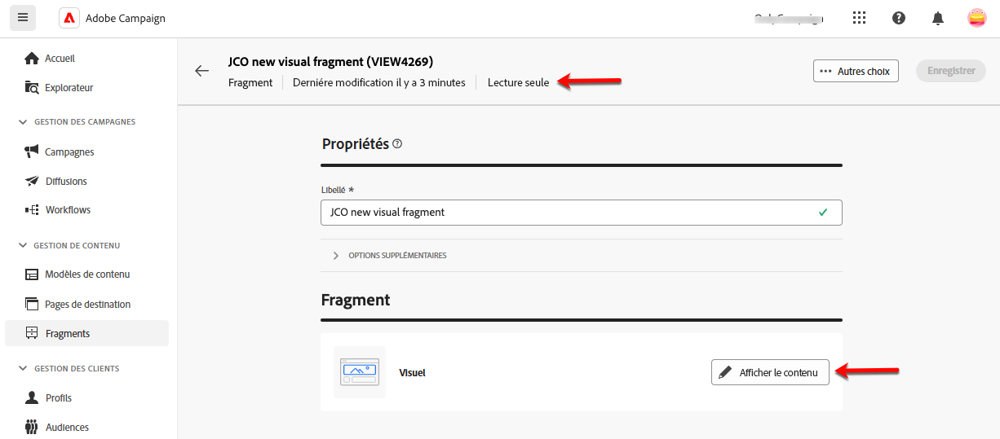
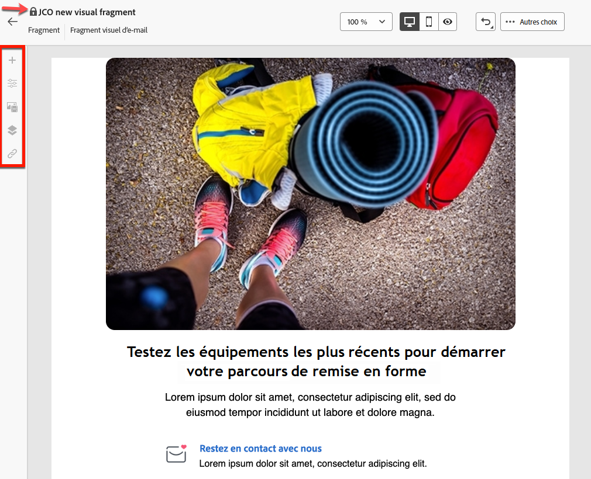
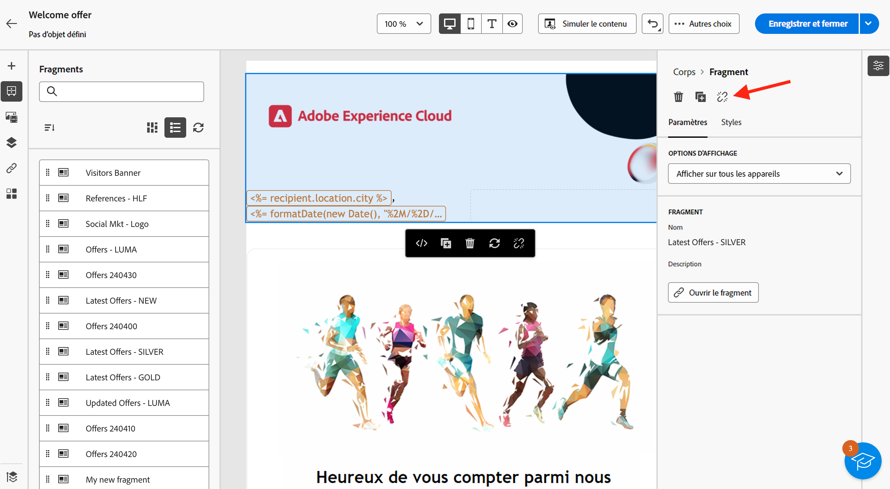

# Ajouter des fragments visuels à vos e-mails {#use-visual-fragments}

>[!AVAILABILITY]
>
>Cette fonctionnalité nécessite une mise à jour de Campaign vers la version 8.6.4. En savoir plus dans les [Notes de mise à jour de la console cliente Campaign v8](https://experienceleague.adobe.com/fr/docs/campaign/campaign-v8/releases/release-notes).

Dans l’interface de Campaign Web, les **fragments visuels** sont des blocs visuels prédéfinis que vous pouvez réutiliser dans plusieurs [diffusions par e-mail](../email/get-started-email-designer.md) ou dans des [modèles de contenu](../content/use-email-templates.md). Découvrez comment créer et gérer des fragments de contenu dans [cette section](fragments.md).

## Utiliser un fragment visuel {#use-fragment}

>[!CONTEXTUALHELP]
>id="acw_fragments_details"
>title="Options des fragments"
>abstract="Ce volet fournit des options relatives au fragment sélectionné. Il vous permet de choisir les appareils sur lesquels vous souhaitez que le fragment s’affiche et d’ouvrir le contenu de ce fragment. Utilisez l’onglet **[!UICONTROL Styles]** pour personnaliser davantage votre fragment. Vous pouvez également rompre l’héritage avec le fragment visuel d’origine."

<!-- pas vu dans l'UI-->

Pour insérer un fragment visuel dans le contenu d’un e-mail, procédez comme suit :

1. Ouvrez un contenu d’e-mail ou de modèle à l’aide du [Concepteur d’e-mail](../email/get-started-email-designer.md).

1. Sélectionnez l’icône **[!UICONTROL Fragments]** dans le rail de gauche.

   

1. La liste de tous les fragments visuels créés sur le sandbox actuel s’affiche. Vous pouvez ainsi :

   * Recherchez un fragment spécifique en saisissant son libellé.
   * Triez les fragments par ordre croissant ou décroissant.
   * Modifiez l’affichage des fragments (mode Carte ou Liste).

   >[!NOTE]
   >
   >Les fragments sont triés par date de création. Les fragments récemment ajoutés apparaissent en premier dans la liste.

   Si des fragments visuels ont été modifiés ou ajoutés pendant que vous modifiez votre contenu, cliquez sur l’icône **Actualiser** pour mettre à jour la liste en incluant les dernières modifications.

1. Faites glisser un fragment visuel de la liste et déposez-le dans la zone où vous souhaitez l’insérer. Comme tout autre composant, vous pouvez déplacer le fragment dans votre contenu.

1. Sélectionnez le fragment pour afficher ses options dans le volet de droite.

   

   Dans l’onglet **[!UICONTROL Paramètres]** vous pouvez effectuer les actions suivantes :

   * Sélectionner les appareils sur lesquels vous souhaitez que le fragment s’affiche.
   * Cliquer sur le bouton **Modifier le contenu** pour ouvrir le contenu de ce fragment. [En savoir plus](../content/fragments.md#edit-fragments)

     Vous pouvez personnaliser davantage votre fragment à l’aide de l’onglet **[!UICONTROL Styles]**.

1. Si nécessaire, désactivez l’héritage avec le fragment visuel d’origine. [En savoir plus](#break-inheritance)

   Vous pouvez également supprimer le fragment de votre contenu ou le dupliquer. Vous pouvez effectuer ces actions directement à partir du menu contextuel qui s’affiche au-dessus du fragment.

1. Ajoutez autant de fragments visuels que vous le souhaitez et **[!UICONTROL enregistrez]** vos modifications.

### Fragment visuel en mode lecture seule {#fragment-readonly}

Des droits d’accès peuvent s’appliquer aux fragments visuels.

Si vous ne disposez pas de l’autorisation de modification pour un fragment visuel spécifique, le modèle de contenu s’affiche en **lecture seule**. Dans ce cas, le bouton **[!UICONTROL Modifier le contenu]** est remplacé par le bouton **[!UICONTROL Afficher le contenu]**, ce qui vous permet d’afficher le fragment, mais sans apporter de modifications.

{zoomable="yes"}

Comme illustré ci-dessous, toutes les icônes des fonctionnalités sont désactivées, ce qui limite l’interaction à l’affichage uniquement.

{zoomable="yes"}

## Rompre l’héritage {#break-inheritance}

Lorsque vous modifiez un fragment visuel, les modifications sont synchronisées et automatiquement propagées à toutes les diffusions e-mail et à tous les modèles de contenu contenant ce fragment.

Par défaut, les fragments sont synchronisés lorsqu’ils sont ajoutés à un e-mail ou à un modèle de contenu.

Vous pouvez toutefois rompre l’héritage du fragment d’origine. Dans ce cas, le contenu du fragment est copié dans la conception actuelle et les modifications ne sont plus synchronisées.

Pour désactiver l’héritage, procédez comme suit :

1. Sélectionnez le fragment visuel.

1. Cliquez sur l’icône Déverrouiller dans la barre d’outils contextuelle.

   

1. Ce fragment devient alors un élément autonome qui n’est plus lié au fragment d’origine. Modifiez-le comme tout autre composant de contenu de votre contenu. [En savoir plus](../email/content-components.md)