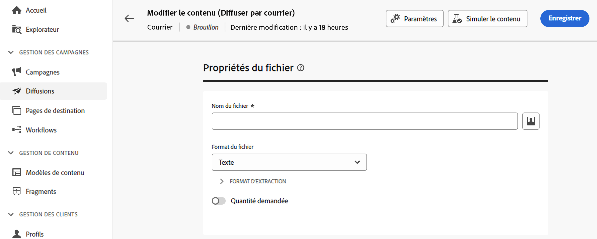
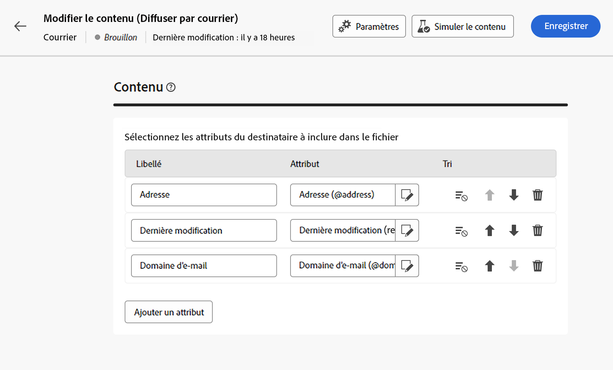

# Concevoir le fichier d’extraction {#design-direct-mail}

>[!CONTEXTUALHELP]
>id="acw_directmail_content"
>title="Contenu du fichier d’extraction"
>abstract="Cliquez sur le bouton **Modifier le contenu** pour lancer la conception du fichier d’extraction requis par votre fournisseur de services postaux. Vous pouvez ainsi définir les propriétés du fichier, telles que son libellé et son format, et spécifier les colonnes à inclure dans le fichier."

>[!CONTEXTUALHELP]
>id="acw_directmail_properties_file"
>title="Propriétés du fichier"
>abstract="Configurez les propriétés du fichier d’extraction, telles que son nom et son format. Vous pouvez personnaliser le nom du fichier à l’aide des attributs de la base de données de l’éditeur d’expression."

>[!CONTEXTUALHELP]
>id="acw_directmail_properties_content"
>title="Contenu"
>abstract="Dans cette section, indiquez les colonnes à afficher dans le fichier d’extraction. Une fois cette opération terminée, vous pouvez obtenir une prévisualisation du fichier d’extraction à l’aide du bouton **Simuler le contenu**."

Pour concevoir le contenu du fichier d’extraction généré par votre diffusion par courrier, cliquez sur le bouton **[!UICONTROL Modifier le contenu]** à partir de la page de diffusion, puis configurez les propriétés et le contenu du fichier.

## Configurer les propriétés du fichier d’extraction {#properties}

1. Dans le champ **[!UICONTROL Nom du fichier]**, indiquez le nom du fichier d’extraction. Vous pouvez le personnaliser à l’aide des attributs de la base de données. Pour ce faire, cliquez sur l’icône **[!UICONTROL Ouvrir la boîte de dialogue de personnalisation]** pour ouvrir l’éditeur d’expression. [Découvrir comment personnaliser du contenu](../personalization/personalize.md)

1. Dans le champ **[!UICONTROL Format du fichier]**, choisissez le format du fichier d’extraction, **Texte**, **Texte contenant des colonnes fixes**, **CSV (Excel)** ou **XML**.

1. Développez la section **[!UICONTROL Format d’extraction]** pour accéder aux options spécifiques du fichier d’extraction. Les valeurs disponibles dépendent du format sélectionné.

+++ Options de format d’extraction disponibles

   * **[!UICONTROL Utiliser la première ligne comme en-tête des colonnes]** (formats Texte/CSV [Excel]) : activez cette option pour utiliser la première colonne comme en-tête.
   * **[!UICONTROL Séparateur de colonne]** (format Texte) : spécifiez le caractère à utiliser comme séparateur de colonne dans le fichier d’extraction.
   * **[!UICONTROL Délimiteur de chaîne]** (format Texte) : indiquez comment délimiter les chaînes dans le fichier d’extraction.
   * **[!UICONTROL Fin de ligne]** (format Texte) : indiquez comment délimiter la fin des lignes dans le fichier d’extraction.
   * **[!UICONTROL Encodage]** : choisissez l’encodage du fichier d’extraction.
   * **[!UICONTROL Format et séparateurs de date]** : indiquez le format des dates dans le fichier d’extraction.
   * **[!UICONTROL Format des nombres]** : indiquez le format des nombres dans le fichier d’extraction.
   * **[!UICONTROL Exporter les libellés plutôt que les valeurs internes des énumérations]** : activez cette option si vous exportez des valeurs d’énumération et souhaitez récupérer les libellés de colonnes plus faciles à comprendre que les identifiants internes.

+++

1. Activez l’option **[!UICONTROL Quantité demandée]** pour limiter le nombre de personnes destinataires de votre diffusion.

   {zoomable=&quot;yes&quot;}

## Configurer les colonnes du fichier d’extraction {#content}

Dans la section **[!UICONTROL Contenu]**, indiquez les colonnes à afficher dans le fichier d’extraction. Pour ce faire, procédez comme suit :

1. Cliquez sur le bouton **[!UICONTROL Ajouter un attribut]** pour créer une nouvelle colonne.
1. Sélectionnez l’attribut à afficher dans la colonne, puis confirmez. Une fois la colonne ajoutée, vous pouvez modifier son libellé et l’attribut associé à partir de l’icône d’édition.
1. Répétez ces étapes pour ajouter autant de colonnes que nécessaire à votre fichier d’extraction.
1. Pour trier le fichier d’extraction à l’aide de l’une des colonnes, cliquez sur l’icône dans la colonne **[!UICONTROL Tri]** et sélectionnez la méthode de tri souhaitée.
1. Pour changer la position d’une colonne, utilisez les flèches haut et bas.

Vous pouvez maintenant prévisualiser le fichier d’extraction et envoyer la diffusion pour le générer. [Découvrir comment tester et envoyer des messages par courrier](send-direct-mail.md)
