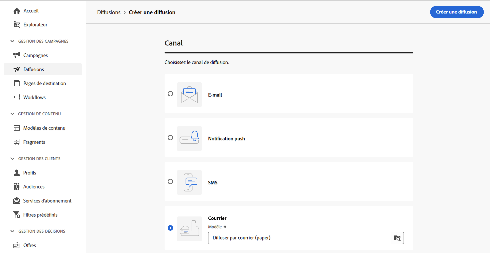
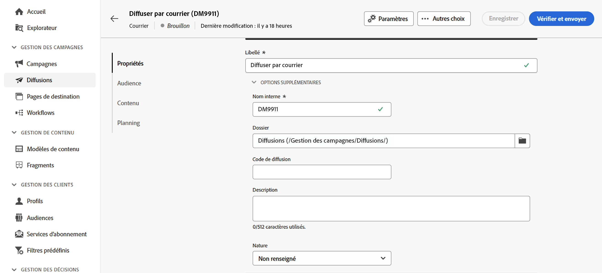
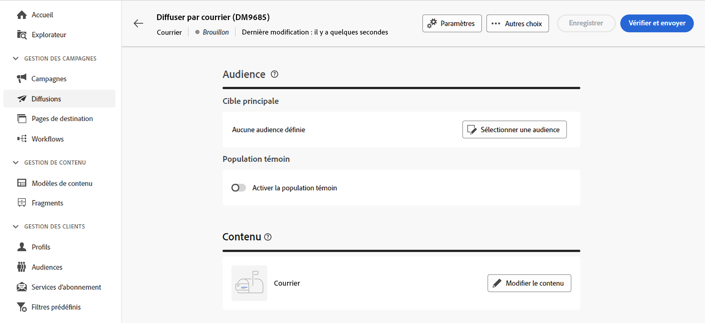
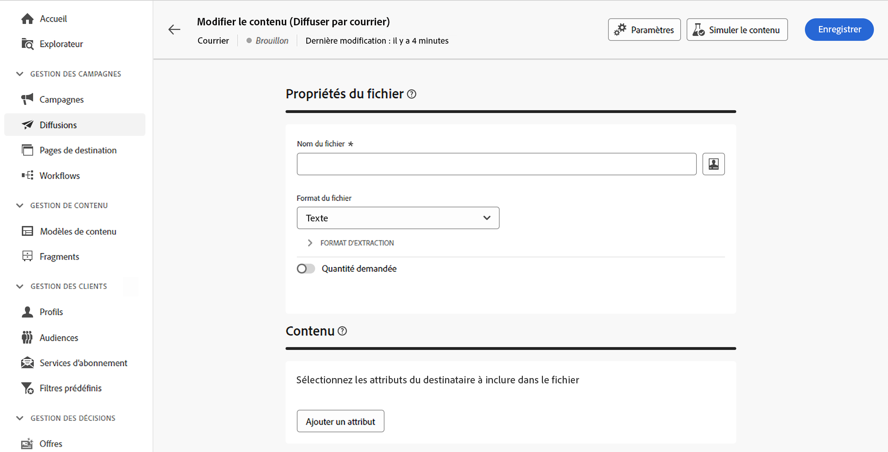
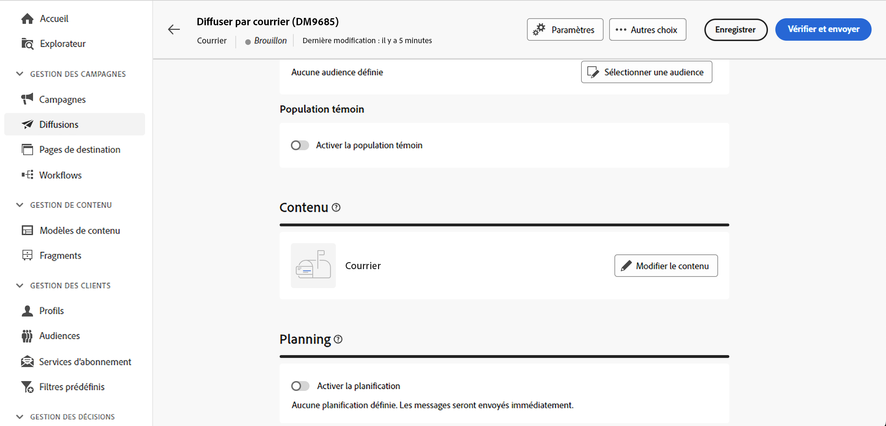

# Créer une diffusion par courrier {#create-direct-mail}

Vous pouvez créer une diffusion par courrier autonome ou créer une diffusion par courrier dans le cadre d’un workflow de campagne. Les étapes ci-dessous détaillent la procédure d’une diffusion par courrier autonome (ponctuelle). Si vous travaillez dans le contexte d’un workflow de campagne, les étapes de création sont détaillées dans [cette section](../workflows/activities/channels.md#create-a-delivery-in-a-campaign-workflow).

Pour créer une diffusion par courrier autonome, procédez comme suit :

1. Accédez au menu **[!UICONTROL Diffusions]** dans le rail de gauche, puis cliquez sur le bouton **[!UICONTROL Créer une diffusion]**.

1. Sous la section **[!UICONTROL Canal]**, choisissez **[!UICONTROL Courrier]** comme canal et sélectionnez un modèle. [En savoir plus sur les modèles](../msg/delivery-template.md)

1. Cliquez sur le bouton **[!UICONTROL Créer une diffusion]** pour confirmer.

   {zoomable="yes"}

1. Saisissez un **[!UICONTROL libellé]** pour la diffusion et accédez au menu déroulant **[!UICONTROL Options supplémentaires]**. Si votre diffusion est basée sur un schéma étendu, des champs d’**options personnalisées** spécifiques sont disponibles.

   {zoomable="yes"}

   +++Configurez les paramètres suivants en fonction de vos besoins.
   * **[!UICONTROL Nom interne]** : attribuez un identifiant unique à la diffusion.
   * **[!UICONTROL Dossier]** : stockez la diffusion dans un dossier spécifique.
   * **[!UICONTROL Code de diffusion]** : organisez vos diffusions à l’aide de votre propre convention de nommage.
   * **[!UICONTROL Description]** : spécifiez une description pour la diffusion.
   * **[!UICONTROL Nature]** : indiquez la nature de la diffusion à des fins de classification.
+++

1. Cliquez sur le bouton **[!UICONTROL Sélectionner une audience]** pour cibler une audience existante ou créer la vôtre.

   * [Découvrir comment sélectionner une audience existante](../audience/add-audience.md)
   * [Découvrir comment créer une audience](../audience/one-time-audience.md)

   {zoomable="yes"}

   >[!NOTE]
   >
   >Les personnes destinataires doivent afficher au minimum leur nom et leur adresse postale. Une adresse est considérée comme complète si les champs relatifs au nom, au code postal et à la ville ne sont pas vides. Les personnes destinataires dont les adresses sont incomplètes seront exclues des diffusions par courrier.

1. Activez l’option **[!UICONTROL Activer la population témoin]** pour définir une population témoin et mesurer l’impact de votre diffusion. Les messages ne sont pas envoyés à cette population témoin. Vous pouvez ainsi comparer le comportement de la population qui a reçu le message avec celui des contacts qui ne l’ont pas reçu. [Découvrir comment travailler avec les populations témoins](../audience/control-group.md)

1. Cliquez sur **[!UICONTROL Modifier le contenu]** pour définir les informations (colonnes) à exporter dans le fichier d’extraction. [En savoir plus](content-direct-mail.md)

   {zoomable="yes"}

1. Pour planifier votre diffusion à une date et une heure spécifiques, activez l’option **[!UICONTROL Activer la planification]**. Une fois la diffusion lancée, le fichier d’extraction est automatiquement envoyé à la date et à l’heure exactes que vous avez définies. [Découvrez comment planifier des diffusions.](../msg/gs-deliveries.md#gs-schedule)

   >[!NOTE]
   >
   >Lorsqu’une diffusion est envoyée dans le cadre d’un workflow, vous devez utiliser l’activité **Planificateur**. En savoir plus sur [cette page](../workflows/activities/scheduler.md).

1. Cliquez sur **[!UICONTROL Paramètres]** pour accéder aux options avancées liées à votre modèle de diffusion. [En savoir plus](../advanced-settings/delivery-settings.md)

   {zoomable="yes"}

1. Une fois votre diffusion par courrier prête, cliquez sur le bouton **[!UICONTROL Vérifier et envoyer]** pour valider et envoyer votre diffusion et générer le fichier d’extraction. [Découvrir comment prévisualiser et envoyer une diffusion par courrier](send-direct-mail.md)
