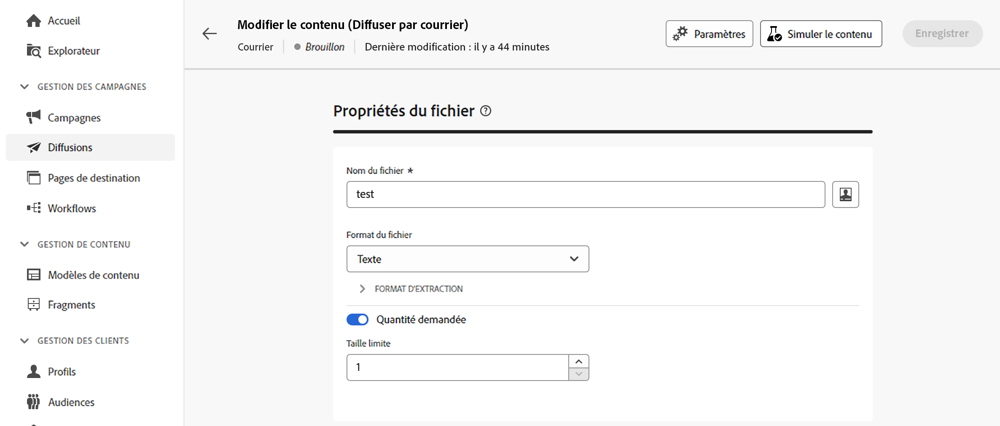
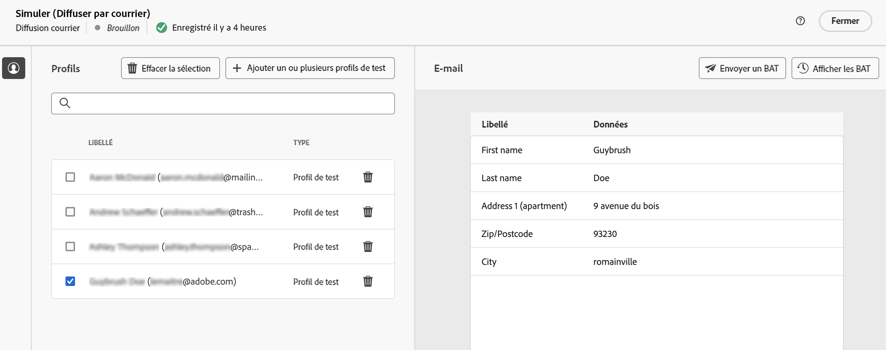
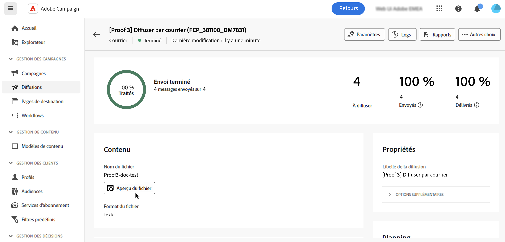
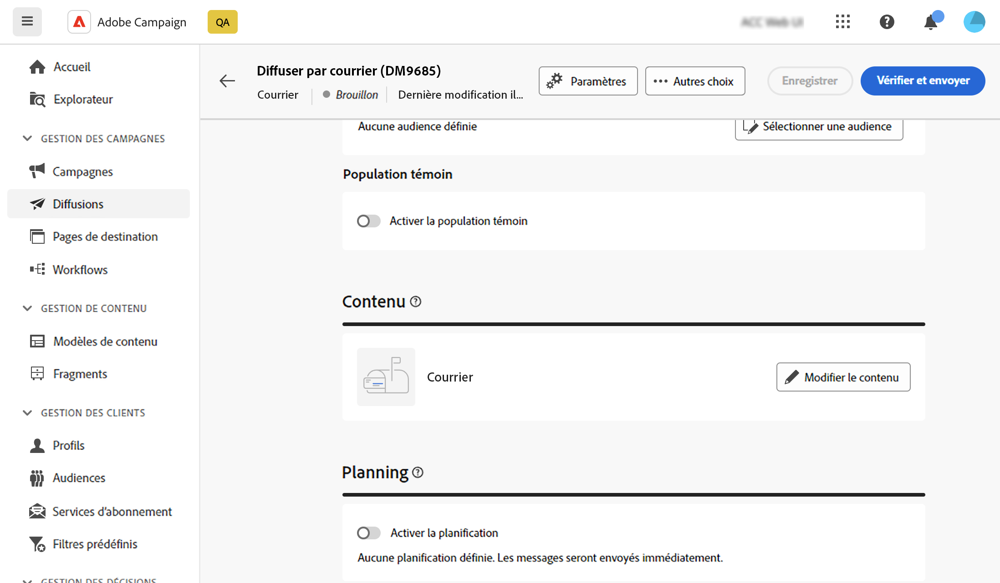
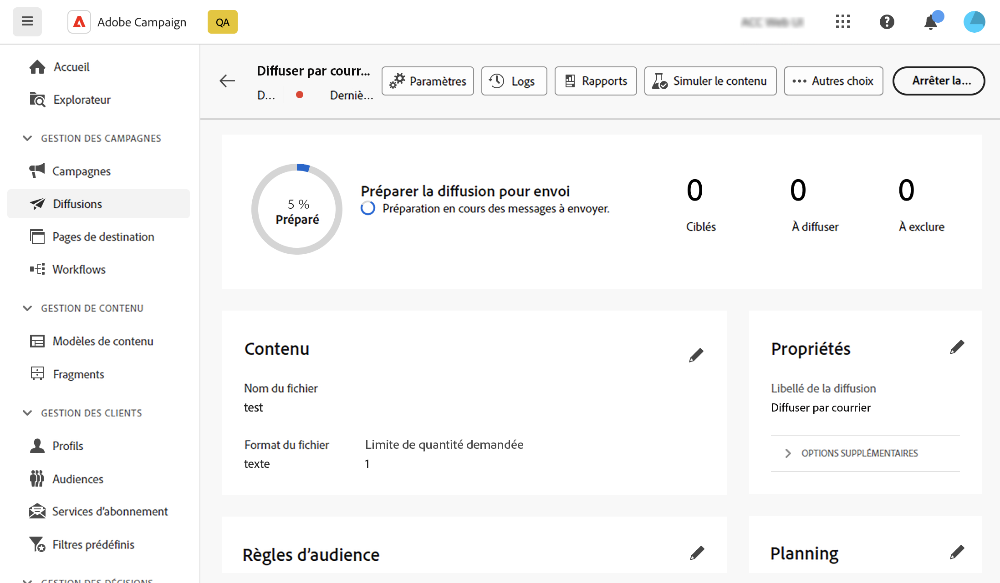

# Prévisualiser et envoyer une diffusion par courrier {#send-direct-mail}

Une fois que vous avez configuré le fichier d’extraction pour votre diffusion par courrier, utilisez des profils de test pour le prévisualiser. Si du contenu personnalisé est inclus, examinez comment ce contenu apparaît dans les colonnes à l’aide des données de profil de test. Cela permet de s’assurer que le contenu du fichier est correctement rendu et que les éléments personnalisés sont correctement intégrés.

Lorsque le fichier d’extraction est prêt, envoyez la diffusion par courrier afin de générer le fichier et de le partager avec votre fournisseur de services postaux. [Découvrir comment envoyer votre diffusion par courrier](#dm-send)

## Prévisualiser le fichier d’extraction {#preview-dm}

La prévisualisation de votre fichier d’extraction comprend les étapes suivantes. Pour plus d’informations sur la prévisualisation des diffusions, consultez [cette section](../preview-test/preview-content.md).

1. Sur la page de contenu de la diffusion, cliquez sur le bouton **[!UICONTROL Simuler le contenu]** pour prévisualiser le contenu que vous avez personnalisé.

   {zoomable="yes"}

1. Cliquez sur **[!UICONTROL Ajouter un ou plusieurs profils de test]** pour sélectionner un ou plusieurs profils et prévisualiser leurs données dans le contenu du fichier d’extraction.

1. Dans le volet de droite, consultez une prévisualisation du fichier d’extraction, où les éléments personnalisés sont remplacés dynamiquement par les données du profil sélectionné.

   {zoomable="yes"}

## Envoyer des BAT {#test-dm}

À l’aide d’**Adobe Campaign**, envoyez des BAT avant de les diffuser à votre audience principale. Cette étape valide votre diffusion et identifie les problèmes éventuels. Les personnes destinataires du test vérifient alors divers éléments, tels que les paramètres de personnalisation, détectent les erreurs éventuelles et garantissent des performances optimales. Ce processus affine et optimise votre fichier d’extraction avant d’atteindre votre audience principale.

Pour les diffusions par courrier, l’envoi de BAT génère un exemple du fichier d’extraction à partir des données des profils de test sélectionnés. Pour y accéder, procédez comme suit :

1. Dans l’écran de simulation du contenu, cliquez sur le bouton **[!UICONTROL Envoyer un BAT]** et procédez comme pour n’importe quel type de diffusion. [Découvrir comment envoyer des BAT](../preview-test/test-deliveries.md)

1. Une fois le BAT envoyé, accédez-y à partir du bouton **[!UICONTROL Afficher les BAT]** ou dans la liste des diffusions. [Découvrir comment accéder aux BAT envoyés](../preview-test/test-deliveries.md#access-test-deliveries)

1. Dans le tableau de bord de la diffusion du BAT, cliquez sur l’icône **[!UICONTROL Aperçu du fichier]** pour accéder à une prévisualisation du fichier d’extraction.

   {zoomable="yes"}

   >[!NOTE]
   >
   >Seules les 100 premières lignes s’affichent dans le fichier de prévisualisation.

## Envoyer votre diffusion par courrier {#send-dm}

Une fois que le courrier est prêt à être envoyé à votre clientèle, envoyez la diffusion pour démarrer l’extraction des données dans le fichier d’extraction spécifié. Pour ce faire, procédez comme suit :

1. Après avoir conçu le contenu de votre fichier d’extraction, cliquez sur **[!UICONTROL Réviser et envoyer]** depuis votre page **[!UICONTROL Diffusion]**.

   {zoomable="yes"}

1. Cliquez sur **[!UICONTROL Préparer]** et suivez la progression et les statistiques fournies.

   En cas d’erreur, reportez-vous au menu **[!UICONTROL Logs]** pour obtenir des informations détaillées sur l’échec.

   {zoomable="yes"}

1. Envoyez les messages en cliquant sur **[!UICONTROL Envoyer]** pour poursuivre le processus d’envoi final.

1. Confirmez l’action d’envoi en cliquant sur le bouton **[!UICONTROL Envoyer]**.

   Si la diffusion par courrier a été planifiée, cliquez sur le bouton **[!UICONTROL Envoyer comme prévu]**. Pour en savoir plus sur la planification des diffusions, consultez [cette section](../msg/gs-messages.md#schedule-the-delivery-sending).

Une fois votre diffusion envoyée, le fichier d’extraction est automatiquement généré et exporté vers l’emplacement spécifié dans le compte externe **[!UICONTROL Routage]** sélectionné dans les [paramètres avancés](../advanced-settings/delivery-settings.md) du modèle de diffusion.

Suivez les données de vos KPI (indicateurs clés de performance) à partir de la page de diffusion, ainsi que les données à partir du menu **[!UICONTROL Logs]**.

Commencez à mesurer l’impact de votre message à l’aide de rapports intégrés. [En savoir plus](../reporting/direct-mail.md)