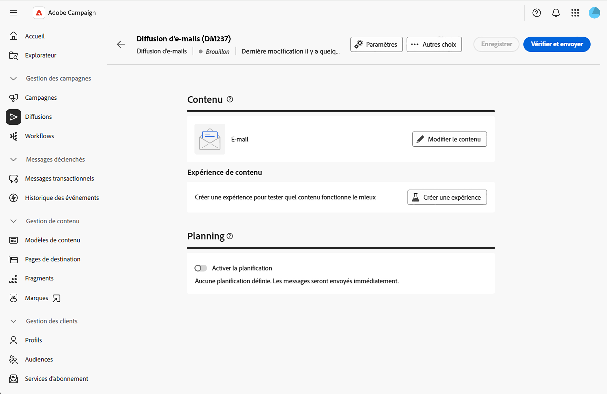
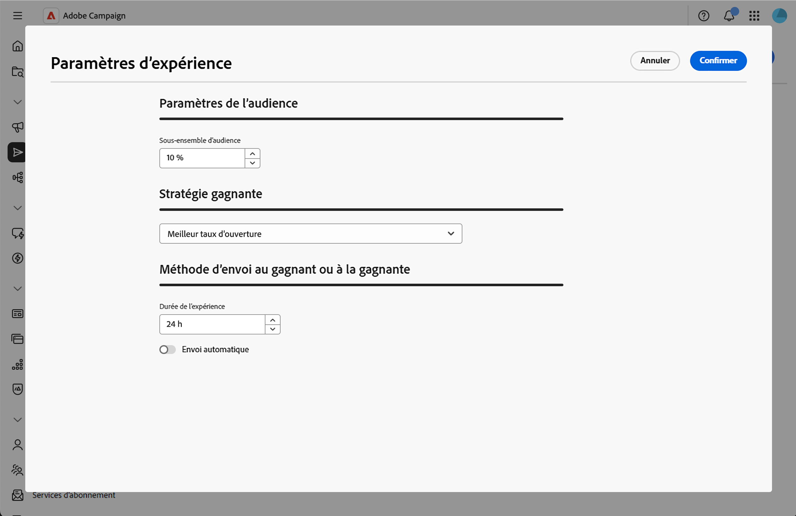
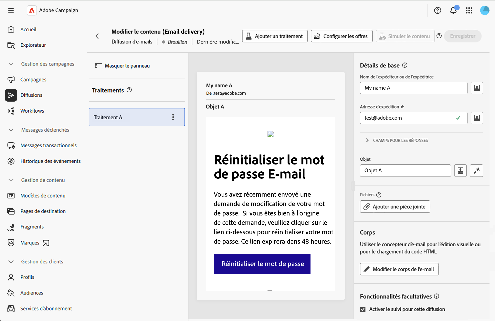
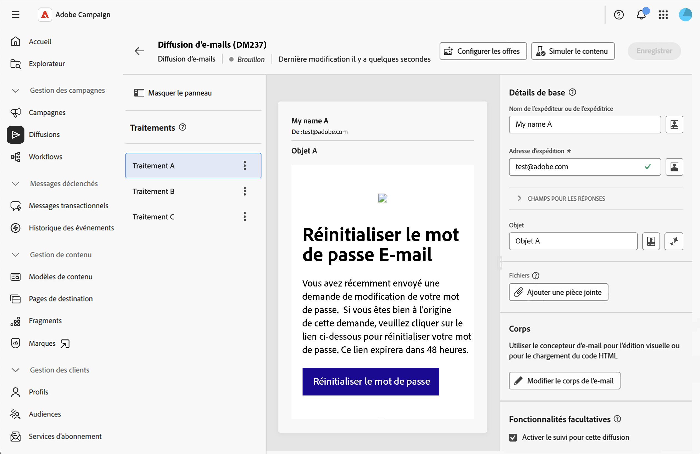
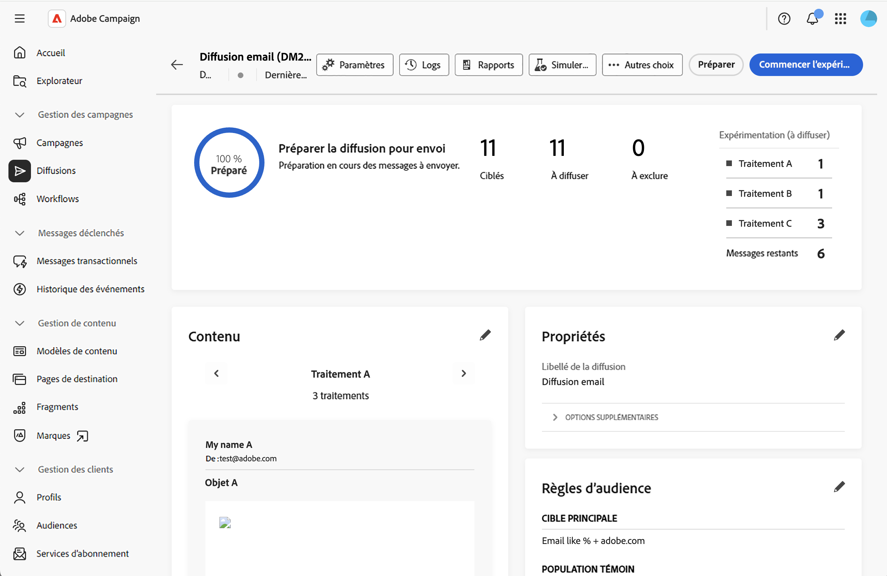

# Créer des expériences de contenu {#content-experiment}

>[!CONTEXTUALHELP]
>id="acw_deliveries_email_content_experiment"
>title="Expériences de contenu"
>abstract="Les expériences de contenu permettent de définir plusieurs variantes de diffusion de test A/B afin de mesurer celle qui fonctionne le mieux pour votre audience cible. Vous pouvez faire varier le contenu, l’objet ou l’expéditeur ou expéditrice de la diffusion afin de tester différentes versions et de déterminer la variante produisant les meilleurs résultats."

## À propos des expériences de contenu {#about-content-experiment}

Les expériences de contenu dans Adobe Campaign Web vous permettent de définir plusieurs variantes de diffusion de test A/B afin de mesurer celle qui fonctionne le mieux pour votre audience cible. Vous pouvez faire varier le contenu, l’objet ou l’expéditeur ou expéditrice de la diffusion afin de tester différentes versions et de déterminer la variante produisant les meilleurs résultats.

Vous pouvez effectuer des tests A/B sur divers éléments d’e-mail, tels que :

* **Objet** : testez différentes lignes d’objet d’e-mail pour déterminer laquelle génère le taux d’ouverture le plus élevé.
* **Nom de l’expéditeur ou de l’expéditrice** : testez différentes combinaisons d’expéditeur ou d’expéditrice.
* **Contenu du corps de l’e-mail** : créez plusieurs versions du contenu afin d’identifier celles qui génèrent le meilleur taux de clic.

>[!NOTE]
>
>* Les expériences de contenu sont actuellement disponibles pour le canal e-mail uniquement.
>* Les tests A/B ne sont pas pris en charge pour les messages transactionnels.
>* Maximum de 3 traitements (variantes) par expérience.

## Créer une expérience de contenu {#create-content-experiment}

Pour ajouter une expérience de contenu à votre diffusion par e-mail, procédez comme suit :

1. Créez une nouvelle diffusion par e-mail ou ouvrez un brouillon de diffusion  [Découvrez comment créer un e-mail](create-email.md).

1. Sur la page des propriétés de la diffusion par e-mail, cliquez sur le bouton **[!UICONTROL Créer une expérience]** situé dans la section **[!UICONTROL Contenu]**.

   {zoomable="yes"}

## Configuration des paramètres de l’expérience {#configure-experiment}

Configurez votre expérience à l’aide des sections suivantes :

{zoomable="yes"}

### Paramètres de l’audience {#audience-settings}

Définissez le pourcentage de votre population cible qui recevra les variantes de l’expérience.

Saisissez une valeur pour définir la taille de l’audience.Cela représente la proportion de destinataires qui recevront l’une des variantes de l’expérience pendant la phase de test.

* **Minimum** : 1 %
* **Maximum** : 100 %
* **Par défaut** : 10 %

Une fois l’expérience terminée, l’audience restante (90 % par défaut) recevra la variante gagnante.

Par exemple, avec une audience cible de 10 000 destinataires et une taille d’audience de 10 %, 1 000 destinataires seront sélectionnés de manière aléatoire pour participer à l’expérience.Les 9 000 destinataires restants recevront la variante gagnante une fois l’expérience terminée.

### Stratégie gagnante {#winning-strategy}

Sélectionnez la mesure à utiliser pour déterminer la variante gagnante :

* **[!UICONTROL Meilleur taux d’ouverture]** (par défaut) : la variante ayant le pourcentage d’ouverture d’e-mail le plus élevé gagne.
* **[!UICONTROL Meilleur taux de clics]** : la variante ayant le pourcentage de clics le plus élevé dans l’e-mail gagne.
* **[!UICONTROL Taux de désabonnements le plus faible]** : la variante ayant le pourcentage de désabonnements le plus bas gagne.

Le système suit automatiquement ces mesures au cours de l’expérience et calcule la variante la plus performante en fonction du critère sélectionné.

### Méthode d&#39;envoi du gagnant {#sending-method}

Définissez la durée de l’expérience et sélectionnez la méthode d’envoi :

1. Saisissez la valeur de la durée en heures.L’expérience s’exécutera pendant cette durée avant de déterminer la variante gagnante.

   * **Minimum** : 3 heures
   * **Maximum** : 240 heures (10 jours)
   * **Par défaut** : 24 heures

   >[!NOTE]
   >
   >Assurez-vous que la durée de votre expérience est suffisamment longue pour collecter des données exploitables.Si la durée est trop courte, les résultats ne seront pas statistiquement fiables, en particulier pour les mesures telles que le taux de clics qui peuvent prendre du temps à s’accumuler.

1. Choisissez comment la variante gagnante doit être envoyée à la population restante :

   * **[!UICONTROL Envoi automatique]** activé : le système envoie automatiquement la variante gagnante à l’audience restante une fois l’expérience terminée.
   * **[!UICONTROL Envoi automatique]** désactivé : vous devez cliquer manuellement sur le bouton **[!UICONTROL Envoyer]** pour envoyer la variante gagnante après avoir consulté les résultats de l’expérience.

Si aucune variante n’obtient de résultats significativement meilleurs que les autres à la fin de l’expérience, le système envoie la première variante à la population restante.Consultez cette [section](#send-deliveries).

## Définition des traitements du contenu {#define-content}

Après avoir enregistré les paramètres de votre expérience, un premier traitement est créé par défaut.Vous devez maintenant ajouter vos autres traitements (jusqu’à trois) et définir leur contenu spécifique.

1. Dans les propriétés de la diffusion, cliquez sur **[!UICONTROL Modifier le contenu]**.Les traitements s’affichent sur le côté gauche.

   {zoomable="yes"}

1. Cliquez sur le bouton **[!UICONTROL Ajouter un traitement]** et définissez son nom.Répétez cette opération pour tous les traitements que vous devez ajouter.Vous pourrez ensuite modifier leur nom, les dupliquer et les supprimer.

1. Cliquez sur chaque traitement et personnalisez les éléments suivants :

   * **Nom de l’expéditeur ou de l’expéditrice** : personnalisez l’expéditeur ou l’expéditrice de l’e-mail.
   * **Objet** : créez une ligne d’objet unique pour chaque traitement.
   * **Corps de l’e-mail** : concevez différentes versions du contenu à l’aide du Concepteur d’e-mail.

   {zoomable="yes"}

1. Prévisualisez chaque traitement en cliquant dessus, puis sur **[!UICONTROL Simuler le contenu]**.

## Démarrage de l’expérience et surveillance des résultats {#validate-start}

Une fois que vous avez défini tous vos traitements de contenu, vous pouvez valider et démarrer l’expérience.

1. Dans les propriétés de la diffusion, cliquez sur **[!UICONTROL Vérifier et envoyer]**, puis sur **[!UICONTROL Préparer]**.

1. Cliquez ensuite sur **[!UICONTROL Démarrer l’expérimentation]** pour lancer le test A/B.

   {zoomable="yes"}

1. Une fois votre expérience en cours d’exécution, surveillez les différentes mesures affichées dans le tableau de bord de la diffusion.

Pendant l’exécution de l’expérience, vous pouvez cliquer sur **[!UICONTROL Arrêter l’envoi]** pour terminer l’expérience.Vous pouvez également effectuer un envoi manuel avant la fin de l’expérience en cliquant sur **[!UICONTROL Sélectionner et envoyer au gagnant]**.

>[!NOTE]
>
>Les résultats sont mis à jour en temps quasi réel à mesure que les destinataires interagissent avec votre e-mail.Cependant, les premiers résultats peuvent ne pas être statistiquement fiables. Il est recommandé d’attendre que la durée de l’expérience soit terminée avant de prendre des décisions définitives.

## Envoi des diffusions {#send-deliveries}

L’envoi peut être effectué automatiquement ou manuellement, selon ce que vous avez choisi dans les paramètres **[!UICONTROL Méthode d’envoi du gagnant]**.Consultez cette [section](#sending-method).

### Envoi automatique {#automatic-sending}

Pour l’envoi automatique, le système analyse les résultats en fonction de votre stratégie gagnante et détermine le traitement gagnant.Le traitement gagnant est automatiquement envoyé à l’audience restante.Si aucun gagnant ne se démarque, la première variante est sélectionnée.

### Envoi manuel {#manual-sending}

Si vous avez configuré l’envoi manuel, vérifiez les résultats à la fin de l’expérience et cliquez sur **[!UICONTROL Envoyer]** pour envoyer le traitement gagnant.Si aucun gagnant ne s’est démarqué, le premier traitement est sélectionné par défaut, mais vous pouvez en choisir un autre.

## Affichage des résultats finaux {#final-results}

Une fois votre expérience terminée et la diffusion entièrement envoyée, vous pouvez accéder à des rapports complets :

1. Dans le tableau de bord de la diffusion, cliquez sur **[!UICONTROL Rapports]**.

1. Accédez à l’onglet du rapport **[!UICONTROL Expériences]** pour afficher les mesures de performances clés de chaque traitement.

## Bonnes pratiques {#best-practices}

Lors de la création d’expériences de contenu, tenez compte des recommandations suivantes :

* **Testez un élément à la fois** : pour des résultats plus clairs, testez les variations d’un seul élément (par exemple, objet uniquement ou contenu uniquement) plutôt que de plusieurs éléments simultanément.

* **Choisissez la durée appropriée** : laissez suffisamment de temps pour la signification statistique :
   * Pour les tests du taux d’ouverture : 12 à 24 heures sont généralement suffisantes.
   * Pour les tests du taux de clics : 24 à 48 heures ou plus peuvent être nécessaires.
   * Les grandes audiences peuvent nécessiter moins de temps, tandis que les audiences plus petites peuvent avoir besoin de plus de temps.

* **Dimensionnez votre audience de manière appropriée** :
   * Assurez-vous que l’audience de l’expérience (le pourcentage alloué au test) est suffisamment grande pour générer des résultats significatifs.
   * Règle générale : minimum de 1 000 destinataires par traitement pour des résultats fiables.

* **Testez régulièrement, mais pas excessivement** : menez des expériences pour des campagnes importantes, mais évitez de tester chaque envoi pour concentrer les ressources sur les décisions importantes.

* **Documentez vos apprentissages** : conservez des enregistrements des résultats des expériences pour éclairer les stratégies de campagne futures.

## Rubriques connexes {#related-topics}

* [Créer votre premier e-mail](create-email.md)
* [Configurer le contenu des e-mails](edit-content.md)
* [Prévisualisation et envoi d’un e-mail](../monitor/prepare-send.md)
* [Rapports de diffusion E-mail](../reporting/email-report.md)
