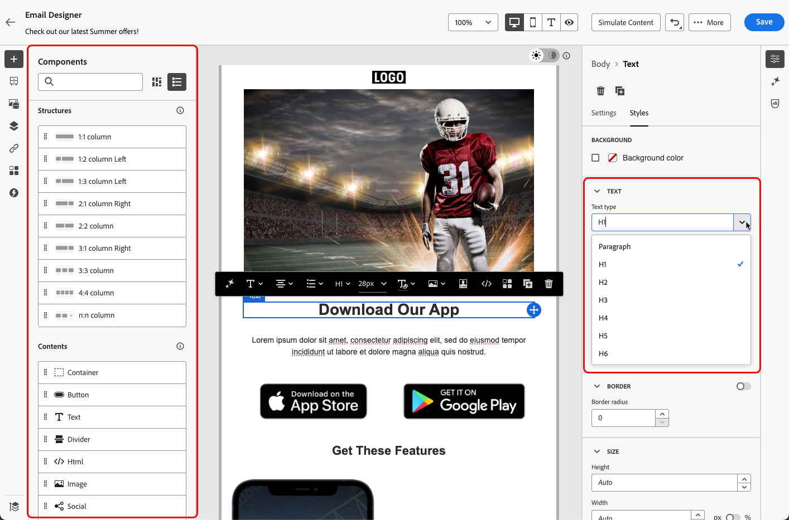
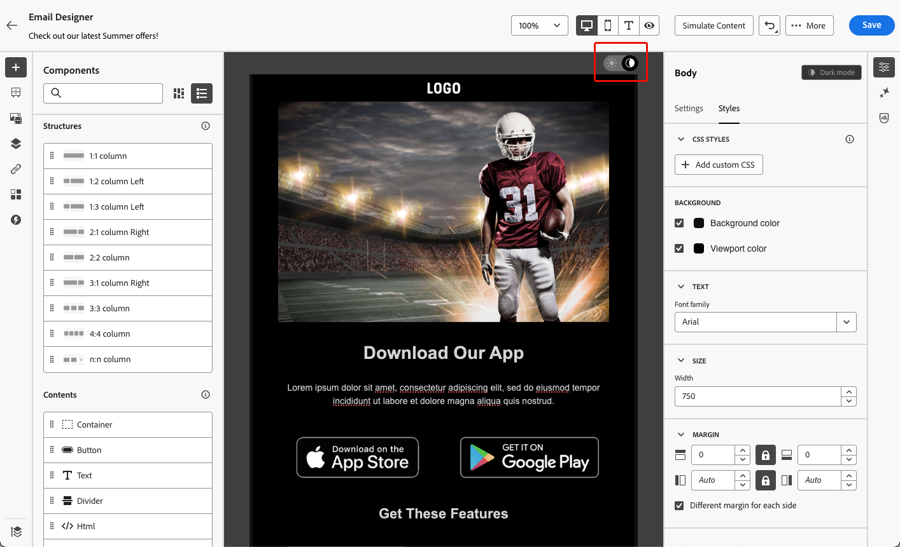

# Concevoir du contenu accessible {#accessible-content}

La [loi européenne sur l’accessibilité](https://eur-lex.europa.eu/legal-content/EN/TXT/?uri=CELEX%3A32019L0882){target="_blank"} est une directive visant à renforcer le marché intérieur des produits et services accessibles en éliminant les obstacles dus aux différences entre les règles nationales des États membres.

Ce règlement stipule que toutes les communications numériques, y compris les e-mails, les bulletins d’information, les fichiers PDF et le contenu téléchargeable, doivent être accessibles. Lors de la création de contenu pour vos destinataires, vous devez donc suivre des directives spécifiques, telles que l’utilisation de polices accessibles et de formats lisibles, tout en fournissant un texte secondaire pour les images.

Le [Concepteur d’e-mail](create-email-content.md) [!DNL Adobe Campaign], qui permet aux responsables marketing de créer du contenu pour les **e-mails** et les **pages de destination**, vous permet de vous conformer facilement à cette directive, en fonction des directives d’accessibilité du contenu web (WCAG) 2.1, niveau AA.

En conséquence, les bonnes pratiques pour concevoir un contenu accessible avec [!DNL Adobe Campaign] sont répertoriées ci-dessous.

Cette page a pour but de rendre votre contenu accessible à tous vos destinataires, afin que les personnes en situation de handicap puissent lire, comprendre et interagir avec vos e-mails et vos pages de destination conçus avec [!DNL Adobe Campaign].

<!--On the other hand, the accessibility of the [!DNL Adobe Campaign] interface itself is detailed in this section.-->
 
## Garantir la lisibilité du texte {#text-readability}

Utilisez l’onglet **[!UICONTROL Styles]** du composant **[!UICONTROL Texte]** pour vous assurer que votre texte est lisible, par exemple en utilisant un contraste de couleur approprié et des polices simples. [En savoir plus](content-components.md#text)

{width="80%"}

Pour les polices et le texte, suivez les instructions ci-dessous :

**Sélection de polices**

* Utilisez des polices sans empattement telles qu’Arial, Verdana, Tahoma, Helvetica ou Open Sans.
* Évitez les polices à empattement, cursives ou décoratives dans le contenu du corps.
* Conservez un jeu de polices limité pour garantir la cohérence et la fonctionnalité de secours (par exemple, `font-family: Arial, Helvetica, sans-serif;`).

**Taille des polices**

* Assurez-vous que la taille de police minimale du corps est de 16 pixels.
* Utilisez une hiérarchie organisée pour les titres.

**Contraste des couleurs**

* Conservez un rapport de contraste d’au moins 4,5 :1 entre le texte et l’arrière-plan.
* Pour un texte volumineux (≥24 px ou 18 px en gras), assurez-vous d’avoir un contraste d’au moins 3 :1.
* Évitez le texte gris clair ou pastel sur fond blanc.
* Ne vous fiez pas uniquement à la couleur pour donner du sens, mais utilisez plutôt des soulignements, des icônes, etc.

**Accessibilité du texte**

* Évitez d’utiliser du texte dans des images.
* Évitez le texte entièrement en majuscules dans le corps.
* Assurez-vous qu’un zoom allant jusqu’à 200 % peut être effectué sur le texte sans interrompre la mise en page.

## Garantir l’accessibilité visuelle {#visual-accessibility}

Pour vous assurer que votre contenu est accessible visuellement, suivez les bonnes pratiques ci-dessous :

* Évitez d’utiliser des indicateurs de couleur uniquement pour les informations importantes.
* Utilisez des libellés de texte ou des icônes pour garantir la clarté.
* Optimisez votre conception pour les mises en page mobiles et réactives en vous assurant que les boutons sont grands et correctement espacés.
* Testez régulièrement sur les appareils et sur les différentes tailles d’écran pour maintenir l’accessibilité.

Dans [!DNL Adobe Campaign], la taille et l’espacement des différents éléments de votre contenu peuvent être affinés à l’aide des paramètres et attributs de style du volet **[!UICONTROL Styles]** du Concepteur d’e-mail. [En savoir plus](get-started-email-style.md)

Par exemple, vous pouvez mettre à jour l’[arrière-plan](backgrounds.md) ou modifier les marges, la dilatation et l’alignement pour améliorer l’accessibilité visuelle de votre contenu. [En savoir plus](alignment-and-padding.md)

{width="80%"}

De plus, le Concepteur d’e-mail [!DNL Adobe Campaign] vous permet de prévisualiser et d’optimiser la conception pour différents appareils et tailles d’écran. Vous pouvez à tout moment **[!UICONTROL Basculer vers la vue en direct]** afin de vérifier comment votre contenu peut s’afficher sur différentes tailles d’appareil.

{width="80%"}

>[!CAUTION]
>
>La vue en direct est un aperçu générique conçu pour comparer l’apparence du rendu sur différentes tailles d’appareil. Le rendu final peut varier en fonction du client de messagerie de la personne destinataire.

## Utiliser un texte secondaire pour les images {#alt-text}

Utilisez le composant **[!UICONTROL Image]** pour fournir un texte secondaire pour les images. [En savoir plus](content-components.md#image)

{width="90%"}

Pour un texte secondaire efficace dans les produits numériques, suivez les directives ci-dessous :

* Décrivez l’objectif de l’image de manière concise et contextuelle.
* Évitez les expressions redondantes telles que « Image de... » et utilisez un texte de remplacement vide pour les images décoratives.
* Pour les icônes significatives, fournissez des libellés significatifs. Pour les images complexes, utilisez un bref texte de remplacement ainsi qu’une description plus longue ailleurs.

## Utiliser un format lisible {#readable-format}

Utilisez la structure et les [composants de contenu](content-components.md) pertinents pour le concepteur d’e-mail, ainsi que les options du volet **[!UICONTROL Styles]** pour organiser votre contenu d’une manière claire, logique et concise, accessible à tous.

{width="100%"}

* Utilisez des HTML sémantiques structurées avec des en-têtes, des paragraphes, des listes et des tableaux appropriés.
* Assurez-vous que le contenu suit un flux logique de gauche à droite, de haut en bas.
* Utilisez un langage clair et concis.
* Proposez des formats alternatifs pour les PDF et les infographies.
* Autorisez le redimensionnement et la redistribution du texte et assurez-vous que la typographie est lisible avec un contraste des couleurs adéquat dans tous les formats.

## Garantir la lisibilité du contenu {#readability}

Pour être lisible, votre contenu doit être clair, bien structuré et utilisable par tous, y compris les personnes ayant des difficultés visuelles, cognitives ou de lecture et celles qui utilisent des technologies d’assistance. Voici quelques points à prendre en compte lors de la création de contenu accessible :

* Limitez les phrases à une vingtaine de mots ou moins.
* Modifiez votre texte pour qu’il soit direct et bref.
* Utilisez la voix active pour simplifier la structure de la phrase.
* Évitez l’argot, le jargon ou les mots régionaux que certaines personnes ne connaissent pas.

Pour évaluer la lisibilité de vos e-mails, vous pouvez utiliser le célèbre [test de lisibilité de Flesch](https://support.microsoft.com/fr-fr/office/get-your-document-s-readability-and-level-statistics-85b4969e-e80a-4777-8dd3-f7fc3c8b3fd2){target="_blank"} disponible sous Microsoft Word, qui calcule la facilité de lecture de votre contenu sur une échelle de 0 à 100.

## Tester votre contenu {#test}

Pour vérifier l’accessibilité de votre contenu, vous pouvez utiliser les fonctionnalités de test fournies par [!DNL Adobe Campaign]. Elles ne sont pas spécialement conçues pour vérifier si votre contenu est entièrement accessible, mais elles peuvent fournir un premier niveau de vérification.

* Prévisualisez votre contenu à l’aide de profils de test. [Voici comment procéder](../preview-test/preview-content.md)

* Utilisez l’option [Rendu des e-mails](../preview-test/email-rendering.md) qui utilise Litmus pour simuler vos conceptions sur les principaux clients de messagerie (Apple Mail, Gmail, Outlook) et voir si le texte, les couleurs et les images rendent votre contenu accessible. <!--Litmus includes accessibility testing-->

* Envoyez des BAT pour tester le rendu de votre contenu avant de l’envoyer à votre audience réelle. [Voici comment procéder](../preview-test/test-deliveries.md)

{width="90%"}

Pour vérifier de manière plus cohérente si votre contenu est accessible, recherchez des outils externes spécifiques tels que :

* le [vérificateur de contraste WebAim](https://webaim.org/resources/contrastchecker/){target="_blank"} et l’[outil d’évaluation de l’accessibilité web WAVE](https://wave.webaim.org/){target="_blank"} pour évaluer le contraste et la conformité ;

* les technologies d’assistance comme les lecteurs d’écran (par exemple, [NVDA](https://www.nvaccess.org/download/){target="_blank"} ou [VoiceOver](https://support.apple.com/fr-fr/guide/iphone/iph3e2e415f/ios){target="_blank"} sur iPhone) pour visualiser les e-mails du point de vue des personnes souffrant de déficience visuelle.

## Utiliser le mode sombre {#dark-mode}

Parmi les bonnes pratiques pour concevoir du contenu en mode sombre, utilisez des PNG ou des SVG transparents, définissez les balises meta et CSS appropriées et fournissez un style de secours accessible si le mode sombre n’est pas pris en charge.

<!--TO PUBLISH WHEN DARK MODE IS RELEASED

Dark mode enhances visual accessibility for users with light sensitivity or visual impairments, for an improved viewing experience.

{width="90%"}

Amongst the best practices for designing content in dark mode, use transparent PNGs or SVGs, set appropriate meta tags and CSS, and provide accessible fallback styling if dark mode is not supported. Finally, make sure your emails render correctly in dark mode by testing all email content and UI elements in both light and dark modes.

Detailed best practices specific to dark mode, including guidelines to ensure accessibility, are listed in [this section](dark-mode.md#best-practices).

KEEP dark mode accessibility best practices IN ONE SINGLE LOCATION - for now listed on the Dark mode page.-->

## Utiliser des attributs spécifiques pour l’accessibilité {#attributes}

### Attributs de langue {#language}

Lors de la création de conceptions, incluez les attributs `lang` (langue) et `dir` (orientation du texte) dans le corps du contenu. Ces attributs aident les technologies d’assistance telles que les lecteurs d’écran à interpréter et présenter votre contenu d’une manière appropriée.

* L’attribut `lang` indique la langue de l’e-mail aux technologies d’assistance, en veillant à ce que les mots soient prononcés correctement.

  +++Exemples

  Exemple pour l’anglais :

  ```
  <body lang="en">
  ```

  Exemple pour le français :

  ```
  <body lang="fr">
  ```

  +++

* L’attribut `dir` spécifie l’orientation du texte. La plupart des langues, y compris l’anglais et le français, sont lues de gauche à droite (ltr), tandis que les langues telles que l’arabe et l’hébreu sont lues de droite à gauche (rtl).

  +++Exemples

  Exemple pour l’anglais (de gauche à droite) :

  ```
  <body lang="en" dir="ltr">
  ```

  Exemple pour l’arabe (de droite à gauche) :

  ```
  <body lang="ar" dir="rtl">
  ```

  +++

Les lecteurs d’écran s’appuient sur l’attribut `lang` pour appliquer les règles de prononciation correctes, tandis que l’orientation du texte assure naturellement le flux du contenu pour les langues écrites de gauche à droite ou de droite à gauche. Sans ces attributs, l’ordre de lecture peut être déroutant et les mots mal prononcés. Par conséquent, enveloppez toujours le corps de votre e-mail avec les attributs `lang` et `dir` appropriés.

>[!TIP]
>
>Si votre e-mail contient plusieurs langues, attribuez les attributs de langue appropriés à des sections spécifiques (comme des blocs `<table>` ou `<td>`) pour vous assurer que chaque partie est lue correctement.

### Tableaux {#tables}

Dans les contenus HTML, les tableaux sont souvent utilisés pour la mise en page. Par défaut, les lecteurs d’écran traitent chaque `<table>` comme un tableau de données, annonçant les lignes, les colonnes et la structure. Cela peut prêter à confusion si le tableau n’est utilisé que pour la mise en forme.

Ajoutez des `role="presentation"` (ou des `role="none"`) aux tableaux de disposition pour vous assurer que les technologies d’assistance ignorent leur structure et se concentrent uniquement sur le contenu réel.

+++Exemple : tableau de disposition (avec `role="presentation"`)

```
<table role="presentation" border="0" cellpadding="0" cellspacing="0" width="100%"> 

  <tr> 

    <td align="center"> 

      <h1>Hello World</h1> 

      <p>Welcome to our newsletter</p> 

    </td> 

  </tr> 

</table>
```

Les lecteurs d’écran lisent : « Bonjour le monde. Bienvenue dans notre newsletter. » *(Aucune mention de lignes, colonnes ou tableau)*

+++

+++Exemple : tableau de données (sans `role="presentation"`)

```
<table border="1" cellpadding="5" cellspacing="0"> 

  <tr> 

    <th scope="col">Name</th> 

    <th scope="col">Score</th> 

  </tr> 

  <tr> 

    <td>Alice</td> 

    <td>95</td> 

  </tr> 

  <tr> 

    <td>Bob</td> 

    <td>88</td> 

  </tr> 

</table> 
```

Les lecteurs d’écran lisent : « Tableau avec 2 colonnes et 3 lignes. »

« Nom, Alice. Score, 95. »

« Nom, Bob. Score, 88. »

+++

>[!TIP]
>
>Utilisez `role="presentation"` exclusivement pour les tableaux de disposition. Pour les tableaux de données, conservez la structure `<table>` sémantique afin que les lecteurs d’écran puissent correctement annoncer les en-têtes et les relations.

### Texte des liens {#links}

Les lecteurs d’écran lisent les liens à l’aide de leur texte. Si un lien est libellé uniquement « Cliquez ici » ou « En savoir plus », les utilisateurs et utilisatrices de technologies d’assistance ne connaîtront pas la destination. Pour garantir leur accessibilité, ils ou elles ont besoin d’un texte descriptif qui indique clairement la cible ou l’action.

Utilisez le Concepteur d’e-mail pour [ajouter un lien](message-tracking.md#insert-links) à votre contenu et modifier le libellé afin de le rendre reconnaissable (visible) et descriptif (avec un objectif clair). Évitez les libellés vagues tels que « ici » ou « plus ».

{width="70%"}

+++Exemple : bon lien (descriptif) : 

```
<p>Learn more in the  

<a href="https://adobe.com/release-notes">August release notes</a>. 

</p>
```

Les lecteurs d’écran lisent :
« Lien, notes de mise à jour d’août. »

+++

+++Exemple - Lien incorrect (non descriptif)

```
<p>Learn more about our new features.  

  <a href="https://adobe.com/release-notes">Click here</a>. 

</p>
```

Les lecteurs d’écran lisent :
« Lien, cliquez ici. » *(Ne fournit aucun contexte en dehors de l’ordre de lecture)*

+++

<!--
>[!TIP]
>
>Always ensure link text is discernible (visible) and descriptive (clear about purpose). Avoid vague labels like 'here' or 'more'.-->

## Offrez une prise en charge de la navigation au clavier et du focus clavier {#keyboard}

<!--for landing pages-->

La prise en charge de la navigation au clavier et du focus clavier permet aux personnes qui ne peuvent pas utiliser de souris d’accéder au contenu et d’interagir avec celui-ci. Elle améliore également la convivialité globale en offrant aux utilisateurs et utilisatrices un moyen clair et cohérent de parcourir les informations.

* Focus via le clavier

   * Assurez-vous que tous les éléments interactifs (tels que les boutons, cases à cocher, liens) ont `tabindex="0"` afin qu’ils soient inclus dans l’ordre de tabulation naturel.

   * Autorisez la navigation à l’aide de la touche de tabulation et des touches fléchées (↑ ↓ ← →), qui doivent mettre en surbrillance de manière visible l’élément sélectionné.

* Style de focus personnalisé

   * Appliquez des styles clairs et distinctifs pour le focus sur les éléments interactifs :

     +++Exemple (CSS)

     ```
     [tabindex="0"] : focus { 
     
     outline: 2px solid #00AEEF;  /* Cyan border */ 
     
     background-color: #20CEFF;   /* Optional background */ 
     
     }
     ```

     +++

   * Assurez-vous que les indicateurs de focus respectent les normes d’apparence de focus WCAG 2.2, notamment :

      * Surface minimale : contour de 2 pixels CSS d’épaisseur.

      * Rapport de contraste : ≥ 3:1 entre l’état de focus et hors focus.

* Prise en charge de l’activation au clavier

   * Assurez-vous que les cases à cocher et les boutons répondent aux touches Entrée et Espace.

   * Validez l’interaction à l’aide du clavier uniquement :

      * Les touches Entrée ou Espace doivent activer/désactiver les cases à cocher.

      * Les touches Entrée ou Espace doivent déclencher l’action des boutons.
