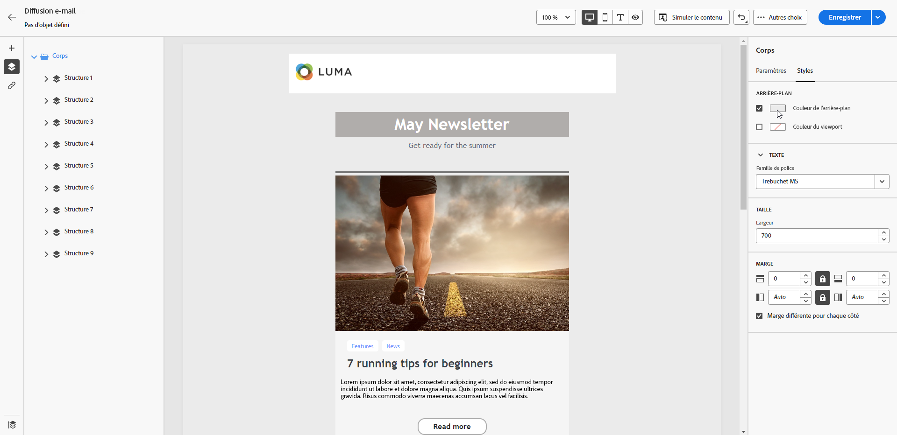
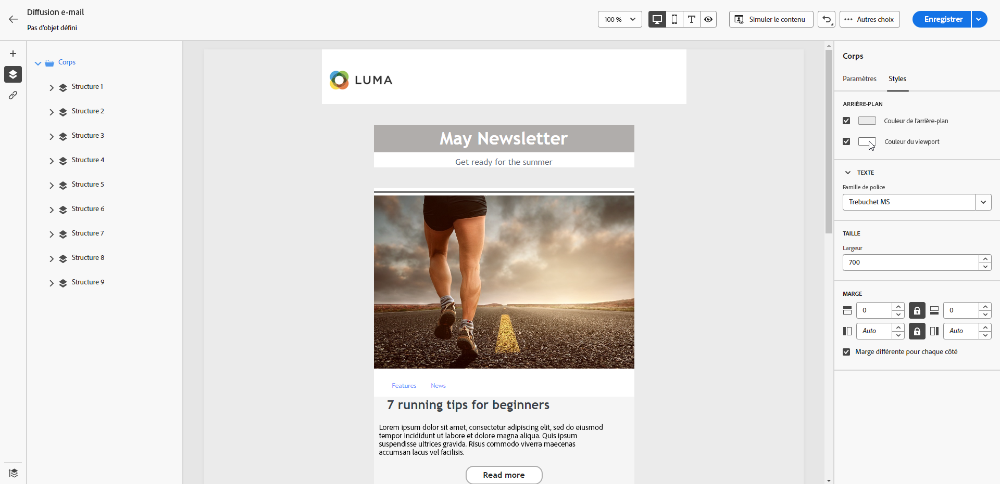
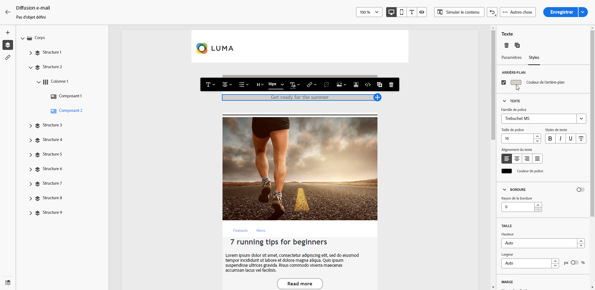
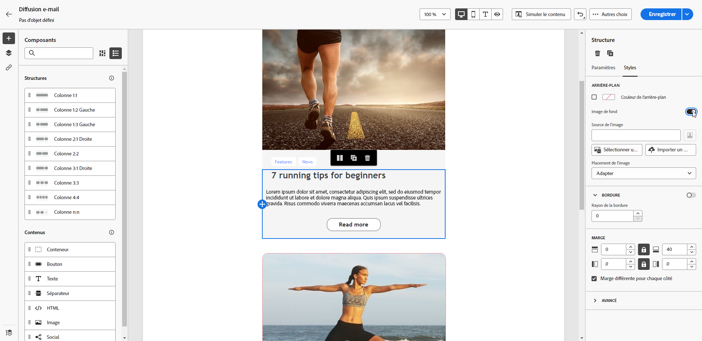
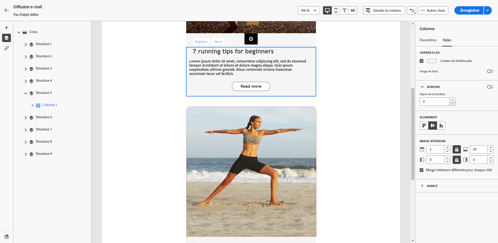

# Personnaliser l’arrière-plan des e-mails {#backgrounds}

>[!CONTEXTUALHELP]
>
Lors de la définition d’arrière-plans avec le Designer Email, Adobe recommande ce qui suit :

1. Appliquez une couleur de fond au corps de votre email si votre design le requiert.
1. Définissez les couleurs de fond au niveau de la colonne dans la plupart des cas.
1. Évitez d’utiliser des couleurs de fond sur les composants d’image ou de texte, car ils sont difficiles à gérer.

Vous trouverez ci-dessous les paramètres d’arrière-plan disponibles que vous pouvez utiliser :

* Définissez une **[!UICONTROL Couleur d’arrière-plan]** pour l’ensemble de l’e-mail. Sélectionnez les paramètres du corps dans l’arborescence de navigation accessible à partir du volet de gauche.

  [Définissez une couleur de fond pour l’ensemble du corps de l’e-mail, accessible via l’arborescence de navigation.]\
  {zoomable="yes"}

* Définissez la même couleur d’arrière-plan pour tous les composants de structure en sélectionnant **[!UICONTROL Couleur d’arrière-plan de la fenêtre]**. Cette option vous permet de choisir un paramètre différent dans la couleur d’arrière-plan.

  [Définissez une couleur d’arrière-plan uniforme pour tous les composants de structure à l’aide de l’option Couleur d’arrière-plan de la fenêtre.]\
  {zoomable="yes"}

* Définissez une couleur d’arrière-plan différente pour chaque composant de structure. Sélectionnez une structure dans l’arborescence de navigation du volet de gauche afin d’appliquer une couleur d’arrière-plan spécifique uniquement sur cette structure.

  [Appliquez des couleurs de fond uniques aux composants de structure individuels via l’arborescence de navigation.]\
  {zoomable="yes"}

  >[!NOTE]\
  Veillez à ne pas définir de couleur d’arrière-plan de fenêtre d’affichage, car elle peut masquer les couleurs d’arrière-plan de la structure.

* Définissez une **[!UICONTROL Image d’arrière-plan]** pour le contenu d’un composant de structure.

  [Ajoutez une image d’arrière-plan au contenu d’un composant de structure spécifique.]\
  {zoomable="yes"}

  >[!NOTE]\
  Certains programmes de messagerie ne prennent pas en charge les images d’arrière-plan. Lorsqu’elle n’est pas prise en charge, la couleur d’arrière-plan des lignes est utilisée à la place. Sélectionnez une couleur de fond de secours appropriée au cas où l’image ne s’afficherait pas.

* Définissez une couleur de fond au niveau des colonnes.

  [Appliquez une couleur de fond au niveau de la colonne pour plus de flexibilité.]\
  {zoomable="yes"}

  >[!NOTE]\
  Il s&#39;agit du cas pratique le plus courant. Adobe recommande de définir les couleurs de fond au niveau de la colonne, car cela offre une plus grande flexibilité lors de la modification de l’ensemble du contenu de l’e-mail.

  Vous pouvez également définir une image de fond au niveau des colonnes, mais cette option est rarement utilisée.