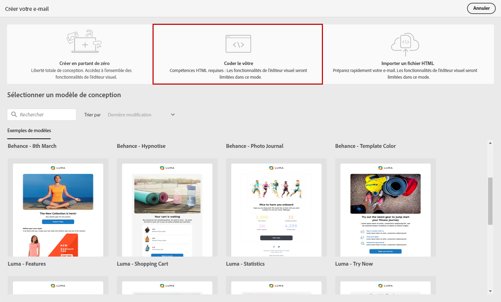
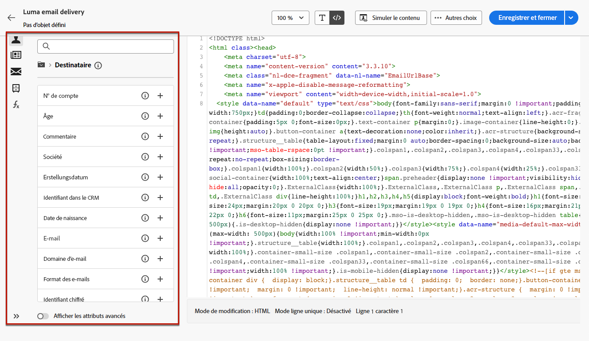

# Coder votre propre contenu d’e-mail {#code-content}

Utilisez le mode **[!UICONTROL Coder le vôtre]** pour importer du code HTML brut et/ou coder le contenu de l’e-mail.

>[!CAUTION]
>
>Cette méthode requiert des compétences en code HTML.

1. Sur la page d’accueil du [concepteur d’e-mail](get-started-email-designer.md), sélectionnez **[!UICONTROL Coder le vôtre]**.

   {zoomable=&quot;yes&quot;}

1. Saisissez ou collez votre code HTML brut dans la zone de travail principale.

1. Dans le volet de gauche, vous pouvez utiliser les fonctionnalités de personnalisation. [En savoir plus](../personalization/gs-personalization.md).

   {zoomable=&quot;yes&quot;}

1. Cliquez sur le bouton **[!UICONTROL Simuler du contenu]** pour vérifier la conception et la personnalisation du message à l’aide de profils de test. [En savoir plus](../preview-test/preview-test.md).

1. Une fois que votre code est prêt, cliquez sur **[!UICONTROL Enregistrer et fermer]**, puis revenez à l’écran de création du message pour le finaliser.
