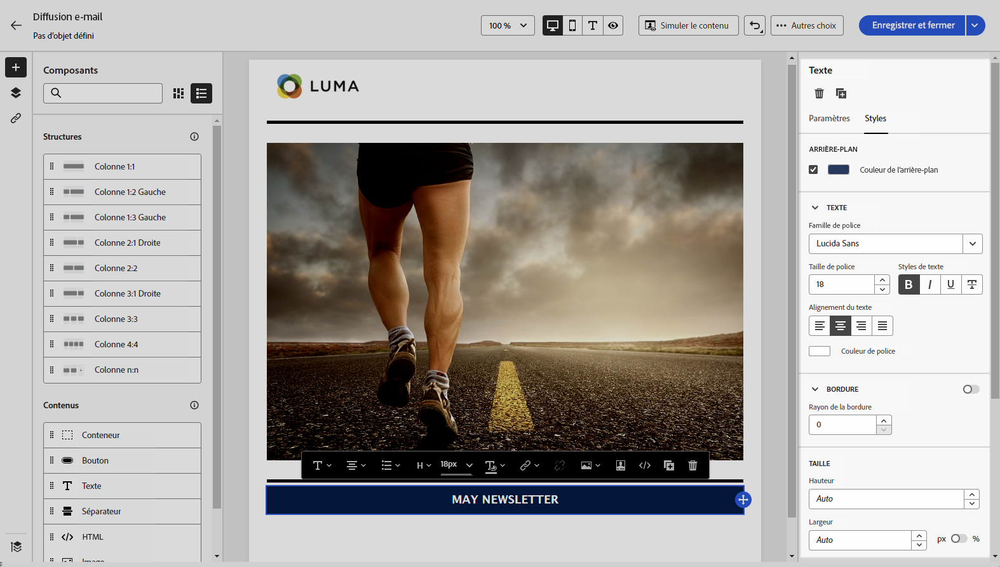
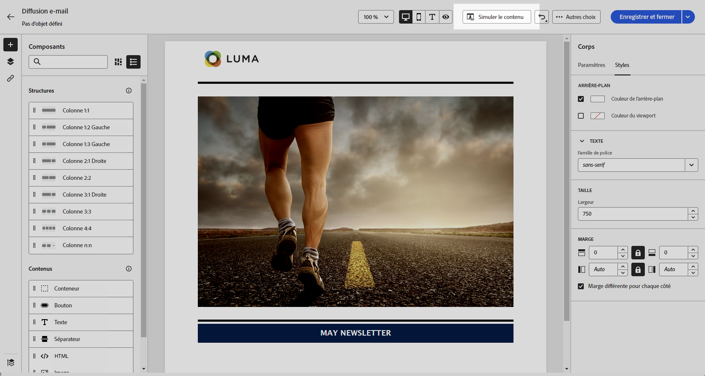

# Rédiger le contenu de l’e-mail en partant de zéro {#create-email-content}

>[!CONTEXTUALHELP]
>id="ac_structure_components_email"
>title="Ajouter des structures"
>abstract="Les structures définissent la disposition de votre e-mail. Faites glisser et déposez un composant de **structure** dans la zone de travail pour commencer à concevoir le contenu de votre e-mail."

>[!CONTEXTUALHELP]
>id="ac_structure_components_landing_page"
>title="Ajouter des structures"
>abstract="Les structures définissent la disposition de la page de destination. Faites glisser et déposez un composant de **structure** dans la zone de travail pour commencer à concevoir votre page de destination."

>[!CONTEXTUALHELP]
>id="ac_structure_components_fragment"
>title="Ajouter des structures"
>abstract="Les structures définissent la disposition du fragment. Faites glisser et déposez un composant de **structure** dans la zone de travail pour commencer à concevoir le contenu de votre fragment."

>[!CONTEXTUALHELP]
>id="ac_structure_components_template"
>title="Ajouter des structures"
>abstract="Les structures définissent la disposition du modèle. Faites glisser et déposez un composant de **structure** dans la zone de travail pour commencer à concevoir le contenu de votre modèle."

>[!CONTEXTUALHELP]
>id="ac_edition_columns_email"
>title="Définition des colonnes de l’email"
>abstract="Le concepteur d’e-mail vous permet de définir facilement la disposition de votre email en définissant la structure des colonnes."

>[!CONTEXTUALHELP]
>id="ac_edition_columns_landing_page"
>title="Définir les colonnes de la page de destination"
>abstract="Le concepteur d’e-mail permet de définir facilement la disposition de la page de destination en définissant la structure des colonnes."

>[!CONTEXTUALHELP]
>id="ac_edition_columns_fragment"
>title="Définir les colonnes du fragment"
>abstract="Le concepteur d’e-mail permet de définir facilement la disposition du fragment en définissant la structure des colonnes."

>[!CONTEXTUALHELP]
>id="ac_edition_columns_template"
>title="Définir les colonnes du modèle"
>abstract="Le concepteur d’e-mail permet de définir facilement la disposition de votre modèle en définissant la structure des colonnes."

Le concepteur d’e-mail permet de définir facilement la structure de votre email. En ajoutant et en déplaçant des éléments structurels à l’aide de simples actions de glisser-déposer, vous pouvez concevoir le corps de votre e-mail en quelques secondes.

Pour commencer à créer le contenu de votre e-mail, procédez comme suit :

1. Sur la page d’accueil du [concepteur d’e-mail](get-started-email-designer.md#start-authoring), cliquez sur l’option **[!UICONTROL Créer en partant de zéro]**.

   {zoomable=&quot;yes&quot;}

1. Commencez à concevoir le contenu de l’e-mail en faisant glisser et en déposant les **[!UICONTROL Structures]** dans la zone de travail pour définir la disposition de l’e-mail.

   >[!NOTE]
   >
   >L’empilement des colonnes n’est pas compatible avec tous les programmes de messagerie. Lorsqu’elles ne sont pas prises en charge, les colonnes ne sont pas empilées.

1. Ajoutez autant de **[!UICONTROL Structures]** que nécessaire et modifiez leurs paramètres dans le volet dédié sur la droite.

   {zoomable=&quot;yes&quot;}

1. Vous pouvez sélectionner le composant **[!UICONTROL n:n colonne]** pour définir le nombre de colonnes de votre choix (entre 3 et 10). Vous pouvez aussi définir la largeur de chaque colonne en déplaçant les flèches situées au bas de celle-ci.

   >[!NOTE]
   >
   >La taille de chaque colonne ne peut pas être inférieure à 10 % de la largeur totale du composant de structure. Vous ne pouvez pas supprimer une colonne qui n’est pas vide.

1. Dans la section **[!UICONTROL Composants]**, faites glisser et déposez autant d’éléments que nécessaire dans une ou plusieurs structures. [En savoir plus sur les composants de contenu](content-components.md).

1. Chaque composant peut être personnalisé à l’aide des onglets **[!UICONTROL Paramètres]** ou **[!UICONTROL Style]** sur la droite. Par exemple, vous pouvez changer le style de texte, la marge intérieure ou la marge de chaque composant. [En savoir plus sur l’alignement et la marge intérieure](alignment-and-padding.md).

   {zoomable=&quot;yes&quot;}

1. Insérez des champs de personnalisation pour personnaliser le contenu de votre e-mail en fonction des données de profil. [En savoir plus sur la personnalisation du contenu](../personalization/personalize.md).

1. Ajouter des liens à votre contenu.

   Cliquez sur l’onglet **[!UICONTROL Liens]** dans le volet de gauche pour afficher toutes les URL du contenu qui seront trackées. Vous pouvez modifier le **[!UICONTROL Type de tracking]** ou le **[!UICONTROL Libellé]**, ainsi qu’ajouter des **[!UICONTROL Catégories]** si nécessaire.

[En savoir plus sur le tracking des liens et des messages.](message-tracking.md)

   {zoomable=&quot;yes&quot;}

1. Si nécessaire, vous pouvez personnaliser davantage l’e-mail en cliquant sur **[!UICONTROL Basculer vers l’éditeur de code]** dans le menu avancé. Vous pouvez modifier le code source de l’e-mail, par exemple pour ajouter des balises HTML de tracking ou personnalisées. [En savoir plus sur l’éditeur de code](code-content.md).

   >[!CAUTION]
   >
   >Vous ne pouvez pas revenir au concepteur visuel de cet e-mail après avoir basculé vers l’éditeur de code.

1. Une fois que votre contenu est prêt, cliquez sur **[!UICONTROL Simuler du contenu]** pour vérifier le rendu de l’e-mail. Vous pouvez choisir la vue de bureau ou mobile. [En savoir plus sur la prévisualisation des e-mails](../preview-test/preview-test.md).

   {zoomable=&quot;yes&quot;}

1. Lorsque votre e-mail est prêt, cliquez sur **[!UICONTROL Enregistrer]**.

