# Utiliser des modèles de contenu {#content-templates}

>[!CONTEXTUALHELP]
>id="acw_contenttemplate_menu"
>title="Modèles de contenu"
>abstract="Pour un processus de conception accéléré et amélioré, vous pouvez créer des modèles d’e-mails autonomes pour réutiliser facilement le contenu personnalisé dans Adobe Campaign. Ces modèles de contenu peuvent être entièrement conçus, en fonction de modèles intégrés ou personnalisés, créés à partir d’un contenu existant ou importés dans l’éditeur de modèles de contenu."

Pour un processus de conception accéléré et amélioré, vous pouvez créer des modèles autonomes afin de réutiliser facilement le contenu personnalisé dans [!DNL Adobe Campaign]. Ces modèles de contenu peuvent être entièrement conçus, basés sur des modèles intégrés ou personnalisés, créés à partir de contenu existant ou importés dans l’éditeur de modèles de contenu.

Cette fonctionnalité permet aux utilisateurs orientés contenu de travailler sur des modèles autonomes, de sorte que les utilisateurs marketing puissent les réutiliser et les adapter dans leurs propres campagnes par e-mail.

>[!NOTE]
>
>Actuellement, seuls les modèles de contenu **e-mail** sont pris en charge.

## Accéder aux modèles de contenu {#access-templates}

>[!CONTEXTUALHELP]
>id="acw_contenttemplate_edition"
>title="Modifier le contenu de votre modèle"
>abstract="Cliquez sur le bouton **Modifier le contenu** pour mettre à jour votre contenu avec le Concepteur d’e-mail."

Pour accéder à la liste des modèles de contenu, accédez au menu **[!UICONTROL Gestion de contenu]** > **[!UICONTROL Modèles de contenu]** dans le rail de gauche.

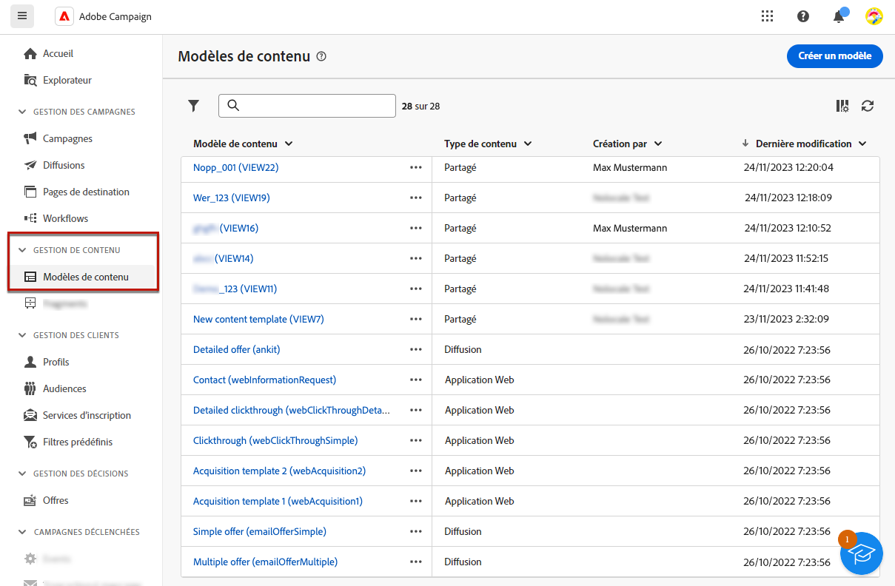{zoomable="yes"}

Ce tableau de bord affiche tous les modèles de contenu disponibles sous la forme d’une liste. Vous pouvez filtrer sur un [dossier](../get-started/permissions.md#folders) spécifique à l’aide de la liste déroulante ou ajouter des règles à l’aide du [concepteur de requête](../query/query-modeler-overview.md).

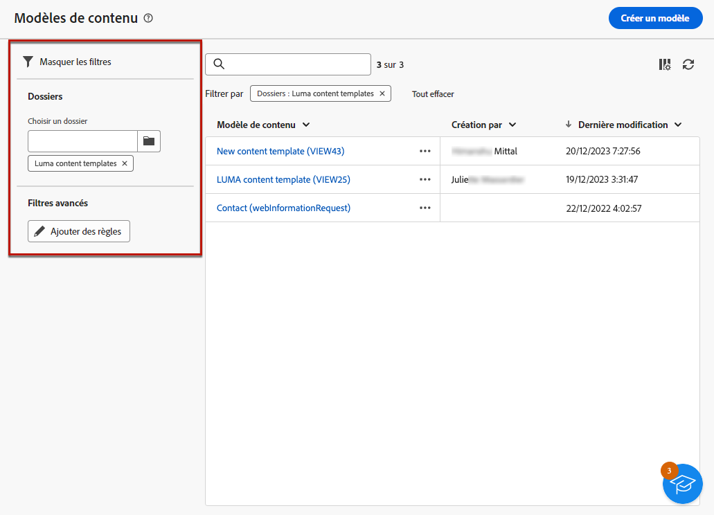{zoomable="yes"}

Dans la liste, vous pouvez modifier, dupliquer ou supprimer des modèles de contenu existants. Utilisez le bouton situé dans la section supérieure pour créer un modèle de contenu.

### Modèle de contenu en mode lecture seule {#template-readonly}

Les droits d’accès peuvent être appliqués aux modèles de contenu.

Si vous ne disposez pas d’autorisations de modification pour un modèle de contenu en particulier, ce dernier s’affiche en **mode lecture seule**. Dans ce cas, le bouton **[!UICONTROL Modifier le contenu]** est remplacé par le bouton **[!UICONTROL Afficher le contenu]**, ce qui vous permet d’afficher le modèle sans apporter de modifications.

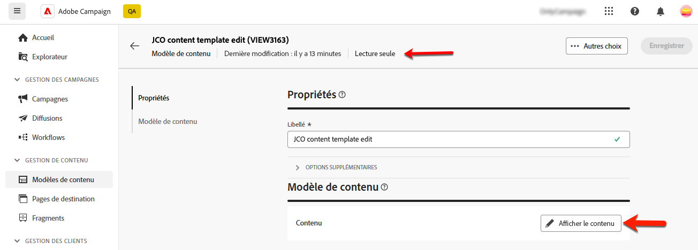{zoomable="yes"}

Comme illustré ci-dessous, toutes les icônes de fonctionnalité sont désactivées, ce qui limite l’interaction au seul affichage.

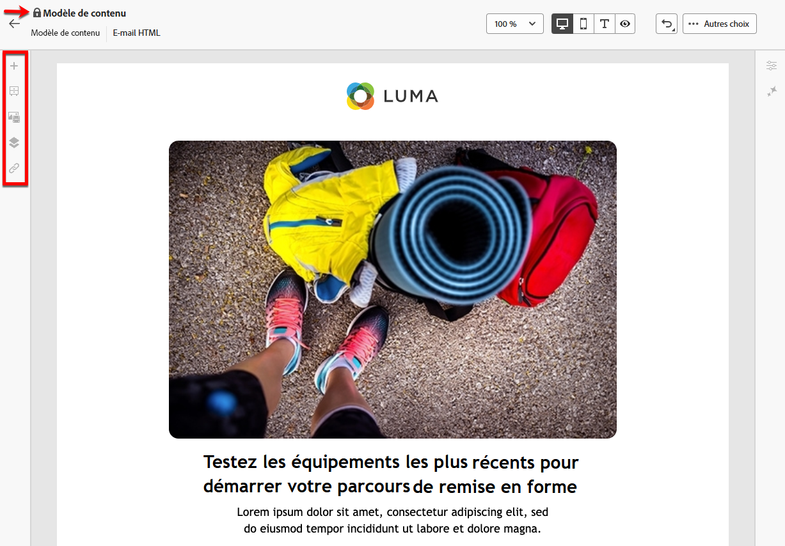{zoomable="yes"}

## Créer des modèles de contenu {#create-content-templates}

>[!CONTEXTUALHELP]
>id="acw_contenttemplate_design"
>title="Conception de modèle de contenu"
>abstract="Concevez votre modèle de contenu d’e-mail."

>[!CONTEXTUALHELP]
>id="acw_contenttemplate_selection"
>title="Sélection du modèle de contenu"
>abstract="Sélectionnez votre modèle de contenu d’e-mail."

Les modèles de contenu peuvent être créés en [enregistrant un e-mail existant en tant que modèle](#save-as-template) ou à partir de la liste des modèles d’e-mail, via le bouton **Créer un modèle de contenu**, [comme décrit ci-dessous](#create-template-from-scratch).

Une fois enregistré, vous pouvez utiliser ce modèle lors de la création d’un [e-mail](../email/create-email.md) dans [!DNL Adobe Campaign]. [Voici comment procéder](use-email-templates.md).

>[!NOTE]
>
>* Les modifications apportées aux modèles de contenu ne sont pas propagées aux e-mails.
>
>* De même, lorsque des modèles sont utilisés dans un e-mail, les modifications que vous apportez au contenu de votre e-mail n’ont aucune incidence sur le modèle de contenu précédemment utilisé.

### Créer un modèle de contenu {#create-template-from-scratch}

>[!CONTEXTUALHELP]
>id="acw_contenttemplate_properties"
>title="Définir les propriétés de votre modèle"
>abstract="Définissez les propriétés de votre modèle de contenu d’e-mail pour le récupérer facilement si nécessaire."

Pour créer un modèle de contenu à partir du tableau de bord des modèles de contenu, procédez comme suit :

1. Accédez à la liste des modèles de contenu via le rail de gauche **[!UICONTROL Gestion de contenu]** > **[!UICONTROL Modèles de contenu]**.

1. Sélectionnez **[!UICONTROL Créer un modèle]**.

   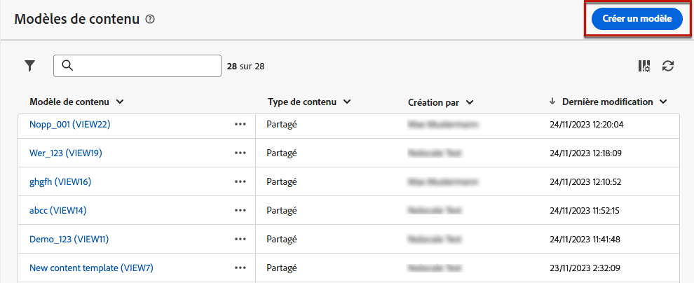{zoomable="yes"}

1. Saisissez le libellé et les propriétés du modèle. Vous pouvez sélectionner le dossier dans lequel vous souhaitez stocker votre modèle. Par défaut, les modèles de contenu sont stockés dans un dossier dédié de la hiérarchie Adobe Campaign : **[!UICONTROL Explorateur]** > **[!UICONTROL Ressources]** > **[!UICONTROL Modèles]** > **[!UICONTROL Modèles de contenu]**. Pour en savoir plus sur les dossiers, consultez [cette page](../get-started/permissions.md#folders).

   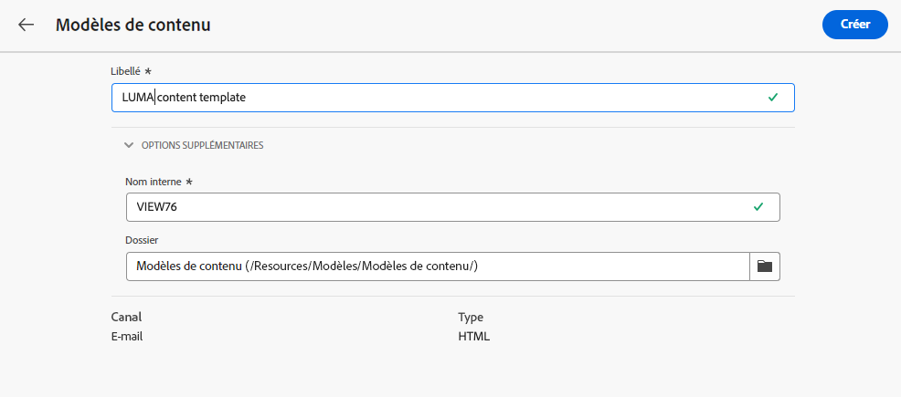{zoomable="yes"}

1. Cliquez sur **[!UICONTROL Créer]** et choisissez votre méthode de conception de modèle parmi les différentes options suivantes :

   * [Concevez votre contenu à partir de zéro](create-email-content.md) dans l’interface du Concepteur d’e-mail.
   * [Codez ou collez du code HTML brut](code-content.md) directement dans le Concepteur d’e-mail.
   * [Importez du contenu HTML existant](existing-content.md) à partir d’un fichier ou d’un dossier .zip.
   * Utilisez du contenu existant à partir d’une liste de modèles intégrés ou personnalisés. Les étapes d’utilisation d’un modèle de contenu dans un e-mail sont décrites dans [cette section](use-email-templates.md).

   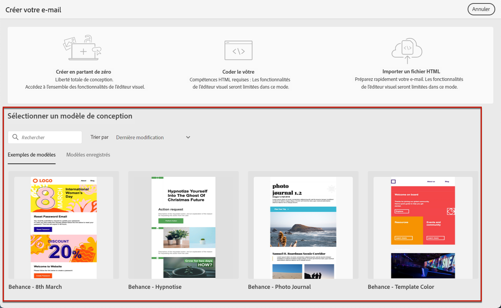{zoomable="yes"}

1. Le Concepteur d’e-mail s’affiche. Modifiez votre contenu selon vos besoins, comme vous le feriez pour n’importe quel e-mail, en fonction de l’option que vous avez sélectionnée. Découvrez comment utiliser le Concepteur d’e-mail dans [cette section](get-started-email-designer.md).

   <!--You can test your content if needed. [Learn how](#test-template)-->

1. Lorsque votre modèle est prêt, cliquez sur **[!UICONTROL Enregistrer]**.

   Si nécessaire, cliquez sur la flèche en regard du nom du modèle pour revenir à l’écran **[!UICONTROL Détails]** et modifiez votre modèle.

   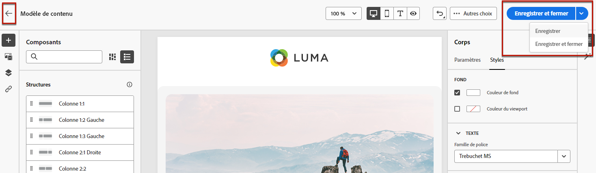{zoomable="yes"}

Le modèle est disponible dans la liste **[!UICONTROL Modèles de contenu]**. [En savoir plus](#access-templates)

Vous pouvez maintenant utiliser ce modèle pour créer du contenu. Elle est disponible sous l’onglet **[!UICONTROL Modèles enregistrés]** de la Designer d’e-mail. [Voici comment procéder](use-email-templates.md).

### Enregistrer le contenu de l’e-mail en tant que modèle {#save-as-template}

Une fois que vous avez [conçu un e-mail](create-email-content.md), vous pouvez enregistrer ce contenu en tant que modèle pour une réutilisation ultérieure. Les modèles enregistrés sont disponibles pour tous les utilisateurs et utilisatrices de votre environnement Adobe Campaign.

Pour enregistrer un contenu d’e-mail en tant que modèle, procédez comme suit :

1. Dans le Concepteur d’e-mail, cliquez sur le bouton **[!UICONTROL Plus]** en haut à droite de l’écran.

1. Sélectionnez **[!UICONTROL Enregistrer comme modèle de contenu]** dans le menu déroulant.

   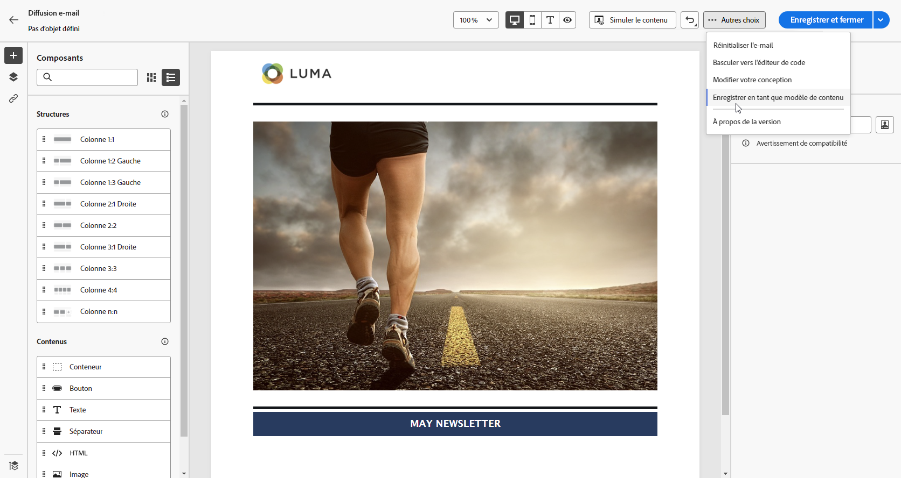{zoomable="yes"}

1. Saisissez le nom du modèle et enregistrez-le.

   {zoomable="yes"}

Le modèle est enregistré et affiché dans la liste **[!UICONTROL Modèles de contenu]**. Il devient alors un modèle de contenu autonome accessible pouvant être modifié et supprimé comme tout autre élément de cette liste. [En savoir plus](#access-manage-templates)

Vous pouvez maintenant utiliser ce modèle pour créer du contenu. Elle est disponible sous l’onglet **[!UICONTROL Modèles enregistrés]** de la Designer d’e-mail. [Voici comment procéder](use-email-templates.md)

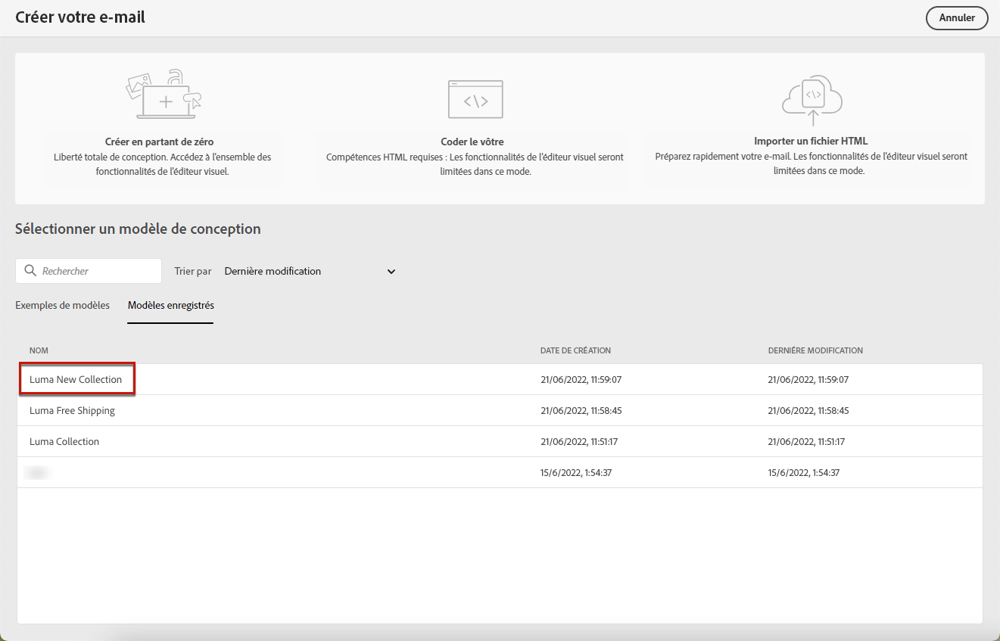{zoomable="yes"}

>[!NOTE]
>
>Toute modification apportée à ce nouveau modèle n’est pas propagée dans l’e-mail d’où elle provient. De même, lorsque le contenu d’origine est modifié dans cet e-mail, le nouveau modèle n’est pas modifié.

<!--

Test your content template {#test-template}

You can test the rendering of any email content template, whether created from scratch or from an email. To do so, follow the steps below.

1. Access the content template list.

1. Click **[!UICONTROL Edit content]** from the **[!UICONTROL Template properties]**.

1. Click **[!UICONTROL Simulate Content]** and select a test profile to check your email rendering. You can choose the desktop or mobile view.

1. You can send a proof to test your content and have it approved by some internal users before using it. To do so, click the **[!UICONTROL Send proof]** button and follow the steps described in .

-->

## Modifier un modèle de contenu {#modify-delete}

Pour mettre à jour un modèle de contenu existant, procédez comme suit :

1. Dans la liste des modèles de contenu, cliquez sur le libellé du modèle pour le modifier.

1. Cliquez sur le bouton **[!UICONTROL Modifier le contenu]** pour mettre à jour votre contenu avec le [Concepteur d’e-mail](get-started-email-designer.md).

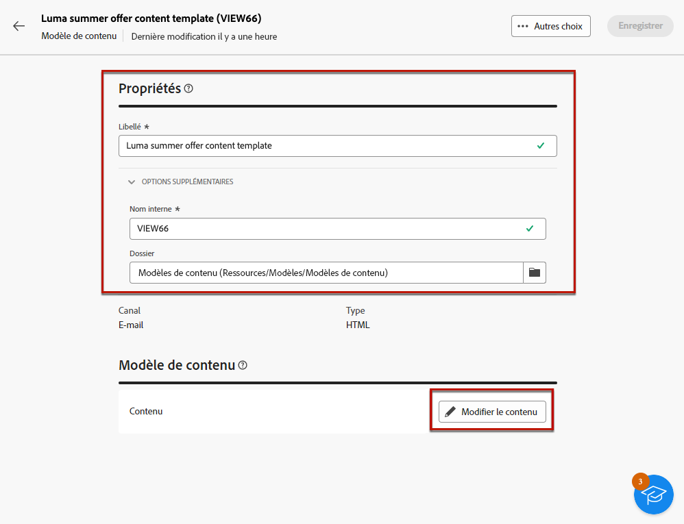{zoomable="yes"}

>[!NOTE]
>
>Les modifications apportées aux modèles de contenu ne sont pas propagées aux e-mails avec ce modèle de contenu.

## Supprimer un modèle de contenu {#content-delete}

Vous pouvez supprimer un modèle de contenu de deux manières différentes :

* Dans la liste des modèles de contenu, cliquez sur le bouton représentant des points de suspension, puis sélectionnez **Supprimer**.

  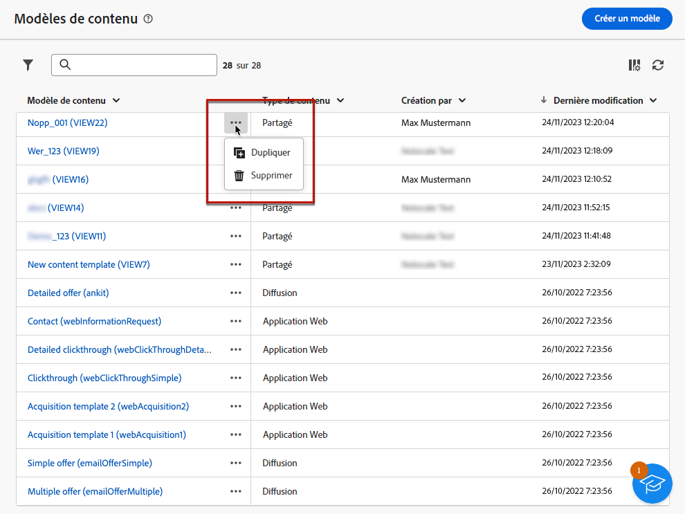{zoomable="yes"}

* Dans le modèle de contenu lui-même, cliquez sur le bouton **Plus**, puis sélectionnez **Supprimer**.

>[!NOTE]
>
>La suppression d’un modèle de contenu n’a aucun impact sur les diffusions créées à partir de ce modèle.

## Dupliquer un modèle de contenu {#content-duplicate}

Vous pouvez dupliquer un modèle de contenu de deux manières :

* Dans la liste des modèles de contenu, cliquez sur le bouton représentant des points de suspension, puis sélectionnez **Dupliquer**.

* À partir du modèle de contenu lui-même, cliquez sur le bouton **Plus**, puis sélectionnez **Dupliquer**.

Dans les deux cas, confirmez la duplication pour créer le modèle de contenu. Le libellé du nouveau modèle de contenu est **Copie de`<label of the initial campaign>`**. Accédez aux paramètres du modèle pour mettre à jour ce libellé.