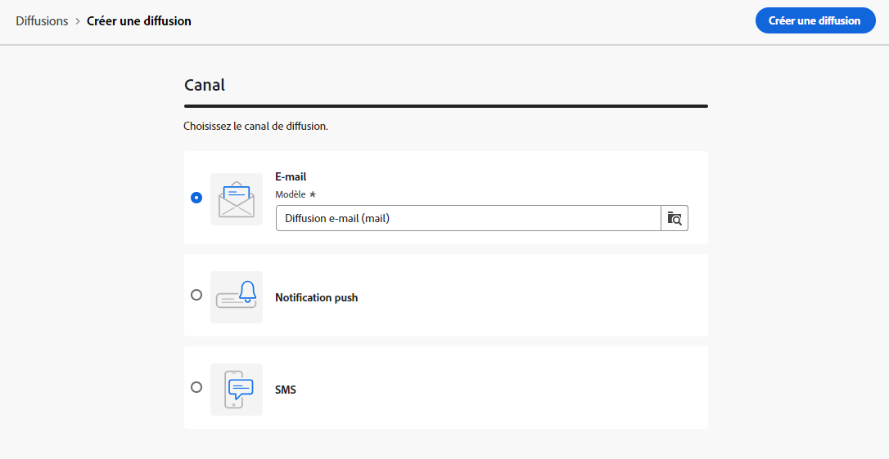

# Envoyer votre premier e-mail {#first-email}

>[!CONTEXTUALHELP]
>id="acw_homepage_card2"
>title="IA dédiée au contenu des emails"
>abstract="Notre technologie Gen AI utilise des algorithmes avancés pour générer du contenu hautement attrayant et personnalisé. Augmentez les taux d’ouverture, les taux de clics publicitaires et les conversions grâce à la génération de contenu intelligent de Gen AI. Gardez l’avance sur le jeu et augmentez votre jeu de marketing email avec Gen AI sur le contenu des emails."

Découvrez comment créer votre premier e-mail ciblé. Dans ce cas d’utilisation, vous planifiez l’envoi d’un e-mail aux membres argent et or du programme de fidélité à une date spécifique.

Basé sur un modèle de conception prédéfini, l’e-mail propose également du contenu personnalisé basé sur les attributs de profil du client ou de la cliente.

## Créer la diffusion e-mail {#create-email}

>[!CONTEXTUALHELP]
>id="acw_deliveries_email_template_selection"
>title="Sélectionner le modèle d’e-mail"
>abstract="Un modèle d’e-mail est une configuration de diffusion spécifique qui contient des paramètres prédéfinis, tels que des règles de typologie, des paramètres de personnalisation ou de routage. Les modèles sont définis dans la console cliente Campaign."

>[!CONTEXTUALHELP]
>id="acw_deliveries_email_properties"
>title="Propriétés de l’e-mail"
>abstract="Les propriétés sont les paramètres de diffusion courants qui vous permettent de nommer et de classer votre diffusion. Si votre diffusion est basée sur un schéma étendu défini dans la console Adobe Campaign v8, des champs spécifiques d’**Options personnalisées** sont disponibles."

Pour créer une diffusion, procédez comme suit :

1. Accédez au menu **[!UICONTROL Diffusions]** dans le rail de gauche, puis cliquez sur le bouton **[!UICONTROL Créer une diffusion]**.

1. Sélectionnez le canal **[!UICONTROL E-mail]** et choisissez un modèle de diffusion e-mail dans la liste.

   >[!NOTE]
   >
   >Les modèles sont des paramètres de diffusion préconfigurés enregistrés en vue d’une utilisation ultérieure. [En savoir plus](../msg/delivery-template.md).

   

1. Cliquez sur le bouton **[!UICONTROL Créer une diffusion]** pour confirmer.
1. Indiquez un libellé pour la diffusion et configurez les options supplémentaires en fonction de vos besoins :

   * **[!UICONTROL Nom interne]** : attribuez un identifiant unique à la diffusion,
   * **[!UICONTROL Dossier]** : stockez la diffusion dans un dossier spécifique,
   * **[!UICONTROL Code de diffusion]** : utilisez ce champ pour organiser vos diffusions selon votre propre convention de nommage,
   * **[!UICONTROL Description]** : spécifiez une description pour la diffusion,
   * **[!UICONTROL Nature]** : indiquez la nature de l’e-mail à des fins de classification.<!--The content of the list is defined in the delivery template selected when creating the email.-->

   >[!NOTE]
   >
   >Si vous avez étendu votre schéma avec des champs personnalisés spécifiques, vous pouvez y accéder dans la section **[!UICONTROL Options personnalisées]**.

   

   En outre, vous pouvez accéder aux paramètres avancés, tels que les règles de typologie et les mappings de ciblage, en cliquant sur le bouton situé à côté du nom de la diffusion. Ces paramètres sont préconfigurés dans le modèle sélectionné, mais peuvent être modifiés selon les besoins pour cet e-mail spécifique.

## Définir le contenu de l’e-mail {#create-content}

Pour commencer à créer le contenu de votre e-mail, procédez comme suit.

<!--Detailed instructions on how to configure the email content are available in [this section](../content/edit-content.md).-->

Dans ce cas d’utilisation, vous allez utiliser un [modèle de diffusion](../msg/delivery-template.md) prédéfini pour concevoir votre e-mail.

1. Dans le tableau de bord de la diffusion e-mail, cliquez sur le bouton **[!UICONTROL Modifier le contenu]**.

   

   Une interface dédiée s’affiche, dans laquelle vous pouvez configurer le contenu de l’e-mail et accéder au concepteur d’e-mail. [En savoir plus](../content/edit-content.md).

   

1. Indiquez l’objet de l’e-mail et personnalisez-le à l’aide de l’éditeur d’expression. [Découvrez comment personnaliser du contenu](../personalization/personalize.md).

   

1. Pour concevoir le contenu de l’e-mail, cliquez sur le bouton **[!UICONTROL Modifier le corps de l’e-mail]**.

   Sélectionnez la méthode à utiliser pour créer le contenu de l’e-mail. Dans cet exemple, utilisez un [modèle de contenu prédéfini](../msg/delivery-template.md).

   

1. Une fois le modèle sélectionné, il s’affiche dans le [concepteur d’e-mail](../content/create-email-content.md). Vous pouvez ainsi apporter les modifications nécessaires et le personnaliser à souhait.

   Par exemple, pour personnaliser le titre de l’e-mail, sélectionnez le bloc de composant et cliquez sur **[!UICONTROL Ajouter une personnalisation]**.

   

1. Une fois que vous êtes satisfait du contenu, enregistrez et fermez votre conception. Cliquez sur **[!UICONTROL Enregistrer]** pour revenir à l’écran de création d’e-mail.

   

## Définir l’audience {#define-audience}

>[!CONTEXTUALHELP]
>id="acw_deliveries_email_audience"
>title="Définir l’audience"
>abstract="Sélectionnez l’audience la plus appropriée pour votre message marketing. Vous pouvez choisir une audience existante déjà définie dans une instance Campaign v8 ou dans Adobe Experience Platform ou choisir de créer une nouvelle audience à l’aide du créateur de règles. Les populations témoins ne sont pas activées pour « Sélectionner à partir du fichier » et vice versa."

Dans ce cas d’utilisation, vous envoyez l’e-mail à une audience existante. Des instructions supplémentaires sur l’utilisation des audiences sont disponibles dans [cette section](../audience/about-audiences.md).

1. Pour sélectionner l’audience de l’e-mail, cliquez sur le bouton **[!UICONTROL Sélectionner l’audience]** et choisissez une audience existante dans la liste.

   Dans cet exemple, nous allons utiliser une audience existante ciblant des client(e)s appartenant aux niveaux de points de fidélité argent et or.

   

   >[!NOTE]
   >
   >Les audiences disponibles dans la liste proviennent de votre instance Campaign v8 ou d’Adobe Experience Platform si l’intégration Destination/Sources a été configurée sur votre instance.
   >
   >L’intégration Destination/Sources vous permet d’envoyer des segments Experience Platform vers Adobe Campaign et d’envoyer des logs de diffusion et de tracking Campaign à Adobe Experience Platform. Découvrez comment utiliser Campaign et Adobe Experience Platform dans la [documentation de Campaign v8 (console cliente)](https://experienceleague.adobe.com/docs/campaign/campaign-v8/connect/ac-aep.html?lang=fr){target="_blank"}.

1. Une fois l’audience sélectionnée, vous pouvez affiner davantage la cible en appliquant des règles supplémentaires.

   Vous pouvez également définir une population témoin afin d’analyser le comportement des destinataires de l’e-mail par rapport au comportement des profils qui n’ont pas été ciblés. [Découvrez comment travailler avec les populations témoins.](../audience/control-group.md)

   

## Planifier l’envoi {#schedule}

Pour planifier l’envoi de l’e-mail, ouvrez votre diffusion e-mail et accédez à la section **Planning**.

Découvrez comment planifier l’envoi de la diffusion [cette section](../msg/gs-messages.md#gs-schedule)

## Prévisualiser et tester l’e-mail {#preview-test}

Avant d’envoyer votre e-mail, vous pouvez le prévisualiser et le tester pour vous assurer qu’il répond à vos attentes.

Dans ce cas d’utilisation, vous prévisualisez l’e-mail et envoyez des versions de test à des adresses e-mail spécifiques tout en empruntant l’identité de certains des profils ciblés.

Des informations supplémentaires sur la prévisualisation et le test des e-mails sont disponibles dans [cette section](../preview-test/preview-test.md).

1. Pour vérifier votre e-mail, cliquez sur **[!UICONTROL Vérifier et envoyer]**. Un aperçu de votre e-mail s’affiche, ainsi que toutes les propriétés, l’audience et le planning configurés. Vous pouvez modifier chacun de ces éléments en cliquant sur le bouton Modifier.

1. Pour prévisualiser l’e-mail et envoyer les versions de test, cliquez sur le bouton **[!UICONTROL Simuler du contenu]**.

   

1. Dans la zone de gauche, sélectionnez le ou les profils que vous souhaitez utiliser pour prévisualiser l’e-mail.

   Le volet de droite affiche un aperçu de l’e-mail en fonction du profil sélectionné. Si vous avez ajouté plusieurs profils, vous pouvez passer d’un profil à l’autre pour prévisualiser l’e-mail correspondant.

   

   <!--Additionally, the **[!UICONTROL Render email]** button allows you to preview the email using mutiple devices or mail providers. Learn on how to preview email rendering
    -->

1. Pour envoyer des versions de test de votre e-mail, cliquez sur le bouton **[!UICONTROL Test]**, puis sélectionnez le mode que vous souhaitez utiliser.

   Dans cet exemple, utilisez le mode **[!UICONTROL Substituer à partir de la cible principale]**, qui envoie des versions de test à des adresses e-mail spécifiques tout en empruntant l’identité de certains des profils ciblés par l’e-mail.

   

1. Cliquez sur **[!UICONTROL Ajouter une adresse]** et indiquez la ou les adresses e-mail qui reçoivent les versions de test.

   Pour chaque adresse e-mail, sélectionnez le profil dont vous souhaitez emprunter l’identité. Vous pouvez également laisser Adobe Campaign sélectionner un profil aléatoire à partir de la cible.

   

1. Cliquez sur **[!UICONTROL Envoyer un e-mail de test]**, puis confirmez l’envoi.

   Les versions de test sont envoyées aux adresses e-mail spécifiées à l’aide du profil sélectionné avec le préfixe **[BAT x]**.

   

   Vous pouvez vérifier à tout moment le statut de l’envoi et accéder aux e-mails de test envoyés en cliquant sur le bouton **[!UICONTROL Afficher le journal des e-mails de test]** dans l’écran Simuler du contenu.

## Envoyer et surveiller l’e-mail {#prepare-send}

Après avoir validé et testé votre e-mail, vous pouvez lancer sa préparation et l’envoyer.

1. Pour lancer la préparation de l’e-mail, cliquez sur **[!UICONTROL Préparer]**. [Découvrez comment préparer un e-mail](../monitor/prepare-send.md).

   

1. Une fois que votre e-mail est prêt à être envoyé, cliquez sur le bouton **[!UICONTROL Envoyer]** (ou **[!UICONTROL Envoyer comme prévu]** si vous avez planifié son envoi) et confirmez l’envoi.

1. Au cours du processus d’envoi, vous pouvez suivre son avancement et visualiser les statistiques en temps réel directement à partir de cet écran.

   

   Vous pouvez également accéder à des informations détaillées sur l’envoi en cliquant sur le bouton **[!UICONTROL Logs]**. [Découvrez comment surveiller les logs de diffusion](../monitor/delivery-logs.md).

1. Une fois l’e-mail envoyé, vous pouvez accéder à des rapports dédiés pour une analyse plus approfondie en cliquant sur le bouton **[!UICONTROL Créer des rapports]**.

