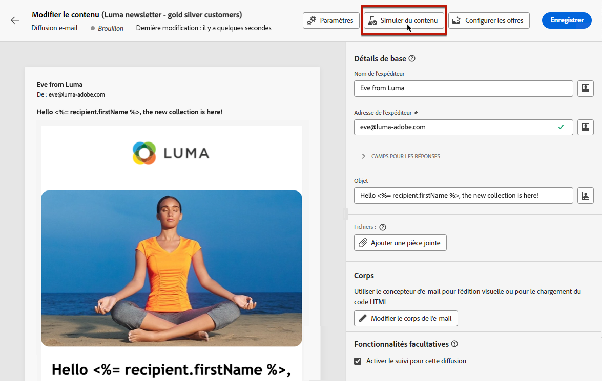
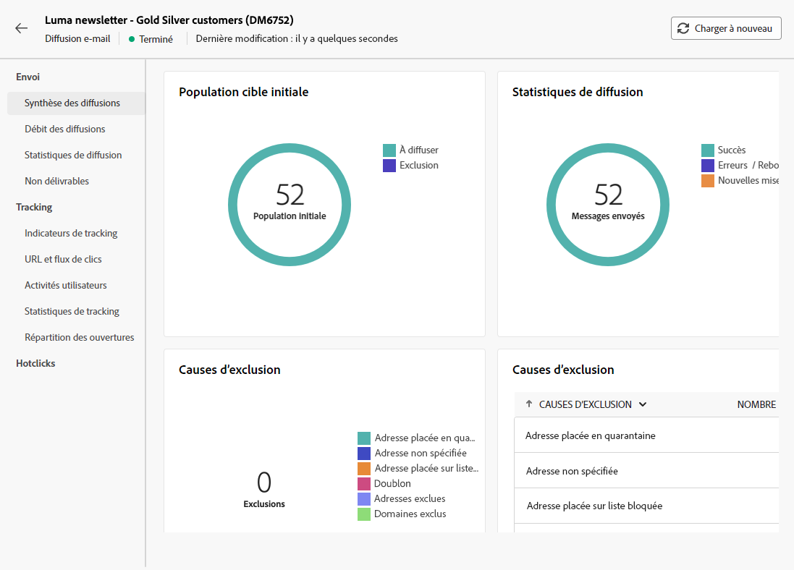

# Envoyer votre premier e-mail {#first-email}

Ce cas d’utilisation présente comment créer votre premier e-mail. Nous allons planifier l’envoi d’un e-mail à une date spécifique aux client(e)s de rang de fidélité argent et or. Cet e-mail sera conçu à l’aide d’un modèle prédéfini et comprendra une personnalisation utilisant les attributs du profil.

## Créer l’e-mail {#create-email}

>[!CONTEXTUALHELP]
>id="acw_deliveries_email_template_selection"
>title="Sélectionnez un modèle d’e-mail."
>abstract="Un modèle est défini dans la console Adobe Campaign v8. Il s’agit d’une configuration de diffusion spécifique qui contient des paramètres prédéfinis tels que les règles de typologie, la personnalisation ou les paramètres de routage."

>[!CONTEXTUALHELP]
>id="acw_deliveries_email_properties"
>title="Propriétés de l’e-mail"
>abstract="Les propriétés sont les paramètres de diffusion courants qui vous permettent de nommer et de classer votre diffusion. Si votre diffusion est basée sur un schéma étendu défini dans la console Adobe Campaign v8, des champs spécifiques d’**Options personnalisées** sont disponibles."

1. Créez une nouvelle diffusion à partir du menu **[!UICONTROL Diffusions]**.

1. Sélectionnez la **[!UICONTROL Email]** canal et modèle à utiliser, puis cliquez sur **[!UICONTROL Créer une diffusion]**.

   >[!NOTE]
   >
   >Un modèle est une configuration de diffusion spécifique qui a été enregistrée comme modèle afin d’être réutilisée. Les modèles de diffusion sont configurés par les utilisateurs et utilisatrices disposant des droits d’administration dans la console Adobe Campaign. [Découvrez comment utiliser les modèles de diffusion](https://experienceleague.adobe.com/docs/campaign/campaign-v8/campaigns/send/create-templates.html){target="_blank"}.

   

1. Indiquez un libellé pour l’e-mail et configurez les options supplémentaires en fonction de vos besoins :

   * **[!UICONTROL Nom interne]** : attribuez un identifiant unique à la diffusion,
   * **[!UICONTROL Dossier]** : stockez la diffusion dans un dossier spécifique,
   * **[!UICONTROL Code de diffusion]** : utilisez ce champ pour organiser vos diffusions selon votre propre convention de nommage,
   * **[!UICONTROL Description]** : spécifiez une description pour la diffusion,
   * **[!UICONTROL Nature]** : indiquez la nature de l’e-mail à des fins de classification.<!--The content of the list is defined in the delivery template selected when creating the email.-->
   >[!NOTE]
   >
   >Si vous avez étendu votre schéma avec des champs personnalisés spécifiques, vous pouvez y accéder à partir de la section **[!UICONTROL Options personnalisées]**.

   

   En outre, les paramètres avancés (règle de typologie, mappings de ciblage, etc.) sont disponibles à partir du bouton situé près du nom de la diffusion. Ils sont prédéfinis dans le modèle sélectionné lors de la création de l’e-mail. Vous pouvez les modifier si nécessaire.

## Créer le contenu de l’e-mail {#create-content}

>[!CONTEXTUALHELP]
>id="acw_homepage_card3"
>title="Découvrez comment concevoir le contenu de vos e-mails à l’aide du Concepteur d’e-mail."
>abstract="Découvrez comment concevoir votre contenu."

Dans ce cas d’utilisation, nous allons concevoir l’e-mail à l’aide d’un modèle prédéfini. Des informations détaillées sur la configuration du contenu d’un e-mail sont disponibles dans [cette section](../content/edit-content.md).

1. Cliquez sur le bouton **[!UICONTROL Modifier le contenu]** pour commencer à créer le contenu de l’e-mail.

   Cet écran vous permet de configurer le contenu de l’e-mail et de le concevoir à l’aide du Concepteur d’e-mail.

   

1. Indiquez l’objet de l’e-mail et personnalisez-le à l’aide de l’éditeur d’expression. [Découvrez comment personnaliser du contenu](../personalization/personalize.md).

   

1. Cliquez sur le bouton **[!UICONTROL Modifier le corps de l’e-mail]** pour créer et concevoir le contenu de l’e-mail.

   Sélectionnez la méthode à utiliser pour créer le contenu de l’e-mail. Dans cet exemple, nous allons utiliser un modèle de conception existant.

   

<!--1. Select the HTML or ZIP file to import then click **[!UICONTROL Next]**.

    If your folder contains assets, choose the instance and folder where they should be stored then click **[!UICONTROL Import]**. (+ link to doc on assets?)

    -->

1. Une fois le modèle sélectionné, il s’affiche dans le Concepteur d’e-mail. Vous pouvez ainsi l’éditer si nécessaire et le personnaliser.

   Dans cet exemple, nous allons personnaliser le titre de l’e-mail. Pour ce faire, sélectionnez le bloc de composant, puis cliquez sur **[!UICONTROL Ajouter la personnalisation]**.

   

1. Une fois votre contenu prêt, enregistrez et fermez votre conception, puis cliquez sur **[!UICONTROL Enregistrer]** pour revenir à l’écran de création d’email.

   

## Définir l’audience {#define-audience}

>[!CONTEXTUALHELP]
>id="acw_deliveries_email_audience"
>title="Définir l’audience"
>abstract="Sélectionnez l’audience la plus appropriée pour votre message marketing. Vous pouvez choisir une audience existante déjà définie dans une instance de Campaign v8 ou dans Adobe Experience Platform ou choisir de créer une audience à l’aide du créateur de règles."

Dans ce cas d’utilisation, nous allons envoyer l’e-mail à une audience existante. Pour plus d’informations sur l’utilisation des audiences, reportez-vous à [cette section](../audience/about-audiences.md).

1. Cliquez sur le bouton **[!UICONTROL Sélectionner une audience]**, puis choisissez une audience existante à cibler.

   Dans cet exemple, nous allons utiliser une audience existante ciblant des client(e)s appartenant aux niveaux de points de fidélité argent et or.

   

   >[!NOTE]
   >
   >Les audiences disponibles dans la liste proviennent de votre instance Campaign V8 ou de Adobe Experience Platform si l’intégration de destination/source a été configurée sur votre instance.
   >
   >L’intégration Destination/Sources vous permet d’envoyer des segments Experience Platform vers Adobe Campaign et d’envoyer des logs de diffusion et de suivi Campaign à Adobe Experience Platform. [Découvrez comment utiliser Campaign et Adobe Experience Platform](https://experienceleague.adobe.com/docs/campaign/campaign-v8/connect/ac-aep.html){target="_blank"}.

1. Une fois votre audience sélectionnée, vous pouvez affiner la cible à l’aide de règles supplémentaires.

   Vous pouvez également définir une population témoin afin d’analyser le comportement des destinataires de l’e-mail par rapport au comportement des profils qui n’ont pas été ciblés. [Découvrez comment travailler avec les populations témoins.](../audience/control-group.md)

   

## Planifier l’envoi {#schedule}

>[!CONTEXTUALHELP]
>id="acw_deliveries_email_schedule"
>title="Planifier l’envoi"
>abstract="Définissez la date et l’heure exactes de votre envoi. En choisissant l’heure la plus appropriée pour votre message marketing, vous maximisez les taux d’ouverture."

Pour planifier l’envoi de l’e-mail, cliquez sur **[!UICONTROL Activer]**, puis indiquez la date et l’heure de votre choix pour l’envoi.

Par défaut, la variable **[!UICONTROL Confirmer avant envoi]** est activée, ce qui signifie que vous devez confirmer l’envoi pour permettre l’envoi de l’email à la date et à l’heure spécifiées. Désactivez cette option pour permettre l’envoi de l’e-mail à la date et à l’heure planifiées, sans confirmation nécessaire.

## Prévisualiser et tester l’e-mail {#preview-test}

Une fois votre e-mail prêt, vous pouvez le prévisualiser et le tester avant de lancer son envoi.

Dans ce cas pratique, nous allons prévisualiser l&#39;email et envoyer des BAT à des adresses email spécifiques tout en empruntant l&#39;identité de certains des profils ciblés.

Des informations supplémentaires sur la prévisualisation et le test des e-mails sont disponibles dans [cette section](../preview-test/preview-test.md).

1. Cliquez sur **[!UICONTROL Vérifier et envoyer]**. Un aperçu de votre e-mail s’affiche, ainsi que toutes les propriétés, l’audience et le planning configurés. Vous pouvez éditer chacun de ces éléments à partir du bouton Modifier.

1. Cliquez sur le bouton **[!UICONTROL Simuler le contenu]** pour prévisualiser l’e-mail et envoyer les BAT.

   

1. Dans la zone de gauche, sélectionnez le ou les profils à utiliser pour prévisualiser l’e-mail.

1. Un aperçu de l’e-mail s’affiche dans le volet de droite en fonction du profil sélectionné. Si vous avez ajouté plusieurs profils, vous pouvez passer d’un profil à l’autre pour prévisualiser l’e-mail correspondant.

   

   <!-- !NOTE
    >
    >Additionally, the **[!UICONTROL Render email]** button allows you to preview the email using mutiple devices or mail providers. Learn on how to preview email rendering-->

1. Pour envoyer des bons à tirer de votre email, cliquez sur le bouton **[!UICONTROL Test]** puis sélectionnez le mode à utiliser pour envoyer vos BAT.

   Dans cet exemple, nous allons utiliser le mode Substituer de la cible principale, ce qui signifie que nous enverrons des BAT à des adresses email spécifiques tout en empruntant l&#39;identité de certains des profils ciblés par la diffusion.

   

1. Cliquez sur Ajouter une adresse, puis indiquez la ou les adresses électroniques qui recevront les bons à tirer.

   Pour chaque adresse email, sélectionnez le profil de la cible à emprunter. Vous pouvez également laisser Adobe Campaign sélectionner un profil aléatoire à partir de la cible.

   

1. Cliquez sur **[!UICONTROL Envoyer un e-mail de test]**, puis confirmez l’envoi.

   Les BAT sont envoyés aux adresses email spécifiées à l’aide du profil sélectionné, avec la variable **[Bon à tirer x]** préfixe.

   

   Vous pouvez vérifier à tout moment l&#39;état de l&#39;envoi et accéder aux BAT envoyés en cliquant sur le bouton **[!UICONTROL Afficher le journal des emails de test]** dans l’écran simuler le contenu.

## Envoyer et surveiller l’e-mail {#prepare-send}

Une fois que vous avez validé et testé votre e-mail, vous pouvez lancer sa préparation et l’envoyer.

1. Cliquez sur **[!UICONTROL Préparer]** pour lancer la préparation du message. [Découvrez comment préparer un e-mail](../monitor/prepare-send.md).

   

1. Une fois que votre email est prêt à être envoyé, cliquez sur **[!UICONTROL Envoyer]** ou **[!UICONTROL Envoyer comme prévu]** confirmez ensuite l’envoi.

1. Une fois l&#39;envoi de votre email commencé, immédiatement ou à la date planifiée, vous pouvez suivre son envoi en temps réel dans cet écran, avec des statistiques.

   

   >[!NOTE]
   >
   >En outre, le bouton **[!UICONTROL Logs]** permet d’accéder à des informations détaillées sur l’envoi de l’e-mail. [Découvrez comment surveiller les logs de diffusion](../monitor/delivery-logs.md).

1. Une fois l’e-mail envoyé, vous pouvez accéder aux rapports à des fins d’analyse plus approfondie. [Découvrez comment utiliser les rapports](../reporting/reports.md)
   
