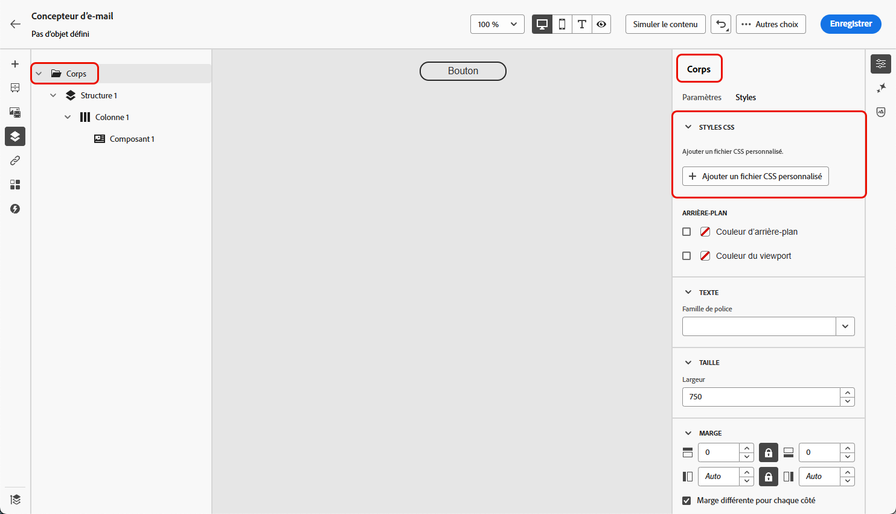
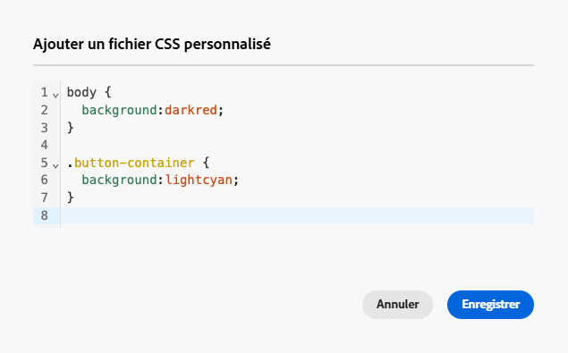
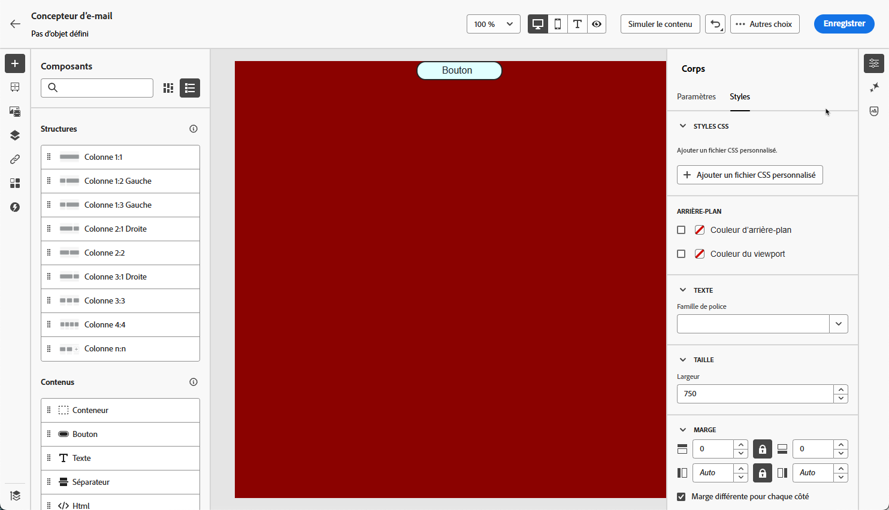

# Ajouter du CSS personnalisé au contenu de votre e-mail {#email-metadata}

>[!CONTEXTUALHELP]
>id="ac_edition_css"
>title="Saisir votre propre CSS"
>abstract="Pour plus de flexibilité et de contrôle sur l’apparence de votre contenu, vous pouvez ajouter du CSS personnalisé directement dans le concepteur d’e-mail pour appliquer un style avancé et spécifique."

Lors de la conception de vos e-mails, vous pouvez ajouter votre propre CSS personnalisé directement dans le [concepteur d’e-mail](get-started-email-designer.md). Cette fonctionnalité vous permet d’appliquer un style avancé et spécifique, pour une plus grande flexibilité et un meilleur contrôle de l’aspect de votre contenu.

## Définir un CSS personnalisé {#define-custom-css}

Pour ajouter un CSS personnalisé au contenu de votre e-mail, procédez comme suit.

1. Vérifiez qu’il y a du contenu défini dans le concepteur d’e-mail en ajoutant au moins un [composant](content-components.md).

1. Sélectionnez **[!UICONTROL Corps]** dans l’**[!UICONTROL arborescence de navigation]** à gauche, ou en haut du volet de droite. La section **[!UICONTROL Styles CSS]** s’affiche à droite.

   {width="85%"}.

   >[!NOTE]
   >
   >La section **[!UICONTROL Styles CSS]** n’est disponible que lorsqu’il y a déjà du contenu dans l’éditeur.

1. Cliquez sur le bouton **[!UICONTROL Ajouter un fichier CSS personnalisé]**.

   >[!NOTE]
   >
   >Le bouton **[!UICONTROL Ajouter un code CSS personnalisé]** n’est disponible que si **[!UICONTROL Corps]** est sélectionné. Cependant, vous pouvez appliquer des styles CSS personnalisés à l’ensemble des composants de votre contenu.

1. Saisissez votre code CSS dans la zone de texte qui s’affiche. Vérifiez que le CSS personnalisé est valide et qu’il suit la syntaxe appropriée. [En savoir plus](#use-valid-css)

   {width="65%"}.

1. Enregistrez votre CSS personnalisé et vérifiez qu’il est correctement appliqué à votre contenu. Si ce n’est pas le cas, consultez la section [Dépannage](#troubleshooting).

   {width="85%"}.

1. Si vous supprimez l’ensemble du contenu, la section disparaît et le CSS personnalisé défini précédemment ne s’applique plus.

1. Ajoutez à nouveau du contenu à l’éditeur pour que la section **[!UICONTROL styles CSS]** réapparaisse. Le CSS personnalisé s’applique à nouveau.

## Utiliser un CSS valide {#use-valid-css}

Vous pouvez saisir n’importe quelle chaîne CSS valide dans la zone de texte **[!UICONTROL Ajouter un fichier CSS personnalisé]**. Un CSS correctement formaté s’applique immédiatement au contenu.

>[!CAUTION]
>
>Les utilisateurs et utilisatrices sont responsables de la sécurité de leur CSS personnalisé. Assurez-vous que votre CSS n’introduit pas de vulnérabilités ou de conflits avec le contenu existant.
>
>Évitez d’utiliser du CSS qui pourrait altérer involontairement la disposition ou la fonctionnalité du contenu.

+++ Exemples de CSS

Vous trouverez ci-dessous des exemples de CSS valide.

```css
.acr-component[data-component-id="form"] {
  display: flex;
  justify-content: center;
  background: none;
}

.acr-Form {
  width: 100%;
  padding: 20px 100px;
  border-spacing: 0px 8px;
  box-sizing: border-box;
  margin: 0;
}

.acr-Form .spectrum-FieldLabel {
  width: 20%;
}

.acr-Form.spectrum-Form--labelsAbove .spectrum-FieldLabel,
.acr-Form [data-form-item="checkbox"] .spectrum-FieldLabel {
  width: auto;
}

.acr-Form .spectrum-Textfield {
  width: 100%;
}

#acr-form-error,
#acr-form-confirmation {
  width: 100%;
  padding: var(--spectrum-global-dimension-static-size-500);
  display: flex;
  align-items: center;
  flex-direction: column;
  justify-content: center;
  gap: var(--spectrum-global-dimension-static-size-200);
}

.spectrum-Form-item.is-required .spectrum-FieldLabel:after{
  content: '*';
  font-size: 1.25rem;
  margin-left: 5px;
  position: absolute;
}

/* Error field placeholder */
.spectrum-HelpText {
  display: none !important;
}

.spectrum-HelpText.is-invalid,
.is-invalid ~ .spectrum-HelpText {
  display: flex !important;
}
```

```css
@media only screen and (min-width: 600px) {
  .acr-paragraph-1 {
    width: 100% !important;
  }
}
```

+++

Si vous saisissez un CSS non valide, un message d’erreur s’affiche, indiquant que le CSS ne peut pas être enregistré. Vous trouverez ci-dessous des exemples de CSS non valide.

+++ Exemples de CSS non valide

Vous ne pouvez pas utiliser de balises `<style>` :

```html
<style type="text/css">
  .acr-Form {
    width: 100%;
    padding: 20px 100px;
    border-spacing: 0px 8px;
    box-sizing: border-box;
    margin: 0;
  }
</style>
```

Vous ne pouvez pas utiliser de syntaxe non valide, telle que des accolades manquantes :

```css
body {
  background: red;
```

+++

## Implémentation technique {#implementation}

Votre CSS personnalisé est ajouté à la fin de la section `<head>` dans le cadre d’une balise `<style>` avec l’attribut `data-name="global-custom"`, comme dans l’exemple ci-dessous. Cela permet de s’assurer que les styles personnalisés s’appliquent globalement au contenu.

+++ Voir l’exemple 

```html
<!DOCTYPE html>
<html>
  <head>
    <meta charset="utf-8">
    <meta name="content-version" content="3.3.31">
    <meta name="x-apple-disable-message-reformatting">
    <meta name="viewport" content="width=device-width,initial-scale=1.0">
    <style data-name="default" type="text/css">
      td { padding: 0; }
      th { font-weight: normal; }
    </style>
    <style data-name="grid" type="text/css">
      .acr-grid-table { width: 100%; }
    </style>
    <style data-name="acr-theme" type="text/css" data-theme="default" data-variant="0">
      body { margin: 0; font-family: Arial; }
    </style>
    <style data-name="media-default-max-width-500px" type="text/css">
      @media screen and (max-width: 500px) {
        body { width: 100% !important; }
      }
    </style>
    <style data-name="global-custom" type="text/css">
      /* Add you custom CSS here */
    </style>
  </head>
  <body>
    <!-- Minimal content -->
  </body>
</html>
```

+++

Le CSS personnalisé n’est pas interprété ni validé par le volet **[!UICONTROL Paramètres]** du concepteur d’e-mail. Il est entièrement indépendant et ne peut être modifié que par l’intermédiaire de l’option **[!UICONTROL Ajouter un fichier CSS personnalisé]**.

<!--
If the `global-custom` style tag has the attribute `data-disabled` set to `true`, the custom CSS will not be applied. 

+++ See sample

For example:

```html
<style data-name="global-custom" type="text/css" data-disabled="true"> body: { color: red; } </style>
```

+++
-->

## Mécanismes de sécurisation : contenu importé

Si vous souhaitez utiliser un CSS personnalisé avec du contenu importé dans le concepteur d’e-mail, tenez compte des points suivants :

* Si vous importez du contenu HTML externe qui inclut du CSS, à moins de le convertir, il se trouve en **[!UICONTROL mode de compatibilité]**, où la section **[!UICONTROL Styles CSS]** n’est pas disponible. [En savoir plus sur l’import de contenu existant](existing-content.md)

* Si vous importez du contenu créé avec le concepteur d’e-mail, y compris le CSS appliqué via l’option **[!UICONTROL Ajouter un fichier CSS personnalisé]**, le CSS précédemment appliqué sera visible et modifiable à partir de la même option.

<!--
* If importing content created with the Email Designer with CSS applied externally, the CSS code previously applied cannot be accessed within the **[!UICONTROL Add custom CSS]** pop-up window, but you can still override it with new custom CSS.-->

## Résolution des problèmes {#troubleshooting}

Si votre CSS personnalisé ne s’applique pas, envisagez les options ci-dessous.

* Assurez-vous que votre CSS est valide et ne comporte pas d’erreurs de syntaxe (telles que des accolades manquantes, des noms de propriété incorrects, etc.). [Voici comment procéder](#use-valid-css)

* Assurez-vous que votre CSS est ajouté à la balise `<style>` avec l’attribut `data-name="global-custom"`.

* Vérifiez si la balise de style `global-custom` a l’attribut `data-disabled` défini sur `true`. Si c’est le cas, le CSS personnalisé n’est pas appliqué.

  +++Par exemple :

  ```html
  <style data-name="global-custom" type="text/css" data-disabled="true"> body: { color: red; } </style>
  ```

  +++

* Assurez-vous que votre CSS n’est pas remplacé par d’autres règles CSS.

   * Utilisez les outils de développement de votre navigateur pour inspecter le contenu et vérifier que votre CSS cible les sélecteurs corrects.

   * Pensez à ajouter `!important` à vos déclarations pour vous assurer qu’elles sont prioritaires.

     +++ Par exemple :

     ```css
     .acr-Form {
       background: red !important;
     }
     ```

     +++
