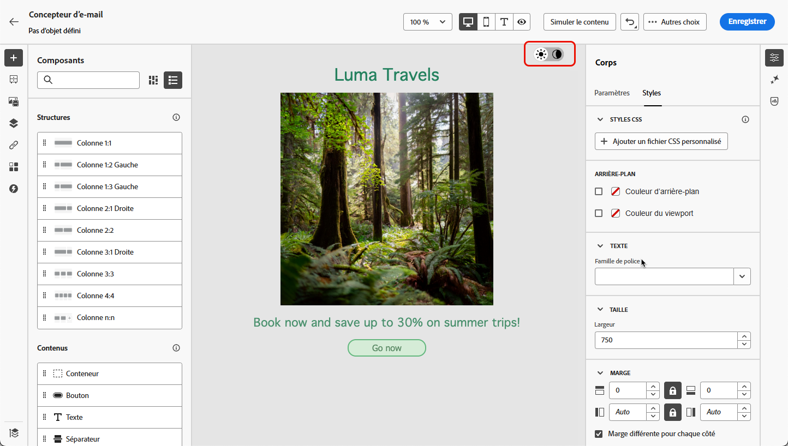
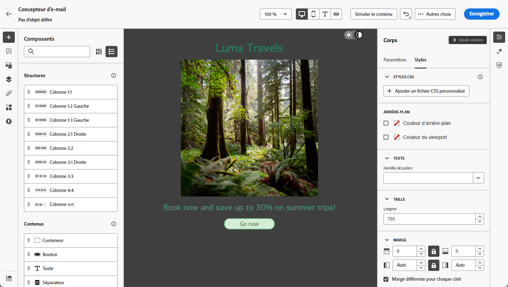
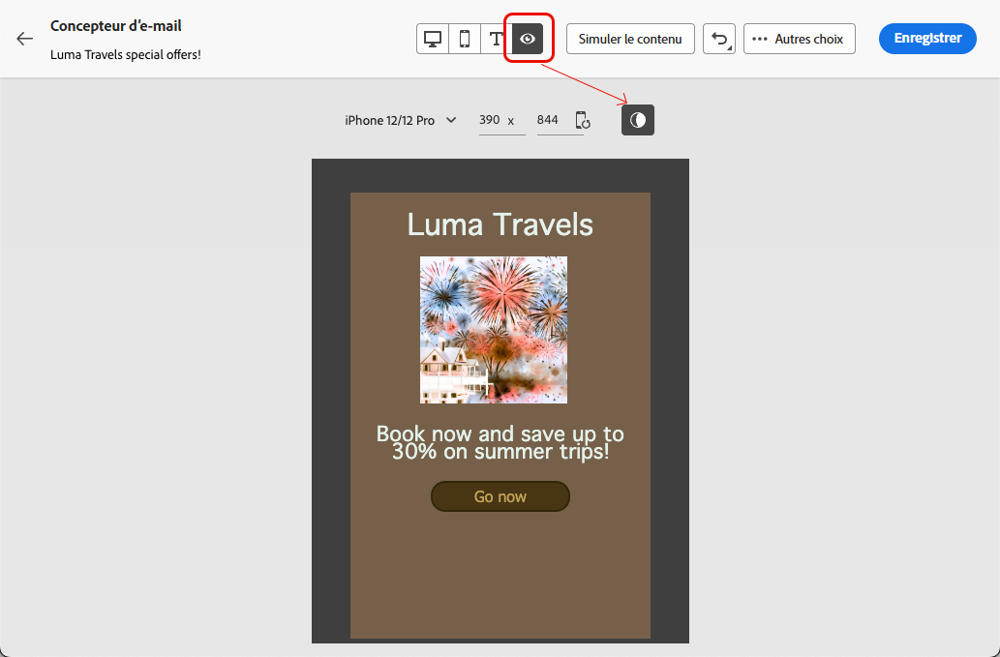

# Gérer le contenu en mode sombre {#dark-mode}

>[!CONTEXTUALHELP]
>id="ac_edition_darkmode"
>title="Basculer vers le mode sombre"
>abstract="Basculez vers le mode sombre pour prévisualiser le rendu et définir des paramètres personnalisés spécifiques.  Le rendu final dépend du client de messagerie de la personne destinataire. Notez que tous les clients de messagerie ne prennent pas en charge le mode sombre personnalisé."

>[!CONTEXTUALHELP]
>id="ac_edition_darkmode_preview"
>title="Basculer vers le mode sombre"
>abstract="Basculez vers le mode sombre pour prévisualiser le rendu sur les clients de messagerie pris en charge.  Le rendu final dépend du client de messagerie de la personne destinataire. Notez que tous les clients de messagerie ne prennent pas en charge le mode sombre."

Lors de la conception de vos e-mails, le [!DNL Adobe Campaign] [Email Designer](get-started-email-designer.md) vous permet de passer à la vue **[!UICONTROL Mode sombre]**.

Dans cette vue en mode sombre <!--Email Designer -->, vous pouvez également définir des paramètres personnalisés spécifiques qui seront affichés par les clients de messagerie de support lorsque leur mode sombre est activé.

## Qu’est-ce que le mode sombre ? {#what-is-dark-mode}

La manière dont le mode sombre est rendu dans les différents clients de messagerie est complexe. Définissons d’abord le mode sombre.

Le mode sombre permet aux clients de messagerie et aux applications de prise en charge d’afficher les e-mails avec des arrière-plans plus sombres et des couleurs plus claires pour le texte, les boutons et d’autres éléments de l’interface utilisateur. Il permet de réduire la fatigue visuelle, d’économiser l’autonomie de la batterie et d’améliorer la lisibilité dans les environnements peu éclairés pour une expérience de visionnage plus confortable.

En tant que tendance croissante sur les principaux systèmes d’exploitation et applications<!-- (Apple Mail, Gmail, Outlook, Twitter, Slack)--> il est devenu une considération importante dans la conception d’e-mails modernes afin de s’assurer que le contenu reste lisible et visuellement attrayant pour tous les utilisateurs et utilisatrices.

## Mécanismes de sécurisation {#guardrails}

Les attentes en termes de rendu en mode sombre doivent être considérées avec précaution, car la façon dont elles sont appliquées par les différents clients de messagerie peut varier considérablement.

<!--The dark mode final rendering depends on the recipient's email client. It is not possible to guarantee that your email will look the same in dark mode across all devices.-->

Avant d’utiliser le mode sombre dans le Designer de messagerie [!DNL Adobe Campaign], il est essentiel de comprendre comment les principaux clients de messagerie le gèrent. Il existe trois cas à distinguer :

<!--
* Check out the list of [email clients supporting dark mode](https://www.caniemail.com/search/?s=dark){target="_blank"}

* Learn more on Dark mode in this [Litmus blog post](https://www.litmus.com/blog/the-ultimate-guide-to-dark-mode-for-email-marketers){target="_blank"}
-->

### Clients ne prenant pas en charge le mode sombre {#not-supporting}

Certains clients de messagerie ne prennent pas du tout en charge cette fonctionnalité, tels que :

* Yahoo!Mail
* AOL

Que vous définissiez des paramètres personnalisés en mode sombre ou non dans le Designer Email, ces clients de messagerie n’affichent jamais de rendu en mode sombre. <!--Regardless of whether the interface is in light or dark mode, your email will render the same.-->

### Clients appliquant leur propre mode sombre {#default-support}

Certains clients de messagerie appliquent systématiquement leur propre mode sombre par défaut pour tous les e-mails reçus. Couleurs, fonds, images, etc. sont automatiquement ajustés avec les paramètres du mode sombre spécifiques au client de messagerie, ce qui signifie qu’aucune modification externe n’est possible.

<!--It is important to note that less than 25% of email clients offer customization options for dark mode. Clients such as Gmail implement their own dark mode rendering, which is not subject to external modification.-->

Ces clients sont par exemple :

* Gmail (messagerie de bureau, iOS, Android, messagerie web mobile)
* Fenêtres Outlook
* Outlook Windows Mail

Dans ce cas, si vous définissez des paramètres de mode sombre personnalisés dans le Designer Email, ces paramètres sont remplacés par les paramètres du client de messagerie.

Il est important de comprendre que ces clients de messagerie gèrent le mode sombre, mais votre conception de mode sombre spécifique ne sera pas rendue.

### Clients prenant en charge le mode sombre personnalisé {#custom-support}

D’autres clients de messagerie offrent la possibilité de rendre le mode sombre personnalisé avec la requête `@media (prefers-color-scheme: dark)`, qui est la méthode utilisée par le Designer de messagerie [!DNL Journey Optimizer].

Voici une liste des principaux clients gérant cette option :

* Apple Mail macOS
* Apple Mail iOS
* MacOS Outlook
* Outlook.com
* Outlook iOS
* Outlook Android

Dans ce cas, les paramètres spécifiques que vous définissez dans le Designer Email doivent être affichés.

>[!NOTE]
>
>Découvrez comment définir des paramètres de mode sombre personnalisés avec le Designer Email dans [cette section](#define-custom-dark-mode).

Cependant, certaines restrictions peuvent s’appliquer en fonction de chaque client de messagerie. Par exemple, certains clients tels qu’Apple Mail 16 (macOs 13) ne généreront pas de mode sombre si des images sont présentes dans le contenu de l’e-mail.

Pour des résultats optimaux, testez votre contenu avec les clients de messagerie que vous ciblez. Pour voir une simulation qui se rapproche le plus possible du résultat final pour chaque client, utilisez l’option [Rendu des emails](../preview-test/email-rendering.md) dans le Designer d’emails.

## Mode sombre dans le Designer Email {#dark-mode-email-designer}

Lorsqu&#39;il s&#39;agit du mode sombre dans le Designer Email, deux aspects doivent être pris en compte :

* Vous pouvez obtenir un aperçu de la manière dont le mode sombre par défaut s’affichera dans la plupart des clients de messagerie de prise en charge. [En savoir plus](#preview-dark-mode)

* Si vous souhaitez remplacer les paramètres par défaut des clients de messagerie [prise en charge du mode sombre personnalisé](#custom-support), vous pouvez définir des paramètres personnalisés pour l’e-mail que vous modifiez. [En savoir plus](#define-custom-dark-mode)

### Aperçu du mode sombre par défaut {#preview-dark-mode}

Pour accéder au mode sombre dans le Designer Email et obtenir un aperçu des paramètres par défaut du mode sombre, procédez comme suit.

1. Sur la page d&#39;accueil de Designer Email, sélectionnez l&#39;option **[!UICONTROL Créer en partant de zéro]**. [En savoir plus](create-email-content.md)

1. Ajoutez [structures](create-email-content.md) et [composants de contenu](content-components.md) à votre contenu.

1. En haut à droite de la zone de travail centrale, activez le bouton bascule en **[!UICONTROL mode sombre]**.

   

1. L’aperçu du mode sombre par défaut s’affiche.

   

Par défaut, l’aperçu du mode sombre d’Email Designer applique le modèle de couleurs « inverser toutes les couleurs » à tous les éléments, à l’exception des images et des icônes.

Cela signifie qu’il détecte les zones comportant des éléments clairs et sombres et les inverse, de sorte que les arrière-plans clairs deviennent sombres et que le texte sombre devient clair, tandis que les arrière-plans sombres deviennent clairs et que le texte clair devient sombre.

>[!CAUTION]
>
>Le rendu final peut varier en fonction du client de messagerie du destinataire. Pour voir une simulation qui se rapproche le plus possible du résultat final pour chaque client de messagerie, utilisez l’option [ Rendu des e-mails ](../preview-test/email-rendering.md).

### Définir le mode sombre personnalisé {#define-custom-dark-mode}

>[!CONTEXTUALHELP]
>id="ac_edition_darkmode_image"
>title="Utiliser une image spécifique pour le mode sombre"
>abstract="Vous pouvez sélectionner une autre image qui s’affichera lorsque le mode sombre sera activé.  L’ajout d’une image spécifique pour le mode sombre ne garantit pas qu’elle s’affichera correctement dans tous les clients de messagerie. Notez que tous les clients de messagerie ne prennent pas en charge le mode sombre personnalisé."

Après avoir basculé en **[!UICONTROL mode sombre]**, vous pouvez choisir de modifier des éléments de style spécifiques de votre contenu qui s’afficheront uniquement lorsque le mode sombre sera activé dans le client de messagerie du destinataire, à condition qu’il prenne en charge cette fonctionnalité.

>[!WARNING]
>
>Le rendu final en mode sombre dépend de chaque client de messagerie. Les résultats peuvent donc varier d&#39;un client à l&#39;autre. [En savoir plus](#guardrails)

<!--
>[!WARNING]
>
>Not all email clients support dark mode. Moreover, some email clients only apply their own default dark mode for all emails that are received. In both cases, the custom settings that you defined in the Email Designer cannot be rendered.-->

Pour tirer parti du style du mode sombre personnalisé Designer d’e-mail, Journey Optimizer utilise <!-- `@media (prefers-color-scheme: dark)` method--> `@media (prefers-color-scheme: dark)` requête CSS, qui détecte si le client de messagerie de l’utilisateur est en mode sombre et applique la conception avec thème sombre définie dans votre e-mail.

Pour définir les paramètres personnalisés du mode sombre, procédez comme suit.

1. Veillez à passer à l’aperçu **[!UICONTROL Mode sombre]** dans le Designer d’e-mail. [Voici comment procéder](#preview-dark-mode)

1. Modifiez les attributs de couleur de style, tels que le texte, les arrière-plans, le bouton, etc.

1. Vous ne pouvez pas modifier les couleurs des images et des icônes, mais vous pouvez définir des ressources spécifiques pour le mode sombre uniquement.

   Pour ce faire, sélectionnez une image. Passez en **[!UICONTROL mode sombre]** à l’aide du bouton dédié dans le volet **[!UICONTROL Paramètres]** et sélectionnez une autre ressource.

   

   <!---->

1. Vous pouvez à tout moment **[!UICONTROL Basculer vers la vue en direct]** afin de vérifier comment votre contenu peut s’afficher sur différentes tailles d’appareil. Dans cet affichage, sélectionnez le bouton (bascule) Mode sombre en haut de l’écran pour prévisualiser la version en mode sombre de votre contenu sur les différents appareils.

   {width="80%" align="center"}

   >[!CAUTION]
   >
   >L’aperçu en direct est un aperçu générique conçu pour comparer l’apparence du rendu sur différentes tailles d’appareil. Le rendu final peut varier en fonction du client de messagerie du destinataire.

1. Une fois que vous êtes satisfait des modifications pour le mode sombre, cliquez sur **[!UICONTROL Simuler du contenu]**.

   

1. Sélectionnez **[!UICONTROL Rendu d’e-mail]** et connectez-vous à votre compte Litmus. Vous pouvez voir le rendu final en mode sombre pour divers clients de messagerie. En savoir plus sur le [Rendu des emails](../preview-test/email-rendering.md).

   >[!WARNING]
   >
   >Bien que la simulation se rapproche beaucoup de la façon dont les e-mails apparaîtront en mode sombre, le rendu réel peut différer en raison de variations au niveau des fournisseurs de services de messagerie ou des paramètres au niveau de l’appareil.

## Bonnes pratiques {#best-practices}

À mesure que l’adoption du mode sombre augmente sur les principaux clients de messagerie, il est essentiel d’examiner le rendu de vos e-mails dans des environnements clairs et sombres, que vous utilisiez le [mode sombre personnalisé](#define-custom-dark-mode) ou non.

Le mode sombre peut modifier les couleurs, les arrière-plans et les images, parfois en remplaçant les choix de conception. Pour garantir la cohérence visuelle, l’accessibilité et l’intégrité de la marque, suivez les bonnes pratiques répertoriées ci-dessous.

**Optimiser vos images et logos**

* Enregistrez les logos et les icônes en tant que PNG avec des arrière-plans transparents pour éviter les zones blanches visibles en mode sombre.

* Évitez les images avec des fonds blancs ou clairs codés en dur.

* Si la transparence n&#39;est pas une option, placez les images sur un arrière-plan solide dans votre conception pour éviter les inversions de couleurs gênantes.

**Surveillez vos antécédents**

* Assurez-vous que le contraste entre le texte et les couleurs d’arrière-plan est suffisant pour garantir la lisibilité dans les modes clair et sombre.

* Évitez de vous fier uniquement aux couleurs de fond pour les contenus critiques. Certains clients remplacent les couleurs de fond en mode sombre, afin de s’assurer que les informations clés sont toujours visibles.

<!--**Inline critical styles**

Inline CSS helps maintain more control over styling, as some clients strip external styles in dark mode.-->

**Conception de contenu accessible en mode sombre**

<!--KEEP dark mode accessibility best practices IN ONE SINGLE LOCATION - for now listed on this page.
If needed, it can be moved to the Design accessible content page:
The best practices for designing accesible content in dark mode are listed in [this section](accessible-content.md#dark-mode).-->

* Utilisez des combinaisons de couleurs faciles à distinguer pour les personnes atteintes de daltonisme.

* Utilisez une palette de tons moyens pour garantir un contraste sur des fonds clairs et sombres.

* Utilisez des combinaisons de couleurs accessibles à fort contraste pour améliorer la lisibilité et respecter les normes WCAG (Web Content Accessibility Guidelines). Utilisez des outils tels que le vérificateur de contraste de WebAIM pour vérifier le contraste des couleurs.

* Évitez les polices légères, car elles peuvent avoir un impact sur la lisibilité. Si votre marque nécessite une police fine, mettez-la en gras en mode sombre.

* Ignorez le blanc pur sur le noir pur, car cela peut entraîner une fatigue oculaire et peut être automatiquement inversé par certains clients de messagerie.

* Fournissez un style de secours accessible si le mode sombre n’est pas pris en charge.

**Tester vos e-mails dans un environnement en mode sombre**

* Utilisez le Designer d’e-mail [aperçu en mode sombre](#preview-dark-mode) qui utilise des modèles de couleurs inversés pour repérer les problèmes dès le début.

* Utilisez l’option [Rendu des e-mails](../preview-test/email-rendering.md) qui utilise Litmus pour simuler vos conceptions sur les principaux clients de messagerie (Apple Mail, Gmail, Outlook) et voir comment les couleurs et les images se comportent en mode sombre.
