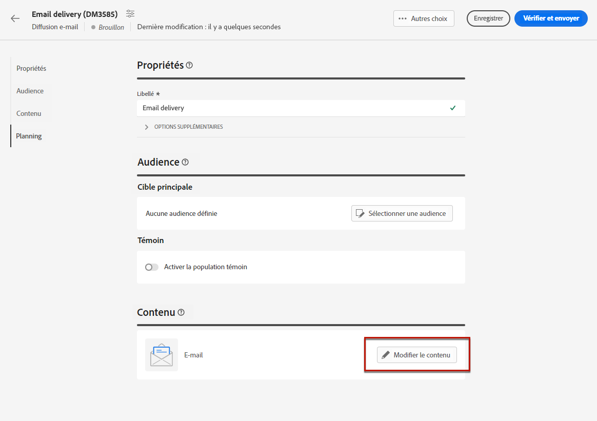
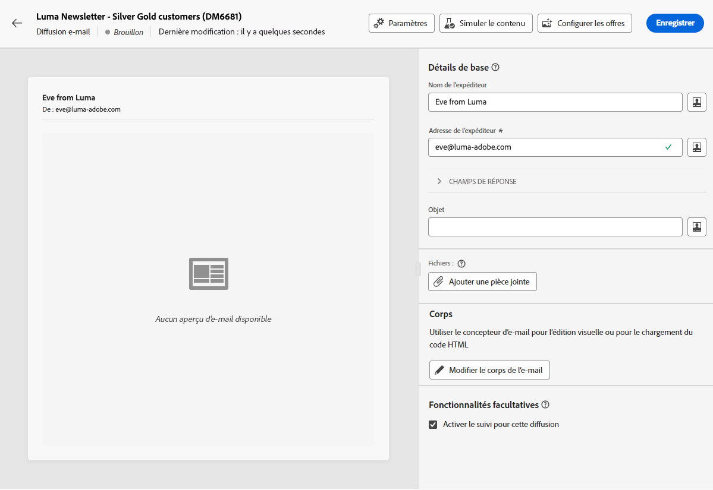
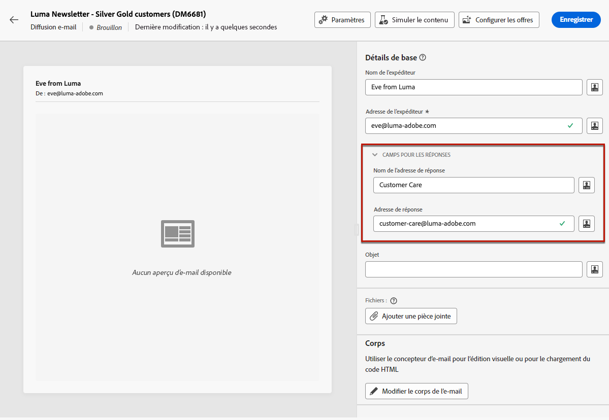

# Configurer le contenu de l’e-mail {#edit-content}

>[!CONTEXTUALHELP]
>id="acw_deliveries_email_content"
>title="Définir le contenu de l’e-mail"
>abstract="L’écran **Modifier le contenu** vous permet de définir les éléments de base de votre message, tels que l’adresse de la personne expéditrice et l’objet, d’effectuer des actions supplémentaires, telles que l’ajout de pièces jointes ou d’offres, et d’accéder au concepteur d’e-mail pour peaufiner l’aspect de votre message."

>[!CONTEXTUALHELP]
>id="acw_deliveries_email_header"
>title="Définir les propriétés de l’e-mail"
>abstract="La section **Détails de base** vous permet de mettre à jour l’adresse de la personne expéditrice et l’adresse de réponse, puis de définir l’objet à l’aide de l’éditeur d’expression."

>[!CONTEXTUALHELP]
>id="acw_deliveries_email_attachment"
>title="Joindre des fichiers à un e-mail"
>abstract="Sélectionnez un ou plusieurs fichiers à insérer dans votre message. Pour éviter tout problème de performances, il est recommandé de ne pas inclure plusieurs pièces jointes par e-mail."

>[!CONTEXTUALHELP]
>id="acw_deliveries_email_options"
>title="Modifier le tracking"
>abstract="Par défaut, le tracking est activé pour la diffusion, ce qui signifie que tous les liens inclus dans le contenu du message sont suivis. Vous pouvez désactiver cette option à partir d’ici."
>additional-url="https://experienceleague.adobe.com/fr/docs/campaign-web/v8/content/email-design/design-content/message-tracking" text="Ajouter des liens et suivre les messages"

La fenêtre **[!UICONTROL Modifier le contenu]** de l’e-mail vous permet d’effectuer les opérations suivantes :

* Définir des éléments de base de votre message, tels que l’adresse de l’expéditeur et l’objet.
* Effectuer des actions supplémentaires telles que l’ajout de pièces jointes ou la configuration d’offres.
* Accéder au [concepteur d’e-mail](get-started-email-designer.md#start-authoring) pour commencer à créer le contenu de votre e-mail.
* Ajoutez des variantes linguistiques à vos diffusions. [En savoir plus](../msg/multilingual.md)

>[!NOTE]
>
>Tous les champs de texte modifiables de cet écran peuvent être remplis à l’aide de champs de personnalisation. [Découvrez comment personnaliser le contenu.](../personalization/personalize.md)

## Configurer la diffusion

Pour configurer ou modifier le contenu d’un e-mail, procédez comme suit.

1. Cliquez sur le bouton **[!UICONTROL Modifier le contenu]** à partir de la fenêtre [tableau de bord de diffusion des e-mails](../email/create-email.md).

   {zoomable="yes"}

1. La fenêtre de modification du contenu de l’e-mail s’ouvre.

   {zoomable="yes"}

   >[!NOTE]
   >
   >Si vous configurez un nouvel e-mail, les champs **[!UICONTROL Nom de la personne expéditrice]** et **[!UICONTROL Adresse e-mail de la personne expéditrice]** sont déjà renseignés.

1. Le champ **[!UICONTROL Nom de l’expéditeur]** est défini dans le modèle d’e-mail. Si vous voulez le modifier, utilisez un nom facilement identifiable par les destinataires, tel que le nom de votre marque, pour augmenter le taux d’ouverture de vos diffusions.

   >[!NOTE]
   >
   >Pour améliorer davantage l’expérience des destinataires, vous pouvez ajouter le nom d’une personne, par exemple « Eve de Luma ».

1. Le champ **[!UICONTROL Adresse e-mail de l’expéditeur]** est également défini dans le modèle d’e-mail. Assurez-vous que le domaine de l’adresse est identique au sous-domaine délégué à Adobe.

   >[!NOTE]
   >
   >Vous pouvez modifier la partie qui précède le signe « @ », mais pas l’adresse du domaine.

1. Développez la section **[!UICONTROL Champs de réponse]**. Le nom et l’adresse de la personne expéditrice sont utilisés par défaut pour les réponses. Adobe recommande toutefois d’utiliser une adresse réelle existante, telle que l’assistance clientèle de votre marque. Ainsi, si une personne destinataire envoie une réponse, l’assistance clientèle sera en mesure de la traiter.

   {zoomable="yes"}

1. Définissez l’**[!UICONTROL Objet]** de l’e-mail. Saisissez directement l’objet dans le champ dédié ou ouvrez l’éditeur d’expression pour ajouter des éléments de [personnalisation](../personalization/personalize.md) à l’aide de divers attributs, fragments d’expression ou offres.

1. Si vous souhaitez joindre un fichier à l’e-mail, cliquez sur le bouton **[!UICONTROL Ajouter une pièce jointe]** puis sélectionnez un ou plusieurs fichiers.

   >[!NOTE]
   >
   >Pour éviter tout problème de performances, il est recommandé de ne pas inclure plusieurs pièces jointes par e-mail.

   <!--limitation on size + number of files?-->

1. Si vous souhaitez envoyer des offres par e-mail, sélectionnez-les à l’aide du bouton **[!UICONTROL configurer les offres]**.

   Vous pouvez ensuite les insérer dans l’e-mail à l’aide des champs de personnalisation. [Découvrez comment envoyer des offres.](../msg/offers.md)

## Modifier le corps de l’e-mail

1. Cliquez sur le bouton **[!UICONTROL Modifier le corps de l’e-mail]** pour organiser et concevoir le contenu de l’e-mail en utilisant le [Concepteur d’e-mail](get-started-email-designer.md#start-authoring).

   >[!NOTE]
   >
   >Vous pouvez également pointer sur l’aperçu de l’e-mail et sélectionner **[!UICONTROL Ouvrir le concepteur d’e-mail]**.

   Des informations supplémentaires sur la conception de contenu d’e-mail sont disponibles dans les sections suivantes :

   * [Rédiger des e-mails à partir de zéro](create-email-content.md)
   * [Donner un style à votre contenu](get-started-email-style.md)

1. Par défaut, le tracking est activé pour la diffusion. Vous pouvez désactiver cette option dans la section **[!UICONTROL Fonctionnalités facultatives]**. [Découvrez comment ajouter des liens et gérer le tracking.](message-tracking.md)

1. Une fois le contenu de votre e-mail défini, cliquez sur le bouton **[!UICONTROL Simuler du contenu]** pour vérifier la manière dont il s’affichera avant de l’envoyer. [Découvrez comment prévisualiser et tester votre e-mail.](../preview-test/preview-test.md)
