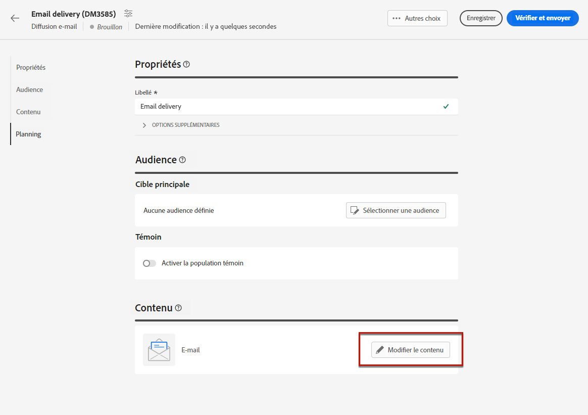
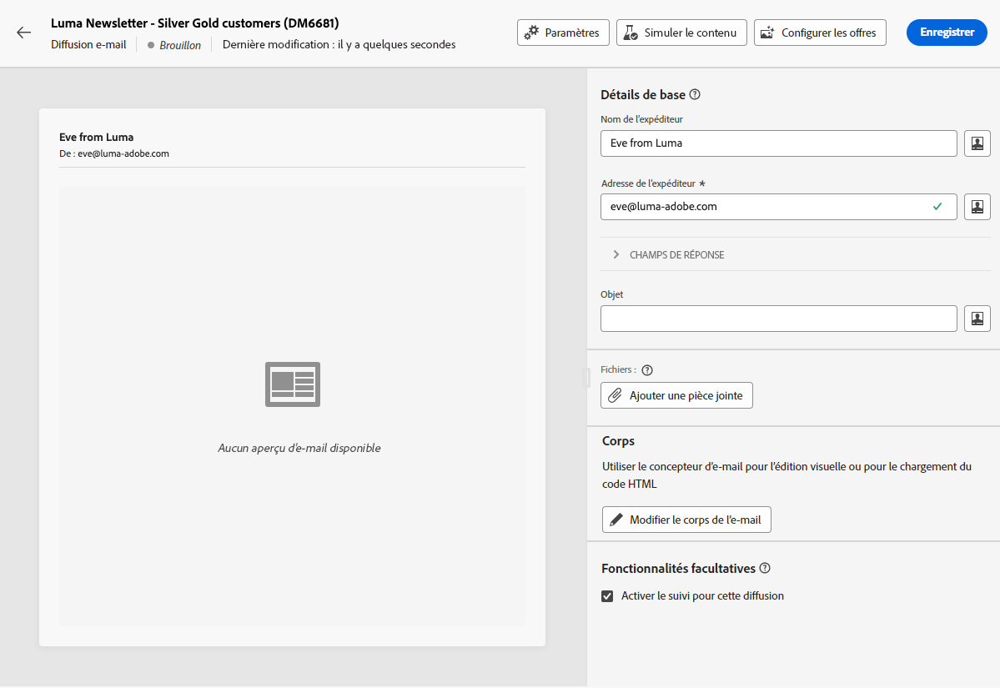
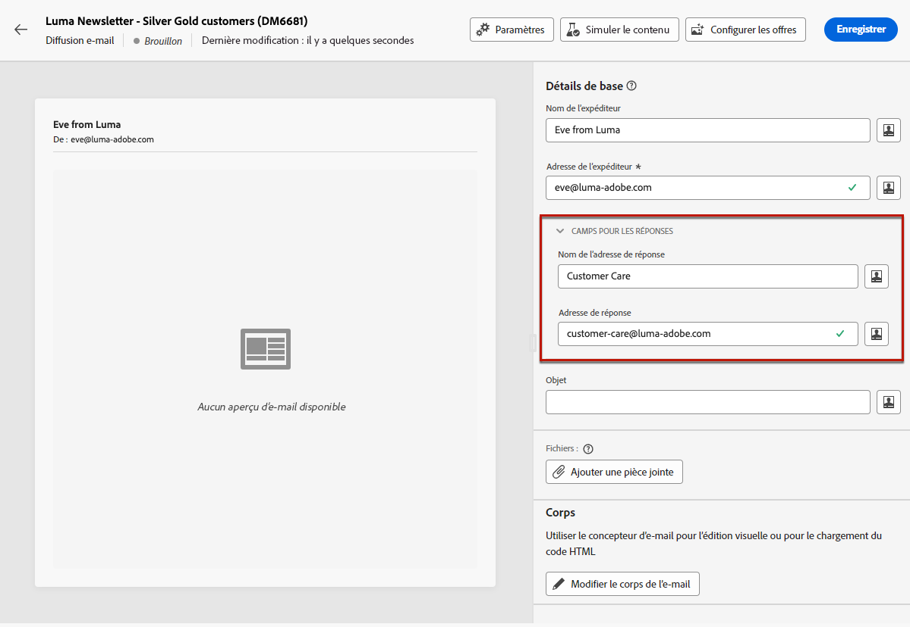

<?xml version="1.0" encoding="UTF-8"?>
<xliff xmlns="urn:oasis:names:tc:xliff:document:1.2" xmlns:okp="okapi-framework:xliff-extensions" xmlns:its="http://www.w3.org/2005/11/its" xmlns:itsxlf="http://www.w3.org/ns/its-xliff/" version="1.2" its:version="2.0">
<file original="help/v8/email/edit-content.md.mdsc" source-language="en-US" target-language="en-XX" datatype="x-text/markdown">
<body>
<trans-unit id="tu1" restype="x-YAML_METADATA_HEADER_VALUE" xml:space="preserve">
<source xml:lang="en-US">Edit the email content</source>
<target xml:lang="en-XX">Modifier le contenu de l’e-mail</target>
</trans-unit>
<trans-unit id="tu2" restype="x-YAML_METADATA_HEADER_VALUE" xml:space="preserve">
<source xml:lang="en-US">Learn how to edit the email content in Campaign Web user interface</source>
<target xml:lang="en-XX">Découvrez comment modifier le contenu de l’e-mail dans l’interface utilisateur web de Campaign.</target>
</trans-unit>
<trans-unit id="tu3" xml:space="preserve">
<source xml:lang="en-US">Configure the email content</source>
<target xml:lang="en-XX">Configurer le contenu de l’e-mail</target>
</trans-unit>
<trans-unit id="tu4" xml:space="preserve">
<source xml:lang="en-US">Define the email content</source>
<target xml:lang="en-XX">Définition du contenu de l’e-mail</target>
</trans-unit>
<trans-unit id="tu5" xml:space="preserve">
<source xml:lang="en-US">The <ph id="1" ctype="x-STRONG_EMPHASIS">**</ph>Edit content<ph id="2" ctype="x-STRONG_EMPHASIS">**</ph> screen allows you to define basic elements of your message, such as the sender address and subject line, perform additional actions like adding attachments or offers, and access the Email Designer to give your message a polished look.</source>
<target xml:lang="en-XX">L’écran <ph id="1" ctype="x-STRONG_EMPHASIS">**</ph>Modifier le contenu<ph id="2" ctype="x-STRONG_EMPHASIS">**</ph> vous permet de définir les éléments de base de votre message, tels que l’adresse de la personne expéditrice et l’objet, d’effectuer des actions supplémentaires, telles que l’ajout de pièces jointes ou d’offres, et d’accéder au concepteur d’e-mail pour peaufiner l’aspect de votre message.</target>
</trans-unit>
<trans-unit id="tu6" xml:space="preserve">
<source xml:lang="en-US">Set the email properties</source>
<target xml:lang="en-XX">Définir les propriétés de l’e-mail</target>
</trans-unit>
<trans-unit id="tu7" xml:space="preserve">
<source xml:lang="en-US">The <ph id="1" ctype="x-STRONG_EMPHASIS">**</ph>Basic details<ph id="2" ctype="x-STRONG_EMPHASIS">**</ph> section allows you to update the sender's address and reply-to address, and define the subject line using the Expression Editor.</source>
<target xml:lang="en-XX">La section <ph id="1" ctype="x-STRONG_EMPHASIS">**</ph>Détails de base<ph id="2" ctype="x-STRONG_EMPHASIS">**</ph> vous permet de mettre à jour l’adresse de la personne expéditrice et l’adresse de réponse, puis de définir l’objet à l’aide de l’éditeur d’expression.</target>
</trans-unit>
<trans-unit id="tu8" xml:space="preserve">
<source xml:lang="en-US">Attach files to your email</source>
<target xml:lang="en-XX">Joindre des fichiers à un e-mail</target>
</trans-unit>
<trans-unit id="tu9" xml:space="preserve">
<source xml:lang="en-US">Select one or multiple files to insert into your message. To avoid performance issues, it is recommended not to include more than one attachment per email.</source>
<target xml:lang="en-XX">Sélectionnez un ou plusieurs fichiers à insérer dans votre message. Pour éviter tout problème de performances, il est recommandé de ne pas inclure plusieurs pièces jointes par e-mail.</target>
</trans-unit>
<trans-unit id="tu10" xml:space="preserve">
<source xml:lang="en-US">Edit tracking</source>
<target xml:lang="en-XX">Modifier le tracking</target>
</trans-unit>
<trans-unit id="tu11" xml:space="preserve">
<source xml:lang="en-US">By default, tracking is enabled for the delivery, meaning all links included in the message content are tracked. You can disable this option from here.</source>
<target xml:lang="en-XX">Par défaut, le tracking est activé pour la diffusion, ce qui signifie que tous les liens inclus dans le contenu du message sont suivis. Vous pouvez désactiver cette option à partir d’ici.</target>
</trans-unit>
<trans-unit id="tu12" xml:space="preserve">
<source xml:lang="en-US">https://experienceleague.adobe.com/en/docs/campaign-web/v8/content/email-design/design-content/message-tracking</source>
<target xml:lang="en-XX">https://experienceleague.adobe.com/fr/docs/campaign-web/v8/content/email-design/design-content/message-tracking</target>
</trans-unit>
<trans-unit id="tu13" xml:space="preserve">
<source xml:lang="en-US">Add links and track messages</source>
<target xml:lang="en-XX">Ajouter des liens et suivre les messages</target>
</trans-unit>
<trans-unit id="tu14" xml:space="preserve">
<source xml:lang="en-US">The email <ph id="1" ctype="x-STRONG_EMPHASIS">**[!UICONTROL </ph>Edit content<ph id="3" ctype="x-LINK_REF">]**</ph> screen allows you to:</source>
<target xml:lang="en-XX">La fenêtre <ph id="1" ctype="x-STRONG_EMPHASIS">**[!UICONTROL </ph>Modifier le contenu<ph id="3" ctype="x-LINK_REF">]**</ph> de l’e-mail vous permet d’effectuer les opérations suivantes :</target>
</trans-unit>
<trans-unit id="tu15" xml:space="preserve">
<source xml:lang="en-US">Define basic elements of your message such as the sender's address and the subject line</source>
<target xml:lang="en-XX">Définir des éléments de base de votre message, tels que l’adresse de l’expéditeur et l’objet.</target>
</trans-unit>
<trans-unit id="tu16" xml:space="preserve">
<source xml:lang="en-US">Perform additional actions such as adding attachments or setting up offers</source>
<target xml:lang="en-XX">Effectuer des actions supplémentaires telles que l’ajout de pièces jointes ou la configuration d’offres.</target>
</trans-unit>
<trans-unit id="tu17" xml:space="preserve">
<source xml:lang="en-US">Access the <ph id="1" ctype="x-LINK">[</ph>Email Designer<ph id="2" ctype="x-LINK">](get-started-email-designer.md#start-authoring)</ph> to start building the proper content of your email</source>
<target xml:lang="en-XX">Accéder au <ph id="1" ctype="x-LINK">[</ph>concepteur d’e-mail<ph id="2" ctype="x-LINK">](get-started-email-designer.md#start-authoring)</ph> pour commencer à créer le contenu de votre e-mail.</target>
</trans-unit>
<trans-unit id="tu18" xml:space="preserve">
<source xml:lang="en-US">Add language variants to your deliveries. <ph id="1" ctype="x-LINK">[</ph>Read more<ph id="2" ctype="x-LINK">](../msg/multilingual.md)</ph></source>
<target xml:lang="en-XX">Ajoutez des variantes linguistiques à vos diffusions. <ph id="1" ctype="x-LINK">[</ph>En savoir plus<ph id="2" ctype="x-LINK">](../msg/multilingual.md)</ph></target>
</trans-unit>
<trans-unit id="tu19" xml:space="preserve">
<source xml:lang="en-US"><ph id="1" ctype="x-regxph" equiv-text="[!NOTE">[!NOTE]</ph></source>
<target xml:lang="en-XX"><ph id="1" ctype="x-regxph" equiv-text="[!NOTE">[!NOTE]</ph></target>
</trans-unit>
<trans-unit id="tu20" xml:space="preserve">
<source xml:lang="en-US">All the editable text fields of this screen can be filled in using personalization fields. <ph id="1" ctype="x-LINK">[</ph>Learn how to personalize content<ph id="2" ctype="x-LINK">](../personalization/personalize.md)</ph></source>
<target xml:lang="en-XX">Tous les champs de texte modifiables de cet écran peuvent être remplis à l’aide de champs de personnalisation. <ph id="1" ctype="x-LINK">[</ph>Découvrez comment personnaliser le contenu.<ph id="2" ctype="x-LINK">](../personalization/personalize.md)</ph></target>
</trans-unit>
<trans-unit id="tu21" xml:space="preserve">
<source xml:lang="en-US">Configure the delivery</source>
<target xml:lang="en-XX">Configurer la diffusion</target>
</trans-unit>
<trans-unit id="tu22" xml:space="preserve">
<source xml:lang="en-US">To configure or edit the content of an email, follow the steps below.</source>
<target xml:lang="en-XX">Pour configurer ou modifier le contenu d’un e-mail, procédez comme suit.</target>
</trans-unit>
<trans-unit id="tu23" xml:space="preserve">
<source xml:lang="en-US">Click the <ph id="1" ctype="x-STRONG_EMPHASIS">**[!UICONTROL </ph>Edit content<ph id="3" ctype="x-LINK_REF">]**</ph> button from the <ph id="5" ctype="x-LINK">[</ph>email delivery dashboard<ph id="6" ctype="x-LINK">](../email/create-email.md)</ph> screen.</source>
<target xml:lang="en-XX">Cliquez sur le bouton <ph id="1" ctype="x-STRONG_EMPHASIS">**[!UICONTROL </ph>Modifier le contenu<ph id="3" ctype="x-LINK_REF">]**</ph> à partir de la fenêtre <ph id="5" ctype="x-LINK">[</ph>tableau de bord de diffusion des e-mails<ph id="6" ctype="x-LINK">](../email/create-email.md)</ph>.</target>
</trans-unit>
<trans-unit id="tu24" xml:space="preserve">
<source xml:lang="en-US"><ph id="1" ctype="x-IMAGE">{zoomable="yes"}</ph></source>
<target xml:lang="en-XX"><ph id="1" ctype="x-IMAGE">{zoomable="yes"}</ph></target>
</trans-unit>
<trans-unit id="tu25" xml:space="preserve">
<source xml:lang="en-US">The email content edition screen opens.</source>
<target xml:lang="en-XX">La fenêtre de modification du contenu de l’e-mail s’ouvre.</target>
</trans-unit>
<trans-unit id="tu26" xml:space="preserve">
<source xml:lang="en-US"><ph id="1" ctype="x-IMAGE">{zoomable="yes"}</ph></source>
<target xml:lang="en-XX"><ph id="1" ctype="x-IMAGE">{zoomable="yes"}</ph></target>
</trans-unit>
<trans-unit id="tu27" xml:space="preserve">
<source xml:lang="en-US"><ph id="1" ctype="x-regxph" equiv-text="[!NOTE">[!NOTE]</ph></source>
<target xml:lang="en-XX"><ph id="1" ctype="x-regxph" equiv-text="[!NOTE">[!NOTE]</ph></target>
</trans-unit>
<trans-unit id="tu28" xml:space="preserve">
<source xml:lang="en-US">If you are configuring a new email, the <ph id="1" ctype="x-STRONG_EMPHASIS">**[!UICONTROL </ph>From name<ph id="3" ctype="x-LINK_REF">]**</ph> and <ph id="5" ctype="x-STRONG_EMPHASIS">**[!UICONTROL </ph>From email<ph id="7" ctype="x-LINK_REF">]**</ph> fields are already populated.</source>
<target xml:lang="en-XX">Si vous configurez un nouvel e-mail, les champs <ph id="1" ctype="x-STRONG_EMPHASIS">**[!UICONTROL </ph>Nom de la personne expéditrice<ph id="3" ctype="x-LINK_REF">]**</ph> et <ph id="5" ctype="x-STRONG_EMPHASIS">**[!UICONTROL </ph>Adresse e-mail de la personne expéditrice<ph id="7" ctype="x-LINK_REF">]**</ph> sont déjà renseignés.</target>
</trans-unit>
<trans-unit id="tu29" xml:space="preserve">
<source xml:lang="en-US">The <ph id="1" ctype="x-STRONG_EMPHASIS">**[!UICONTROL </ph>From name<ph id="3" ctype="x-LINK_REF">]**</ph> field is defined in the email template. If you want to modify it, use a name that is easily identifiable by the recipients, such as your brand's name, to increase the opening rate of your deliveries.</source>
<target xml:lang="en-XX">Le champ <ph id="1" ctype="x-STRONG_EMPHASIS">**[!UICONTROL </ph>Nom de l’expéditeur<ph id="3" ctype="x-LINK_REF">]**</ph> est défini dans le modèle d’e-mail. Si vous voulez le modifier, utilisez un nom facilement identifiable par les destinataires, tel que le nom de votre marque, pour augmenter le taux d’ouverture de vos diffusions.</target>
</trans-unit>
<trans-unit id="tu30" xml:space="preserve">
<source xml:lang="en-US"><ph id="1" ctype="x-regxph" equiv-text="[!NOTE">[!NOTE]</ph></source>
<target xml:lang="en-XX"><ph id="1" ctype="x-regxph" equiv-text="[!NOTE">[!NOTE]</ph></target>
</trans-unit>
<trans-unit id="tu31" xml:space="preserve">
<source xml:lang="en-US">To further improve the recipient's experience, you can add a person's name, for example, "Eve from Luma".</source>
<target xml:lang="en-XX">Pour améliorer davantage l’expérience des destinataires, vous pouvez ajouter le nom d’une personne, par exemple « Eve de Luma ».</target>
</trans-unit>
<trans-unit id="tu32" xml:space="preserve">
<source xml:lang="en-US">The <ph id="1" ctype="x-STRONG_EMPHASIS">**[!UICONTROL </ph>From email<ph id="3" ctype="x-LINK_REF">]**</ph> address field is also defined in the email template. Make sure the address domain matches the subdomain that you delegated to Adobe.</source>
<target xml:lang="en-XX">Le champ <ph id="1" ctype="x-STRONG_EMPHASIS">**[!UICONTROL </ph>Adresse e-mail de l’expéditeur<ph id="3" ctype="x-LINK_REF">]**</ph> est également défini dans le modèle d’e-mail. Assurez-vous que le domaine de l’adresse est identique au sous-domaine délégué à Adobe.</target>
</trans-unit>
<trans-unit id="tu33" xml:space="preserve">
<source xml:lang="en-US"><ph id="1" ctype="x-regxph" equiv-text="[!NOTE">[!NOTE]</ph></source>
<target xml:lang="en-XX"><ph id="1" ctype="x-regxph" equiv-text="[!NOTE">[!NOTE]</ph></target>
</trans-unit>
<trans-unit id="tu34" xml:space="preserve">
<source xml:lang="en-US">You can change the part preceding the '@', but not the domain address.</source>
<target xml:lang="en-XX">Vous pouvez modifier la partie qui précède le signe « @ », mais pas l’adresse du domaine.</target>
</trans-unit>
<trans-unit id="tu35" xml:space="preserve">
<source xml:lang="en-US"><ph id="1" ctype="x-regxph" equiv-text="[!NOTE">[!NOTE]</ph></source>
<target xml:lang="en-XX"><ph id="1" ctype="x-regxph" equiv-text="[!NOTE">[!NOTE]</ph></target>
</trans-unit>
<trans-unit id="tu36" xml:space="preserve">
<source xml:lang="en-US">Administrators can restrict this field to a predefined list of sender addresses. In this case, you select an address from a dropdown list instead of typing it. <ph id="1" ctype="x-LINK">[</ph>Learn more<ph id="2" ctype="x-LINK">](../administration/options.md#restrict-sender-address)</ph></source>
<target xml:lang="en-XX">Les administrateurs et administratrices peuvent limiter ce champ à une liste prédéfinie d’adresses d’expédition. Dans ce cas, vous sélectionnez une adresse dans une liste déroulante au lieu de la saisir. <ph id="1" ctype="x-LINK">[</ph>En savoir plus<ph id="2" ctype="x-LINK">](../administration/options.md#restrict-sender-address)</ph></target>
</trans-unit>
<trans-unit id="tu37" xml:space="preserve">
<source xml:lang="en-US">Expand the <ph id="1" ctype="x-STRONG_EMPHASIS">**[!UICONTROL </ph>Reply-to fields<ph id="3" ctype="x-LINK_REF">]**</ph> section. The sender's name and addresses are used by default for replies. However, Adobe recommends using an existing real address, such as your brand's customer care. In this case, if a recipient sends a reply, the customer care team will be able to handle it.</source>
<target xml:lang="en-XX">Développez la section <ph id="1" ctype="x-STRONG_EMPHASIS">**[!UICONTROL </ph>Champs de réponse<ph id="3" ctype="x-LINK_REF">]**</ph>. Le nom et l’adresse de la personne expéditrice sont utilisés par défaut pour les réponses. Adobe recommande toutefois d’utiliser une adresse réelle existante, telle que l’assistance clientèle de votre marque. Ainsi, si une personne destinataire envoie une réponse, l’assistance clientèle sera en mesure de la traiter.</target>
</trans-unit>
<trans-unit id="tu38" xml:space="preserve">
<source xml:lang="en-US"><ph id="1" ctype="x-IMAGE">{zoomable="yes"}</ph></source>
<target xml:lang="en-XX"><ph id="1" ctype="x-IMAGE">{zoomable="yes"}</ph></target>
</trans-unit>
<trans-unit id="tu39" xml:space="preserve">
<source xml:lang="en-US">Define the email <ph id="1" ctype="x-STRONG_EMPHASIS">**[!UICONTROL </ph>Subject line<ph id="3" ctype="x-LINK_REF">]**</ph>. Type your subject directly into the dedicated field, or open the Expression Editor to add <ph id="5" ctype="x-LINK">[</ph>personalization<ph id="6" ctype="x-LINK">](../personalization/personalize.md)</ph> using various attributes, expression fragments, or offers.</source>
<target xml:lang="en-XX">Définissez l’<ph id="1" ctype="x-STRONG_EMPHASIS">**[!UICONTROL </ph>Objet<ph id="3" ctype="x-LINK_REF">]**</ph> de l’e-mail. Saisissez directement l’objet dans le champ dédié ou ouvrez l’éditeur d’expression pour ajouter des éléments de <ph id="5" ctype="x-LINK">[</ph>personnalisation<ph id="6" ctype="x-LINK">](../personalization/personalize.md)</ph> à l’aide de divers attributs, fragments d’expression ou offres.</target>
</trans-unit>
<trans-unit id="tu40" xml:space="preserve">
<source xml:lang="en-US">If you want to attach a file to the email, click the <ph id="1" ctype="x-STRONG_EMPHASIS">**[!UICONTROL </ph>Add attachment<ph id="3" ctype="x-LINK_REF">]**</ph> button, then select one or multiple files.</source>
<target xml:lang="en-XX">Si vous souhaitez joindre un fichier à l’e-mail, cliquez sur le bouton <ph id="1" ctype="x-STRONG_EMPHASIS">**[!UICONTROL </ph>Ajouter une pièce jointe<ph id="3" ctype="x-LINK_REF">]**</ph> puis sélectionnez un ou plusieurs fichiers.</target>
</trans-unit>
<trans-unit id="tu41" xml:space="preserve">
<source xml:lang="en-US"><ph id="1" ctype="x-regxph" equiv-text="[!NOTE">[!NOTE]</ph></source>
<target xml:lang="en-XX"><ph id="1" ctype="x-regxph" equiv-text="[!NOTE">[!NOTE]</ph></target>
</trans-unit>
<trans-unit id="tu42" xml:space="preserve">
<source xml:lang="en-US">To avoid performance issues, it is recommended not to include more than one attachment per email.</source>
<target xml:lang="en-XX">Pour éviter tout problème de performances, il est recommandé de ne pas inclure plusieurs pièces jointes par e-mail.</target>
</trans-unit>
<trans-unit id="tu43" xml:space="preserve">
<source xml:lang="en-US">If you want to send offers with your email, select them using the <ph id="1" ctype="x-STRONG_EMPHASIS">**[!UICONTROL </ph>Set up offers<ph id="3" ctype="x-LINK_REF">]**</ph> button.</source>
<target xml:lang="en-XX">Si vous souhaitez envoyer des offres par e-mail, sélectionnez-les à l’aide du bouton <ph id="1" ctype="x-STRONG_EMPHASIS">**[!UICONTROL </ph>configurer les offres<ph id="3" ctype="x-LINK_REF">]**</ph>.</target>
</trans-unit>
<trans-unit id="tu44" xml:space="preserve">
<source xml:lang="en-US">You can then insert them into the email using personalization fields. <ph id="1" ctype="x-LINK">[</ph>Learn how to send offers<ph id="2" ctype="x-LINK">](../msg/offers.md)</ph></source>
<target xml:lang="en-XX">Vous pouvez ensuite les insérer dans l’e-mail à l’aide des champs de personnalisation. <ph id="1" ctype="x-LINK">[</ph>Découvrez comment envoyer des offres.<ph id="2" ctype="x-LINK">](../msg/offers.md)</ph></target>
</trans-unit>
<trans-unit id="tu45" xml:space="preserve">
<source xml:lang="en-US">Edit the email body</source>
<target xml:lang="en-XX">Modifier le corps de l’e-mail</target>
</trans-unit>
<trans-unit id="tu46" xml:space="preserve">
<source xml:lang="en-US">Click the <ph id="1" ctype="x-STRONG_EMPHASIS">**[!UICONTROL </ph>Edit email body<ph id="3" ctype="x-LINK_REF">]**</ph> button to structure and design the content of the email using the <ph id="5" ctype="x-LINK">[</ph>Email Designer<ph id="6" ctype="x-LINK">](get-started-email-designer.md#start-authoring)</ph>.</source>
<target xml:lang="en-XX">Cliquez sur le bouton <ph id="1" ctype="x-STRONG_EMPHASIS">**[!UICONTROL </ph>Modifier le corps de l’e-mail<ph id="3" ctype="x-LINK_REF">]**</ph> pour organiser et concevoir le contenu de l’e-mail en utilisant le <ph id="5" ctype="x-LINK">[</ph>Concepteur d’e-mail<ph id="6" ctype="x-LINK">](get-started-email-designer.md#start-authoring)</ph>.</target>
</trans-unit>
<trans-unit id="tu47" xml:space="preserve">
<source xml:lang="en-US"><ph id="1" ctype="x-regxph" equiv-text="[!NOTE">[!NOTE]</ph></source>
<target xml:lang="en-XX"><ph id="1" ctype="x-regxph" equiv-text="[!NOTE">[!NOTE]</ph></target>
</trans-unit>
<trans-unit id="tu48" xml:space="preserve">
<source xml:lang="en-US">You can also hover over the email preview and select <ph id="1" ctype="x-STRONG_EMPHASIS">**[!UICONTROL </ph>Open email designer<ph id="3" ctype="x-LINK_REF">]**</ph>.</source>
<target xml:lang="en-XX">Vous pouvez également pointer sur l’aperçu de l’e-mail et sélectionner <ph id="1" ctype="x-STRONG_EMPHASIS">**[!UICONTROL </ph>Ouvrir le concepteur d’e-mail<ph id="3" ctype="x-LINK_REF">]**</ph>.</target>
</trans-unit>
<trans-unit id="tu49" xml:space="preserve">
<source xml:lang="en-US">Additional information on how to design email content are available in these sections:</source>
<target xml:lang="en-XX">Des informations supplémentaires sur la conception de contenu d’e-mail sont disponibles dans les sections suivantes :</target>
</trans-unit>
<trans-unit id="tu50" xml:space="preserve">
<source xml:lang="en-US">Author emails from scratch</source>
<target xml:lang="en-XX">Rédiger des e-mails à partir de zéro</target>
</trans-unit>
<trans-unit id="tu51" xml:space="preserve">
<source xml:lang="en-US">Style your content</source>
<target xml:lang="en-XX">Donner un style à votre contenu</target>
</trans-unit>
<trans-unit id="tu52" xml:space="preserve">
<source xml:lang="en-US">By default, tracking is enabled for the delivery. You can disable it, or configure open tracking, from the delivery's <ph id="1" ctype="x-STRONG_EMPHASIS">**[!UICONTROL </ph>Settings<ph id="3" ctype="x-LINK_REF">]**</ph> > <ph id="5" ctype="x-STRONG_EMPHASIS">**[!UICONTROL </ph>Tracking<ph id="7" ctype="x-LINK_REF">]**</ph> tab. <ph id="9" ctype="x-LINK">[</ph>Learn more<ph id="10" ctype="x-LINK">](../advanced-settings/delivery-settings.md#tracking-tab)</ph>. <ph id="11" ctype="x-LINK">[</ph>Learn how to add links and manage tracking<ph id="12" ctype="x-LINK">](message-tracking.md)</ph></source>
<target xml:lang="en-XX">Par défaut, le tracking est activé pour la diffusion. Vous pouvez le désactiver ou configurer le tracking des ouvertures à partir de l’onglet <ph id="1" ctype="x-STRONG_EMPHASIS">**[!UICONTROL </ph>Paramètres<ph id="3" ctype="x-LINK_REF">]**</ph> > <ph id="5" ctype="x-STRONG_EMPHASIS">**[!UICONTROL </ph>Tracking<ph id="7" ctype="x-LINK_REF">]**</ph> de la diffusion. <ph id="9" ctype="x-LINK">[</ph>En savoir plus<ph id="10" ctype="x-LINK">](../advanced-settings/delivery-settings.md#tracking-tab)</ph>. <ph id="11" ctype="x-LINK">[</ph>Découvrez comment ajouter des liens et gérer le tracking.<ph id="12" ctype="x-LINK">](message-tracking.md)</ph></target>
</trans-unit>
<trans-unit id="tu53" xml:space="preserve">
<source xml:lang="en-US">Once the content of your email has been defined, use the <ph id="1" ctype="x-STRONG_EMPHASIS">**[!UICONTROL </ph>Simulate content<ph id="3" ctype="x-LINK_REF">]**</ph> button to check how it displays before sending it. You can also validate your content quality to assess readability, CTA effectiveness, and overall quality. <ph id="5" ctype="x-LINK">[</ph>Learn more about content quality validation<ph id="6" ctype="x-LINK">](../content/brands-score.md#validate-quality)</ph></source>
<target xml:lang="en-XX">Une fois le contenu de votre e-mail défini, cliquez sur le bouton <ph id="1" ctype="x-STRONG_EMPHASIS">**[!UICONTROL </ph>Simuler du contenu<ph id="3" ctype="x-LINK_REF">]**</ph> pour vérifier la manière dont il s’affichera avant de l’envoyer. Vous pouvez également valider la qualité de votre contenu pour évaluer la lisibilité, l’efficacité CTA et la qualité globale. <ph id="5" ctype="x-LINK">[</ph>En savoir plus sur la validation de la qualité du contenu<ph id="6" ctype="x-LINK">](../content/brands-score.md#validate-quality)</ph>.</target>
</trans-unit>
<trans-unit id="tu54" xml:space="preserve">
<source xml:lang="en-US"><ph id="1" ctype="x-LINK">[</ph>Learn how to preview and test your email<ph id="2" ctype="x-LINK">](../preview-test/preview-test.md)</ph>.</source>
<target xml:lang="en-XX"><ph id="1" ctype="x-LINK">[</ph>Découvrez comment prévisualiser et tester votre e-mail.<ph id="2" ctype="x-LINK">](../preview-test/preview-test.md)</ph></target>
</trans-unit>
</body>
</file>
</xliff>