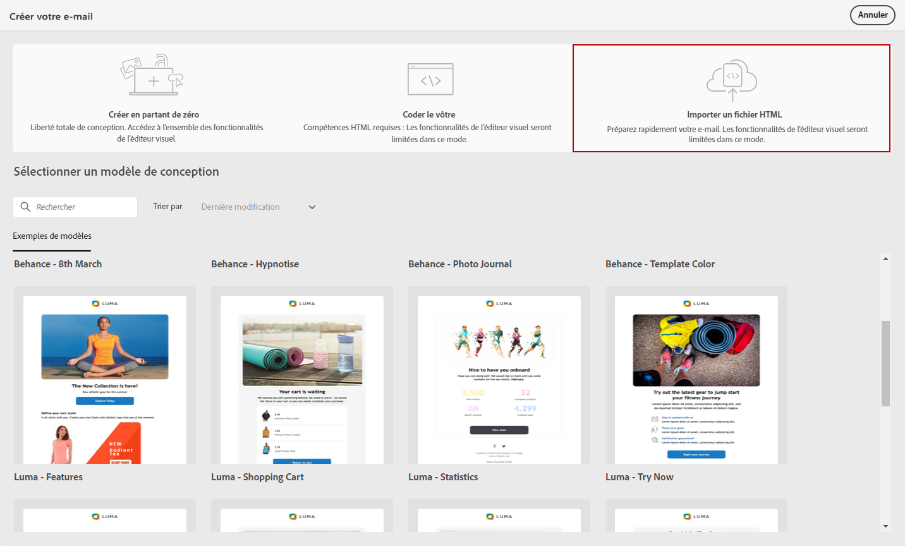
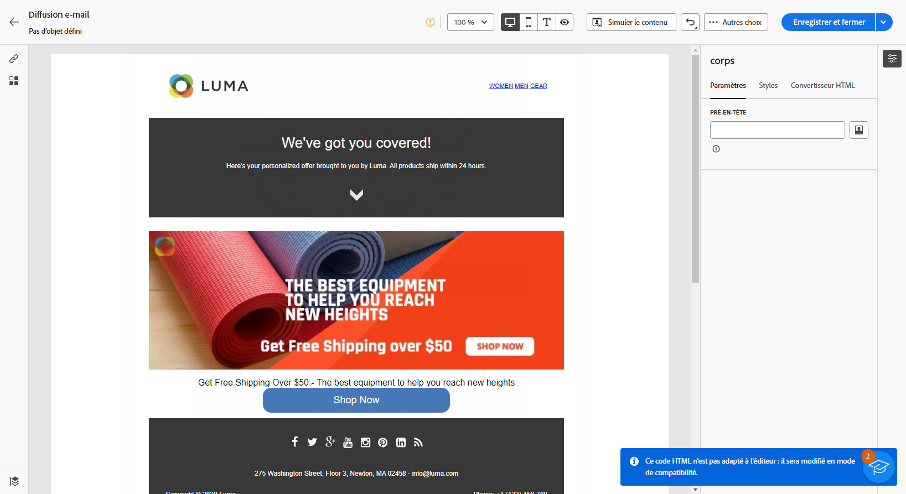
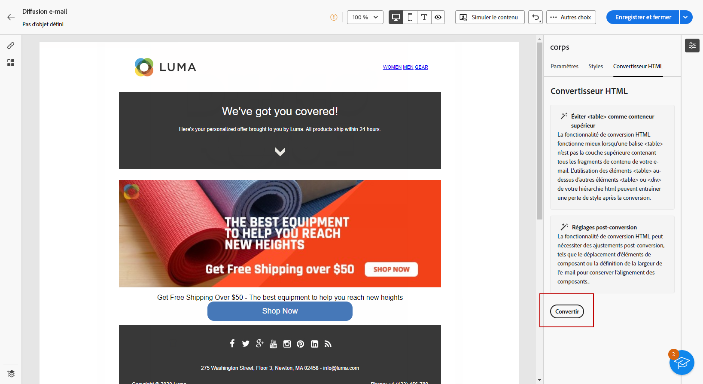

# Importer le contenu des e-mails {#existing-content}

>[!CONTEXTUALHELP]
>id="acw_deliveries_email_import_content"
>title="Utiliser un contenu d’e-mail existant"
>abstract="Le concepteur d’e-mail permet d’importer du contenu HTML existant. Ce contenu peut être un fichier HTML avec une feuille de style incorporée ou un dossier ZIP contenant le fichier HTML, la feuille de style (CSS) et les images."

Vous pouvez importer du contenu HTML existant dans le concepteur d’e-mail. Ce contenu peut être :

* Un **fichier HTML** avec une feuille de style incorporée,
* Un **dossier ZIP** contenant le fichier HTML, la feuille de style (fichier .css) et les images.

>[!NOTE]
>
>La structure du fichier ZIP est libre. Toutefois, les références doivent être relatives et adaptées à l’arborescence du dossier ZIP.

➡️ [Découvrir cette fonctionnalité en vidéo](#video)

Pour importer un fichier contenant du contenu HTML, procédez comme suit :

1. Sur la page d’accueil du [concepteur d’e-mail](get-started-email-designer.md), sélectionnez **[!UICONTROL Importer un fichier HTML]**.

   {zoomable="yes"}

1. Faites glisser et déposez le fichier HTML ou ZIP contenant le contenu HTML, puis cliquez sur **[!UICONTROL Importer]**.

1. Le contenu HTML chargé passe en **[!UICONTROL Mode de compatibilité]**.

   Ce mode permet de personnaliser votre texte, d’ajouter des liens ou d’inclure des ressources à votre contenu.

   {zoomable="yes"}

1. Pour pouvoir exploiter les composants de contenu du concepteur d’e-mail, accédez à l’onglet **[!UICONTROL Convertisseur HTML]** et cliquez sur **[!UICONTROL Convertir]**.

   {zoomable="yes"}

   >[!NOTE]
   >
   >L’utilisation d’une balise `<table>` comme premier calque d’un fichier HTML peut entraîner une perte de style, y compris des paramètres d’arrière-plan et de largeur de la balise de calque supérieure.

1. Personnalisez votre fichier importé selon vos besoins à l’aide des fonctionnalités du concepteur d’e-mail. [En savoir plus](content-components.md)

## Vidéo pratique {#video}

Découvrez comment créer un e-mail en chargeant un fichier HTML, le rendre compatible avec le concepteur d’e-mail et le convertir en modèle.

>[!VIDEO](https://video.tv.adobe.com/v/3447034/?captions=fre_fr&quality=12)