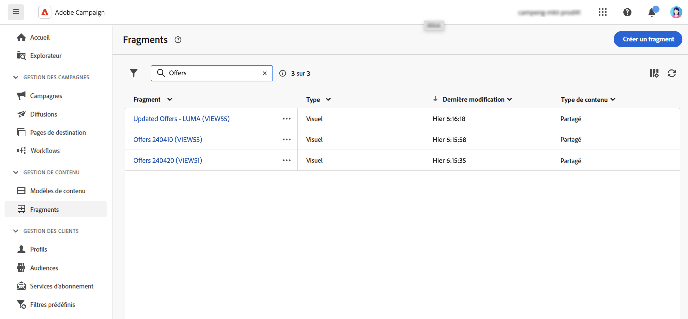
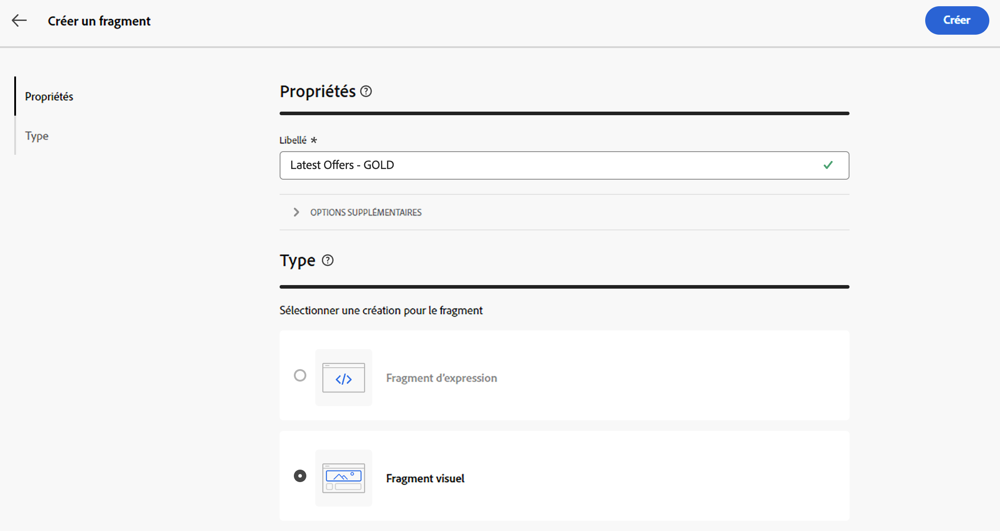
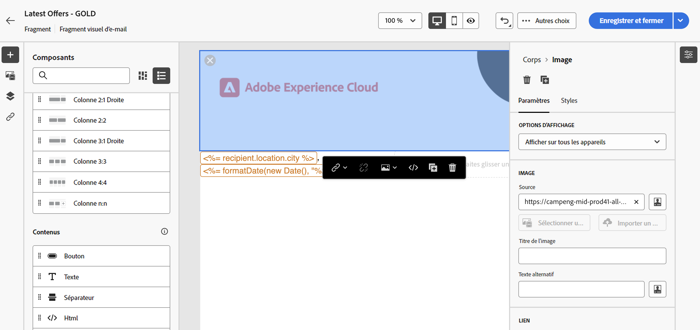
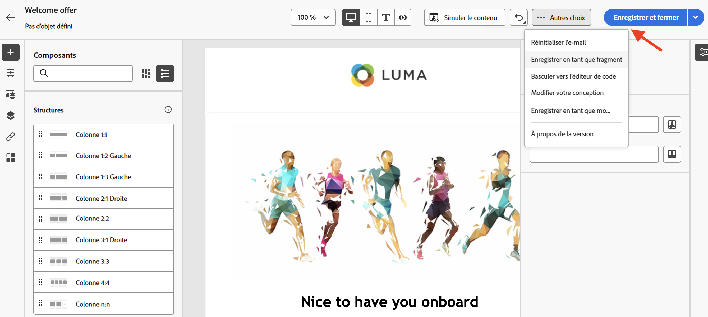
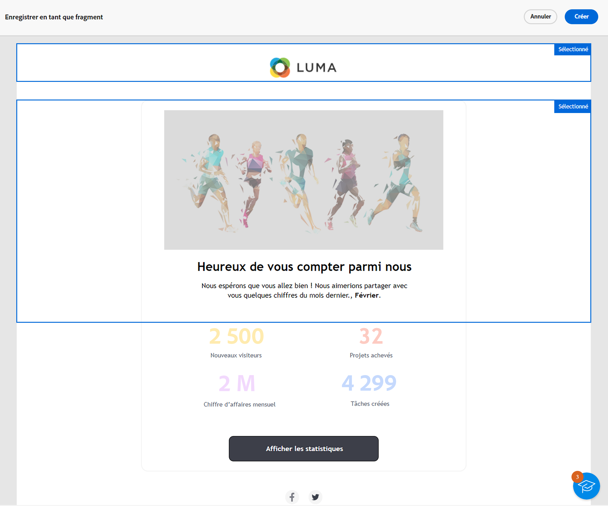
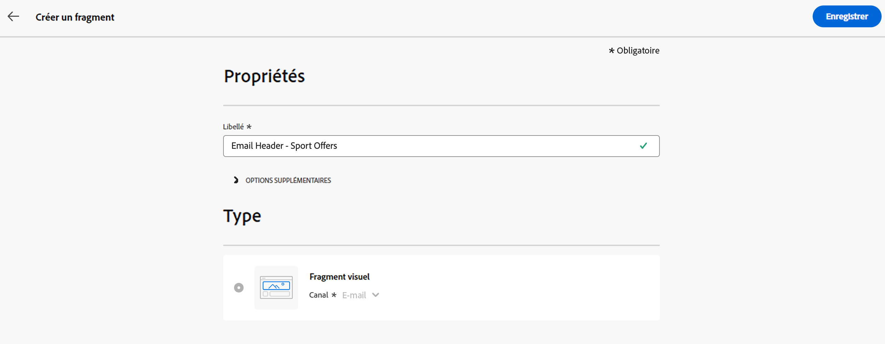
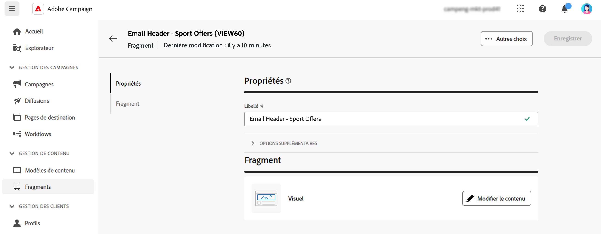
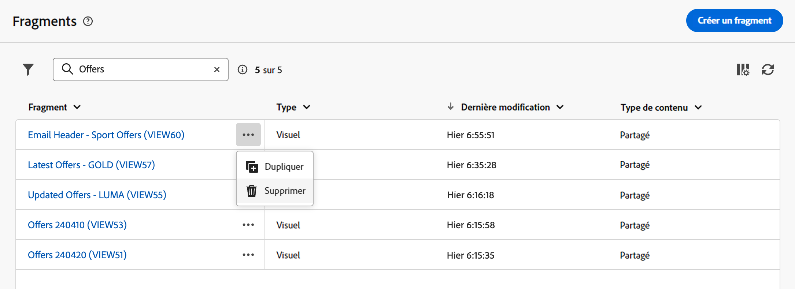

# Créer des fragments de contenu {#fragments}

>[!CONTEXTUALHELP]
>id="acw_fragments_menu"
>title="Définir vos propres fragments"
>abstract="Un fragment est un composant réutilisable pouvant être référencé dans un ou plusieurs e-mails d’une campagne à l’autre. Cette fonctionnalité permet de précréer plusieurs blocs de contenu personnalisés destinés aux utilisateurs et utilisatrices marketing et permettant d’assembler rapidement les contenus d’e-mail dans un processus de conception amélioré."

>[!CONTEXTUALHELP]
>id="acw_fragments_save"
>title="Enregistrement de fragments"
>abstract="Enregistrement de fragments"

>[!CONTEXTUALHELP]
>id="acw_fragments_create"
>title="Définir vos propres fragments"
>abstract="Un fragment est un composant réutilisable pouvant être référencé dans un ou plusieurs e-mails d’une campagne à l’autre."

>[!CONTEXTUALHELP]
>id="acw_fragments_properties"
>title="Propriétés des fragments"
>abstract="Propriétés des fragments"

>[!CONTEXTUALHELP]
>id="acw_fragments_type"
>title="Type de fragment"
>abstract="Sélectionnez le type de fragment. Pour l’instant, seuls les fragments visuels pour les e-mails sont disponibles."

>[!CONTEXTUALHELP]
>id="acw_fragments_list"
>title="Définir vos propres fragments"
>abstract="Un fragment est un composant réutilisable pouvant être référencé dans un ou plusieurs e-mails d’une campagne à l’autre. Vous pouvez également utiliser des fragments dans vos modèles d’e-mails. Pour l’instant, seuls les fragments visuels sont disponibles."

>[!CONTEXTUALHELP]
>id="acw_fragments_details"
>title="Détails des fragments"
>abstract="Détails des fragments"

>[!CONTEXTUALHELP]
>id="acw_create_fragment"
>title="Définir vos propres fragments"
>abstract="Un fragment est un composant réutilisable pouvant être référencé dans un ou plusieurs e-mails d’une campagne à l’autre."

Un fragment est un composant réutilisable pouvant être référencé dans un ou plusieurs e-mails d’une campagne à l’autre. Lors de la modification d’un fragment, chaque contenu qui l’utilise est mis à jour.

Cette fonctionnalité permet de précréer plusieurs blocs de contenu personnalisés destinés aux utilisateurs et utilisatrices marketing et permettant d’assembler rapidement les contenus d’e-mail dans un processus de conception amélioré.

Pour optimiser l’utilisation des fragments :

* Créez vos propres fragments visuels, comme décrit ci-dessous.
* Utilisez-les autant de fois que nécessaire dans votre contenu, via le concepteur d’e-mail. Voir [Ajouter des fragments visuels à vos e-mails](../email/use-visual-fragments.md).

## Créer un fragment visuel {#create-fragments}

Vous pouvez créer des fragments de contenu de deux manières différentes :

* Créez un fragment à partir de zéro, à l’aide du menu dédié **[!UICONTROL Fragments]**. [Voici comment procéder](#create-from-scratch)

* Lors de la conception de contenu, enregistrez une partie de votre contenu en tant que fragment. [Voici comment procéder](#save-as-fragment)

Une fois enregistré, votre fragment peut être utilisé dans un e-mail ou un modèle d’e-mail. Qu’il soit créé à partir de zéro ou d’un contenu existant, vous pouvez désormais utiliser ce fragment lors de la création de tout contenu dans Campaign. Voir [Ajouter des fragments visuels](../email/use-visual-fragments.md).

### Créer un fragment à partir de zéro {#create-from-scratch}

Pour créer un fragment à partir de zéro, procédez comme suit.

1. [Accédez à la liste des fragments](#access-manage-fragments) par le biais du menu de gauche **[!UICONTROL Gestion de contenu]** > **[!UICONTROL Fragments]**.

   

1. Sélectionnez **[!UICONTROL Créer un fragment]**.

1. Saisissez le libellé du fragment.

   

1. Si nécessaire, vous pouvez définir d’autres options, telles que le nom interne du fragment, son dossier et une description.

   >[!NOTE]
   >
   >Pour l’instant, vous ne pouvez créer que des fragments visuels.

1. Cliquez sur le bouton **Créer** pour configurer le contenu de votre fragment.

1. Le [Concepteur d’e-mail](../email/get-started-email-designer.md) s’affiche. Modifiez votre contenu selon vos besoins, comme vous le feriez pour n’importe quel e-mail d’une campagne. Vous pouvez ajouter des images, un lien, des champs de personnalisation et du contenu dynamique.

   

1. Lorsque votre fragment est prêt, cliquez sur **[!UICONTROL Enregistrer et fermer]**. Il est ajouté à la [liste de fragments](#access-manage-fragments).

Ce fragment est maintenant prêt à être utilisé lors de la création d’un [e-mail](../email/get-started-email-designer.md) ou d’un [modèle de contenu](use-email-templates.md) dans Campaign. [Voici comment procéder](../email/use-visual-fragments.md)

### Enregistrer du contenu en tant que fragment {#save-as-fragment}

Tout contenu d’e-mail peut être enregistré en tant que fragment en vue d’une réutilisation ultérieure. Lors de la conception d’un [modèle de contenu](use-email-templates.md) ou d’un [e-mail](../email/get-started-email-designer.md), vous pouvez enregistrer une partie de votre contenu en tant que fragment visuel. Pour ce faire, procédez comme suit :

1. Dans le [Concepteur d’e-mail](../email/get-started-email-designer.md), cliquez sur le bouton **Plus** en haut à droite de l’écran.

1. Sélectionnez **[!UICONTROL Enregistrer en tant que fragment]** à partir du menu déroulant.

   

1. L’écran **[!UICONTROL Enregistrer en tant que fragment]** s’affiche. Sélectionnez ensuite les éléments à inclure dans votre fragment, notamment les champs de personnalisation et le contenu dynamique.

   >[!CAUTION]
   >
   >Vous pouvez uniquement sélectionner des sections adjacentes. Vous ne pouvez pas sélectionner une structure vide ou un autre fragment.

   

1. Cliquez sur **[!UICONTROL Créer]**. Renseignez le nom du fragment et enregistrez-le.

   

   Ce contenu est désormais un fragment autonome ajouté à la [liste de fragments](#manage-fragments) et accessible à partir du menu dédié. Vous pouvez désormais utiliser ce fragment lors de la création d’un [e-mail](../email/get-started-email-designer.md) ou d’un [modèle de contenu](use-email-templates.md) dans Campaign. [Voici comment procéder](../email/use-visual-fragments.md)

>[!NOTE]
>
>Toute modification apportée à ce nouveau fragment n’est pas propagée dans le modèle d’où elle provient. De même, lorsque le contenu d’origine est modifié dans cet e-mail ou ce modèle, le nouveau fragment n’est pas modifié.

## Gérer vos fragments {#manage-fragments}

Vous pouvez modifier, mettre à jour, dupliquer ou supprimer un fragment de la liste des fragments.

### Modifier et mettre à jour un fragment {#edit-fragments}

Pour modifier un fragment, suivez les étapes ci-dessous.

1. Cliquez sur le nom du fragment à modifier dans la liste **[!UICONTROL Fragments]**.
1. Cliquez sur le bouton **Modifier le contenu** pour ouvrir le contenu de ce fragment.

   

1. Effectuez les modifications nécessaires et enregistrez vos modifications.

>[!CAUTION]
>
>Toute modification apportée à un fragment est propagée aux diffusions d’e-mails ou aux modèles qui l’utilisent.

### Supprimer un fragment {#delete-fragments}

Pour supprimer un fragment, procédez comme suit :

1. Accédez à la liste des fragments, puis cliquez sur le bouton **[!UICONTROL Autres actions]** en regard du fragment à supprimer.
1. Cliquez sur **Supprimer** pour confirmer.

   

>[!CAUTION]
>
>Lors de la suppression d’un fragment de contenu, les diffusions d’e-mails et les modèles qui l’utilisent sont mis à jour : le fragment est supprimé du contenu de l’e-mail, mais il est toujours référencé. Pour conserver le contenu du fragment dans ces diffusions et modèles, vous devez rompre l’héritage avant de supprimer le fragment, [comme décrit dans cette section](use-visual-fragments.md#break-inheritance).
>

### Dupliquer un fragment {#duplicate-fragments}

Vous pouvez facilement dupliquer un fragment pour en créer un nouveau. Pour dupliquer un fragment existant, procédez comme suit :

1. Accédez à la liste des fragments, puis cliquez sur le bouton **[!UICONTROL Autres actions]** en regard du fragment à supprimer.
1. Cliquez sur **Dupliquer** pour confirmer.
1. Saisissez le libellé du nouveau fragment et enregistrez vos modifications.

   Le modèle est alors ajouté à la liste des fragments. Vous pouvez le modifier et le configurer selon vos besoins.
