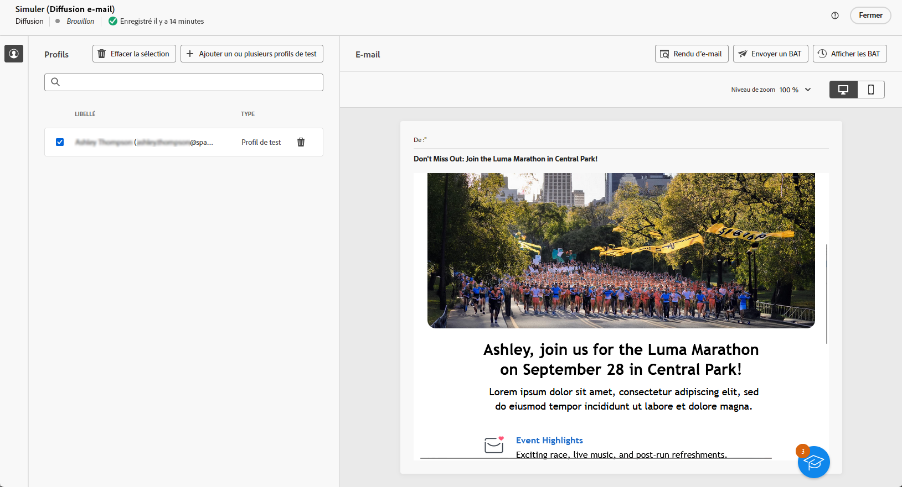
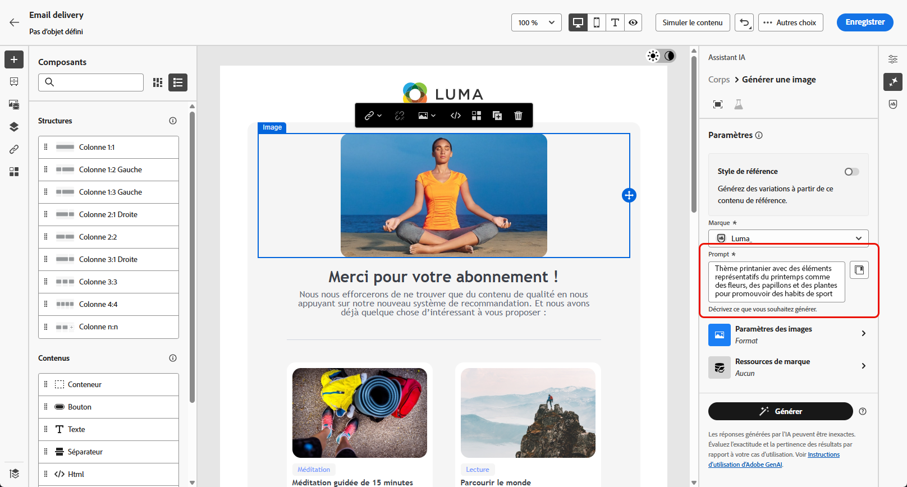

# Génération d’e-mails avec l’assistant IA {#generative-content}

>[!IMPORTANT]
>
>Avant de commencer à utiliser cette fonctionnalité, lisez la section sur les [Mécanismes de sécurisation et limitations](generative-gs.md#generative-guardrails) connexes.
> 
>
>Vous devez accepter les termes d’un [contrat d’utilisation](https://www.adobe.com/legal/licenses-terms/adobe-dx-gen-ai-user-guidelines.html){target="_blank"} avant de pouvoir utiliser l’assistant IA dans Adobe Campaign Web. Pour plus d’informations, contactez votre représentant ou représentante Adobe.

Une fois vos e-mails créés et personnalisés, utilisez l’assistant IA dans Adobe Campaign Web pour améliorer votre contenu.

L’assistant IA d’Adobe Campaign Web vous permet d’optimiser l’impact de vos diffusions en générant des e-mails entiers, du contenu texte ciblé et même des images personnalisées qui résonnent auprès de votre audience. Cela améliore vos campagnes par e-mail pour un meilleur engagement.

Dans vos campagnes par e-mail, utilisez l’assistant IA pour générer des e-mails entiers, du texte ou des images. Explorez les onglets ci-dessous pour savoir comment utiliser l’assistant IA d’Adobe Campaign Web.

>[!BEGINTABS]

>[!TAB Génération d’e-mail complet]

Dans l’exemple suivant, nous utiliserons l’assistant IA d’Adobe Campaign Web afin d’améliorer un e-mail existant en le personnalisant pour un événement spécial.

1. Après avoir créé et configuré votre diffusion e-mail, cliquez sur **[!UICONTROL Modifier le contenu]**.

   Pour plus d’informations sur la configuration de votre diffusion par e-mail, consultez [cette page](../email/create-email-content.md).

1. Personnalisez la disposition selon vos besoins et accédez au menu **[!UICONTROL Assistant IA]**.

   {zoomable="yes"}

1. Activez l’option **[!UICONTROL Utiliser le contenu original]** de l’asistant IA afin de personnaliser le nouveau contenu en fonction du contenu sélectionné.

1. Ajustez le contenu en décrivant ce que vous souhaitez générer dans le champ **[!UICONTROL Prompt]**.

   Si vous avez besoin d’aide pour concevoir votre prompt, accédez à la **[!UICONTROL bibliothèque de prompts]** qui offre un large éventail d’idées pour améliorer vos diffusions.

   {zoomable="yes"}

1. Activez ou désactivez l’**[!UICONTROL Objet]** ou le **[!UICONTROL Pré-en-tête]** pour les inclure à la génération des variantes.

1. Adaptez votre prompt avec l’option **[!UICONTROL Paramètres de texte]** :

   * **[!UICONTROL Stratégie de communication]** : choisissez le style de communication le plus adapté au texte généré.
   * **[!UICONTROL Ton]** : le ton de votre e-mail doit résonner auprès de votre audience. Que vous souhaitiez communiquer de façon informative, ludique ou convaincante, l’assistant IA adapte le message en conséquence.

   {zoomable="yes"}

1. Choisissez vos **[!UICONTROL Paramètres d’image]** :

   * **[!UICONTROL Type de contenu]** : cette propriété classe la nature de l’élément visuel, en faisant la distinction entre les différentes formes de représentation visuelle, telles que les photos, les graphiques ou les illustrations.
   * **[!UICONTROL Intensité visuelle]** : vous pouvez contrôler l’impact de l’image en ajustant son intensité. Un réglage inférieur (2) crée un aspect plus doux, tandis qu’un réglage supérieur (10) rend l’image plus vivante.
   * **[!UICONTROL Couleur et ton]** : ajustez l’aspect général des couleurs et l’ambiance ou l’atmosphère véhiculée.
   * **[!UICONTROL Éclairage]** : modifiez l’éclairage de l’image pour façonner son atmosphère et mettre en évidence des éléments spécifiques.
   * **[!UICONTROL Composition]** : organisez les éléments dans le cadre de l’image.

   {zoomable="yes"}

1. Dans le menu **[!UICONTROL Ressources de marque]**, cliquez sur **[!UICONTROL Charger une ressource de marque]** pour ajouter n’importe quelle ressource de marque pouvant fournir du contexte supplémentaire à l’assistant IA ou sélectionnez-en une chargée précédemment.

   Les fichiers précédemment chargés sont disponibles dans la liste déroulante **[!UICONTROL Ressources de marque chargées]**. Sélectionnez les ressources que vous souhaitez inclure dans votre génération.

1. Lorsque votre prompt est prêt, cliquez sur **[!UICONTROL Générer]**.

1. Parcourez les **[!UICONTROL variations]** générées et cliquez sur **[!UICONTROL Aperçu]** pour afficher une version plein écran de la variation sélectionnée.

1. Naviguez vers l’option **[!UICONTROL Affiner]** dans la fenêtre **[!UICONTROL Aperçu]** pour accéder à d’autres fonctionnalités de personnalisation :

   * **[!UICONTROL Reformuler]** : l’assistant IA reformule votre message de différentes manières en conservant une écriture soignée et attrayante pour diverses audiences.
   * **[!UICONTROL Utiliser un langage plus simple]** : simplifiez les termes pour garantir la clarté et l’accessibilité pour toucher une audience plus large.

   Vous pouvez également modifier le **[!UICONTROL Ton]** et la **[!UICONTROL Stratégie de communication]** de votre texte.

   {zoomable="yes"}

1. Cliquez sur **[!UICONTROL Sélectionner]** une fois que vous avez trouvé le contenu approprié.

1. Insérez des champs de personnalisation pour personnaliser le contenu de votre e-mail en fonction des données de profil. Cliquez ensuite sur le bouton **[!UICONTROL Simuler le contenu]** pour contrôler le rendu et vérifier les paramètres de personnalisation avec les profils de test. [En savoir plus](../preview-test/preview-content.md)

   {zoomable="yes"}

Lorsque vous définissez le contenu, l’audience et le planning, préparez la diffusion de votre e-mail. [En savoir plus](../monitor/prepare-send.md)

>[!TAB Génération de texte uniquement]

Dans l’exemple suivant, utilisez l’assistant IA afin d’améliorer le contenu de votre e-mail d’invitation pour un événement à venir.

1. Après avoir créé et configuré votre diffusion e-mail, cliquez sur **[!UICONTROL Modifier le contenu]**.

   Pour plus d’informations sur la configuration de votre diffusion par e-mail, consultez [cette page](../email/create-email-content.md).

1. Sélectionnez un **[!UICONTROL composant de texte]** pour cibler du contenu spécifique, puis accédez au menu **[!UICONTROL Assistant IA]**.

   {zoomable="yes"}

1. Activez l’option **[!UICONTROL Utiliser le contenu original]** de l’assistant IA afin de personnaliser le nouveau contenu en fonction du contenu sélectionné.

1. Ajustez le contenu en décrivant ce que vous souhaitez générer dans le champ **[!UICONTROL Prompt]**.

   Si vous avez besoin d’aide pour concevoir votre prompt, accédez à la **[!UICONTROL bibliothèque de prompts]** qui offre un large éventail d’idées d’invites pour améliorer vos diffusions.

   {zoomable="yes"}

1. Adaptez votre prompt à l’aide de l’option **[!UICONTROL Paramètres de texte]** :

   * **[!UICONTROL Stratégie de communication]** : choisissez le style de communication le plus adapté au texte généré.
   * **[!UICONTROL Ton]** : le ton de votre e-mail doit résonner auprès de votre audience. Que vous souhaitiez communiquer de façon informative, ludique ou convaincante, l’assistant IA adapte le message en conséquence.
   * **Longueur de texte** : utilisez le curseur pour sélectionner la longueur souhaitée de votre texte.

   {zoomable="yes"}

1. Dans le menu **[!UICONTROL Ressources de marque]**, cliquez sur **[!UICONTROL Charger une ressource de marque]** pour ajouter n’importe quelle ressource de marque fournissant du contexte supplémentaire à l’assistant IA ou sélectionnez-en une chargée précédemment.

   Les fichiers précédemment chargés sont disponibles dans la liste déroulante **[!UICONTROL Ressources de marque chargées]**. Sélectionnez les ressources que vous souhaitez inclure dans votre génération.

1. Lorsque votre prompt est prêt, cliquez sur **[!UICONTROL Générer]**.

1. Parcourez les **[!UICONTROL variations]** générées et cliquez sur **[!UICONTROL Aperçu]** pour afficher une version plein écran de la variation sélectionnée.

1. Naviguez vers l’option **[!UICONTROL Affiner]** dans la fenêtre **[!UICONTROL Aperçu]** pour accéder à d’autres fonctionnalités de personnalisation :

   * **[!UICONTROL Utiliser comme contenu de référence]** : la variante choisie sert de contenu de référence pour générer d’autres résultats.
   * **[!UICONTROL Élaborer]** : permet de développer des sujets spécifiques, en fournissant des détails supplémentaires pour une meilleure compréhension et un meilleur engagement.
   * **[!UICONTROL Résumer]** : permet de condenser des points clés en résumés clairs et concis qui retiennent l’attention et encouragent la lecture.
   * **[!UICONTROL Reformuler]** : permet de reformuler le message de différentes manières en conservant une écriture soignée et attrayante pour diverses audiences.
   * **[!UICONTROL Utiliser un langage plus simple]** : simplifiez vos énoncés pour garantir la clarté et l’accessibilité pour une audience plus large.

   Vous pouvez également modifier le **[!UICONTROL Ton]** et la **[!UICONTROL Stratégie de communication]** de votre texte.

   {zoomable="yes"}

1. Cliquez sur **[!UICONTROL Sélectionner]** une fois que vous avez trouvé le contenu approprié.

1. Insérez des champs de personnalisation pour personnaliser le contenu de votre e-mail en fonction des données de profil. Cliquez ensuite sur le bouton **[!UICONTROL Simuler le contenu]** pour contrôler le rendu et vérifier les paramètres de personnalisation avec les profils de test. [En savoir plus](../preview-test/preview-content.md)

Lorsque vous définissez le contenu, l’audience et le planning, préparez la diffusion de votre e-mail. [En savoir plus](../monitor/prepare-send.md)

>[!TAB Génération d’images]

Dans l’exemple ci-dessous, découvrez comment tirer parti de l’assistant IA pour optimiser et améliorer vos ressources, afin d’offrir une expérience plus conviviale.

1. Après avoir créé et configuré votre diffusion e-mail, cliquez sur **[!UICONTROL Modifier le contenu]**.

   Pour plus d’informations sur la configuration de votre diffusion par e-mail, consultez [cette page](../email/create-email-content.md).

1. Renseignez les **[!UICONTROL détails de base]** de votre diffusion. Une fois terminé, cliquez sur **[!UICONTROL Modifier le contenu de l’e-mail]**.

1. Sélectionnez la ressource à modifier à l’aide de l’assistant IA.

1. Dans le menu de droite, sélectionnez **[!UICONTROL Assistant IA]**.

   {zoomable="yes"}

1. Activez l’option **[!UICONTROL Style de référence]** de l’assistant IA afin de personnaliser le nouveau contenu en fonction du contenu sélectionné.

1. Ajustez le contenu en décrivant ce que vous souhaitez générer dans le champ **[!UICONTROL Prompt]**.

   Si vous avez besoin d’aide pour concevoir votre prompt, accédez à la **[!UICONTROL bibliothèque de prompts]** qui offre un large éventail d’idées d’invites pour améliorer vos diffusions.

   {zoomable="yes"}

1. Adaptez votre prompt à l’aide de l’option **[!UICONTROL Paramètres d’image]** :

   * **[!UICONTROL Format]** : déterminez la largeur et la hauteur de la ressource. Choisissez parmi des formats courants tels que 16:9, 4:3, 3:2 ou 1:1, ou saisissez une taille personnalisée.
   * **[!UICONTROL Type de contenu]** : hiérarchisez la nature de l’élément visuel, en faisant la distinction entre les différentes formes de représentation visuelle, telles que les photos, les graphiques ou les illustrations.
   * **[!UICONTROL Intensité visuelle]** : vous pouvez contrôler l’impact de l’image en ajustant son intensité. Un réglage inférieur (2) crée un aspect plus doux, tandis qu’un réglage supérieur (10) rend l’image plus vivante.
   * **[!UICONTROL Couleur et ton]** : ajustez l’aspect général des couleurs et l’ambiance ou l’atmosphère véhiculée.
   * **[!UICONTROL Éclairage]** : modifiez l’éclairage de l’image pour façonner son atmosphère et mettre en évidence des éléments spécifiques.
   * **[!UICONTROL Composition]** : organisez les éléments dans le cadre de l’image.

   {zoomable="yes"}

1. Dans le menu **[!UICONTROL Ressources de marque]**, cliquez sur **[!UICONTROL Charger une ressource de marque]** pour ajouter n’importe quelle ressource de marque fournissant du contexte supplémentaire à l’assistant IA ou sélectionnez-en une chargée précédemment.

   Les fichiers précédemment chargés sont disponibles dans la liste déroulante **[!UICONTROL Ressources de marque chargées]**. Sélectionnez les ressources que vous souhaitez inclure dans votre génération.

1. Quand la configuration de votre prompt vous satisfait, cliquez sur **[!UICONTROL Générer]**.

1. Parcourez les **[!UICONTROL Suggestions de variation]** pour trouver la ressource souhaitée.

   Cliquez sur **[!UICONTROL Aperçu]** pour afficher une version plein écran de la variation sélectionnée.

   {zoomable="yes"}

1. Choisissez **[!UICONTROL Générer des résultats similaires]** si vous souhaitez afficher les images associées à cette variante.

   {zoomable="yes"}

1. Cliquez sur **[!UICONTROL Sélectionner]** une fois que vous avez trouvé le contenu approprié.

1. Après avoir défini le contenu de votre message, cliquez sur le bouton **[!UICONTROL Simuler le contenu]** pour contrôler le rendu et vérifier les paramètres de personnalisation avec les profils de test. [En savoir plus](../preview-test/preview-content.md)

1. Lorsque vous définissez le contenu, l’audience et le planning, préparez la diffusion de votre e-mail. [En savoir plus](../monitor/prepare-send.md)

>[!ENDTABS]

## Vidéo pratique {#video}

Découvrez comment utiliser l’assistant IA pour générer du contenu complet, du texte et des images pour les e-mails.

>[!VIDEO](https://video.tv.adobe.com/v/3428984)