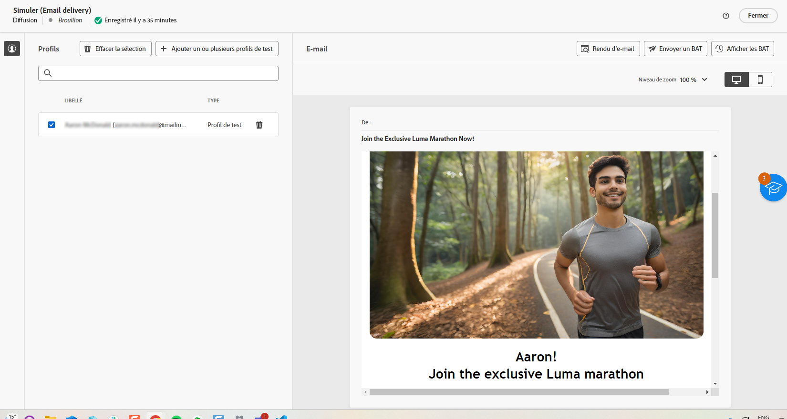

# Génération d’e-mails avec l’assistant IA {#generative-content}

>[!BEGINSHADEBOX]

**Table des matières**

* [Commencer avec l’assistant IA](generative-gs.md)
* **[Génération d’e-mails avec l’assistant IA](generative-content.md)**
* [Génération de SMS avec l’assistant IA](generative-sms.md)
* [Génération de notifications push avec l’assistant AI](generative-push.md)

>[!ENDSHADEBOX]

Une fois que vous avez créé et personnalisé vos e-mails, utilisez l’assistant IA optimisé par une IA générative de Journey Optimizer dans Campaign pour donner encore plus de poids à votre contenu.

L’assistant IA peut vous aider à optimiser l’impact de vos diffusions en suggérant un contenu différent et davantage susceptible de résonner auprès de votre audience.

>[!NOTE]
>
>Avant de commencer à utiliser cette fonctionnalité, lisez la section connexe [Mécanismes de sécurisation et limitations](generative-gs.md#guardrails-and-limitations).

## Génération de contenu avec l’assistant IA {#generative-text}

Voici comment votre assistant d’IA peut vous aider à rédiger des emails attrayants :

* **Résumé**: de longues informations peuvent surcharger les destinataires des emails. Utilisez l’assistant d’IA pour condenser des points clés en résumés clairs et concis qui attirent l’attention et les encourager à lire davantage.

* **Elaborate**: l’assistant d’IA peut vous aider à développer des sujets spécifiques, en fournissant des détails supplémentaires pour une meilleure compréhension et un meilleur engagement.

* **Simplification de la langue**: utilisez l’assistant d’IA pour simplifier votre langue, en assurant clarté et accessibilité pour une audience plus large.

* **Réphrase**: l’assistant d’IA peut reformuler votre message de différentes manières, en actualisant votre écriture et en l’adaptant à différents publics.

* **Modifier le ton**: le ton de votre email doit résonner auprès de votre audience. Que vous souhaitiez être informatif, ludique ou convaincant, l’assistant d’IA peut adapter le message en conséquence.

Dans l’exemple suivant, nous utiliserons l’assistant d’IA pour améliorer le contenu de notre invitation par courrier électronique pour notre événement à venir.

1. Après avoir créé et configuré votre diffusion e-mail, cliquez sur **[!UICONTROL Modifier le contenu]**.

   Pour plus d’informations sur la configuration de votre diffusion e-mail, consultez [cette page](../email/create-email-content.md).

1. Personnalisez votre email selon vos besoins et accédez au **[!UICONTROL Assistant IA]** .

   Vous pouvez également sélectionner un **[!UICONTROL composant de texte]** pour cibler uniquement un contenu spécifique.

   {zoomable=&quot;yes&quot;}

1. Activez la variable **[!UICONTROL Utiliser le contenu d’origine]** l’option de l’assistant d’IA pour personnaliser le nouveau contenu en fonction de votre diffusion, du nom de la diffusion et de l’audience sélectionnée.

   >[!IMPORTANT]
   >
   > Votre invite doit toujours être liée à un contexte spécifique en chargeant une ressource de marque ou en activant la fonction **[!UICONTROL Améliorer le contenu actuel]**.

1. Ajustez le contenu en décrivant ce que vous souhaitez générer dans le champ **[!UICONTROL Invite]**.

   Si vous avez besoin d’aide pour concevoir votre invite, accédez à la **[!UICONTROL Bibliothèque d’invites]** qui dispose d’un large éventail d’idées d’invites pour améliorer vos diffusions.

   {zoomable=&quot;yes&quot;}

1. Vous pouvez activer ou désactiver la fonction **[!UICONTROL Objet]** ou **[!UICONTROL Preheader]** pour les inclure à la génération des variantes.

   Notez que cette option est disponible si vous n’avez pas sélectionné de composant Texte spécifique.

1. Sélectionnez **[!UICONTROL Charger une ressource de marque]** pour ajouter toute ressource de marque incluant du contenu pouvant fournir du contexte supplémentaire à l’assistant IA.

   {zoomable=&quot;yes&quot;}

1. Adaptez les différentes options de votre invite :

   * **[!UICONTROL Stratégie de communication]**: sélectionnez l’approche de communication souhaitée pour le texte généré.
   * **[!UICONTROL Langue]**: choisissez la langue du contenu de la variante.
   * **[!UICONTROL Tone]**: assurez-vous que le texte est adapté à votre audience et à votre objectif.
   * **[!UICONTROL Length]**: sélectionnez la longueur de votre contenu à l’aide du curseur de plage. Disponible uniquement si vous avez sélectionné un composant Texte spécifique.

   {zoomable=&quot;yes&quot;}

1. Lorsque votre texte descriptif est prêt, cliquez sur **[!UICONTROL Générer]**.

1. Parcourir les **[!UICONTROL Variations]** et cliquez sur **[!UICONTROL Aperçu]** pour afficher une version plein écran de la variation sélectionnée.

1. Accédez au **[!UICONTROL Affiner]** dans la fonction **[!UICONTROL Aperçu]** pour accéder à d’autres fonctions de personnalisation et affiner votre variation en fonction de vos préférences.

   Cliquez sur **[!UICONTROL Sélectionner]** une fois que vous avez trouvé le contenu approprié.

   {zoomable=&quot;yes&quot;}

1. Insérez des champs de personnalisation pour personnaliser le contenu de votre e-mail en fonction des données de profil. Cliquez ensuite sur le bouton **[!UICONTROL Simulation du contenu]** pour contrôler le rendu et vérifier les paramètres de personnalisation avec les profils de test. [En savoir plus](../preview-test/preview-content.md)

   {zoomable=&quot;yes&quot;}

Lorsque vous avez défini le contenu, l’audience et le planning, vous pouvez préparer votre diffusion e-mail. [En savoir plus](../monitor/prepare-send.md)

## Génération d’images avec l’assistant IA {#generative-image}

Utilisez l’assistant d’IA pour générer des visuels variés et personnalisés pour vos campagnes par e-mail. Par exemple, il peut être utilisé pour :

* **Générer**: générez un large éventail d’images attrayantes spécialement conçues pour vos campagnes par e-mail. Un contrôle granulaire sur les paramètres tels que la palette de couleurs, l’éclair et la composition vous permet de résonner avec des segments d’audience distincts et d’atteindre vos objectifs de campagne uniques.

* **Générer un contenu similaire**: utilisez l’assistant d’IA pour générer des images similaires à partir d’une variante sélectionnée.

* **Ressource de marque**: optimisez la sélection d’images pour les campagnes par e-mail en exploitant à la fois les ressources de marque internes et les sources externes telles que Adobe Firefly.

Dans l’exemple ci-dessous, découvrez comment tirer parti de l’assistant IA pour optimiser et améliorer votre contenu, afin d’offrir une expérience plus conviviale. Procédez comme suit :

1. Après avoir créé et configuré votre diffusion e-mail, cliquez sur **[!UICONTROL Modifier le contenu]**.

   Pour plus d’informations sur la configuration de votre diffusion e-mail, consultez [cette page](../email/create-email-content.md).

1. Renseignez les **[!UICONTROL détails de base]** de votre diffusion. Une fois terminé, cliquez sur **[!UICONTROL Modifier le contenu de l’e-mail]**.

1. Sélectionnez la ressource à modifier à l’aide de l’assistant IA.

1. Dans le menu de droite, sélectionnez **[!UICONTROL Assistant IA]**.

   {zoomable=&quot;yes&quot;}

1. Ajustez le contenu en décrivant ce que vous souhaitez générer dans le champ **[!UICONTROL Invite]**.

   Si vous avez besoin d’aide pour concevoir votre invite, accédez à la **[!UICONTROL Bibliothèque d’invites]** qui dispose d’un large éventail d’idées d’invites pour améliorer vos diffusions.

   {zoomable=&quot;yes&quot;}

1. Sélectionnez **[!UICONTROL Charger une ressource de marque]** pour ajouter toute ressource de marque incluant du contenu pouvant fournir du contexte supplémentaire à l’assistant IA.

   >[!IMPORTANT]
   >
   > Votre invite doit toujours être liée à un contexte spécifique.

1. Adaptez les différentes options de votre invite :

   * **[!UICONTROL Format]**: détermine la largeur et la hauteur de la ressource. Vous avez la possibilité de choisir parmi des formats courants tels que 16:9, 4:3, 3:2 ou 1:1, ou vous pouvez saisir une taille personnalisée.
   * **[!UICONTROL Couleur et ton]**: l’aspect général des couleurs dans une image et l’humeur ou l’atmosphère qu’elle véhicule.
   * **[!UICONTROL Type de contenu]**: cette propriété classe la nature de l’élément visuel en faisant la distinction entre les différentes formes de représentation visuelle, telles que les photos, les graphiques ou les illustrations.
   * **[!UICONTROL Éclairage]**: fait référence à l’éclair présent dans une image, qui forme son atmosphère et met en évidence des éléments spécifiques.
   * **[!UICONTROL Composition]**: fait référence à la disposition des éléments dans le cadre d’une image.

   {zoomable=&quot;yes&quot;}

1. Quand la configuration de votre invite vous satisfait, cliquez sur **[!UICONTROL Générer]**.

1. Parcourez les **[!UICONTROL Suggestions de variation]** pour trouver la ressource souhaitée.

   Cliquez sur **[!UICONTROL Aperçu]** pour afficher une version plein écran de la variation sélectionnée.

   {zoomable=&quot;yes&quot;}

1. Choisissez **[!UICONTROL Afficher les images similaires]** si vous souhaitez afficher les images associées à cette variante.

1. Cliquez sur **[!UICONTROL Sélectionner]** une fois que vous avez trouvé le contenu approprié.

   {zoomable=&quot;yes&quot;}

1. Après avoir défini le contenu de votre message, cliquez sur le bouton **[!UICONTROL Simuler le contenu]** pour contrôler le rendu et vérifier les paramètres de personnalisation avec les profils de test.  [En savoir plus](../preview-test/preview-content.md)

   {zoomable=&quot;yes&quot;}

1. Lorsque vous avez défini le contenu, l’audience et le planning, vous pouvez préparer votre diffusion e-mail. [En savoir plus](../monitor/prepare-send.md)
