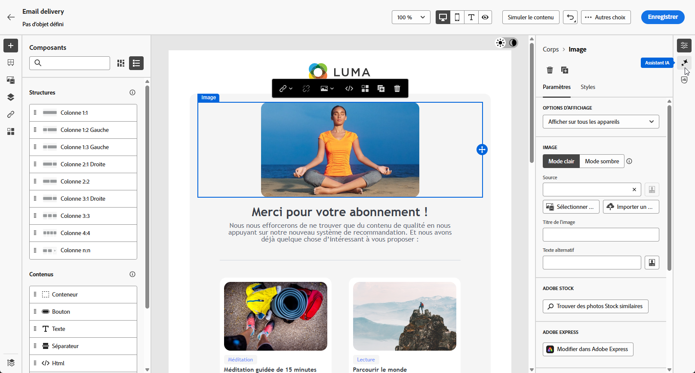

# Génération d’emails à l’aide de l’assistant AI {#generative-content}

>[!BEGINSHADEBOX]

**Table des matières**

* [Prise en main de l’assistant d’IA](generative-gs.md)
* **[Génération d’emails à l’aide de l’assistant AI](generative-content.md)**
* [Génération de SMS avec l’assistant d’IA](generative-sms.md)
* [Génération des notifications push à l’aide de l’assistant AI](generative-push.md)

>[!ENDSHADEBOX]

Une fois que vous avez créé et personnalisé vos emails, utilisez l’assistant Journey Optimizer AI dans Campaign, optimisé par l’IA générative, pour passer votre contenu au niveau supérieur.

L’assistant d’IA peut vous aider à optimiser l’impact de vos diffusions en suggérant un contenu différent plus susceptible de résonner auprès de votre audience.

>[!NOTE]
>
>Avant de commencer à utiliser cette fonctionnalité, lisez la section connexe [Mécanismes de sécurisation et limitations](generative-gs.md#guardrails-and-limitations).

## Génération de contenu à l’aide de l’assistant AI {#generative-text}

1. Après avoir créé et configuré votre diffusion e-mail, cliquez sur **[!UICONTROL Modifier le contenu]**.

   Pour plus d’informations sur la configuration de votre diffusion e-mail, consultez [cette page](../email/create-email-content.md).

1. Renseignez les **[!UICONTROL détails de base]** de votre diffusion. Une fois terminé, cliquez sur **[!UICONTROL Modifier le contenu]**.

1. Personnalisez votre email selon vos besoins. [En savoir plus](content-components.md)

1. Accédez au **[!UICONTROL Assistant IA]** .

   Vous pouvez également sélectionner une **[!UICONTROL Composant textuel]** pour cibler uniquement un contenu spécifique.

   {zoomable=&quot;yes&quot;}

1. Ajustez le contenu en décrivant ce que vous souhaitez générer dans la variable **[!UICONTROL Invite]** champ .

   Si vous avez besoin d’aide pour concevoir votre invite, accédez au **[!UICONTROL Invite Library]** qui offre un large éventail d’idées rapides pour améliorer vos diffusions.

   {zoomable=&quot;yes&quot;}

1. Activez/désactivez la variable **[!UICONTROL Objet]** ou **[!UICONTROL Preheader]** pour les inclure à la génération des variantes.

1. Dans le menu contextuel, activez la variable **[!UICONTROL Amélioration du contexte actuel]** l’option de l’assistant d’IA pour personnaliser le nouveau contenu en fonction de votre diffusion, du nom de la diffusion et de l’audience sélectionnée.

   >[!IMPORTANT]
   >
   > Votre invite doit toujours être liée à un contexte spécifique en chargeant une ressource de marque ou en activant la fonction **[!UICONTROL Amélioration du contenu actuel]** .

1. Cliquez sur **[!UICONTROL Chargement d’une ressource de marque]** pour ajouter toute ressource de marque contenant du contenu pouvant fournir un contexte supplémentaire à l’assistant d’IA.

   {zoomable=&quot;yes&quot;}

1. Sélectionnez la **[!UICONTROL Stratégie de communication]** qui répond le mieux à vos besoins. Cette dernière a une incidence sur la tonalité et le style du texte généré.

1. Choisissez la **[!UICONTROL Langue]** et le **[!UICONTROL Ton]** à donner au texte. Vous vous assurez ainsi que le texte est adapté à votre audience et à votre objectif.

   {zoomable=&quot;yes&quot;}

1. Lorsque votre texte descriptif est prêt, cliquez sur **[!UICONTROL Générer]**.

1. Parcourez les **[!UICONTROL Variations]** générées et cliquez sur **[!UICONTROL Appliquer]** une fois que vous avez trouvé le contenu approprié.

   Cliquez sur **[!UICONTROL Aperçu]** pour afficher une version plein écran de la variation sélectionnée.

   {zoomable=&quot;yes&quot;}

1. Insérez des champs de personnalisation pour personnaliser le contenu de votre e-mail en fonction des données de profil. [En savoir plus sur la personnalisation du contenu](../personalization/personalize.md).

   {zoomable=&quot;yes&quot;}

1. Après avoir défini le contenu de votre message, cliquez sur le bouton **[!UICONTROL Simuler le contenu]** pour contrôler le rendu et vérifier les paramètres de personnalisation avec les profils de test. [En savoir plus](../preview-test/preview-content.md)

   {zoomable=&quot;yes&quot;}

1. Lorsque vous avez défini le contenu, l’audience et le planning, vous pouvez préparer votre diffusion e-mail. [En savoir plus](../monitor/prepare-send.md)

## Génération d’images avec l’assistant d’IA {#generative-image}

Dans l’exemple ci-dessous, découvrez comment tirer parti de l’assistant d’IA pour optimiser et améliorer votre contenu, afin d’offrir une expérience plus conviviale. Procédez comme suit :

1. Après avoir créé et configuré votre diffusion e-mail, cliquez sur **[!UICONTROL Modifier le contenu]**.

   Pour plus d’informations sur la configuration de votre diffusion e-mail, consultez [cette page](../email/create-email-content.md).

1. Renseignez les **[!UICONTROL détails de base]** de votre diffusion. Une fois terminé, cliquez sur **[!UICONTROL Modifier le contenu de l’e-mail]**.

1. Sélectionnez la ressource que vous souhaitez modifier à l’aide de l’assistant AI.

1. Dans le menu de droite, sélectionnez **[!UICONTROL Assistant IA]**.

   {zoomable=&quot;yes&quot;}

1. Ajustez le contenu en décrivant ce que vous souhaitez générer dans la variable **[!UICONTROL Invite]** champ .

   Si vous avez besoin d’aide pour concevoir votre invite, accédez au **[!UICONTROL Invite Library]** qui offre un large éventail d’idées rapides pour améliorer vos diffusions.

   {zoomable=&quot;yes&quot;}

1. Cliquez sur **[!UICONTROL Chargement d’une ressource de marque]** pour ajouter toute ressource de marque contenant du contenu pouvant fournir un contexte supplémentaire à l’assistant d’IA.

   >[!IMPORTANT]
   >
   > Votre invite doit toujours être liée à un contexte spécifique.

1. Sélectionnez le **[!UICONTROL Format]** de votre ressource. Vous déterminez ainsi la largeur et la hauteur de la ressource.

   Vous avez la possibilité de choisir parmi des rapports communs tels que 16:9, 4:3, 3:2 ou 1:1, ou vous pouvez saisir une taille personnalisée.

1. Personnalisez les paramètres **[!UICONTROL Couleur et ton]**, **[!UICONTROL Type de contenu]**, **[!UICONTROL Éclairage]** et **[!UICONTROL Composition]** en fonction des caractéristiques de votre ressource.

   {zoomable=&quot;yes&quot;}

1. Quand la configuration rapide vous satisfait, cliquez sur **[!UICONTROL Générer]**.

1. Parcourez les **[!UICONTROL Suggestions de variation]** pour trouver la ressource souhaitée.

   Cliquez sur **[!UICONTROL Aperçu]** pour afficher une version plein écran de la variation sélectionnée.

   {zoomable=&quot;yes&quot;}

1. Choisir **[!UICONTROL Afficher le même]** si vous souhaitez afficher les images associées à cette variante.

1. Cliquez sur **[!UICONTROL Sélectionner]** une fois que vous avez trouvé le contenu approprié.

   {zoomable=&quot;yes&quot;}

1. Après avoir défini le contenu de votre message, cliquez sur le bouton **[!UICONTROL Simuler le contenu]** pour contrôler le rendu et vérifier les paramètres de personnalisation avec les profils de test.  [En savoir plus](../preview-test/preview-content.md)

   {zoomable=&quot;yes&quot;}

1. Lorsque vous avez défini le contenu, l’audience et le planning, vous pouvez préparer votre diffusion e-mail. [En savoir plus](../monitor/prepare-send.md)
