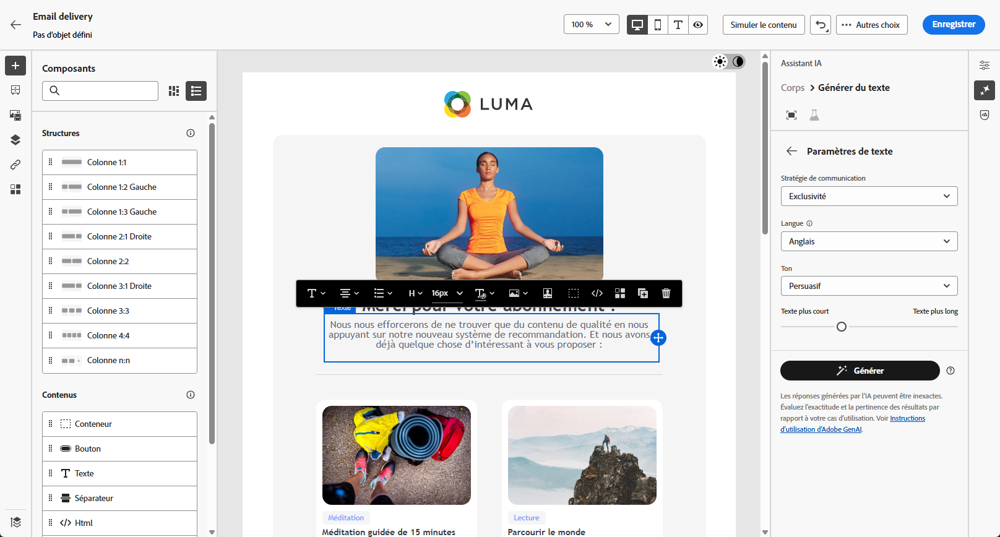

# Génération d’e-mails avec l’assistant IA {#generative-content}

>[!BEGINSHADEBOX]

**Table des matières**

* [Commencer avec l’assistant IA](generative-gs.md)
* **[Génération d’e-mails avec l’assistant IA](generative-content.md)**
* [Génération de SMS avec l’assistant IA](generative-sms.md)
* [Génération de notifications push avec l’assistant AI](generative-push.md)

>[!ENDSHADEBOX]

Une fois que vous avez créé et personnalisé vos e-mails, utilisez l’assistant IA optimisé par une IA générative de Journey Optimizer dans Campaign pour donner encore plus de poids à votre contenu.

L’assistant IA peut vous aider à optimiser l’impact de vos diffusions en suggérant un contenu différent et davantage susceptible de résonner auprès de votre audience.

>[!NOTE]
>
>Avant de commencer à utiliser cette fonctionnalité, lisez la section connexe [Mécanismes de sécurisation et limitations](generative-gs.md#guardrails-and-limitations).

## Génération de contenu avec l’assistant IA {#generative-text}

1. Après avoir créé et configuré votre diffusion e-mail, cliquez sur **[!UICONTROL Modifier le contenu]**.

   Pour plus d’informations sur la configuration de votre diffusion e-mail, consultez [cette page](../email/create-email-content.md).

1. Renseignez les **[!UICONTROL détails de base]** de votre diffusion. Une fois terminé, cliquez sur **[!UICONTROL Modifier le contenu]**.

1. Personnalisez votre e-mail selon vos besoins. [En savoir plus](content-components.md)

1. Accédez au menu **[!UICONTROL Assistant IA]**.

   Vous pouvez également sélectionner un **[!UICONTROL composant de texte]** pour cibler uniquement un contenu spécifique.

   {zoomable=&quot;yes&quot;}

1. Ajustez le contenu en décrivant ce que vous souhaitez générer dans le champ **[!UICONTROL Invite]**.

   Si vous avez besoin d’aide pour concevoir votre invite, accédez à la **[!UICONTROL bibliothèque d’invites]** qui offre un large éventail d’idées rapides pour améliorer vos diffusions.

   {zoomable=&quot;yes&quot;}

1. Activez l’**[!UICONTROL Objet]** ou le **[!UICONTROL Pré-en-tête]** pour les inclure à la génération des variantes.

1. Dans le menu Contexte, activez l’option **[!UICONTROL Améliorer avec le contexte actuel]** de l’assistant IA afin de personnaliser le nouveau contenu en fonction de votre diffusion, de son nom et de l’audience sélectionnée.

   >[!IMPORTANT]
   >
   > Votre invite doit toujours être liée à un contexte spécifique en chargeant une ressource de marque ou en activant la fonction **[!UICONTROL Améliorer le contenu actuel]**.

1. Sélectionnez **[!UICONTROL Charger une ressource de marque]** pour ajouter toute ressource de marque incluant du contenu pouvant fournir du contexte supplémentaire à l’assistant IA.

   {zoomable=&quot;yes&quot;}

1. Sélectionnez la **[!UICONTROL Stratégie de communication]** qui répond le mieux à vos besoins. Cette dernière a une incidence sur la tonalité et le style du texte généré.

1. Choisissez la **[!UICONTROL Langue]** et le **[!UICONTROL Ton]** à donner au texte. Vous vous assurez ainsi que le texte est adapté à votre audience et à votre objectif.

   {zoomable=&quot;yes&quot;}

1. Lorsque votre texte descriptif est prêt, cliquez sur **[!UICONTROL Générer]**.

1. Parcourez les **[!UICONTROL Variations]** générées et cliquez sur **[!UICONTROL Appliquer]** une fois que vous avez trouvé le contenu approprié.

   Cliquez sur **[!UICONTROL Aperçu]** pour afficher une version plein écran de la variation sélectionnée.

   {zoomable=&quot;yes&quot;}

1. Insérez des champs de personnalisation pour personnaliser le contenu de votre e-mail en fonction des données de profil. [En savoir plus sur la personnalisation du contenu](../personalization/personalize.md).

   {zoomable=&quot;yes&quot;}

1. Après avoir défini le contenu de votre message, cliquez sur le bouton **[!UICONTROL Simuler le contenu]** pour contrôler le rendu et vérifier les paramètres de personnalisation avec les profils de test. [En savoir plus](../preview-test/preview-content.md)

   {zoomable=&quot;yes&quot;}

1. Lorsque vous avez défini le contenu, l’audience et le planning, vous pouvez préparer votre diffusion e-mail. [En savoir plus](../monitor/prepare-send.md)

## Génération d’images avec l’assistant IA {#generative-image}

Dans l’exemple ci-dessous, découvrez comment tirer parti de l’assistant IA pour optimiser et améliorer votre contenu, afin d’offrir une expérience plus conviviale. Procédez comme suit :

1. Après avoir créé et configuré votre diffusion e-mail, cliquez sur **[!UICONTROL Modifier le contenu]**.

   Pour plus d’informations sur la configuration de votre diffusion e-mail, consultez [cette page](../email/create-email-content.md).

1. Renseignez les **[!UICONTROL détails de base]** de votre diffusion. Une fois terminé, cliquez sur **[!UICONTROL Modifier le contenu de l’e-mail]**.

1. Sélectionnez la ressource à modifier à l’aide de l’assistant IA.

1. Dans le menu de droite, sélectionnez **[!UICONTROL Assistant IA]**.

   {zoomable=&quot;yes&quot;}

1. Ajustez le contenu en décrivant ce que vous souhaitez générer dans le champ **[!UICONTROL Invite]**.

   Si vous avez besoin d’aide pour rédiger votre invite, accédez à la **[!UICONTROL Bibliothèque d’invites]** qui dispose d’un large éventail d’idées d’invites pour améliorer vos diffusions.

   {zoomable=&quot;yes&quot;}

1. Sélectionnez **[!UICONTROL Charger une ressource de marque]** pour ajouter toute ressource de marque incluant du contenu pouvant fournir du contexte supplémentaire à l’assistant IA.

   >[!IMPORTANT]
   >
   > Votre invite doit toujours être liée à un contexte spécifique.

1. Sélectionnez le **[!UICONTROL Format]** de votre ressource. Vous déterminez ainsi la largeur et la hauteur de la ressource.

   Vous avez la possibilité de choisir parmi des formats courants tels que 16:9, 4:3, 3:2 ou 1:1, ou vous pouvez saisir une taille personnalisée.

1. Personnalisez les paramètres **[!UICONTROL Couleur et ton]**, **[!UICONTROL Type de contenu]**, **[!UICONTROL Éclairage]** et **[!UICONTROL Composition]** en fonction des caractéristiques voulues pour votre ressource.

   {zoomable=&quot;yes&quot;}

1. Quand la configuration de votre invite vous satisfait, cliquez sur **[!UICONTROL Générer]**.

1. Parcourez les **[!UICONTROL Suggestions de variation]** pour trouver la ressource souhaitée.

   Cliquez sur **[!UICONTROL Aperçu]** pour afficher une version plein écran de la variation sélectionnée.

   {zoomable=&quot;yes&quot;}

1. Choisissez **[!UICONTROL Afficher les images similaires]** si vous souhaitez afficher les images associées à cette variante.

1. Cliquez sur **[!UICONTROL Sélectionner]** une fois que vous avez trouvé le contenu approprié.

   {zoomable=&quot;yes&quot;}

1. Après avoir défini le contenu de votre message, cliquez sur le bouton **[!UICONTROL Simuler le contenu]** pour contrôler le rendu et vérifier les paramètres de personnalisation avec les profils de test.  [En savoir plus](../preview-test/preview-content.md)

   {zoomable=&quot;yes&quot;}

1. Lorsque vous avez défini le contenu, l’audience et le planning, vous pouvez préparer votre diffusion e-mail. [En savoir plus](../monitor/prepare-send.md)
