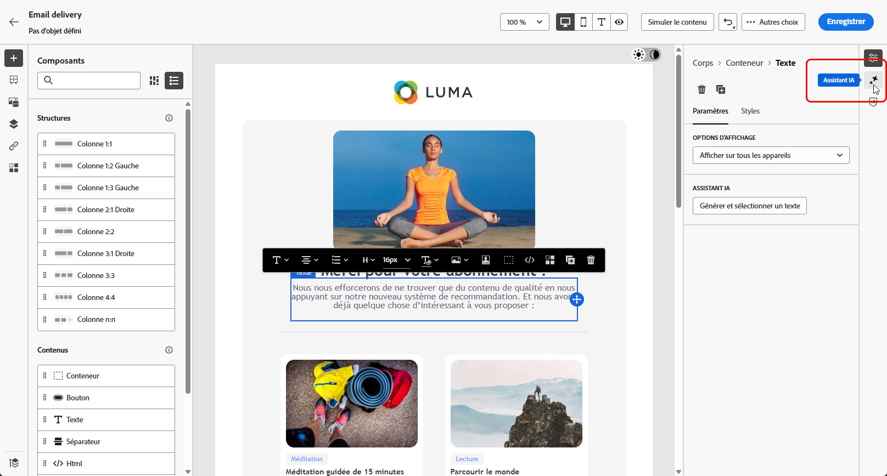
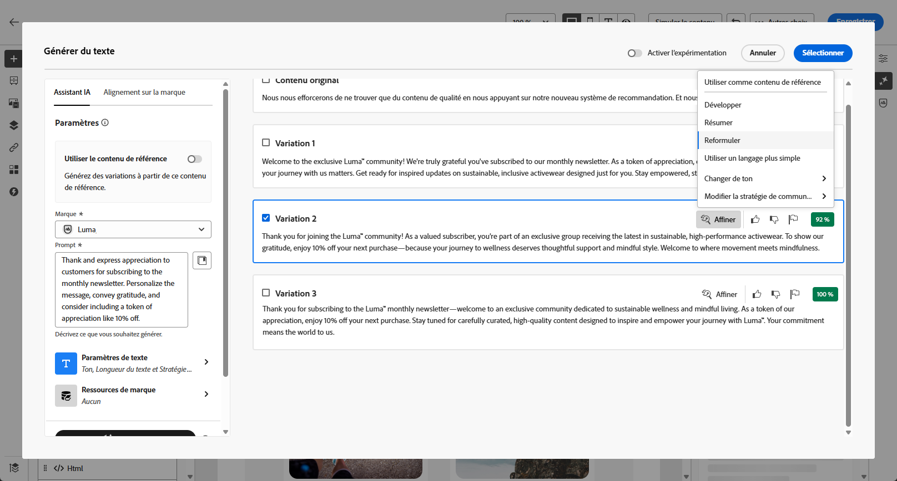
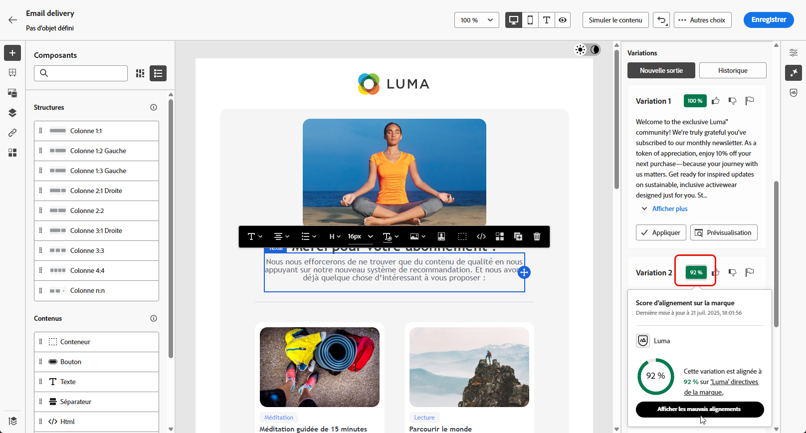

# Génération de texte avec l’assistant de contenu {#generative-content}

Une fois que vous avez créé et personnalisé vos e-mails, utilisez l’assistant de contenu optimisé par l’IA générative pour donner encore plus de poids à votre contenu.

L’assistant de contenu peut vous aider à optimiser l’impact de vos diffusions en suggérant un contenu différent et davantage susceptible de résonner auprès de votre audience.

>[!NOTE]
>
>Avant de commencer à utiliser cette fonctionnalité, lisez la section connexe [Mécanismes de sécurisation et limitations](generative-gs.md#guardrails-and-limitations).

Pour générer et améliorer le contenu d’un e-mail à l’aide de l’assistant de contenu, procédez comme suit. Vous pouvez également créer du contenu HTML complet avec l’assistant de contenu, comme décrit sur [cette page](generative-email.md).

1. Après avoir créé et configuré votre diffusion e-mail, cliquez sur **[!UICONTROL Modifier le contenu]**.

   Pour plus d’informations sur la configuration de votre diffusion e-mail, consultez [cette page](../email/create-email-content.md).

1. Renseignez les **[!UICONTROL détails de base]** de votre diffusion. Une fois terminé, cliquez sur **[!UICONTROL Modifier le contenu de l’e-mail]**.

1. Personnalisez votre e-mail selon vos besoins.

1. Sélectionnez le **[!UICONTROL Composant de texte]** à mettre à jour et accédez au menu Génération d’expérience.

   {zoomable=&quot;yes&quot;}

1. Ajustez le contenu en décrivant ce que vous souhaitez générer.

   Activez l’option **[!UICONTROL Améliorer avec le contexte actuel]** de l’assistant de contenu afin de personnaliser le nouveau contenu en fonction de votre diffusion, de son nom et de l’audience sélectionnée.

   {zoomable=&quot;yes&quot;}

1. Sélectionnez **[!UICONTROL Charger le fichier]** pour ajouter toute ressource de marque ayant du contenu pouvant fournir un contexte supplémentaire à l’assistant de contenu.

   Cliquez également sur **[!UICONTROL Contenu chargé]** pour rechercher des fichiers mis à jour précédemment. Notez que le contenu chargé est exclusivement disponible pour réutilisation par l’utilisateur ou l’utilisatrice en cours.

1. Sélectionnez la **[!UICONTROL Stratégie de communication]** qui répond le mieux à vos besoins. Cette dernière a une incidence sur la tonalité et le style du texte généré.

1. Choisissez la **[!UICONTROL Langue]** et le **[!UICONTROL Ton]** à donner au texte. Vous vous assurez ainsi que le texte est adapté à votre audience et à votre objectif.

   {zoomable=&quot;yes&quot;}

1. Utilisez le curseur pour définir la longueur du texte généré.

1. Lorsque votre texte descriptif est prêt, cliquez sur **[!UICONTROL Générer]**.

1. Parcourez les **[!UICONTROL Variations]** générées et cliquez sur **[!UICONTROL Appliquer]** une fois que vous avez trouvé le contenu approprié.

   {zoomable=&quot;yes&quot;}

1. Insérez des champs de personnalisation pour personnaliser le contenu de votre e-mail en fonction des données de profil. [En savoir plus sur la personnalisation du contenu](../personalization/personalize.md).

   {zoomable=&quot;yes&quot;}

1. Après avoir défini le contenu de votre message, cliquez sur le bouton **[!UICONTROL Simuler le contenu]** pour contrôler le rendu et vérifier les paramètres de personnalisation avec les profils de test. [En savoir plus](../preview-test/preview-content.md)

   {zoomable=&quot;yes&quot;}

1. Lorsque vous avez défini le contenu, l’audience et le planning, vous pouvez préparer votre diffusion e-mail. [En savoir plus](../monitor/prepare-send.md)
