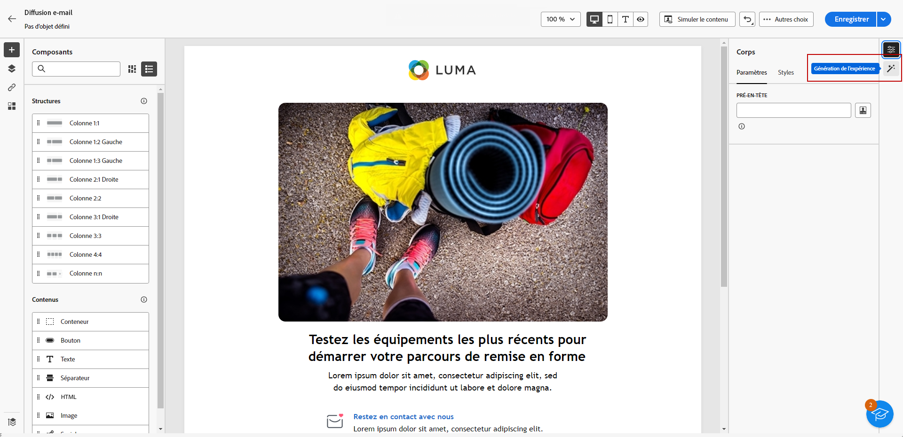
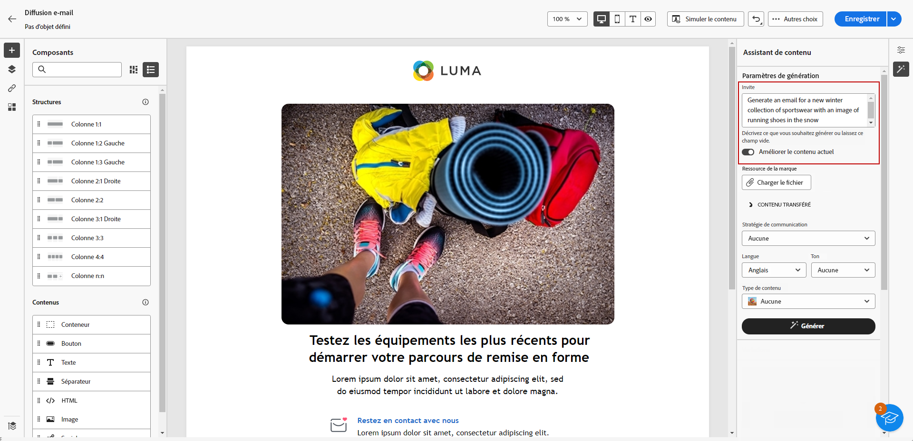
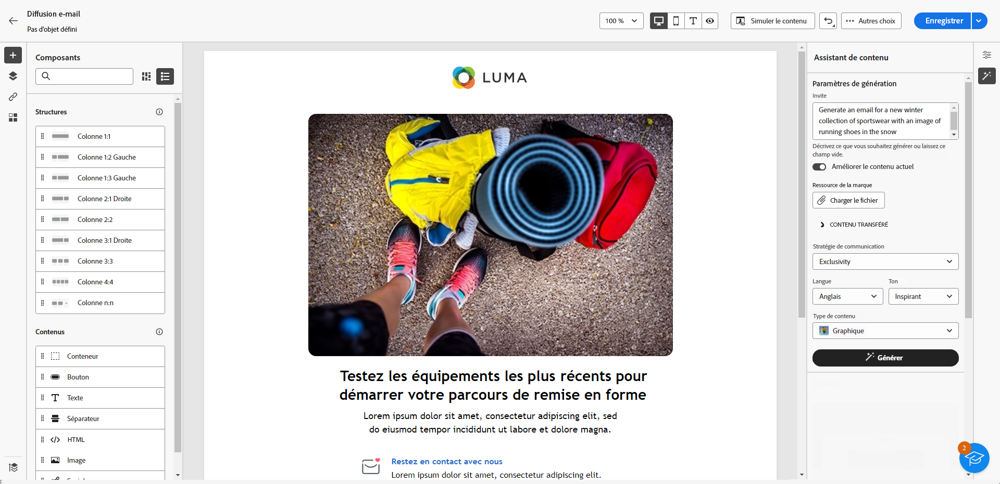
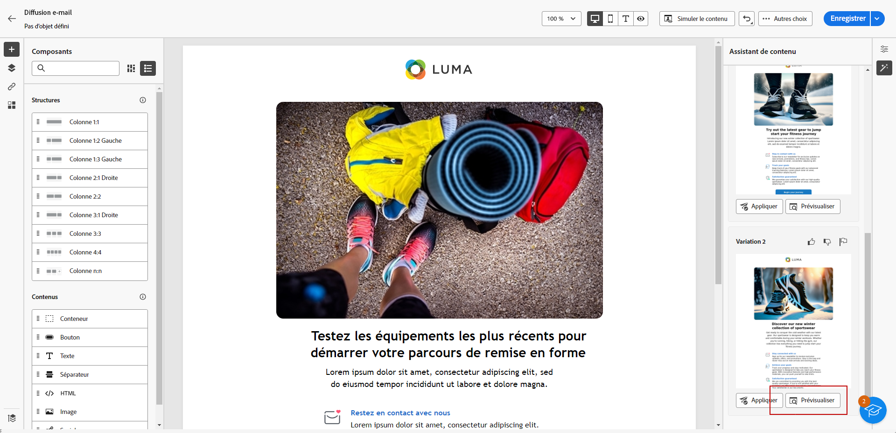
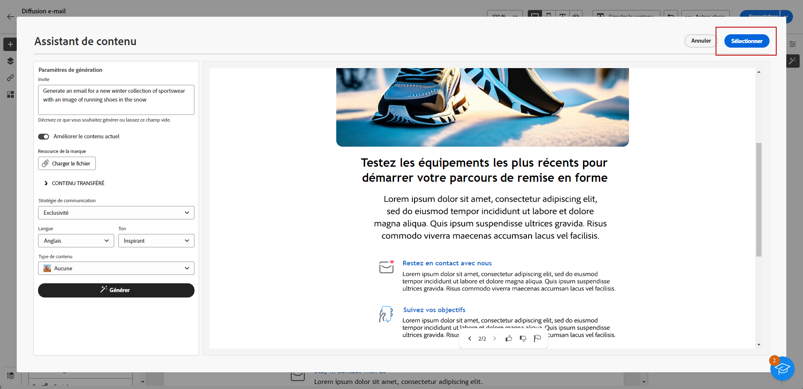
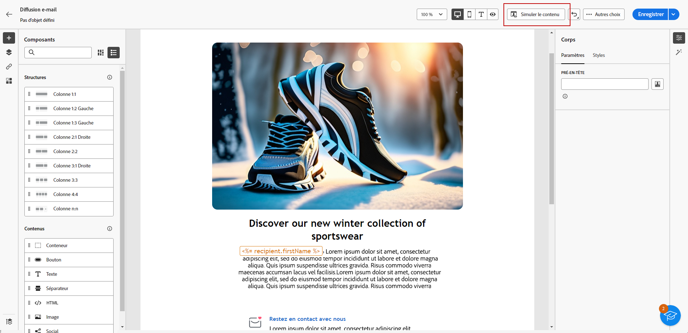

# Générer un e-mail avec l’assistant IA {#generative-email}

L’assistant IA dans Campaign améliore l’impact de votre communication en générant automatiquement un contenu d’e-mail complet, ce qui vous permet de gagner du temps et de garantir une qualité constante. Grâce à l’IA générative, vous pouvez créer facilement des e-mails attrayants qui résonnent auprès de votre audience, rendant ainsi votre communication plus efficace.

>[!NOTE]
>
>Avant de commencer à utiliser cette fonctionnalité, lisez la section connexe [Mécanismes de sécurisation et limitations](generative-gs.md#guardrails-and-limitations).

Pour générer le contenu d’un e-mail avec l’assistant IA, procédez comme suit. Vous pouvez également améliorer du contenu existant avec l’assistant IA, comme expliqué sur [cette page](generative-content.md).

1. Après avoir créé et configuré votre diffusion E-mail, cliquez sur **[!UICONTROL Créer un contenu]**.

   Pour plus d’informations sur la configuration de votre diffusion e-mail, consultez [cette page](../email/create-email-content.md).

1. Renseignez les **[!UICONTROL détails de base]** de votre diffusion. Une fois terminé, cliquez sur **[!UICONTROL Modifier le corps de l’e-mail]**.

1. Sélectionnez le modèle de conception sur lequel vous souhaitez que l’assistant IA base l’e-mail généré.

   Vous pouvez également importer un fichier HTML.

1. Dans le menu de droite, sélectionnez **[!UICONTROL Génération de l’expérience]**.

   {zoomable=&quot;yes&quot;}

1. Ajustez le contenu en décrivant ce que vous souhaitez générer.

   Voici quelques exemples de texte descriptif :

   * Pour une newsletter : générez une newsletter mensuelle comprenant des articles sur des voyages, des indications clés sur les destinations et des offres exclusives réservées aux personnes abonnées.
   * Pour les commentaires et les enquêtes : créez un e-mail invitant les clientes et clients à fournir des commentaires sur leur expérience logicielle récente et à participer à un questionnaire d’amélioration des produits.
   * Pour les e-mails d’anniversaire : générez un e-mail d’anniversaire, célébrez le jour spécial du client ou de la cliente et offrez-lui une remise.

   {zoomable=&quot;yes&quot;}

1. Sélectionnez **[!UICONTROL Charger un fichier]** pour ajouter une ressource de marque incluant du contenu pouvant fournir du contexte supplémentaire à l’assistant IA.

   Cliquez également sur **[!UICONTROL Contenu chargé]** pour rechercher des fichiers mis à jour précédemment. Notez que le contenu chargé est exclusivement disponible pour réutilisation par l’utilisateur ou l’utilisatrice en cours.

1. Sélectionnez la **[!UICONTROL Stratégie de communication]** qui répond le mieux à vos besoins. Cette étape a une incidence sur le ton et le style de l’e-mail généré.

1. Choisissez la **[!UICONTROL Langue]** et le **[!UICONTROL Ton]** à donner au texte. Vous vous assurez ainsi que le texte est adapté à votre audience et à votre objectif.

   {zoomable=&quot;yes&quot;}

1. Personnalisez les paramètres de ressources **[!UICONTROL Type de contenu]** de sorte à les faire correspondre aux caractéristiques de ressources souhaitées.

1. Lorsque votre texte descriptif est prêt, cliquez sur **[!UICONTROL Générer]**.

1. Parcourez les **[!UICONTROL Suggestions de variation]** pour trouver l’e-mail de votre choix. Cliquez sur **[!UICONTROL Aperçu]** pour afficher une version plein écran de la variation sélectionnée.

   {zoomable=&quot;yes&quot;}

1. Cliquez sur **[!UICONTROL Sélectionner]** une fois que vous avez trouvé le contenu approprié.

   {zoomable=&quot;yes&quot;}

1. Insérez des champs de personnalisation pour personnaliser le contenu de votre e-mail en fonction des données de profil ou personnalisez davantage votre contenu, si nécessaire. [En savoir plus sur la personnalisation du contenu](../personalization/personalize.md).

1. Après avoir défini le contenu de votre e-mail, cliquez sur le bouton **[!UICONTROL Simuler le contenu]** pour contrôler le rendu et vérifier les paramètres de personnalisation avec les profils de test. [En savoir plus](../preview-test/preview-content.md)

   {zoomable=&quot;yes&quot;}

1. Lorsque vous avez défini le contenu, l’audience et le planning, vous pouvez préparer votre diffusion e-mail. [En savoir plus](../monitor/prepare-send.md)
