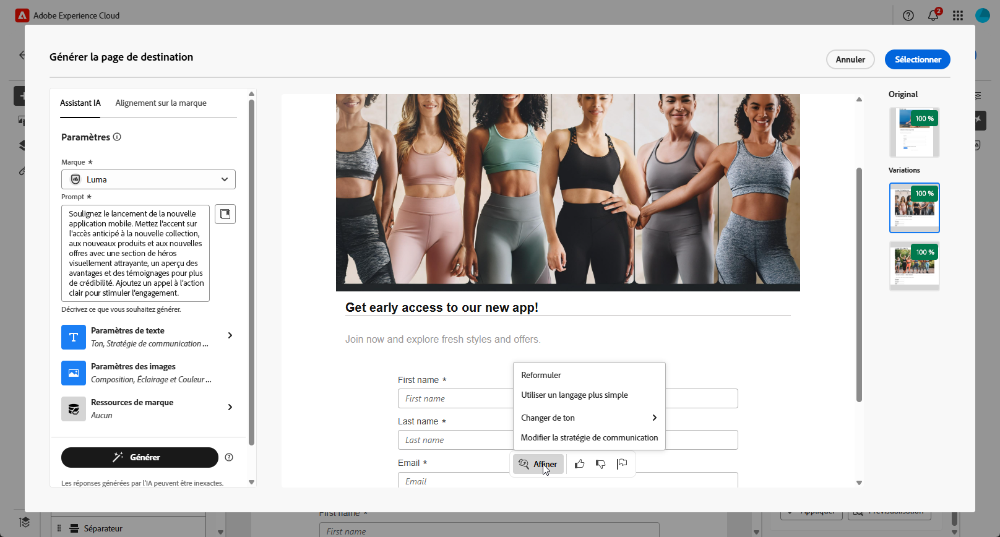
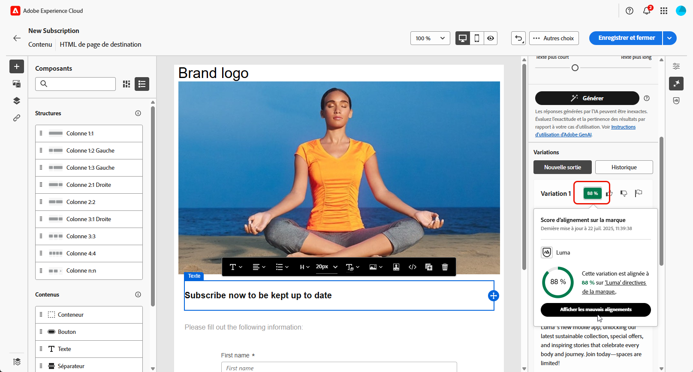

# Génération de pages de destination avec l’assistant AI{#generative-lp}

>[!IMPORTANT]
>
>Avant de commencer à utiliser cette fonctionnalité, lisez les [Mécanismes de sécurisation et limites](generative-gs.md#generative-guardrails) associés.
> 
>
>Vous devez accepter un [contrat utilisateur](https://www.adobe.com/fr/legal/licenses-terms/adobe-dx-gen-ai-user-guidelines.html) avant de pouvoir utiliser l’assistant AI dans Adobe Campaign Web. Pour plus d’informations, contactez votre représentant ou représentante Adobe.

Transformez vos pages de destination avec l’assistant AI dans Adobe Campaign Web, optimisé par l’IA générative.

Créez sans effort du contenu à fort impact, y compris des pages complètes, des fragments de texte sur mesure et des visuels personnalisés qui correspondent à votre audience, ce qui entraîne un engagement et une interaction accrus.

Explorez les onglets ci-dessous pour savoir comment utiliser l’assistant AI dans Adobe Campaign Web.

>[!BEGINTABS]

>[!TAB Génération d’une page de destination complète]

Dans l’exemple suivant, découvrez comment tirer parti de l’assistant AI pour affiner un modèle de page de destination existant.

1. Après avoir créé et configuré votre page de destination, cliquez sur **[!UICONTROL Modifier le contenu]**.

   Pour plus d’informations sur la configuration de votre page de destination, consultez [cette page](../landing-pages/create-lp.md).

1. Personnalisez votre disposition selon vos besoins et accédez au menu **[!UICONTROL Assistant IA]**.

   {zoomable="yes"}

1. Activez l’option **[!UICONTROL Utiliser le contenu d’origine]** pour que l’assistant AI personnalise le nouveau contenu en fonction du contenu sélectionné.

1. Ajustez le contenu en décrivant ce que vous souhaitez générer dans le champ **[!UICONTROL Invite]**.

   Si vous avez besoin d&#39;aide pour concevoir votre invite, accédez à la **[!UICONTROL bibliothèque d&#39;invites]**, qui fournit un large éventail d&#39;idées d&#39;invites pour améliorer votre page de destination.

   {zoomable="yes"}

1. Adaptez votre prompt avec les options **[!UICONTROL Paramètres de texte]** :

   * **[!UICONTROL Stratégie de communication]** : choisissez le style de communication le plus adapté au texte généré.
   * **[!UICONTROL Ton]** : le ton de votre page de destination doit correspondre à votre audience. Que vous souhaitiez donner une impression informative, ludique ou convaincante, AI Assistant peut adapter le message en conséquence.

   {zoomable="yes"}

1. Choisissez vos **[!UICONTROL Paramètres d’image]** :

   * **[!UICONTROL Type de contenu]** : catégorisez la nature de l’élément visuel en faisant la distinction entre différentes formes de représentation visuelle, telles que des photos, des graphiques ou des œuvres d’art.
   * **[!UICONTROL Intensité visuelle]** : contrôlez l’impact de l’image en ajustant son intensité. Un réglage inférieur (2) crée un aspect plus doux, tandis qu&#39;un réglage supérieur (10) rend l&#39;image plus vibrante.
   * **[!UICONTROL Couleur et ton]** : ajustez l’aspect général des couleurs dans une image et l’ambiance ou l’atmosphère qu’elle véhicule.
   * **[!UICONTROL Éclairage]** : modifiez l’éclairage présent dans une image pour façonner son atmosphère et mettre en évidence des éléments spécifiques.
   * **[!UICONTROL Composition]** : disposez les éléments dans le cadre d’une image.

   {zoomable="yes"}

1. Dans le menu **[!UICONTROL Ressources de marque]**, cliquez sur **[!UICONTROL Charger une ressource de marque]** pour ajouter une ressource de marque qui fournit un contexte supplémentaire à l’assistant AI, ou sélectionnez-en une précédemment chargée.

   Les fichiers précédemment chargés sont disponibles dans la liste déroulante **[!UICONTROL Ressources de marque chargées]**. Activez/désactivez les ressources que vous souhaitez inclure dans votre génération.

   {zoomable="yes"}

1. Lorsque votre invite est prête, cliquez sur **[!UICONTROL Générer]**.

1. Parcourez les **[!UICONTROL Variations]** générées, puis cliquez sur **[!UICONTROL Aperçu]** pour afficher une version en plein écran de la variation sélectionnée.

1. Naviguez vers l’option **[!UICONTROL Affiner]** dans la fenêtre **[!UICONTROL Aperçu]** pour accéder à d’autres fonctionnalités de personnalisation :

   * **[!UICONTROL Reformuler]** : l’assistant d’IA peut reformuler votre message de différentes manières, ce qui vous permet d’écrire des textes frais et attrayants pour diverses audiences.
   * **[!UICONTROL Utiliser un langage plus simple]** : simplifiez votre langue pour garantir la clarté et l’accessibilité pour une audience plus large.

   Vous pouvez également modifier le **[!UICONTROL Ton]** et la **[!UICONTROL Stratégie de communication]** de votre texte.

   {zoomable="yes"}

1. Cliquez sur **[!UICONTROL Sélectionner]** une fois que vous avez trouvé le contenu approprié.

1. Insérez des champs de personnalisation pour personnaliser le contenu de votre page de destination en fonction des données de profil. Cliquez ensuite sur le bouton **[!UICONTROL Simuler du contenu]** pour contrôler le rendu et vérifier les paramètres de personnalisation avec les profils de test. [En savoir plus](../landing-pages/create-lp.md#test-landing-page)

Une fois votre page de destination prête, publiez-la pour la rendre disponible dans un message. [En savoir plus](../landing-pages/create-lp.md#publish-landing-page)

>[!TAB Génération de texte uniquement]

Dans l’exemple suivant, découvrez comment tirer parti de l’assistant AI pour améliorer le contenu de votre page de destination.

1. Après avoir créé et configuré votre page de destination, cliquez sur **[!UICONTROL Modifier le contenu]**.

   Pour plus d’informations sur la configuration de votre page de destination, consultez [cette page](../landing-pages/create-lp.md).

1. Sélectionnez un **[!UICONTROL composant de texte]** pour cibler un contenu spécifique, puis accédez au menu **[!UICONTROL Assistant IA]**.

   {zoomable="yes"}

1. Activez l’option **[!UICONTROL Utiliser le contenu d’origine]** pour que l’assistant AI personnalise le nouveau contenu en fonction du contenu sélectionné.

1. Ajustez le contenu en décrivant ce que vous souhaitez générer dans le champ **[!UICONTROL Invite]**.

   Si vous avez besoin d&#39;aide pour concevoir votre invite, accédez à la **[!UICONTROL bibliothèque d&#39;invites]**, qui fournit un large éventail d&#39;idées d&#39;invites pour améliorer vos pages de destination.

   {zoomable="yes"}

1. Adaptez votre prompt avec les options **[!UICONTROL Paramètres de texte]** :

   * **[!UICONTROL Stratégie de communication]** : choisissez le style de communication le plus adapté au texte généré.
   * **[!UICONTROL Ton]** : le ton de votre page de destination doit correspondre à votre audience. Que vous souhaitiez donner une impression informative, ludique ou convaincante, AI Assistant peut adapter le message en conséquence.
   * **Longueur de texte** : utilisez le curseur pour sélectionner la longueur souhaitée de votre texte.

   {zoomable="yes"}

1. Dans le menu **[!UICONTROL Ressources de marque]**, cliquez sur **[!UICONTROL Charger une ressource de marque]** pour ajouter une ressource de marque qui fournit un contexte supplémentaire à l’assistant AI, ou sélectionnez-en une précédemment chargée.

   Les fichiers précédemment chargés sont disponibles dans la liste déroulante **[!UICONTROL Ressources de marque chargées]**. Activez/désactivez les ressources que vous souhaitez inclure dans votre génération.

   {zoomable="yes"}

1. Lorsque votre invite est prête, cliquez sur **[!UICONTROL Générer]**.

1. Parcourez les **[!UICONTROL Variations]** générées, puis cliquez sur **[!UICONTROL Aperçu]** pour afficher une version en plein écran de la variation sélectionnée.

1. Naviguez vers l’option **[!UICONTROL Affiner]** dans la fenêtre **[!UICONTROL Aperçu]** pour accéder à d’autres fonctionnalités de personnalisation :

   * **[!UICONTROL Utiliser comme contenu de référence]** : la variante choisie servira de contenu de référence pour générer d’autres résultats.
   * **[!UICONTROL Développer]** : permet de développer des sujets spécifiques, en fournissant des détails supplémentaires pour une meilleure compréhension et un meilleur engagement.
   * **[!UICONTROL Résumer]** : condensez les informations volumineuses en résumés clairs et concis qui retiennent l’attention et encouragent la lecture.
   * **[!UICONTROL Reformuler]** : reformuler votre message de différentes manières, en gardant votre écriture fraîche et attrayante pour divers publics.
   * **[!UICONTROL Utiliser un langage plus simple]** : simplifiez votre langue pour garantir la clarté et l’accessibilité pour une audience plus large.

   Vous pouvez également modifier le **[!UICONTROL Ton]** et la **[!UICONTROL Stratégie de communication]** de votre texte.

   {zoomable="yes"}

1. Cliquez sur **[!UICONTROL Sélectionner]** une fois que vous avez trouvé le contenu approprié.

1. Insérez des champs de personnalisation pour personnaliser le contenu de votre page de destination en fonction des données de profil. Cliquez ensuite sur le bouton **[!UICONTROL Simuler du contenu]** pour contrôler le rendu et vérifier les paramètres de personnalisation avec les profils de test. [En savoir plus](../landing-pages/create-lp.md#test-landing-page)

Une fois votre page de destination prête, publiez-la pour la rendre disponible dans un message. [En savoir plus](../landing-pages/create-lp.md#publish-landing-page)

>[!TAB Génération d’image uniquement]

Dans l’exemple ci-dessous, découvrez comment tirer parti de l’assistant AI pour optimiser et améliorer vos ressources, offrant ainsi une expérience plus conviviale.

1. Après avoir créé et configuré votre page de destination, cliquez sur **[!UICONTROL Modifier le contenu]**.

   Pour plus d’informations sur la configuration de votre page de destination, consultez [cette page](../landing-pages/create-lp.md).

1. Sélectionnez la ressource à modifier à l’aide de l’assistant AI.

1. Dans le menu de droite, sélectionnez **[!UICONTROL Assistant IA]**.

   {zoomable="yes"}

1. Activez l’option **[!UICONTROL Style de référence]** pour que l’assistant AI personnalise le nouveau contenu en fonction du contenu de référence. Vous pouvez également charger une image pour ajouter du contexte à votre variation.

1. Ajustez le contenu en décrivant ce que vous souhaitez générer dans le champ **[!UICONTROL Invite]**.

   Si vous avez besoin d&#39;aide pour concevoir votre invite, accédez à la **[!UICONTROL bibliothèque d&#39;invites]**, qui fournit un large éventail d&#39;idées d&#39;invites pour améliorer vos pages de destination.

   {zoomable="yes"}

1. Adaptez votre prompt avec les options **[!UICONTROL Paramètres d’image]** :

   * **[!UICONTROL Format]** : déterminez la largeur et la hauteur de la ressource. Choisissez parmi les ratios courants tels que 16:9, 4:3, 3:2 ou 1:1, ou saisissez une taille personnalisée.
   * **[!UICONTROL Type de contenu]** : catégorisez la nature de l’élément visuel en faisant la distinction entre différentes formes de représentation visuelle, telles que des photos, des graphiques ou des œuvres d’art.
   * **[!UICONTROL Intensité visuelle]** : contrôlez l’impact de l’image en ajustant son intensité. Un réglage inférieur (2) crée un aspect plus doux, tandis qu&#39;un réglage supérieur (10) rend l&#39;image plus vibrante.
   * **[!UICONTROL Couleur et ton]** : ajustez l’aspect général des couleurs dans une image et l’ambiance ou l’atmosphère qu’elle véhicule.
   * **[!UICONTROL Éclairage]** : modifiez l’éclairage présent dans une image pour façonner son atmosphère et mettre en évidence des éléments spécifiques.
   * **[!UICONTROL Composition]** : disposez les éléments dans le cadre d’une image.

   {zoomable="yes"}

1. Dans le menu **[!UICONTROL Ressources de marque]**, cliquez sur **[!UICONTROL Charger une ressource de marque]** pour ajouter une ressource de marque qui fournit un contexte supplémentaire à l’assistant AI, ou sélectionnez-en une précédemment chargée.

   Les fichiers précédemment chargés sont disponibles dans la liste déroulante **[!UICONTROL Ressources de marque chargées]**. Activez/désactivez les ressources que vous souhaitez inclure dans votre génération.

1. Quand la configuration de votre invite vous satisfait, cliquez sur **[!UICONTROL Générer]**.

1. Parcourez les **[!UICONTROL suggestions de variation]** pour trouver la ressource souhaitée.

   Cliquez sur **[!UICONTROL Aperçu]** pour afficher une version plein écran de la variation sélectionnée.

1. Choisissez **[!UICONTROL Générer des résultats similaires]** si vous souhaitez afficher les images associées à cette variante.

   {zoomable="yes"}

1. Cliquez sur **[!UICONTROL Sélectionner]** une fois que vous avez trouvé le contenu approprié.

1. Après avoir défini le contenu de votre message, cliquez sur le bouton **[!UICONTROL Simuler du contenu]** pour contrôler le rendu et vérifier les paramètres de personnalisation avec les profils de test. [En savoir plus](../landing-pages/create-lp.md#test-landing-page)

Une fois votre page de destination prête, publiez-la pour la rendre disponible dans un message. [En savoir plus](../landing-pages/create-lp.md#publish-landing-page)

>[!ENDTABS]