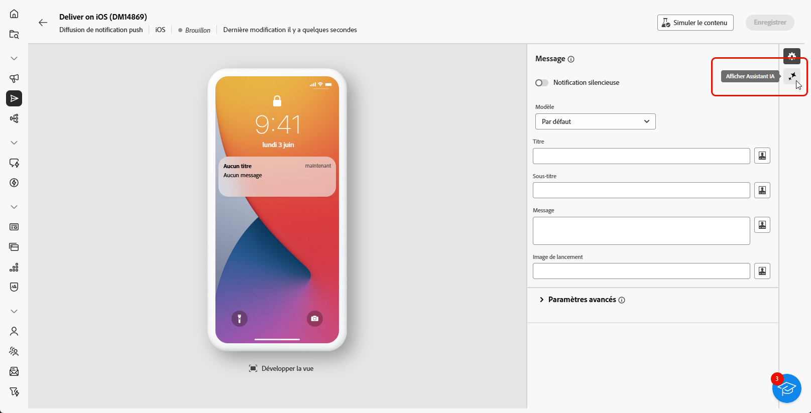
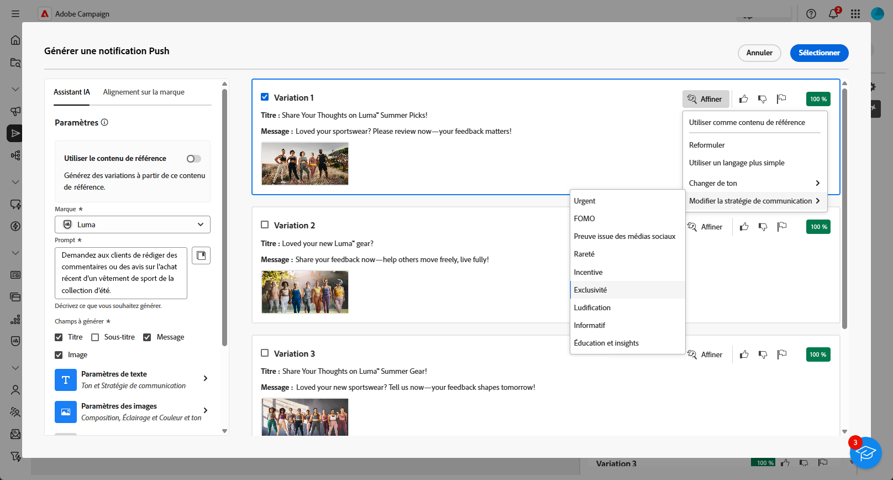

# Génération de notifications push avec l’assistant AI {#generative-push}

>[!BEGINSHADEBOX]

**Table des matières**

* [Commencer avec l’assistant IA](generative-gs.md)
* [Génération d’e-mails avec l’assistant IA](generative-content.md)
* [Génération de SMS avec l’assistant IA](generative-sms.md)
* **[Génération de notifications push avec l’assistant IA](generative-push.md)**

>[!ENDSHADEBOX]

L’assistant IA peut vous aider à optimiser l’impact de vos diffusions en suggérant un contenu différent et davantage susceptible de résonner auprès de votre audience.

>[!NOTE]
>
>Avant de commencer à utiliser cette fonctionnalité, lisez la section connexe [Mécanismes de sécurisation et limitations](generative-gs.md#guardrails-and-limitations).

Dans l’exemple suivant, nous utiliserons l’assistant d’IA pour concevoir des messages attrayants afin de créer une expérience client plus attrayante.

1. Après avoir créé et configuré votre diffusion de notifications push, cliquez sur **[!UICONTROL Modifier le contenu]**.

   Pour plus d’informations sur la configuration de votre diffusion de notifications push, consultez [cette page](../push/create-push.md).

1. Renseignez les **[!UICONTROL détails de base]** de votre diffusion. Une fois terminé, cliquez sur **[!UICONTROL Modifier le contenu]**.

1. Personnalisez vos notifications push selon vos besoins. [En savoir plus](../push/content-push.md)

1. Accédez au menu **[!UICONTROL Afficher l’assistant IA]**.

   {zoomable=&quot;yes&quot;}

1. Activez la variable **[!UICONTROL Utiliser le contenu d’origine]** l’option de l’assistant d’IA pour personnaliser le nouveau contenu en fonction de votre diffusion, du nom de la diffusion et de l’audience sélectionnée.

   >[!IMPORTANT]
   >
   > Votre invite doit toujours être liée à un contexte spécifique en chargeant une ressource de marque ou en activant la fonction **[!UICONTROL Améliorer le contenu actuel]**.

   {zoomable=&quot;yes&quot;}

1. Ajustez le contenu en décrivant ce que vous souhaitez générer dans le champ **[!UICONTROL Invite]**.

   Si vous avez besoin d’aide pour concevoir votre invite, accédez à la **[!UICONTROL Bibliothèque d’invites]** qui dispose d’un large éventail d’idées d’invites pour améliorer vos diffusions.

   {zoomable=&quot;yes&quot;}

1. Sélectionnez **[!UICONTROL Charger une ressource de marque]** pour ajouter toute ressource de marque incluant du contenu pouvant fournir du contexte supplémentaire à l’assistant IA.

1. Sélectionnez le champ à générer : **[!UICONTROL Titre]**, **[!UICONTROL Sous-titre]** ou **[!UICONTROL Message]**.

1. Adaptez les différentes options de votre invite :

   * **[!UICONTROL Stratégie de communication]**: choisissez le style de communication le plus adapté au texte généré.
   * **[!UICONTROL Langue]**: sélectionnez la langue dans laquelle vous souhaitez générer votre contenu.
   * **[!UICONTROL Tone]**: le ton de votre email doit résonner auprès de votre audience. Que vous souhaitiez être informatif, ludique ou convaincant, l’assistant d’IA peut adapter le message en conséquence.

   {zoomable=&quot;yes&quot;}

1. Lorsque votre texte descriptif est prêt, cliquez sur **[!UICONTROL Générer]**.

1. Parcourir les **[!UICONTROL Variations]** et cliquez sur **[!UICONTROL Aperçu]** pour afficher une version plein écran de la variation sélectionnée.

1. Accédez au **[!UICONTROL Affiner]** dans la fonction **[!UICONTROL Aperçu]** pour accéder à d’autres fonctionnalités de personnalisation :

   * **[!UICONTROL Réphrase]**: l’assistant d’IA peut reformuler votre message de différentes manières, en actualisant votre écriture et en l’adaptant à différents publics.

   * **[!UICONTROL Utilisation d’une langue simple]**: utilisez l’assistant d’IA pour simplifier votre langue, en assurant clarté et accessibilité pour une audience plus large.

   {zoomable=&quot;yes&quot;}

1. Cliquez sur **[!UICONTROL Sélectionner]** une fois que vous avez trouvé le contenu approprié.

1. Insérez des champs de personnalisation pour personnaliser le contenu de votre e-mail en fonction des données de profil. Cliquez ensuite sur le bouton **[!UICONTROL Simulation du contenu]** pour contrôler le rendu et vérifier les paramètres de personnalisation avec les profils de test. [En savoir plus](../preview-test/preview-content.md)

   {zoomable=&quot;yes&quot;}

Lorsque vous avez défini le contenu, l’audience et le planning, vous pouvez préparer votre diffusion de notifications push. [En savoir plus](../monitor/prepare-send.md)

