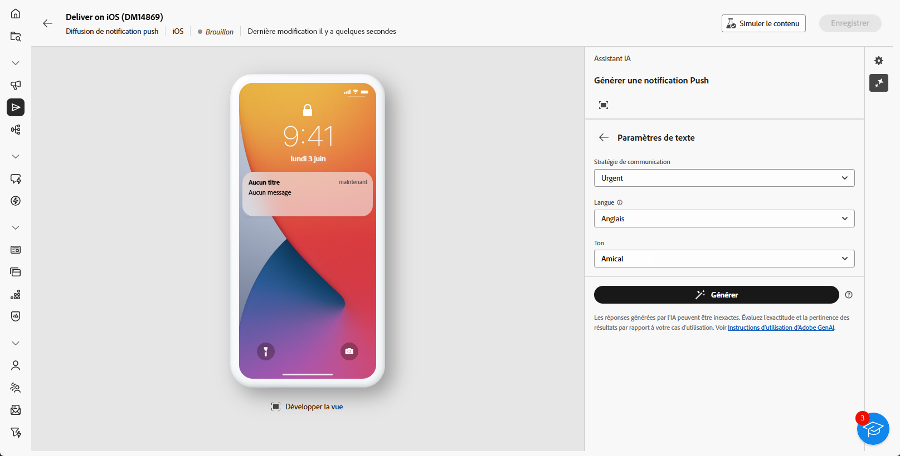

# Génération de notifications push avec l’assistant AI {#generative-push}

>[!IMPORTANT]
>
>Avant de commencer à utiliser cette fonctionnalité, lisez les [Mécanismes de sécurisation et limites](generative-gs.md#generative-guardrails) associés.
> 
>
>Vous devez accepter un [contrat utilisateur](https://www.adobe.com/fr/legal/licenses-terms/adobe-dx-gen-ai-user-guidelines.html) avant d’utiliser l’assistant AI dans Adobe Campaign Web. Pour plus d’informations, contactez votre représentant ou représentante Adobe.

L’assistant d’IA permet d’optimiser l’impact de vos diffusions en suggérant différents contenus qui résonnent avec votre audience.

Dans l’exemple suivant, l’assistant AI est utilisé pour concevoir des messages attrayants afin de créer une expérience client plus attrayante.

1. Après avoir créé et configuré votre diffusion Notification push, cliquez sur **[!UICONTROL Modifier le contenu]**.

   Pour plus d&#39;informations sur la configuration de votre diffusion push, consultez [cette page](../push/create-push.md).

1. Accédez au menu **[!UICONTROL Afficher l’assistant IA]**.

   {zoomable="yes"}

1. Activez l’option **[!UICONTROL Utiliser le contenu d’origine]** pour que l’assistant AI personnalise le nouveau contenu en fonction du contenu sélectionné.

1. Ajustez le contenu en décrivant ce que vous souhaitez générer dans le champ **[!UICONTROL Invite]**.

   Si vous avez besoin d&#39;aide pour concevoir votre invite, accédez à la **[!UICONTROL bibliothèque d&#39;invites]** qui fournit un large éventail d&#39;idées d&#39;invites pour améliorer vos diffusions.

   {zoomable="yes"}

1. Sélectionnez le champ à générer : **[!UICONTROL Titre]**, **[!UICONTROL Message]** et/ou **[!UICONTROL Image]**.

1. Personnalisez l’invite à l’aide de l’option **[!UICONTROL Paramètres de texte]** :

   * **[!UICONTROL Stratégie de communication]** : choisissez le style de communication le plus adapté au texte généré.
   * **[!UICONTROL Ton]** : ajustez le ton de votre e-mail pour qu’il résonne avec votre audience. Que vous souhaitiez donner une impression informative, ludique ou persuasive, l’assistant AI adapte le message en conséquence.

   {zoomable="yes"}

1. Choisissez vos **[!UICONTROL Paramètres d’image]** :

   * **[!UICONTROL Type de contenu]** : catégorisez la nature de l’élément visuel en faisant la distinction entre différentes formes de représentation visuelle, telles que des photos, des graphiques ou des œuvres d’art.
   * **[!UICONTROL Intensité visuelle]** : contrôlez l’impact de l’image en ajustant son intensité. Un réglage inférieur (2) crée un aspect plus doux et plus sobre, tandis qu&#39;un réglage supérieur (10) rend l&#39;image plus vibrante et plus puissante visuellement.
   * **[!UICONTROL Éclairage]** : réglez l’éclairage de l’image afin de façonner son atmosphère et de mettre en évidence des éléments spécifiques.
   * **[!UICONTROL Composition]** : organisez les éléments dans le cadre de l’image.

   {zoomable="yes"}

1. Dans le menu **[!UICONTROL Ressources de marque]**, cliquez sur **[!UICONTROL Charger une ressource de marque]** pour ajouter une ressource de marque contenant du contenu qui fournit un contexte supplémentaire à l’assistant d’IA, ou sélectionnez-en une précédemment chargée.

   Les fichiers précédemment chargés sont disponibles dans la liste déroulante **[!UICONTROL Ressources de marque chargées]**. Activez/désactivez les ressources que vous souhaitez inclure dans votre génération.

1. Lorsque votre invite est prête, cliquez sur **[!UICONTROL Générer]**.

1. Parcourez les **[!UICONTROL variations]** générées et cliquez sur **[!UICONTROL Aperçu]** pour afficher une version plein écran de la variation sélectionnée.

1. Naviguez vers l’option **[!UICONTROL Affiner]** dans la fenêtre **[!UICONTROL Aperçu]** pour accéder à d’autres fonctionnalités de personnalisation :

   * **[!UICONTROL Utiliser comme contenu de référence]** : utilisez la variante choisie comme contenu de référence pour générer d’autres résultats.
   * **[!UICONTROL Reformuler]** : reformuler votre message de différentes manières pour garder votre écriture à jour et attrayante pour divers publics.
   * **[!UICONTROL Utiliser un langage plus simple]** : simplifiez votre langue pour garantir la clarté et l’accessibilité pour une audience plus large.

   Vous pouvez également modifier le **[!UICONTROL Ton]** et la **[!UICONTROL Stratégie de communication]** de votre texte.

   {zoomable="yes"}

1. Cliquez sur **[!UICONTROL Sélectionner]** une fois que vous avez trouvé le contenu approprié.

1. Insérez des champs de personnalisation pour personnaliser le contenu de votre e-mail en fonction des données de profil. Cliquez ensuite sur le bouton **[!UICONTROL Simuler du contenu]** pour contrôler le rendu et vérifier les paramètres de personnalisation avec les profils de test. [En savoir plus](../preview-test/preview-content.md)

   {zoomable="yes"}

Lorsque vous définissez le contenu, l’audience et le planning, préparez votre diffusion push. [En savoir plus](../monitor/prepare-send.md)