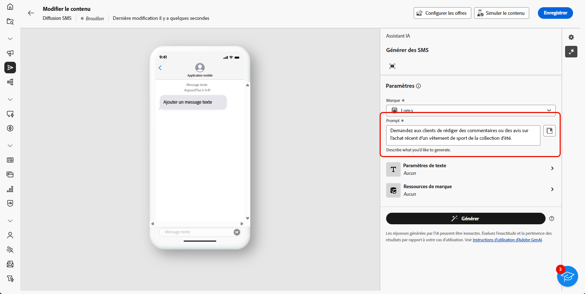

# Génération de SMS avec l’assistant AI {#generative-sms}

>[!IMPORTANT]
>
>Avant de commencer à utiliser cette fonctionnalité, lisez la section sur les [Mécanismes de sécurisation et limitations](generative-gs.md#generative-guardrails) connexes.
> 
>
>Vous devez accepter un [contrat utilisateur](https://www.adobe.com/fr/legal/licenses-terms/adobe-dx-gen-ai-user-guidelines.html) avant d’utiliser l’assistant AI dans Adobe Campaign Web. Pour plus d’informations, contactez votre représentant ou représentante Adobe.

Une fois que vous avez conçu et personnalisé vos SMS en fonction de votre audience, améliorez votre communication à l’aide de l’assistant AI dans Adobe Campaign Web, optimisé par une technologie d’IA innovante.

Cet outil vous fournit des suggestions intelligentes pour affiner votre contenu, permettant à vos messages d’avoir un impact efficace et de maximiser l’engagement.

>[!BEGINTABS]

>[!TAB Génération de SMS complet]

1. Après avoir créé et configuré votre diffusion e-mail, cliquez sur **[!UICONTROL Modifier le contenu]**.

   Pour plus d’informations sur la configuration de votre diffusion par SMS, consultez [cette page](../sms/create-sms.md).

1. Renseignez les **[!UICONTROL détails de base]** de votre diffusion. Une fois terminé, cliquez sur **[!UICONTROL Modifier le contenu]**.

1. Accédez au menu **[!UICONTROL Afficher l’assistant IA]**.

   {zoomable="yes"}

1. Ajustez le contenu en décrivant ce que vous souhaitez générer dans le champ **[!UICONTROL Prompt]**.

   Si vous avez besoin d’aide pour concevoir votre prompt, accédez à la **[!UICONTROL bibliothèque de prompts]** qui offre un large éventail d’idées rapides pour améliorer vos diffusions.

   {zoomable="yes"}

1. Adaptez votre prompt avec les options **[!UICONTROL Paramètres de texte]** :

   * **[!UICONTROL Stratégie de communication]** : choisissez le style de communication le plus adapté au texte généré.
   * **[!UICONTROL Ton]** : le ton de votre e-mail doit résonner auprès de votre audience. Que vous souhaitiez donner une impression informative, ludique ou persuasive, l’assistant AI adapte le message en conséquence.
   * **Longueur de texte** : utilisez le curseur pour sélectionner la longueur souhaitée de votre texte.

   {zoomable="yes"}

1. Dans le menu **[!UICONTROL Ressources de marque]**, cliquez sur **[!UICONTROL Charger une ressource de marque]** pour ajouter une ressource de marque contenant du contenu qui fournit un contexte supplémentaire à l’assistant d’IA, ou sélectionnez-en une précédemment chargée.

   Les fichiers précédemment chargés sont disponibles dans la liste déroulante **[!UICONTROL Ressources de marque chargées]**. Sélectionnez les ressources que vous souhaitez inclure dans votre génération.

1. Lorsque votre prompt est prêt, cliquez sur **[!UICONTROL Générer]**.

1. Parcourez les **[!UICONTROL variations]** générées et cliquez sur **[!UICONTROL Aperçu]** pour afficher une version plein écran de la variation sélectionnée.

   {zoomable="yes"}

1. Accédez à l’option **[!UICONTROL Affiner]** dans la fenêtre **[!UICONTROL Aperçu]** pour accéder à d’autres fonctionnalités de personnalisation et affiner votre variation en fonction de vos préférences :

   * **[!UICONTROL Utiliser comme contenu de référence]** : la variante choisie servira de contenu de référence pour générer d’autres résultats.
   * **[!UICONTROL Utiliser un langage plus simple]** : l’assistant d’IA vous aide à écrire des messages clairs et concis que tout le monde peut comprendre.
   * **[!UICONTROL Reformuler]** : l’assistant AI reformule votre message afin qu’il reste attrayant pour différentes audiences.

   Vous pouvez également modifier le **[!UICONTROL Ton]** et la **[!UICONTROL Stratégie de communication]** de votre texte.

   {zoomable="yes"}

1. Cliquez sur **[!UICONTROL Sélectionner]** une fois que vous avez trouvé le contenu approprié.

1. Insérez des champs de personnalisation pour personnaliser le contenu de vos SMS en fonction des données de profil. [En savoir plus sur la personnalisation du contenu](../personalization/personalize.md).

   {zoomable="yes"}

1. Après avoir défini le contenu de votre message, cliquez sur le bouton **[!UICONTROL Simuler le contenu]** pour contrôler le rendu et vérifier les paramètres de personnalisation avec les profils de test. [En savoir plus](../preview-test/preview-content.md).

   {zoomable="yes"}

Lorsque vous définissez le contenu, l’audience et le planning, préparez votre diffusion SMS. [En savoir plus](../monitor/prepare-send.md).

>[!TAB Génération de texte uniquement]

1. Après avoir créé et configuré votre diffusion e-mail, cliquez sur **[!UICONTROL Modifier le contenu]**.

   Pour plus d’informations sur la configuration de votre diffusion par SMS, consultez [cette page](../sms/create-sms.md).

1. Renseignez les **[!UICONTROL détails de base]** de votre diffusion. Une fois terminé, cliquez sur **[!UICONTROL Modifier le contenu]**.

1. Personnalisez votre SMS selon vos besoins. [En savoir plus](../sms/content-sms.md).

1. Accédez au menu **[!UICONTROL Assistant IA]** en regard de votre champ **[!UICONTROL Message]**.

   {zoomable="yes"}

1. Activez l’option **[!UICONTROL Utiliser du contenu de référence]** pour que l’assistant AI personnalise le nouveau contenu en fonction du contenu sélectionné.

1. Ajustez le contenu en décrivant ce que vous souhaitez générer dans le champ **[!UICONTROL Prompt]**.

   Si vous avez besoin d’aide pour concevoir votre prompt, accédez à la **[!UICONTROL Bibliothèque de prompts]** qui propose un large éventail d’idées d’invites pour améliorer vos campagnes.

   {zoomable="yes"}

1. Adaptez votre prompt à l’aide de l’option **[!UICONTROL Paramètres de texte]** :

   * **[!UICONTROL Stratégie de communication]** : sélectionnez l’approche de communication souhaitée pour le texte généré.
   * **[!UICONTROL Langue]** : choisissez la langue du contenu de la variante.
   * **[!UICONTROL Ton]** : assurez-vous que le texte est adapté à votre audience et à votre objectif.
   * **[!UICONTROL Longueur]** : sélectionnez la longueur de votre contenu à l’aide du curseur de plage.

   {zoomable="yes"}

1. Dans le menu **[!UICONTROL Ressources de marque]**, cliquez sur **[!UICONTROL Charger une ressource de marque]** pour ajouter une ressource de marque contenant du contenu qui fournit un contexte supplémentaire à l’assistant d’IA, ou sélectionnez-en une précédemment chargée.

   Les fichiers précédemment chargés sont disponibles dans la liste déroulante **[!UICONTROL Ressources de marque chargées]**. Sélectionnez les ressources que vous souhaitez inclure dans votre génération.

1. Lorsque votre prompt est prêt, cliquez sur **[!UICONTROL Générer]**.

1. Parcourez les **[!UICONTROL Variations]** générées et cliquez sur **[!UICONTROL Aperçu]** pour afficher une version plein écran de la variation sélectionnée.

1. Accédez à l’option **[!UICONTROL Affiner]** dans la fenêtre **[!UICONTROL Aperçu]** pour accéder à d’autres fonctionnalités de personnalisation et affiner votre variation en fonction de vos préférences :

   * **[!UICONTROL Utiliser comme contenu de référence]** : la variante choisie servira de contenu de référence pour générer d’autres résultats.
   * **[!UICONTROL Reformuler]** : l’assistant d’IA peut reformuler votre message de différentes manières, ce qui vous permet d’écrire des textes frais et attrayants pour diverses audiences.
   * **[!UICONTROL Utiliser un langage plus simple]** : utilisez l’assistant d’IA pour simplifier votre langue, en assurant la clarté et l’accessibilité pour une audience plus large.

   Vous pouvez également modifier le **[!UICONTROL Ton]** et la **[!UICONTROL Stratégie de communication]** de votre texte.

   {zoomable="yes"}

1. Cliquez sur **[!UICONTROL Sélectionner]** une fois que vous avez trouvé le contenu approprié.

1. Insérez des champs de personnalisation pour personnaliser le contenu de vos SMS en fonction des données de profil. [En savoir plus sur la personnalisation du contenu](../personalization/personalize.md).

1. Après avoir défini le contenu de votre message, cliquez sur le bouton **[!UICONTROL Simuler le contenu]** pour contrôler le rendu et vérifier les paramètres de personnalisation avec les profils de test. [En savoir plus](../preview-test/preview-content.md).

   {zoomable="yes"}

Lorsque vous définissez le contenu, l’audience et le planning, préparez votre diffusion SMS. [En savoir plus](../monitor/prepare-send.md).

>[!ENDTABS]