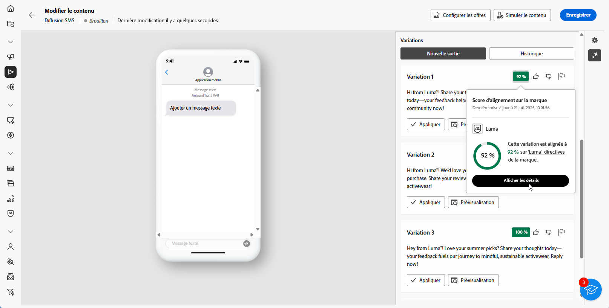

# Génération de SMS avec l’assistant IA {#generative-sms}

>[!BEGINSHADEBOX]

**Table des matières**

* [Commencer avec l’assistant IA](generative-gs.md)
* [Génération d’e-mails avec l’assistant IA](generative-content.md)
* **[Génération de SMS avec l’assistant IA](generative-sms.md)**
* [Génération de notifications push avec l’assistant AI](generative-push.md)

>[!ENDSHADEBOX]

Une fois que vous avez conçu et personnalisé vos SMS en fonction de votre audience, améliorez votre communication grâce à l’assistant IA dans Campaign, propulsé par une technologie d’IA innovante.

Cet outil pratique vous fournit des suggestions intelligentes pour affiner votre contenu, permettant à vos messages d’avoir un impact efficace et de maximiser l’engagement.

>[!NOTE]
>
>Avant de commencer à utiliser cette fonctionnalité, lisez la section connexe [Mécanismes de sécurisation et limitations](generative-gs.md#guardrails-and-limitations).

1. Après avoir créé et configuré votre diffusion e-mail, cliquez sur **[!UICONTROL Modifier le contenu]**.

   Pour plus d’informations sur la configuration de votre diffusion e-mail, consultez [cette page](../sms/create-sms.md).

1. Renseignez les **[!UICONTROL détails de base]** de votre diffusion. Une fois terminé, cliquez sur **[!UICONTROL Modifier le contenu]**.

1. Personnalisez votre SMS selon vos besoins. [En savoir plus](../sms/content-sms.md)

1. Accédez au menu **[!UICONTROL Afficher l’assistant IA]**.

   {zoomable=&quot;yes&quot;}

1. Ajustez le contenu en décrivant ce que vous souhaitez générer dans le champ **[!UICONTROL Invite]**.

   Si vous avez besoin d’aide pour concevoir votre invite, accédez à la **[!UICONTROL Bibliothèque d’invites]** qui dispose d’un large éventail d’idées d’invites pour améliorer vos diffusions.

   {zoomable=&quot;yes&quot;}

1. Activez l’option **[!UICONTROL Améliorer avec le contexte actuel]** de l’assistant IA afin de personnaliser le nouveau contenu en fonction de votre diffusion, du nom de la diffusion et de l’audience sélectionnée.

   >[!IMPORTANT]
   >
   > Votre invite doit toujours être liée à un contexte spécifique en chargeant une ressource de marque ou en activant la fonction **[!UICONTROL Améliorer le contenu actuel]**.

1. Sélectionnez **[!UICONTROL Charger une ressource de marque]** pour ajouter toute ressource de marque incluant du contenu pouvant fournir du contexte supplémentaire à l’assistant IA.

1. Sélectionnez la **[!UICONTROL Stratégie de communication]** qui répond le mieux à vos besoins. Cette dernière a une incidence sur la tonalité et le style du texte généré.

1. Choisissez la **[!UICONTROL Langue]** et le **[!UICONTROL Ton]** à donner au texte. Vous vous assurez ainsi que le texte est adapté à votre audience et à votre objectif.

   {zoomable=&quot;yes&quot;}

1. Utilisez le curseur pour définir la longueur du texte généré.

1. Lorsque votre texte descriptif est prêt, cliquez sur **[!UICONTROL Générer]**.

1. Parcourez les **[!UICONTROL Variations]** générées et cliquez sur **[!UICONTROL Appliquer]** une fois que vous avez trouvé le contenu approprié.

   Cliquez sur **[!UICONTROL Aperçu]** pour afficher une version plein écran de la variation sélectionnée.

   {zoomable=&quot;yes&quot;}

1. Insérez des champs de personnalisation pour personnaliser le contenu de vos SMS en fonction des données de profil. [En savoir plus sur la personnalisation du contenu](../personalization/personalize.md)

   {zoomable=&quot;yes&quot;}

1. Après avoir défini le contenu de votre message, cliquez sur le bouton **[!UICONTROL Simuler le contenu]** pour contrôler le rendu et vérifier les paramètres de personnalisation avec les profils de test. [En savoir plus](../preview-test/preview-content.md)

   {zoomable=&quot;yes&quot;}

1. Lorsque vous avez défini le contenu, l’audience et le planning, vous pouvez préparer votre diffusion SMS. [En savoir plus](../monitor/prepare-send.md)
